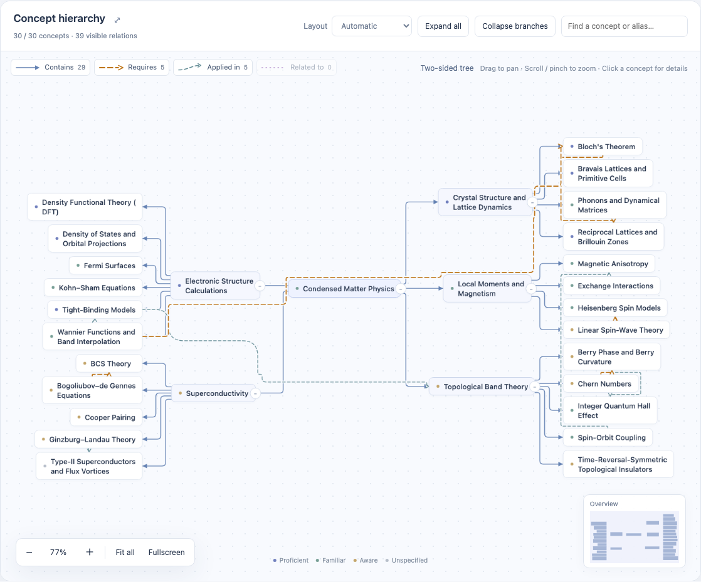
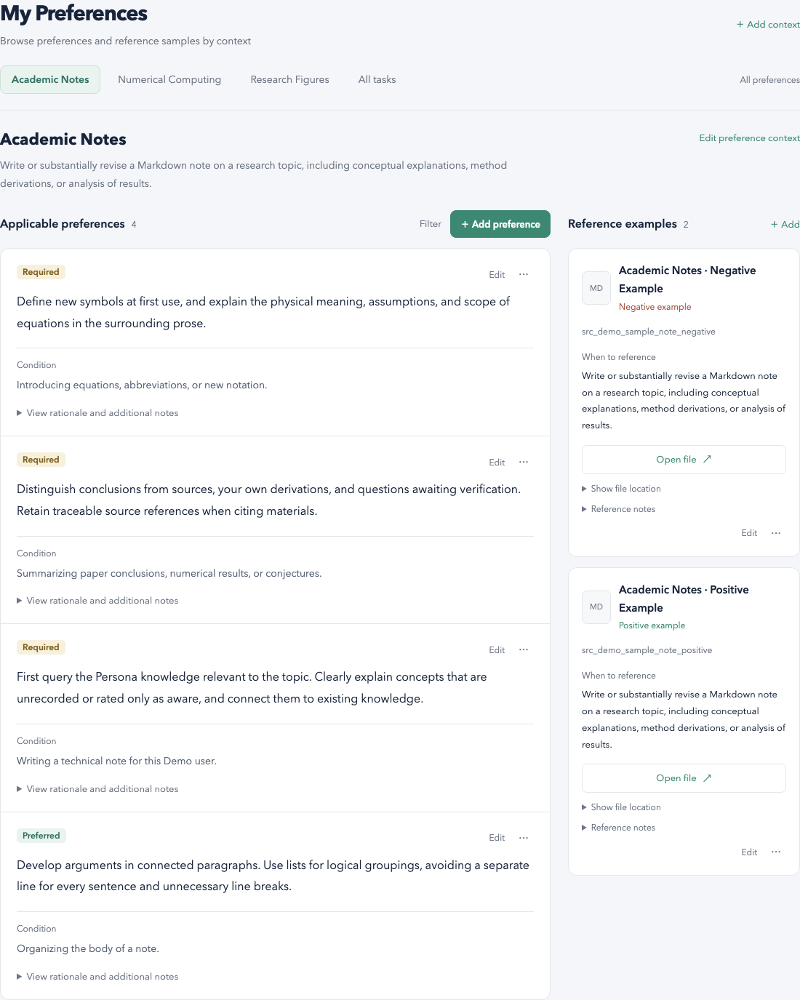

# PersonaStudio

[简体中文](README.zh-CN.md)

> Let AI understand me better.

PersonaStudio is a personal AI toolkit built around **AI Persona**.

Models are becoming increasingly capable, but high-quality human–AI collaboration still faces two common bottlenecks:

- People spend a great deal of time understanding, filtering, and correcting AI-generated information.
- People cannot always express their background, intent, and standards completely in every prompt.

Without enough context, even the strongest model cannot know what you understand, what you have read, or how you tend to think. It also cannot know how you want notes, explanations, and research results to be presented. Unless this information is recorded systematically, it cannot continue to help across conversations and tools.

PersonaStudio turns this information into a personal profile that you control and can continually expand, inspect, and reuse.


## What is an AI Persona?

An AI Persona is a personal AI profile maintained and controlled by the user. It includes:

- **Knowledge:** The fields, concepts, and methods you know or care about, and how they relate to one another.
- **Materials:** The articles, courses, notes, and references you have selected.
- **Preferences:** How you prefer to work in different human–AI collaboration contexts, and how you judge the quality of a result.
- **Feedback and examples:** Which results meet your expectations, which do not, and positive or negative examples that AI can learn from.

It helps users summarize their background as structured data that is easier for AI to use. With access to this information, AI can understand what you know and what interests you, then generate content that better matches your knowledge, goals, and personal preferences.

## What can it help AI do?

With this context, AI can:

1. **Reinterpret an article for you**
   Adapt an explanation to your existing knowledge and reading goals: skip what you already know, supply missing background, and expand the parts worth exploring.

2. **Plan how to learn a field**
   Build a learning path from your current foundation, avoid unnecessary repetition, and identify the gaps you genuinely need to fill.

3. **Create notes to your requirements**
   Use your knowledge structure, working context, and previous examples to produce notes with the structure, level of detail, and style you expect.

It can also support many other personalized needs that can only be met after AI understands you.

## Current features

PersonaStudio's first application is **AI Persona**, a local-first, file-first workspace for personal AI profiles.

### Knowledge and materials

- Manage knowledge, courses, materials, and original sources.
- Create typed relationships and explore your personal knowledge structure as a graph.
- Preserve source information so you can return to the original material for verification.



*The knowledge graph brings concepts, materials, and their relationships into one navigable view.*

### Contextual preferences

- Manage global preferences and preferences for different collaboration contexts.
- Attach positive and negative examples, revision history, and human-written notes.
- Give AI the relevant requirements for each context without restating your standards every time.



*Preferences are organized by collaboration context, and each rule can include positive and negative examples that make it more concrete.*

### AI maintenance, review, and integrations

- Use AI maintenance and material extraction to create candidate updates that enter the official profile only after human review.
- Save feedback and personal test cases, run isolated evaluations, and improve prompts.
- Connect Codex Hook and read-only MCP integrations when needed, allowing other AI tools to read the Persona within an authorized scope.
- Switch between Simplified Chinese and English interfaces.

Manual edits take effect when saved. AI-generated changes do not modify official data until a person reviews them. Public MCP exposes knowledge and source-reading tools only; it cannot publish changes.

## Installation

PersonaStudio currently supports macOS and Linux. Use the same command for the first installation and later updates:

```sh
curl -fsSL https://github.com/rainshed/PersonaStudio/releases/latest/download/install.sh | sh
```

If prompted, open a new terminal, then initialize a workspace:

```sh
ai-persona setup
```

Personal workspaces are stored separately from the application. Installing or updating the application never moves or replaces your workspace data, and the previous application version is retained for recovery.

## Getting started

You can explore an isolated fictional Persona without configuring a model account:

```sh
ai-persona start --demo
```

When you are ready to use your own data, run:

```sh
ai-persona start
```

Browsing and manual editing do not require a model account. Only model-powered features such as AI maintenance, material extraction, and evaluation require additional configuration.

## Requirements

| Component | Requirement |
| --- | --- |
| Operating system | macOS or Linux. Native Windows is not supported; WSL requires validation in the actual environment. |
| Python | 3.12 or later, prepared through uv by the installer. |
| Node.js | 22.19 or later with npm, required only for optional AI model features. |
| Model account | Optional. Browsing and manual editing work without one. |

## Future directions

PersonaStudio will continue to expand its collection of personal AI tools around AI Persona. Possibilities include:

1. **Personalized arXiv recommendations**
   Use a person's knowledge structure, reading history, and research interests to surface papers that are more likely to match their interests and current research needs, rather than relying on keyword matching alone. Tailored summaries can then help them understand more in less time.

2. **Expert AI mentors**
   With permission, capture the preferences and principles that experienced researchers apply to topic selection, reading, experimental design, and research judgment, so AI can use that experience to offer more relevant guidance to learners and researchers.

3. **More possibilities for personalization**

## Documentation

- [Models, data, backups, and troubleshooting](docs/OPERATIONS.md)
- [Codex, MCP, and remote access](docs/INTEGRATIONS.md)

The project uses the [MIT license](LICENSE). Bundled assets retain their respective [third-party notices](docs/THIRD_PARTY_NOTICES.md).

Feel free to adapt this project to your own needs. If you find it useful, consider giving it a Star so more people can discover it. Thank you!
