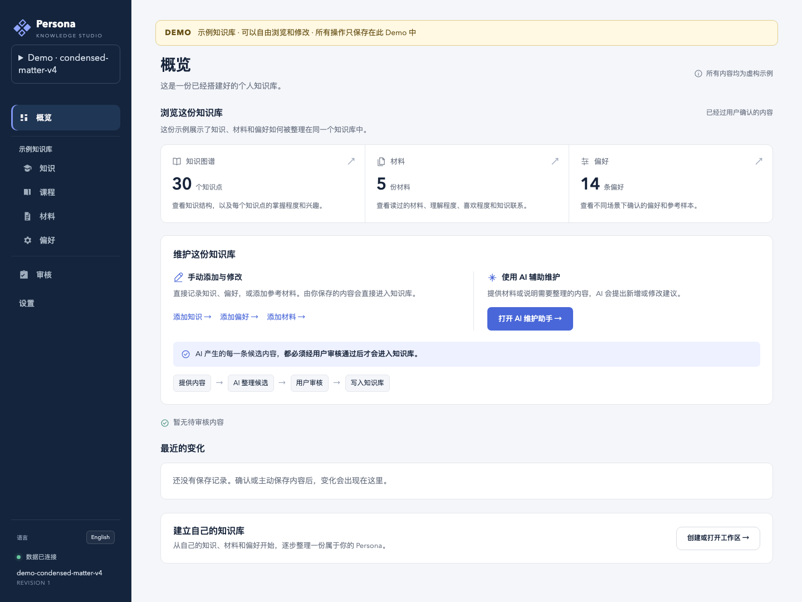
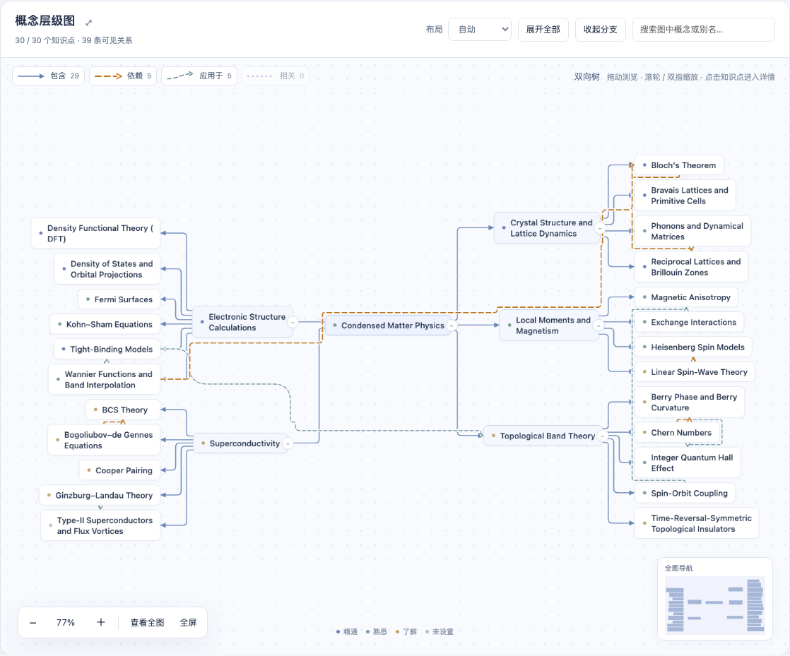
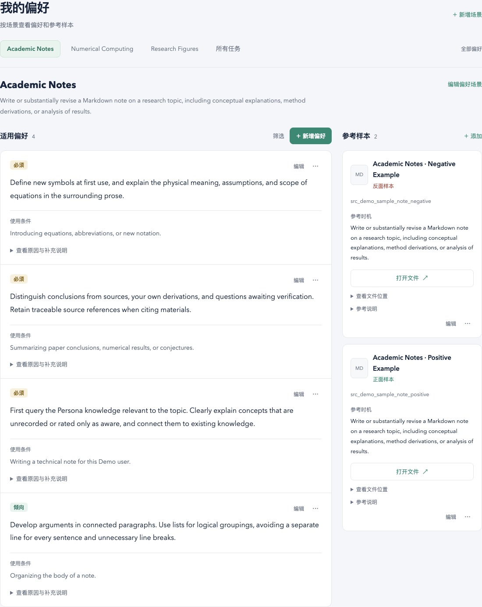

# 知我（PersonaStudio）

[English](README.md)

> 让 AI 更懂我。

「知我」是一套以 **AI Persona** 为核心的个人 AI 工具库。

模型越来越强，但高质量的人机协作仍有两个常见瓶颈：

- 人需要花很多时间理解、筛选和修正 AI 生成的信息。
- 人不一定能把自己的背景、意图和标准完整地写进每一次提示词。

再强的模型，如果缺乏上下文，也无法了解你的知识基础、读过哪些材料、习惯怎样思考，更不知道你希望笔记、解释和研究结果以什么方式呈现。这些信息如果没有被系统地记录下来，就很难在多次对话和不同工具之间持续发挥作用。

「知我」希望做的，就是把这些信息沉淀为一份由用户自己掌控、可积累、可检查、可复用的个人档案。



## 什么是 AI Persona

AI Persona 是一份由用户维护并掌控的个人 AI 档案，主要包括：

- **知识**：你熟悉和感兴趣哪些领域、概念和方法，以及它们之间的关系。
- **材料**：你挑选的文章、课程、笔记与参考资料。
- **偏好**：你在不同人机协作场景下习惯怎样工作，以及用什么标准判断结果。
- **反馈与样例**：哪些结果符合预期，哪些不符合，以及可供 AI 参考的正反例。

它帮助用户把自己的背景信息总结成对 AI 更加友好的结构化数据。当 AI 能够读取这些信息时，就可以知道你掌握什么知识、对什么感兴趣，从而生成更符合你的知识基础、任务目标与个人偏好的内容。

## 它可以帮助 AI 做什么

有了这些背景，AI 可以：

1. **重新解读一篇文章**
   根据你的知识水平、已掌握的概念和阅读目的，决定哪些内容可以略过，哪些需要补充背景，哪些值得深入展开。

2. **规划一个领域的学习路径**
   从你当前的认知基础出发安排学习顺序，减少重复内容，并指出真正需要补齐的知识缺口。

3. **按你的要求生成笔记**
   结合你的知识结构、使用场景和既有样例，生成更符合你要求的结构、粒度与表达方式。

以及更多只有在了解你之后，才能真正满足的个性化需求。

## 当前功能

知我目前的第一个应用是 **AI Persona**，一个本地优先、文件优先的个人档案工作区。

### 知识与材料

- 管理知识、课程、材料与原文。
- 建立带类型的知识关系，并通过知识图谱浏览个人知识结构。
- 保留知识来源，方便回到原始材料核对。



*知识图谱将概念、材料与它们之间的关系放在同一个可浏览视图中。*

### 场景偏好

- 管理全局偏好和不同协作场景下的偏好。
- 为偏好保存正反样例、修改历史与人工说明。
- 按场景向 AI 提供相关要求，避免每次从头描述自己的标准。



*偏好按协作场景组织，每条规则都可以配合正反样例，让要求更具体。*

### AI 维护、审核与接入

- 通过 AI 维护和材料提取生成候选更新，人工确认后再写入正式数据。
- 保存反馈和个人测试样例，运行隔离评测并改进提示词。
- 按需接入 Codex Hook 与只读 MCP，让其他 AI 工具在授权范围内读取 Persona。
- 在简体中文与英文界面之间切换。

人工编辑保存后立即生效；AI 生成的修改在人工审核前不会改变正式数据。公共 MCP 只提供知识与来源读取工具，不能发布修改。

## Paper Radar：

**Paper Radar** 是基于AI Persona中用户自己维护的信息进行arXiv个性化推荐的平台。

- 按 arXiv 领域分类与 AI Persona 知识范围订阅论文，生成每日推荐。
- 对指定的文章可以基于用户AI Persona 知识范围做详细分析，指出这篇文章和用户感兴趣的知识与文章之间的关联。
- 用户可以自定义各个环节的提示词，从而得到自己最满意的结果。
- 用户可以对推荐的文章选择满意或不满意，自动生成测试集，作为修改提示词的参考。

详见 [Paper Radar 使用指南](docs/PAPER_RADAR.zh-CN.md)。

## 安装

「知我」支持 macOS。0.1.1 起可以选择以下两种安装方式（需要包含可选组件的 GitHub Release）：

**只安装 AI Persona**：管理知识、材料和偏好。

```sh
curl -fsSL https://github.com/rainshed/PersonaStudio/releases/latest/download/install.sh | sh
```

**安装 AI Persona + Paper Radar**：同时使用论文订阅、推荐和分析。

```sh
curl -fsSL https://github.com/rainshed/PersonaStudio/releases/latest/download/install.sh | sh -s -- --with-paper-radar
```

安装器准备所需环境和已经构建好的网页，不需要克隆仓库或手动构建。只安装 AI Persona 时不会下载 Paper Radar 或其 Node.js 环境。

如果终端提示，请打开一个新终端，然后初始化工作区：

```sh
ai-persona setup
```

个人工作区独立保存在应用之外。安装或更新不会移动或覆盖你的工作区数据，同时会保留上一个应用版本用于故障恢复。

### 补装、更新与移除

先安装 AI Persona，之后仍可以添加 Paper Radar：

```sh
personastudio install paper-radar
paper-radar start
```

也可以在 AI Persona 的“设置 → 扩展应用”中找到安装入口。首次进入 Radar 时确认发现的 Persona 工作区，测试连接并保存，再创建订阅。

```sh
personastudio status              # 查看已安装的应用
personastudio update              # 更新已安装的应用
personastudio remove paper-radar  # 移除 Radar，保留研究数据
```

再次运行原安装命令也会记住当前安装组合。补装和移除使用当前发布版本，更新才切换到最新版本。旧版 AI Persona 用户先运行上面的安装命令升级，即可使用这些管理命令。

移除 Radar 后，其研究记录、报告和设置会保留；重新安装后可以继续使用。安装器也会保留之前的应用版本，便于故障恢复。更新或移除前，请完成或取消进行中的研究任务。

## 开始使用

无需配置模型账号，就可以先体验隔离的虚构 Persona：

```sh
ai-persona start --demo
```

准备使用自己的数据时，运行：

```sh
ai-persona start
```

浏览和人工编辑不需要模型账号；只有 AI 维护、材料提取与评测等模型功能需要额外配置。

## 环境要求

| 组件 | 要求 |
| --- | --- |
| 操作系统 | macOS；Linux 与 Windows 暂不在正式支持范围内。 |
| Python | 3.12 或更新版本，由安装器通过 uv 准备。 |
| Node.js | Paper Radar 由安装器自动准备独立的 Node.js 24 运行环境。只安装 AI Persona 时，模型功能按需配置 Node.js 22.19 或更新版本。 |
| 模型账号 | 可选；浏览和人工编辑无需模型账号。 |

## 未来方向

「知我」希望围绕 AI Persona 继续扩展个人 AI 工具，并对更多的系统和agent提供支持。

## 文档

- [模型、数据、备份与排错](docs/OPERATIONS.zh-CN.md)
- [Codex、MCP 与远端访问](docs/INTEGRATIONS.zh-CN.md)

项目采用 [MIT 许可证](LICENSE)，随包资源保留各自的[第三方声明](docs/THIRD_PARTY_NOTICES.md)。

欢迎基于这个项目做各种你更喜欢的修改。如果你觉得这个工具有用，可以点个 Star，让更多的人能看见它，谢谢！
