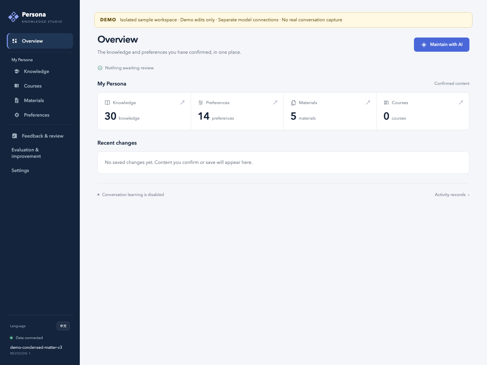

# PersonaStudio

[English](README.md)

围绕个人知识、偏好与 AI 协作构建的工具集合，由你掌握数据和最终决定。

当前收录的第一个应用是 **AI Persona**：具有网页界面、AI 维护助手和 MCP 接口的本地知识与偏好工作区。人工编辑保存后生效；AI 提议的修改先进入待审核区。



## 开始使用

下载或克隆仓库后，在仓库根目录打开终端。先安装 [uv](https://docs.astral.sh/uv/getting-started/installation/)，然后执行：

```sh
./scripts/ai-persona setup
```

本地设置向导帮助你选择工作区。请将个人数据放在仓库外。应用名和命令继续使用 `ai-persona`。

如果想先体验内置的虚构人格：

```sh
./scripts/ai-persona start --demo
```

Demo 首选 **8766** 端口，被占用时自动选择空闲端口，在独立副本中保存你的体验操作。浏览和人工编辑无需模型账号。

Studio 在当前系统用户下只运行一个服务。重复启动同一工作区会复用已有服务；可从侧栏「管理与切换工作区」创建、打开或切换到其他工作区和 Demo；页面会先检查任务，再停止原 Studio。命令行切换仍需先停止当前服务。

## 可以做什么

- 整理知识、课程、阅读材料、关系与可复用的个人偏好。
- 编辑时自动保留工作区草稿，刷新或切换语言后可恢复。
- 统一添加 arXiv、Markdown、文本 PDF、TXT 与粘贴文本，再选择保存或交给 AI。
- 查看知识图谱、材料原文与可追踪的修改历史。
- 请 AI 助手整理材料、提出修改，再由你审核。
- 接入 Codex，使用限定范围的知识查询，按需开启对话学习和偏好应用。
- 保存明确反馈、积累个人测试样例，在隔离评测中比较改进效果。
- 在简体中文与英文界面之间切换。

完整保留范围见[页面与功能兼容矩阵](docs/FEATURE_PARITY.md)。

## 环境要求

| 组件 | 要求 |
| --- | --- |
| 操作系统 | 面向 macOS、Linux；暂不支持原生 Windows。WSL 需单独验证实际环境。 |
| Python | 3.12 或更新；启动器通过 uv 安装锁定版本的应用环境。 |
| Node.js | 使用 AI 模型功能时需要 22.19 或更新版本，并包含 npm。 |
| 模型账号 | 可选；手动管理知识与偏好无需模型账号。 |

需要 AI 功能时，打开「设置 → 模型」，按页面提示检查环境并点击「安装模型组件」，然后添加账号、认证、测试并保存。也可以通过命令行安装：

```sh
./scripts/ai-persona models-install
```

支持的 API Key 与账号授权方式见[模型接入与认证](docs/MODEL_CONNECTIONS.md)。模型运行时安装在 Python 包目录之外。连接测试会真实调用提供方，可能消耗账号额度。

检查本地环境：

```sh
./scripts/ai-persona doctor --demo
```

## 仓库结构

```text
PersonaStudio/
├── apps/
│   └── ai-persona/      # 应用、锁文件、源码、测试和示例数据
├── scripts/            # 仓库启动器与检查入口
├── docs/               # 上手、数据管理与兼容说明
└── .github/            # 协作与自动化配置
```

当前只包含 `ai-persona`。Paper Radar 和 Promptbench 将来可以作为同级应用加入，本版没有捆绑这些应用或创建占位目录。现有 **Prompt Workbench** 入口依赖单独运行的服务，使用前请查看[集成说明](docs/INTEGRATIONS.md)。

## 文档

- [交付验证记录](docs/VALIDATION.md)
- [中文上手指南](docs/GETTING_STARTED.zh-CN.md) · [Getting started](docs/GETTING_STARTED.md)
- [数据、迁移与备份](docs/DATA_MANAGEMENT.md)
- [MCP、Codex、远端访问与 Prompt Workbench](docs/INTEGRATIONS.md)
- [应用文档](apps/ai-persona/README.zh-CN.md)
- [参与贡献](CONTRIBUTING.md) · [安全说明](SECURITY.md) · [变更记录](CHANGELOG.md)

个人工作区、模型凭据与部署日志不属于公共仓库。内置 Demo 使用虚构内容。项目采用 [MIT 许可证](LICENSE)，随包分发的第三方资源保留[各自的许可证](docs/THIRD_PARTY_NOTICES.md)。
