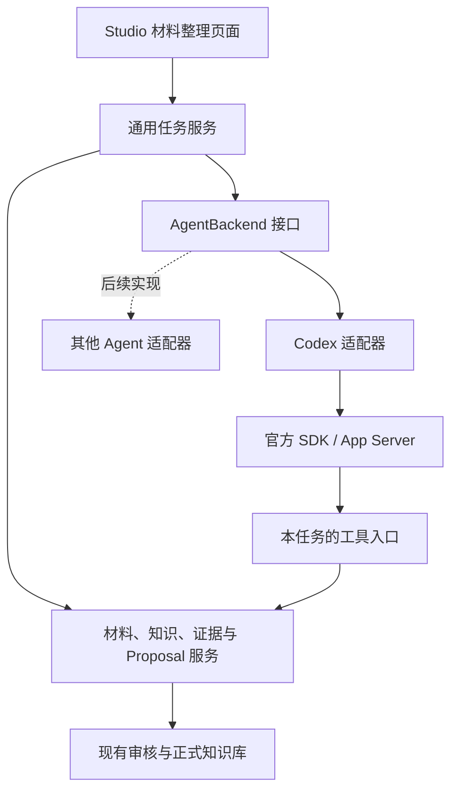

# 从 arXiv 或文件提取材料、知识与关系：Codex 接入设计

> 2026-09-11 实现更新：新任务改为 Agent 自主安排整个材料集合的阅读与整理，不再强制先逐篇分析再合并。来源工具、证据校验和人工审核保持独立。审核与提取结果共用主页图谱和内联审核组件。当前行为见 [材料整理使用说明](AI_PERSONA_EXTRACTION_USAGE.zh-CN.md)。

| 项目 | 内容 |
|---|---|
| 状态 | 已有本地实现；使用与验证范围见[实现说明](AI_PERSONA_EXTRACTION_USAGE.zh-CN.md)，尚未发布 Release |
| 版本 | 0.2 |
| 日期 | 2026-09-10 |
| 适用范围 | PersonaStudio / AI Persona 的材料整理功能 |
| 首期执行后端 | Codex；面向使用 Codex 的用户 |
| 扩展原则 | 领域模型、任务契约与执行后端分离，后续可增加其他 Agent |
| 后续阶段 | [第二阶段：多材料整理与统一知识图](AI_PERSONA_BATCH_KNOWLEDGE_GRAPH_DESIGN.zh-CN.md) |

本文整理已讨论的产品方向，并补充实现所需的接口、状态和验收设计。文中的新工具名称、状态名称和字段是建议契约，不代表现有接口已存在。文件格式范围、预算策略及数据迁移属于本设计提出的实现建议。

## 1. 目标与范围

用户提供 arXiv 链接或文件，设置提取目标后，由 Codex 按需读取材料、查询现有知识库，提取材料信息、少量有价值的知识点及有依据的关系，最后调用 AI Persona 的工具生成待审核 proposal。

完整流程：

```text
提供链接或文件 → 保存来源与建立索引 → 确认目标和提取规则
            → Codex 按需读取、查重、核对 → 工具提交 proposal → 用户审核
```

### 1.1 首期目标

- 保留现有 Studio 页面和人工维护、草稿编辑、审核能力，在材料整理入口接入 Codex。
- 接受 arXiv ID/链接，以及本地文件；原文不在初始提示词中整篇展开。
- 提供简短、可修改、可恢复默认的知识点和关系提取规则。
- 优先复用已有材料、知识节点和关系，允许没有新增知识点。
- 每项候选有可追溯依据，最终通过工具提交并保存 proposal。
- 显示真实进度、就近错误、已保存结果，并支持取消与继续。
- 为后续 Pi、Harness 等后端保留小而明确的通用接口。

### 1.2 首期边界

| 输入/能力 | 首期设计 |
|---|---|
| arXiv | ID，以及 `/abs/`、`/pdf/`、`/html/` 链接；支持显式版本 |
| Markdown | 保留现有 `.md`、`.markdown` 导入 |
| 文本 PDF | 新增直接上传，按页提取；结构质量不足时明确提示 |
| 纯文本 | 建议支持 UTF-8 `.txt`，按段落和位置建立索引 |
| HTML | 首期处理系统获取的官方 arXiv HTML；任意 HTML 文件导入后续扩展 |
| 扫描 PDF | 检测无有效文本；提示补充可读文本，不假装已分析；OCR 后续扩展 |
| Word、EPUB 等 | 后续通过解析器接口增加 |
| 任务规模 | 首期一项任务整理一份材料；保留未来多材料结构的扩展空间 |
| 执行后端 | 先实现 Codex，不同时实现多套后端 |
| 自动发布/监控 | 不自动采纳 proposal，不增加 arXiv 后台更新监控 |

直接上传 PDF、TXT 和 `/html/` 链接属于新能力，不能沿用历史文档中的“已支持”措辞。此设计不要求删除现有其他模型连接，也不改变本模块之外的执行流程。

## 2. 核心原则与职责

| 参与方 | 职责 |
|---|---|
| 用户 | 决定关注范围、提取规则及是否采纳 |
| AI Persona 核心 | 保存来源、定义结构、提供工具、限制范围、校验证据与候选、管理 proposal |
| Codex | 根据目标读取、检索、判断、补读、提出候选，并调用工具提交 |
| Codex 适配器 | 认证与运行时检查、会话生命周期、工具连接、事件和错误转换 |

必须遵守：

1. 来源内容是待分析数据，不能修改任务权限或用户目标。
2. 已被提供给模型的片段不等于已经理解；可定位的引用不等于语义上支持论断。
3. 上传、分析、标题或作者姓名均不能证明用户读过、喜欢、掌握或撰写了材料。
4. Agent 无权直接修改正式知识库。提交 proposal 只进入待审核流程。
5. Codex 的最终回答不等于业务成功；以工具返回的持久化结果为准。
6. 中间结果及时保存；超时、断线和上下文压缩不能把未完成工作表述为已完成。

## 3. 知识点、关系与材料的定义

### 3.1 默认知识点描述

以下文本作为设置页中的默认值，允许用户修改：

> 知识点是有明确名称、可独立检索和跨材料复用的领域、方法、概念或研究对象。优先提取通用术语，以及与关注领域直接相关、在材料中起关键作用的内容；优先复用已有节点，避免把临时表述、单条结论或细碎步骤单独建点。

补充执行含义：

- “广泛使用”是优先倾向，不是允许模型凭空认定的事实。仅凭一篇论文通常不能确认术语的普及程度。
- 论文提出的重要新方法或对象允许成为候选，但需注明“本文提出”及出处。
- 关注领域影响优先级，不自动排除理解材料所必需的跨领域知识。
- 仅在背景或参考文献中出现，一般不足以单独新增节点。
- 不按句子、公式、实验参数、结论数量机械建点。
- 结论通常写入材料总结、知识节点说明或关系陈述；仅在本身是可独立复用的命名实体时考虑建点。
- 不设置必须达到的提取数量。资源上限不等于质量目标，超限需说明保留项和延后项，不能静默丢弃。

例子：

| 材料中的内容 | 建议处理 |
|---|---|
| “Wigner 函数”“Lévy walk” | 若在材料中起关键作用，查询已有节点后提出复用或新增候选 |
| “在参数 a=2 时指数为 5/3” | 作为带条件的结果和依据，不单独建知识点 |
| “一种有效的新策略” | 缺乏独立名称和定义时不建点 |
| 有明确名称、定义和作用的论文新方法 | 可以提取，标记新方法，不声称已广泛使用 |

领域、方法、概念和研究对象是提取语义，不等同于任意增加数据库枚举。当前 `KnowledgeNode.semantic_role` 已有 domain、area、topic、concept、theory、model、method、technique、tool。首期按实际含义映射到这些类型，例如研究模型映射为 model、命名研究对象可映射为 concept，并在 scope_note 中说明；无法准确映射的候选保留待确认。新增独立 research_object 类型需另行版本化迁移，不能让 Agent 自造枚举。

### 3.2 默认关系描述

> 只提取材料明确支持、具有具体含义的关系。使用系统已有关系类型；不因共同出现而连线，不推断学习先修关系。已有关系优先补充依据。

用户可以修改提取偏好，但不能在提示词中绕过系统的关系类型和端点约束。

| 层次 | 处理规则 |
|---|---|
| 材料—知识 | 使用 covers，并用 knowledge_role 区分主题、问题、方法、模型、结果等；用 salience 表达主要或次要作用 |
| 知识—知识 | 使用已有 broader_than、part_of、applied_in、requires、related_to，遵循现有方向和端点规则 |
| 模型中的机制/条件联系 | 若只能用 related_to 表达，必须写出具体 statement 和适用条件，不把它暗示为普适因果 |
| 先修关系 | 首期不从材料分析自动推断；只有明确的任务要求和相应依据才进入其他维护流程 |

不要求所有候选两两连线。每条关系都需要自己的依据；两个节点分别有依据，不代表两者之间的关系有依据。

### 3.3 材料信息

- 书目信息：标题、作者、原文摘要、日期、标识符、版本、期刊、规范链接、语言。
- 整理信息：核心问题、方法、主要结论、适用条件、限制和待核对项。
- 来源信息：原始文件、内容哈希、解析版本、章节/页码定位。

确定性元数据优先，用户明确修订优先于自动提取。字段之间冲突时保留来源并提示核对。原文 abstract 与 AI 生成的 summary 分开保存，不能用生成摘要覆盖原文摘要。缺失字段保持缺失，不根据文件名猜测作者、日期或 DOI。

### 3.4 提取配置与版本

设置页只展示必要选项：知识点定义、关系规则、关注领域、整篇整理/定向提取。默认使用保守提取，不要求用户学习技术术语。

用户可以保存工作区默认规则，或仅覆盖本次任务。默认文案升级不覆盖用户自定义内容。程序保存规则 ID、版本、来源及本次实际生效的文本；恢复任务沿用快照。修改目标或规则应创建新任务版本，不在运行中无声替换。

提取规则负责“值得收录什么”；来源隔离、个人状态限制、工具权限、字段结构和 proposal 校验属于固定应用契约。

## 4. 来源准备与按需读取

### 4.1 arXiv

1. 规范化链接和 ID；未指定版本时先解析当前版本，再固定到具体版本。
2. 获取元数据，按 arXiv 基础 ID、版本、DOI 和现有来源查重。
3. 优先使用同版本官方 HTML 建立结构索引，保留标题层级、段落、图表说明、公式表示和锚点。
4. 保存原始 HTML；获取同版本 PDF 供回退与疑点核对。HTML 可用时，PDF 暂时下载失败不阻止文本分析，但必须记录“PDF 尚未保存/核对不可用”。
5. HTML 不可用时使用 PDF 文本及页码索引；两者均不可读时停止并明确说明。

不能把不同版本的元数据、HTML 和 PDF 拼成同一份来源。链接未标版本的入口只是发现入口，证据必须绑定已固定的版本。正文、附录和参考文献在目录中明确区分。

### 4.2 本地文件

上传后先保存不可变来源，再做类型、大小、编码、文本可读性及重复检查。格式限制和大小上限由解析器能力及现有上传限制共同决定，在上传前可见。

- Markdown 按标题和段落建立结构；frontmatter 作为带来源的元数据。
- TXT 按段落建立稳定位置，缺少章节时使用中性的段落编号。
- PDF 保留页码与文本片段的映射。阅读顺序不可靠、公式缺损、扫描页等情况标记解析质量，不伪造可靠章节。
- 表格、公式和图片通过专用片段或页图按需读取，不在初始上下文中全部展开。

解析器接口独立于 Codex，未来可替换为 Docling 等实现。本设计不依赖某个新的解析框架才能启动。

### 4.3 结构与证据定位

建议增加可重建的结构索引 sidecar，至少包含：

| 字段 | 含义 |
|---|---|
| source_id、source_version、content_hash | 程序确定的来源身份与版本 |
| representation_id、parser_version | HTML/PDF/Markdown 等具体表示及解析版本 |
| section_id、parent_id、title、order | 章节层级与顺序 |
| block_id、block_kind | 段落、公式、表格、图注等内容块 |
| locator | 原文锚点、抽取文本行范围或 PDF 页码/位置 |
| quality_flags | 解析缺失、疑似重复、公式待核对等 |

现有 extracted text 和行号依据继续兼容。结构索引是派生表示，不能成为无出处的第二份原文。重新解析后的证据不得套用旧行号；保存原表示或通过版本校验要求重新定位。

### 4.4 读取预算和覆盖

初始输入只放材料身份、简短元数据/摘要、任务规则和工具入口。大摘要与大目录也需要预算和分页；正文通过工具获取。

一次读取返回有限片段、明确位置、是否完整及续读游标。过长章节按段落继续拆分，不能默默截去尾部。可使用 token 预算或保守估算，但必须区分估算值与提供方实际用量。

工具限制同时覆盖：单次输出、单轮累计输出、整项任务累计读取和总时间/调用预算。本文不把具体数值当作已验证的最优值；实现阶段通过代表材料确定默认值。单次超时只是其中一项限制，不再依靠持续增加等待时间解决大输入。

覆盖记录分开表示 `读取已送达`、`分析已保存`、`待核对`、`明确跳过`，由工具送达账本和分析检查点共同确定。搜索命中或工具截断部分不能自动计作已完成章节。

## 5. 提供给 Agent 的任务契约

### 5.1 初始上下文

采用结构化输入，每个语义块带来源；摘要等来源文本始终作为数据。以下为简化示例，不是完整 API Schema：

```yaml
schema_version: ai-persona.material-extraction-task/v1
identity:
  origin: {kind: application, component: extraction_service}
  task_id: task_example
  task_revision: 1
  workspace_id: workspace_example
  persona_revision: 12
request:
  origin: {kind: user_request, id: request_example}
  goal: 整理材料信息、核心问题、方法与结论，提出必要的知识与关系候选。
  reading_mode: full
policy:
  origin: {kind: user_saved_policy, id: policy_example, revision: 2}
  knowledge_definition: 有明确名称、可独立检索和跨材料复用的领域、方法、概念或研究对象。
  relation_definition: 只提取材料明确支持且具有具体含义的关系；优先复用已有关系。
focus:
  origin: {kind: user_selection, id: request_example}
  domain_ids: []
sources:
  - origin: {kind: source_manifest, id: source_example, revision: 1}
    source_id: source_example
    source_version: v1
    content_hash: sha256:example
    title: 示例论文
    overview_available: true
output:
  origin: {kind: application_contract, version: material-extraction/v1}
  allowed_entities: [material, knowledge_node, relation]
  terminal_tool: submit_extraction_proposal
  review_required: true
```

正式版本从服务端 Schema 生成契约。上述简化知识点文本仅展示结构；实际任务使用第 3 节全文或用户保存的规则快照。关注领域为空意味着没有额外偏向，不能自行推断用户兴趣。

### 5.2 固定执行要求

- 先理解任务、材料概况和结构，再决定读取顺序。
- 以工具实际返回的当前工作区记录作为复用依据。
- 提取时保留条件、单位、研究范围及疑点，不把论文结论改写为普适事实。
- 公式或提取文本可疑时补读同版本原文，必要时查看 PDF；不能默默“修正”原文。
- 提交前检查重复、引用、关系方向和覆盖情况。
- 不要求解释隐藏推理；面向用户的进度只描述可观察动作和已保存结果。

### 5.3 两种阅读模式

| 模式 | 完成条件 |
|---|---|
| 整篇整理 full | 目录范围已枚举；正文和相关附录均有处理状态；未读或跳过部分及其原因可见；未解决关键缺口时不能标为完整 |
| 定向提取 targeted | 明确记录目标范围、检索和补读依据；结果注明是定向整理，不声称覆盖全文 |

整篇整理不要求核查所有参考文献原文，也不要求证明每一行推导；这类未做的工作在覆盖说明中明确。Agent 负责阅读策略，程序负责防止虚报覆盖。

## 6. 架构与 Codex 适配



### 6.1 通用后端接口

| 操作 | 输入/输出职责 |
|---|---|
| inspect_capabilities | 返回认证、可用模型、恢复、取消、图像读取等能力；不伪造各后端能力相同 |
| start | 接受不可变任务快照与工具范围，返回后端任务句柄 |
| resume | 使用已有任务/检查点继续；检查版本与来源一致性 |
| cancel | 请求停止，关闭本轮写入资格 |
| events / status | 返回规范化进度、等待、失败、结束及用量事件 |

应用任务 ID 独立于 Codex thread/turn ID。后者仅在适配器映射和诊断中保存。通用事件保留原始事件引用以便诊断，但 UI 不依赖 Codex 的事件名称和内部路径。费用/用量不可获得时为 unknown/null，不填零。

### 6.2 Codex 接入选择

首期优先验证官方 Python SDK，因为现有后端为 Python。该 SDK 基于 App Server，支持启动和管理本地 Codex 任务；安装、版本和 API 覆盖需在实现时验证并固定兼容版本。若 SDK 尚未封装必要操作，由同一个适配器使用 App Server，不能让协议细节进入领域服务。

认证尽量复用 Codex 已有认证；无有效认证时由 Studio 引导官方登录。登录成功和任务可运行分开检查。应用不复制、解析或自行刷新 Codex 私有凭据，也不把原有 Pi 连接自动等同于 Codex CLI 登录。

运行目录、任务存储和工具服务指向选定 Persona 工作区，不能依赖用户终端当前目录或任意全局 MCP 配置。配置隔离与复用登录需要共同验证，不采用“复制整个用户 Codex 配置目录”的做法。

优先通过本任务专用 MCP 工具连接领域服务。动态工具接口仅在明确锁定并验证版本后作为适配器内部选择，不能成为跨 Agent 契约的基础。工具初始化失败时任务应失败，不能悄悄退回另一知识库。

### 6.3 与现有 hook 隔离

Studio 内部分析和真实用户对话是不同来源：

- 应用在受信任的任务元数据中标记 `origin=studio_material_extraction`。
- 内部任务排除出对话学习和偏好采集，防止把程序提示词当作用户表达。
- 内部运行使用显式注入的任务规则，不依赖全局 hook 再补一份上下文。
- 禁止内部分析触发另一轮自动分析；测试全局 hook 已启用时的行为。
- 来源排除由配置和程序校验，不依靠可被原文模仿的一句提示词。

### 6.4 执行边界

正式知识库写入仅由应用服务执行。Codex 读取工具返回的来源，或在任务暂存目录内处理明确提供的文件。若启用终端或页图处理，权限由运行环境限制，不能只以 cwd 作为沙箱。网络获取优先由来源导入服务处理，首期不要求 Agent 任意访问外部网站。

## 7. 工具契约

名称为建议值。已有查询工具尽量复用业务实现；任务包装器固定工作区、来源范围、版本、返回字段和预算。

| 工具 | 用途 | 关键结果 |
|---|---|---|
| get_source_overview（新增） | 元数据、解析质量、分页目录 | 来源身份、章节列表、游标、缺失项 |
| read_source_section（新增） | 读取章节/子块 | 有界内容、locator、basis_ref、续读位置、完整性 |
| read_source（复用） | 精确行范围、页码等补读 | 片段与可验证依据；新增表示需扩展现有定位支持 |
| search_source_content（复用） | 在允许来源内定位相关内容 | 命中位置、片段、分页与范围说明 |
| search_knowledge（复用并裁剪） | 查重材料/概念及相关关系 | 当前工作区记录 ID、必要字段、版本、结果完整性 |
| get_persona_records（复用并裁剪） | 读取拟复用对象 | 当前记录与必要关系、修订号 |
| save_extraction_checkpoint（新增） | 增量保存章节分析和候选草稿 | 持久化检查点 ID、校验结果、草稿版本 |
| submit_extraction_proposal（新增包装器） | 校验并提交最终业务结果 | outcome、proposal_ids、任务/草稿版本、审核状态 |

每次工具调用由服务端绑定 task_id、run_id、工作区和允许来源；模型传入的 ID 仍需范围校验。所有返回内容带来源。搜索结果优先返回客观概念字段，不顺带返回用户掌握程度、兴趣或无关材料全文。

返回被截断时必须可补读，且不得生成声称整段完整的依据。basis_ref 由程序创建，绑定来源、表示版本、位置和内容哈希，模型不能自行构造有效引用。

## 8. 候选与 Proposal

### 8.1 候选结构

| 字段 | 要求 |
|---|---|
| client_ref | 本任务内稳定候选 ID，用于引用新节点和去重 |
| entity_type | material、knowledge_node 或 relation |
| operation | 本流程仅开放 create、update、relate；补充依据通过更新实现 |
| target_id / endpoint refs | 更新使用现有 ID；新关系可引用本任务内临时节点 ID |
| values | 仅包含建议变更字段；缺省不表示删除旧值 |
| basis | 工具产生的 basis_ref，并指明支持哪些字段或陈述 |
| reason | 简短说明为何值得收录/修改、为何复用或新增 |
| conflicts / unresolved | 冲突、条件限制、解析疑点及待确认事项 |

模型不生成正式数据库 ID、审核结果或个人状态。新节点保持个人字段未指定，现有节点的个人字段原样保留。

### 8.2 保存与提交

中间检查点是任务草稿，不是正式知识库，也不必每读一节就生成一个待审核 proposal。章节结果可增量保存，最终提交合并后的候选。

`submit_extraction_proposal` 执行以下步骤：

1. 核对本次运行资格、草稿版本和来源哈希。
2. 检查字段、枚举、关系方向、依赖及目标记录修订。
3. 验证依据确实已通过工具提供，且定位有效；标记仍需人工语义审核的内容。
4. 查重材料、节点和关系；不把单次搜索无命中视为“全库不存在”的证明。
5. 验证覆盖说明及未完成项，不允许不完整任务声称完成全文整理。
6. 调用现有编译与 proposal 业务服务，事务性保存并返回审核入口。

结构错误返回具体字段、原因和可操作修复建议，让 Agent 补读或修正。关键歧义进入等待用户确认，不反复猜测。

### 8.3 终态语义

| outcome | 含义 |
|---|---|
| proposed | 本轮计划提交的有效 proposal 均已持久化，返回 proposal_ids，进入 pending_review；明确延后项单独列出 |
| no_change | 已保存整理结果与无变更理由，例如材料和依据均已存在；不制造空 proposal |
| needs_input | 缺少必须由用户确认的信息；保存草稿，等待补充 |

无论哪种情况，最终业务结果均通过工具登记。Agent 只输出文字却未成功登记时，任务保持未完成并可继续。已创建 proposal 后的最终说明丢失，不应导致重新创建 proposal。

### 8.4 幂等、数量与审核

- 提交使用任务 ID、任务版本、草稿修订生成幂等键；重复请求返回同一组 proposal ID。
- 请求超时后先查提交状态，不能直接重提。
- 分组提交中途失败时，保存已成功的 proposal ID 和尚未提交的组，任务仍为可恢复失败；继续只补交未成功的组，不能因已有一个 proposal 就宣称全任务完成。
- 当前 Finish 结构最多 30 项 changes，这是一次提交限制，不是要求提取 30 项。设计不直接提高限制；应用按依赖拆分为可审核的 proposal 组，或保存延后项并说明。
- 有依赖的材料、知识和关系不能拆成悬空引用；必要时作为同一原子变更组，待关联记录成立后再提交后续组。
- 用户在页面手工编辑草稿后，Agent 的迟到结果不能覆盖。修改使用修订检查，冲突进入重新合并。
- 采纳、编辑后采纳、拒绝和延后继续使用现有审核能力。模型调用权限不包含采纳。

## 9. 状态、恢复与可观测性

建议任务状态如下，独立于 ProposalStatus：

| 状态 | 页面含义 |
|---|---|
| preparing | 正在保存与解析材料 |
| ready | 材料和规则已准备好 |
| running | 正在读取、检索、提取或核对，子阶段通过事件展示 |
| waiting_for_user | 等待登录或关键补充信息 |
| paused | 用户停止或达到可恢复预算，已保存进度 |
| failed | 当前运行失败，说明可否继续与原因 |
| proposed | 提案已创建，待用户审核 |
| no_change | 已完成并确认无需变更 |

每次继续生成新的 run_id。取消时立即使旧 run_id 失去写入资格，迟到的工具调用和响应不能提交或覆盖草稿。

应用持久化：任务规则快照、来源版本、目录及覆盖记录、已保存候选、证据引用、查询范围、后端句柄、提交幂等信息、事件摘要及错误。Codex 会话作为辅助执行历史，不能替代应用业务检查点。

恢复规则：

- 来源或解析表示变化：对应证据重新定位和验证，不复用过期行号。
- 用户目标或规则变化：创建新任务版本；原结果保留但不能自动混用。
- 知识库变化：可复用来源理解结果，重新查重并验证拟修改对象和关系。
- Codex 会话不可恢复：从应用检查点启动新会话，提供目标、完成项、证据引用、待办和未解决问题；原文按需补读。
- 模型/后端变化：显式记录新的运行配置，重新检查候选；不静默切换并沿用原结果的质量结论。

上下文压缩主要交给 Codex 执行。应用保证证据、覆盖和候选在压缩之外持久化；恢复时不把全部原文、工具日志和候选历史重新塞入上下文。

记录实际阶段、工具调用、已保存章节/候选数量、耗时和提供方用量。对工具读取、模型等待、校验和提交耗时分别计量；不从等待长短推断供应商内部故障。普通诊断日志不存凭据、整份材料或隐藏推理；后端会话日志按其实际存储行为明确位置与清理方式。

## 10. 页面体验

### 10.1 开始前

- 输入 arXiv 或上传文件，展示解析结果、重复提示和来源质量。
- 显示 Codex 可用性及登录状态，缺失时提供明确的安装/登录引导。
- 显示目标、关注领域和提取规则；规则默认简洁，编辑区可展开。
- 支持整篇整理和定向提取，明确告诉用户结果会进入待审核提案。

### 10.2 运行中

- 在操作附近显示当前阶段，例如“读取方法部分”“查找已有概念”“核对公式”。
- 展示已保存进度和未完成范围；总量不明确时不显示虚构百分比。
- 可以停止；说明已保存哪些内容以及哪些工作尚未完成。
- 错误就近显示；错误区域不在视野内时滚动定位并聚焦，避免轮询造成重复跳动。
- 恢复入口区别“继续分析”和“重新开始”，避免误以为继续一定从最后一个模型 token 恢复。

### 10.3 结果与审核

按材料、知识点和关系展示候选，标明新增/复用/更新。每项支持查看证据和跳转原文，条件或解析疑点在候选附近可见。总览展示覆盖范围、延后项及审核入口。结果与待审核 proposal 必须能对应，不能只展示一份无法追溯的聊天总结。

## 11. 现有实现的复用与迁移

以下为 2026-09-10 代码核对结果，不是本设计的实现完成声明。

| 现有部分 | 当前情况 | 本设计处理 |
|---|---|---|
| material_imports/arxiv.py | 先下载 PDF，再尝试 HTML，HTML 转为带标题的长文本 | 增加同版本结构索引，调整为 HTML 可用时优先服务读取；兼容旧来源 |
| material_imports/service.py | arXiv 和 Markdown 导入 | 增加直接 PDF/TXT 的解析入口及质量反馈 |
| material_analysis.py | 按最多 60,000 字符分段理解 | 新 Codex 路径不自动预分析整篇；改为索引与按需读取 |
| maintenance/service.py | 进入工具循环前注入分析结果和大量原文 | 新路径从小上下文启动，避免重复前置分析 |
| maintenance/runner.py | 已有工具循环、读取范围、证据账本与检查点 | 复用领域能力；新路径由 Codex 驱动执行，不嵌套两套自主循环 |
| maintenance/compiler.py | 已有候选、依据与对象校验 | 复用并扩展定位/范围支持，继续作为正式提交边界 |
| query_mcp.py | 已有查询工具，部分返回个人状态和图扩展 | 提供任务范围包装器和客观字段投影，避免无关上下文 |
| codex_hook.py | 输入捕获、学习入队、偏好注入 | 增加内部分析来源的可信排除与防递归测试 |
| model_runtime | 目前通过 pi-ai 调用模型 | 本材料路径接完整 Codex；不把直接模型调用误称为 Codex Agent |

### 11.1 材料个人关系约束

当前 Material v2 要求 `user_relationships` 至少一项，非作者材料必须填写 studied/read/skimmed 之一。这与“不从上传推断读过”冲突。

本设计建议在版本化模型中允许空列表，含义为“未指定”，且不加入 `unread` 之类未经用户确认的事实。已有关系原样迁移，空列表不自动参与阅读状态统计。需要同步表单、序列化、筛选、导入和校验；具体 schema 版本号由实现时统一分配并记录迁移。

迁移完成前，缺少该信息只能保存来源/草稿并请求用户明确填写，不能默认写成 skimmed 以绕过约束。已有材料的关系不因本次分析被清空。

### 11.2 兼容与回退

- 旧来源、历史行号依据、旧草稿和提案继续可读。
- 原文保持不可变；新索引按需生成并版本化。
- 新执行路径先通过功能开关接入材料整理，保留原路径作为回退，不静默把同一任务切回另一后端。
- 旧运行中的任务不被部署强制中断；旧检查点与新任务版本明确区分。
- 保存现有模型连接和用户配置。本次收敛是首期产品支持范围，不等于删除未来扩展基础。

## 12. 验收标准

| 类别 | 必须通过的验收 |
|---|---|
| 输入 | arXiv 三类链接、显式/隐式版本、Markdown、文本 PDF、TXT 正常；扫描/损坏/超限文件明确失败且不丢原文 |
| 结构 | HTML 标题层级、公式/表格重复表示处理、附录、PDF 页码定位；长章节可连续读取，无静默遗漏 |
| 目标 | 默认规则可编辑/恢复；工作区默认与本次覆盖独立；恢复沿用快照 |
| 提取质量 | 关键术语、问题、方法、结果和限制有依据；不按句子建点、不凑数量、不把共同出现变成关系 |
| 复用 | 已有概念别名可复用；搜索分页和范围限制正确；跨工作区 ID 被拒绝 |
| 个人状态 | 上传、作者同名、模型推断均不能生成阅读/兴趣/掌握状态；已有个人字段保持不变 |
| 证据 | 错误来源、过期哈希、越界/截断引用、错误关系端点被拦截；人工抽查语义支持 |
| 提交 | Agent 通过工具产生可审阅 proposal；无变更结果可登记；文字“完成”不算提交成功 |
| 幂等 | 提交超时、重复工具调用、任务恢复只产生同一逻辑提案组；依赖不会悬空 |
| 恢复 | 取消、重启、断线、会话不可恢复、规则/来源/知识库变化的处理符合第 9 节 |
| Hook | 启用用户现有 hook 时，内部分析不会进入用户学习队列或递归启动 |
| UI | 就近错误/自动定位、真实阶段、停止/继续、提案入口、原文定位在桌面与窄屏可用 |
| 安装 | 干净环境可安装指定运行时；有效已有认证可用；缺失/失效认证可引导；任务工具指向正确工作区 |

评估使用固定材料版本、目标、知识库快照、模型和输出规则。覆盖短论文、长论文、含附录/公式/表格的论文，以及已有知识可复用的情形。比较总完成率、首条可审阅结果时间、总耗时、最大单次输入、实际用量、证据支持率、遗漏和重复；不以候选数量或模拟延迟作为质量提升证明。

测试分为确定性离线校验、协议/恢复集成、隔离页面验收及真实 Codex 端到端验收。真实验收应事先明确材料和账号使用范围；没有完成真实调用时不得宣称认证与语义质量已全面通过。

## 13. 实施顺序与交付物

本文件定义第一阶段：单材料的 Codex 提取与 proposal 审核。以下五项是第一阶段内部的实施步骤。第一阶段验收通过后，再实施[第二阶段：多材料整理与统一知识图](AI_PERSONA_BATCH_KNOWLEDGE_GRAPH_DESIGN.zh-CN.md)；批量导入、跨材料整合和批次知识图预览不加入第一阶段验收范围。

1. **契约与数据边界**：提取规则快照、任务模型、来源身份、个人关系迁移、proposal 幂等和终态。
2. **材料读取能力**：arXiv HTML 结构、文件解析、分页、证据映射、覆盖表及专用工具。
3. **Codex 适配**：固定运行时、认证检查、任务启动/恢复/取消、工具范围、hook 隔离与事件转换。
4. **端到端流程**：按需提取、增量草稿、查重校验、工具提交、原有审核界面衔接。
5. **验收与发布准备**：兼容迁移、失败恢复、干净安装、真实样本评估、更新用户指南和能力矩阵。

每一步提供代码、相应测试和明确的未完成项。首次发布的完成条件是第 12 节必需验收通过，不以“Codex 能返回一段分析文字”为完成标准。

## 14. 参考与文档关系

- [材料模型](AI_PERSONA_MATERIAL_DESIGN.zh-CN.md)、[存储设计](AI_PERSONA_STORAGE_DESIGN.zh-CN.md)、[统一维护](AI_PERSONA_UNIFIED_MAINTENANCE_DESIGN.zh-CN.md)：沿用已有领域结构与审核边界。
- [历史材料导入需求](AI_PERSONA_MATERIAL_IMPORT_REQUIREMENTS.zh-CN.md)、[历史分段优化](AI_PERSONA_MATERIAL_ANALYSIS_OPTIMIZATION.zh-CN.md)：解释旧实现；其格式范围、前置分析和 Pi 路径不作为本设计新路径的要求。
- [Codex 官方 SDK](https://learn.chatgpt.com/docs/codex-sdk)：Python SDK 与 App Server 接入；能力和版本以实际固定的依赖及验收为准。
- [Codex App Server](https://learn.chatgpt.com/docs/app-server)：认证、会话与事件协议，动态工具仍需按官方成熟度和版本评估。
- [arXiv HTML 说明](https://info.arxiv.org/about/accessible_HTML.html)：HTML 覆盖和转换质量存在限制，因此保留 PDF 回退与质量标记。

本设计基于 2026-09-10 的讨论与代码核对。此前一次无对话历史的 Codex 子代理实验观察到整篇读取截断后分段补读和 PDF 核对，说明补读与核对流程值得保留；该单次实验不证明性能优势，也不证明自动章节化一定发生。因此预算、来源和完成条件仍由应用明确实现。
