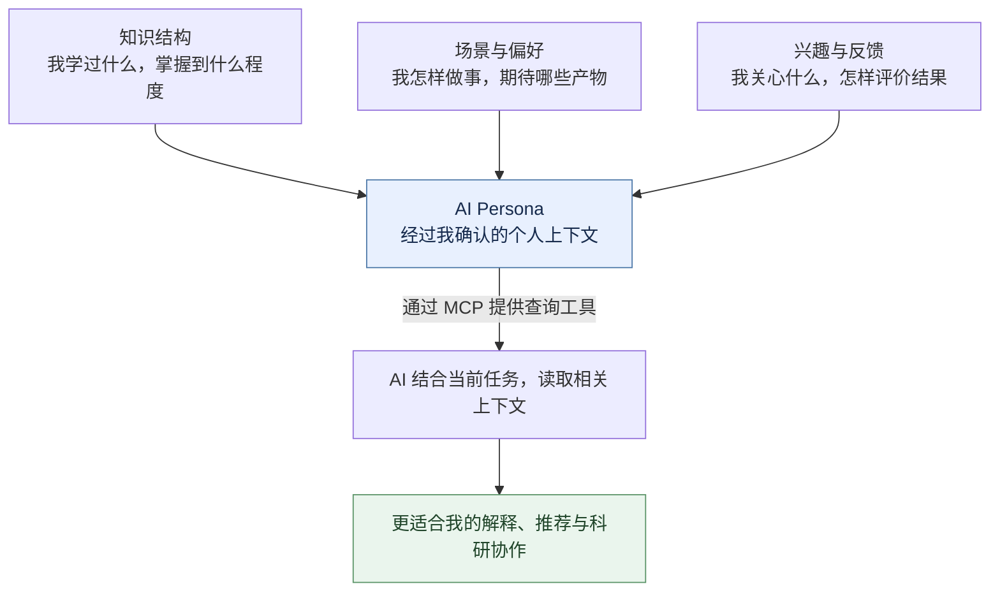
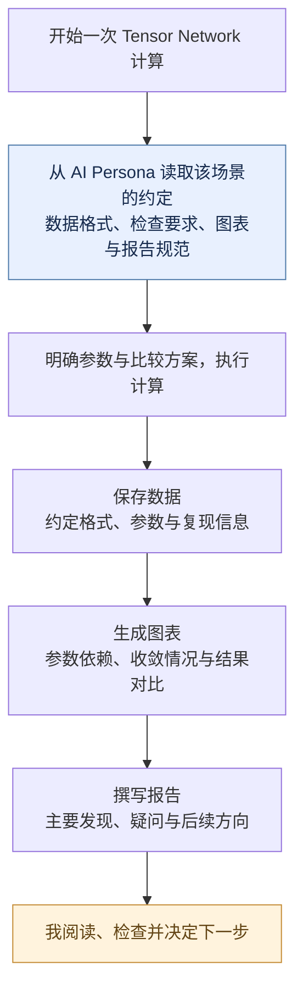
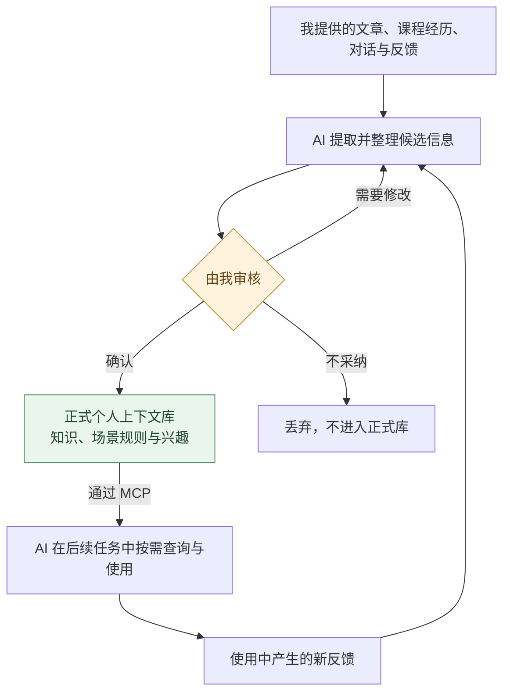

# AI Persona：让越来越强的 AI，更好地理解我

最近做一个科研工作时，我让 AI 跑了一天，得到了一个结果。之后，我花了一个星期去理解它，最后把它写成了一篇文章。

回过头看，同样的结果，如果放到过去，可能需要我花几个月才能完成。

这让我开始重新思考：在现在这个时代，我们应该怎样更好地和 AI 合作？

AI 相对于人的显著优势，是快，而且不知疲倦。就像我们早已习惯把计算交给计算机一样，我们也应该把越来越多 AI 能完成的任务交给它。在科研中，这件事已经很常见了：让 AI 写代码、做推导，或者给它设定一个目标，让它通过反复尝试、检验和调整，持续推进研究。

但随着 AI 的能力增强，我越来越明显地感到，科研中很大一部分瓶颈，开始落在我自己身上：**我需要理解 AI 产出的东西，才能判断它是否可信、意味着什么，以及下一步应该往哪里走。**

AI 一天做出来的结果，我可能需要一个星期才能理解。这个时间差让我意识到，除了让 AI 更快地完成任务，还有一件事值得认真去做：让它以更适合我的方式，把结果交到我手上。

这就是我想做 AI Persona 的动机。

我希望把自己的知识结构、场景与偏好、研究兴趣，逐渐整理成一份由我确认、方便我查看，也能被 AI 调用的结构化个人上下文。这样，AI 在解释一个结果、推荐一篇论文，或者执行一整套科研工作流程时，就能更清楚地知道：它正在和谁合作，这个人需要什么，以及怎样的结果才方便他理解和使用。

*AI Persona 的基本设想：让关于我的信息，成为 AI 协作时可以使用的上下文。*

几个月前，我做过一个科研项目的记忆管理 skill。当时觉得很有用，因为它能帮助 agent 记住项目推进到了哪里、尝试过哪些方向、经历过哪些失败，以及我现在正在做什么。这些信息既有助于 AI 自己继续工作，也让它与我的讨论更连贯。

但仅仅一个月之后，我就发现，这个 skill 对我而言已经基本没有必要了。随着模型能力变强，只要把项目路径设置好、把材料合理地组织起来，它就能自己查找和读取需要的信息。原先需要专门设计的一部分记忆管理流程，逐渐被模型自身的能力覆盖了。

这段经历让我开始关心：哪些上下文，是模型能力不断增强之后，依然需要我们提供的？

目前，我的判断是：**越个性化的信息，越值得积累。**

模型可以知道某个数学概念是什么，却无法预先知道我是否学过它、理解到了什么程度。它可以掌握常见的论文写作和绘图规范，却无法预先知道我习惯使用哪一套符号、喜欢怎样的笔记结构，以及觉得多大的字号读起来舒服。

这些信息取决于我这个具体的人。通用能力再强的模型，也需要某种途径来了解它们。

比如，我希望 AI 在给我写一份 note 时，能够考虑我的知识结构。遇到我已经熟悉的概念，可以简洁地带过；遇到我还没有掌握的知识，则应该补上必要的定义、背景和中间步骤。这样，我就更容易沿着自己的知识基础，理解新的内容。

我也有一些很具体的偏好。例如，我希望在 note 的开头集中列出用到的符号及其定义，希望它遵循我习惯的符号约定。科研绘图也是一样，字体、字号、配色和标注方式，都有可以反复使用的个人偏好。

如果每次开始一个任务，都需要重新交代这些事情，沟通本身就会成为负担。把它们积累下来，AI 才有机会在不同任务中持续使用这些信息。

而“场景与偏好”还可以涵盖更完整的工作方式。

比如，我做 Tensor Network 计算时，关心的事情往往从计算开始前，一直延伸到结果整理之后。我可能希望先明确参数和比较方案，在计算过程中按照约定的格式保存数据，结束后画出我关心的图，再写出一份符合我阅读习惯的总结报告。

对我而言，这些事情共同构成了一次完整的科研工作。

很多这样的要求，分散在过去的代码、文件夹、报告，以及我和 AI 的反复交流里。每开始一次类似的计算，我都可能需要重新交代其中的一部分。有时忘了说，等计算结束才发现，某些数据没有保存，某张关键的图没有画，或者报告缺少我最关心的比较。

我希望 AI Persona 能逐渐把这些经验整理成明确的场景规则。当我再次开始一项类似的工作时，AI 可以读取相关约定，理解我对这类任务的完整期待。

理想情况下，我只需要说：

> 按我平时做 Tensor Network 计算的流程，研究一下这个问题。

AI 就能知道，除了完成计算，还需要怎样保存数据、怎样检查和呈现结果，以及怎样把这项工作交到我手里。

*一种可能的场景工作流：把我对数据、图表和报告的要求，贯穿到整项任务中。具体步骤可以由我调整。*

**“完成任务”这件事，也可以有属于我的具体定义。**

同样是“读一篇论文”，有人希望迅速提取结论，有人希望逐步检查推导。我可能希望 AI 先把论文与我已经熟悉的知识联系起来，再解释真正新增的部分，最后列出它对我当前研究可能有什么用。

同样是“复现一篇论文”，我可能希望先从最小例子开始，确认关键结果，再逐渐扩大计算规模；每一步都留下参数、数据和差异分析，最后形成一份以后能够接着使用的记录。

甚至面对一次失败的尝试，我也可以有自己的处理习惯：保存失败条件，区分已经排除的解释和仍待验证的猜想，把下一次尝试写得足够具体。这样，一次失败也能成为后续工作的起点。

这些场景还可以延伸到准备组会、学习一门新课程、整理每周工作，或者向不同背景的人介绍一个研究方向。每个场景都可以包含一组相关信息：我想达到什么目的，习惯怎样推进，需要哪些产物，以及我通常依据什么来判断结果是否令人满意。

当场景与知识结构结合起来，个人上下文的价值还会进一步显现。写计算报告时，AI 可以根据我的背景决定哪些步骤需要展开；准备组会时，它可以参考我对讲述顺序和重点安排的偏好；学习一个新方向时，它可以从我已经掌握的知识出发，安排阅读与练习。

这些流程也应该能够随时调整。探索一个新想法时，我可能只需要快速计算和简短记录；准备正式结果时，我才需要完整的数据整理、图表和报告。我希望 AI Persona 能保留这些场景之间的差异，让我根据实际工作不断修改约定。

另一个我很期待的应用是信息推荐。

我读过哪些文章，精读过哪些论文，对哪些内容感兴趣，又对哪些内容不感兴趣，这些都能帮助 AI 理解我的需求。结合我的知识基础和当前研究方向，它可以更有针对性地筛选 arXiv 论文或相关资讯，也更容易解释一篇文章为什么值得我读、它与我已有的知识有什么联系。

其中，兴趣和掌握程度需要分别记录。我可能熟悉一个方向，却暂时不想继续关注；也可能对一个新问题很感兴趣，但还需要补上基础。把这些区别表达清楚，AI 才更容易提供适合我当前状态的内容。

不过，知道这些信息有价值，并不意味着整理它们是一件容易的事。

让我手动维护一份完整的个人知识档案，逐条填写背景、习惯、兴趣和工作流程，本身就是一项繁琐的工作。而且，我对自己的描述也很难一次就写完整。很多偏好，只有在具体任务中才会显现出来：看到一份笔记之后，我才意识到自己需要更详细的推导；修改一份报告时，我才明确自己希望增加哪些比较。

所以，我希望 AI Persona 能借助 AI，从我提供的材料和日常交流中提取这些信息，让整理的过程尽量轻量。

比如，我可以把读过或精读过的文章放进去，让 AI 提取其中的知识点，整理概念之间的关系，形成一个可以查看和修改的知识网络。我再根据自己的实际情况，标注哪些只是接触过、哪些已经理解、哪些掌握得比较熟练。课程经历也可以用同样的方式补充进去。

读过一篇文章，并不代表掌握了其中的所有知识。AI 可以帮助搭建网络，我的掌握程度仍然需要由我确认。

偏好和工作流程也可以从对话中逐渐积累。当我说“以后写 note 时，把所有符号都列在前面”，或者“以后做这类计算，也把这组数据保存下来”，AI 可以把它整理成一条候选规则，再交给我确认。我也可以补充它适用的场景，避免一次临时要求被当成长期偏好。

围绕这个过程，我最看重三个要求：

1. **便于人查看和审核。** 数据需要有清楚的结构，能够直接呈现在界面上，让我看得懂 AI 记录了哪些关于我的信息，也方便我修改和删除。
2. **正式入库必须经过确认。** AI 可以发现、提取和整理候选信息；每一条关于我的数据，在进入正式个人上下文库之前，都必须经过我的确认。已有规则的更新也一样。
3. **积累过程足够轻量。** 我希望在读文章、写笔记、修改图表和与 AI 讨论的过程中，就能自然地产生候选信息，再通过简单的审核把它们留下来。

*AI 负责帮助整理，我决定留下什么。新信息和更新都经过确认，才成为后续协作的依据。*

当这些数据以结构化的方式保存下来之后，就可以通过 MCP，为大语言模型提供查询和读取它们的工具。

AI 在写笔记之前，可以查询我的相关知识背景和笔记偏好；开始一项计算时，可以读取该场景的工作流程；推荐论文时，可以参考我的研究兴趣、阅读记录和反馈。

最初，我可以明确规定哪些任务需要查询哪些信息。随着模型能力提升，我也期待它能更准确地判断，什么时候需要了解我的背景，以及需要读取哪些上下文。

我希望今天为一次合作花时间讲清楚的事情，能够在未来很多次合作中继续发挥作用。即使换一个模型、开始一个新项目，我也能把这份经过自己确认的个人上下文带过去，让新的合作从一个更有默契的起点开始。

这也是我对 AI Persona 的长期期待。模型越有能力，就越有可能充分利用这些个人信息，把任务完成得更符合我的需要。

只要科研还需要我参与理解、判断和选择，AI 如何与我协作，就始终是一件重要的事。我希望 AI Persona 能让“了解我”成为一种可以持续积累的基础，让 AI 每一次更强的能力，都更容易转化为我真正能够理解和使用的帮助。
