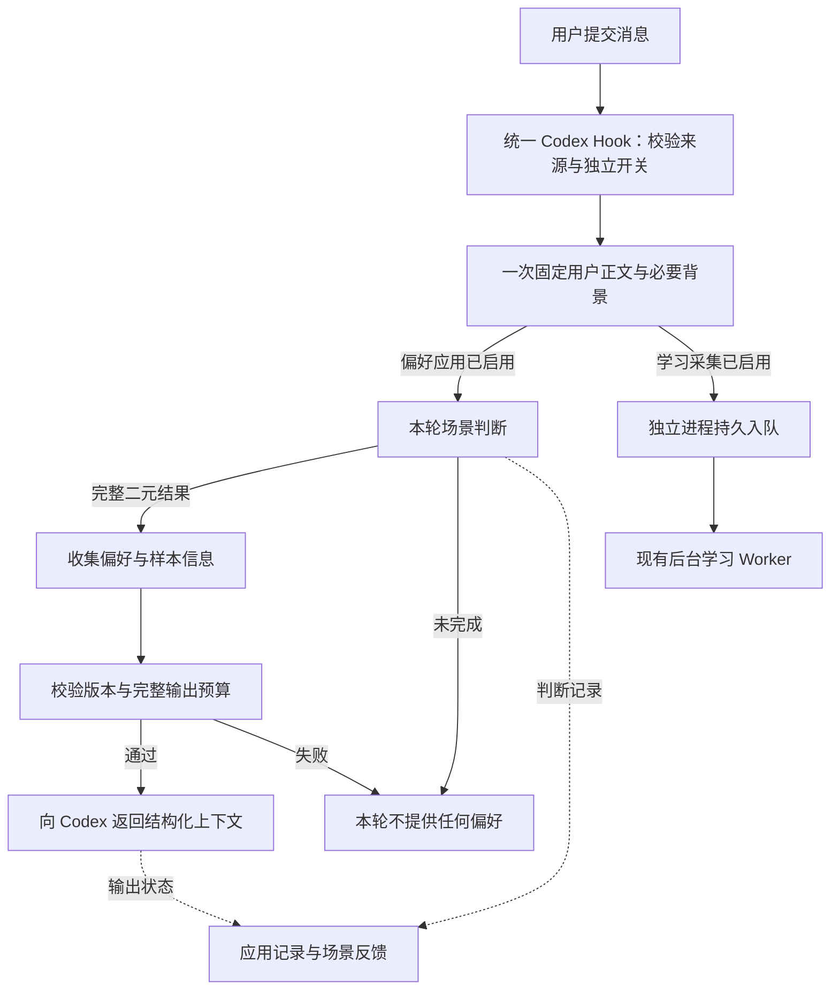

# AI Persona：偏好场景触发、上下文提供与反馈设计

> 设计与历史参考：本文可能包含早期阶段或规划，不是本次发行的验收报告。当前入口与能力以[使用指南](../../../docs/GETTING_STARTED.zh-CN.md)和[兼容矩阵](../../../docs/FEATURE_PARITY.md)为准。

| 字段 | 内容 |
| --- | --- |
| 状态 | 统一 Hook、独立业务流程和页面已完成；真实 Codex 自动触发待统一 Hook 信任后验收 |
| 版本 | 0.3 |
| 日期 | 2026-09-08 |
| 首版宿主 | Codex，本机 `UserPromptSubmit` Hook |
| 目标 | 根据当前任务命中场景，在 Agent 开始处理前提供相关长期偏好，并支持用户评价场景判断是否合理 |
| 核心原则 | 最终 Agent 负责理解和使用偏好；AI Persona 负责选择场景、提供准确完整的信息及说明来源 |

关联文档：[对话学习设计](AI_PERSONA_CONVERSATION_LEARNING_DESIGN.zh-CN.md)、[对话学习接入说明](AI_PERSONA_CONVERSATION_LEARNING_USAGE.zh-CN.md)、[反馈与个人 Benchmark](AI_PERSONA_FEEDBACK_BENCHMARK_DESIGN.zh-CN.md)、[模型接入](AI_PERSONA_MODEL_INTEGRATION.zh-CN.md)、[MCP 设计](AI_PERSONA_MCP_DESIGN.zh-CN.md)。

本文整理本次讨论的产品决定与首版实现。具体交付状态、测试证据及尚未完成的宿主验收见第 10、12 节；操作步骤见[偏好自动应用使用说明](AI_PERSONA_PREFERENCE_ACTIVATION_USAGE.zh-CN.md)。本文的新二元判断协议替代新运行中的场景 `uncertain` 方案；历史记录保留原貌，对话学习自身的处理状态不受影响。

## 1. 已确认的原则

1. **先适配 Codex，以 Hook 接收用户请求并调用 LLM 判断场景。** 核心业务保持独立，未来接入其他 Agent 时可以复用。
2. **场景判断只有命中和不命中。** 不输出“不确定”，不增加置信度作为第三种选择。每个场景独立判断，允许多个命中，也允许全部不命中。
3. **判断未完成，本轮不提供任何偏好上下文，包括全局偏好。** Codex 正常继续。超时、调用失败、非法输出等记录为运行失败，不伪造“不命中”，不计入场景判断准确率。
4. **假设最终 Agent 具有足够的理解能力。** 命中场景之后，提供相关偏好原文、适用条件和样本信息；不再通过额外模型逐条裁定偏好、不代写执行方案。
5. **提供结构化上下文，并说明来源和使用定位。** 信息来自用户保存或确认的长期偏好，供当前任务参考；当前用户明确要求优先于历史默认偏好。
6. **场景描述说明什么时候使用；典型请求示例提供希望触发该场景的用户请求例子。** 示例是语义参考，不是关键词列表或穷尽清单。
7. **参考样本支持文件和文件夹。** 本流程先提供资源信息；AI 如何按需检索、选择、读取文件夹内容留待后续设计。

执行阶段采用可调整的 5 秒等待上限，提供独立开关并复用现有来源范围；反馈只保存评价与回放样例，不自动修改正式内容。这些是首版实现默认值，不把它们追记为此前已经逐项确认的产品要求。具体取舍见第 13 节。

## 2. 首版范围与职责

### 2.1 首版需要完成

- 从 Codex 用户消息事件取得本轮输入与必要的对话背景。
- 在回答前完成一次场景判断，校验所有场景的二元结果。
- 收集命中场景下的正式偏好及参考样本，并按正常成功路径合并全局偏好。
- 生成带来源说明的 JSON，通过 Hook 返回本轮上下文。
- 记录场景判断、实际组装内容、提供状态与失败原因。
- 在 AI Persona 中查看记录，对单个场景的误触发或漏触发进行反馈。
- 复用已有反馈样例和回放能力，支持比较不同版本的判断效果。

### 2.2 首版不包含

- 其他 Agent 的接入实现。
- 再次使用模型筛选每条偏好、解释每条规则或者生成一套执行指令。
- 自动注入完整知识库、全部聊天记录、样本全文或文件夹全部文件内容。
- 文件夹内容的自动分析、索引、检索与按需读取策略。
- 从 Agent 的回答自动推定偏好已被遵循，或自动评价最终任务质量。
- 因用户反馈而自动修改正式偏好、场景或线上提示词；是否进一步开放见第 13 节。

### 2.3 三方职责

| 参与者 | 负责的事情 |
| --- | --- |
| 场景判断 LLM | 理解本轮任务，对每个已启用场景给出命中或不命中及简短理由 |
| AI Persona 程序 | 校验结果、读取正式数据、按范围收集和去重、组装上下文、记录状态和反馈 |
| 最终 Agent | 理解偏好的适用条件、处理本次要求与历史偏好的关系、决定具体执行方式 |

系统保留 `required / preferred / avoid` 的用户原始表达强度，不把全部偏好改写成同一种建议。场景判断不负责解决偏好间的语义冲突，组装程序也不依据记录新旧擅自覆盖另一条偏好。

## 3. 全流程



两个功能共用一个 `UserPromptSubmit` 命令处理器，由 `codex_input.py` 统一验证事件、检查来源范围、规范化正文、捕获有界背景并排除重复的当前消息；`codex_hook.py` 负责按开关分发。来自学习页和偏好应用页的配置生成接口返回同一份配置，同一来源只安装一次。

自动应用偏好需要在模型开始处理本轮请求前返回，因此使用同步路径；学习采集通过独立子进程入队，模型分析继续由现有 Worker 在后台完成。入队进程自身最多等待 3 秒，统一入口不等待其完成；学习库锁定或入队失败不会拖住偏好输出。共享输入通过匿名临时文件传入学习子进程，避免大输入写管道时阻塞主流程；不建立第二份持久学习队列。

两个功能仍分别检查各自开关与权限。偏好判断失败时，学习可以继续；学习入队失败时，偏好可以继续。只有共同的消息格式或来源范围不合法时，两者一起停止。读取背景的共同时间计入本轮偏好总预算，不因为合并入口获得额外等待时间。

例如，“帮我画一张散点图”可以触发科研绘图偏好，同时不包含任何值得学习的新偏好。偏好应用不能以对话学习是否触发作为前置条件。两项模型任务保留各自提示词、路由和调用生命周期。

## 4. 判断输入与语义

### 4.1 输入组成

| 信息 | 用途与边界 |
| --- | --- |
| 当前用户正文 | 本轮任务的主要依据；保留用户真实表达 |
| 必要的最近对话 | 理解“好的，就这样做”“把刚才的图改一下”等指代和延续；保留消息角色 |
| 已有任务摘要（如有） | 帮助理解长任务；首版不额外调用模型生成摘要 |
| 已知产物类型（如有） | 补充任务信息；不额外猜测出一个类型作为硬过滤条件 |
| 全部已启用场景的目录快照 | 包括标识、名称、描述、典型请求示例、排除条件、产物类型和版本 |

输入采用有长度上限的固定快照，不读取后续回答，不把同一条当前消息重复放进最近对话。宿主自动附带的浏览器状态等内容应与用户正文区分，不能把自动附带的网页地址当作用户要求执行某项任务的证据。

背景读取应有明确边界；宿主不提供历史时，仍可用当前完整正文判断。语义上缺少支持某个场景适用的依据时，模型选择不命中；已经发起的必要输入读取发生运行错误时，记录判断未完成。不能以任意裁断当前请求的方式掩盖超长或读取错误。

首版在预算允许时一次提交完整有效场景目录，不先用关键词排除场景，不另加一次“是否需要判断场景”的模型调用。场景目录过大时记录输入超预算，不把未判断的场景默认为不命中。大量场景下的召回优化另行设计。

### 4.2 判断问题

> 根据当前用户请求及必要的对话背景，这个场景是否适用于本轮任务？

- 符合场景描述、有任务依据：命中。
- 不符合、被排除条件排除，或缺少适用依据：不命中。
- 同义表达可以命中；典型请求示例为空，也可以根据描述命中。
- 明确区分执行任务、讨论功能、引用他人请求和否定表达。
- 本轮是前面任务的继续时结合背景判断；本轮已经切换任务时重新判断。
- 偏好内容本身不进入这一步，避免把“是否喜欢某种格式”混同为“是否正在做该场景的任务”。

例如，用户本次指定 SVG 仍可能命中科研绘图场景。场景下“默认使用 PNG”的偏好如何让位于本次明确要求，由最终 Agent 处理。

### 4.3 场景字段约定

界面继续使用“描述”和“典型请求示例”。存储中的 `activation.intents` 可以暂时保留为兼容字段，但传给判断模型时必须解释为典型请求示例。此次设计不要求重建已有场景，也不恢复已移除的“补充说明”输入。

## 5. 二元判断契约与失败规则

### 5.1 建议的新输出契约

以下为模型输出示例，标识均为示例值。由程序把场景 key 映射为正式记录 ID。

```json
{
  "contexts": [
    {
      "key": "research.plotting",
      "matched": true,
      "reason": "用户要求把实验数据绘制为散点图。"
    },
    {
      "key": "academic.note",
      "matched": false,
      "reason": "本轮没有撰写或整理学术笔记的任务。"
    }
  ]
}
```

要求：每个输入场景恰好返回一次；标识真实且不重复；`matched` 必须是严格布尔值；理由简短，供记录和反馈使用。理由无需进入 Agent 上下文，不要求模型输出推理过程或置信度。

模型输出缺失场景、包含未知场景、返回字符串代替布尔值，或者仍返回 `uncertain`，均属于输出无效。**本轮完整校验通过之前，不提交部分结果，也不注入部分命中场景。**

建议把对外场景判断协议升级为 `ai-persona.activation/v2`，复用现有 `run_id / result_id / feedback_url`。持久化层可继续用已有的 `triggered` 布尔字段；`matched` 到 `triggered` 的映射由程序完成，不维护两份可独立修改的真值。

### 5.2 判断结果与运行状态分离

| 情况 | 判断是否完成 | 本轮提供内容 |
| --- | --- | --- |
| 完整判断，至少一个场景命中 | 是 | 命中场景的偏好、样本信息，以及全局偏好 |
| 完整判断，全部不命中 | 是 | 仅全局偏好；没有全局偏好则不输出 |
| 有效场景目录为空且读取成功 | 是，程序直接得到空结果，无需调用 LLM | 仅全局偏好；没有全局偏好则不输出 |
| 模型超时、调用失败、输出无效、输入处理失败 | 否 | **不提供任何偏好，包括全局偏好** |
| 未启用或超出来源范围 | 未运行 | 不提供 |
| 判断成功，但组装或返回上下文失败 | 判断已完成，提供失败 | 不提供；保留有效场景判断用于独立评价 |

成功路径中的全局偏好处理是本设计采用的默认规则，延续“所有任务”的适用范围。空目录与目录读取失败必须区分：只有成功读取到空目录，才能走无需模型的完成路径。

失败后不输出“本次未命中”的替代内容，不补发仅全局偏好的兜底包，不要求用户等待或重试，也不在本轮结束后自动补发旧结果。用户继续对话时，下一轮按新输入重新处理。

## 6. 上下文准备

### 6.1 收集与一致性

程序基于本轮正式数据快照进行收集：

1. 取得有效全局偏好。
2. 取得 `context_refs` 与命中场景有交集的有效偏好。
3. 取得同样关联到命中场景的有效参考样本。
4. 按记录 ID 去重，并保留其场景关联。
5. 保留偏好原文、行为类型、条件和已有理由；不增加语义改写。
6. 解析已有样本的资源元数据，生成可提供的资源引用。

只使用正式有效记录，不读取待审核建议作为当前偏好。同一偏好关联多个命中场景时只提供一次；不同记录即使文字相近，也不擅自语义合并。

不得直接把现有分页接口的第一页或最多 10 个样本当成“该场景全部内容”。实现需要完整收集候选，再统一检查输出预算；不能把已有查询接口的截断行为无提示地带入本流程。

场景目录与内容必须来自一致快照，不能用旧描述判断后读取一个无关版本的场景。建议固定本轮 Persona 版本和所用记录快照；最终返回前如发现已选内容被停用、删除或版本变化，首版放弃本轮提供并记录原因，不再增加一次同步模型重试。

### 6.2 提供给 Agent 的结构

建议使用 JSON 文本，外层说明一次来源，内部使用稳定字段。以下为完整示意；路径和标识是占位值，实际输出只能使用经适配器确认的资源位置。

```json
{
  "schema_version": "ai-persona.preference-context-payload/v1",
  "type": "user_preference_context",
  "source": {
    "kind": "saved_user_persona",
    "owner": "current_user",
    "time_scope": "long_term",
    "description": "以下信息来自用户保存或确认的长期偏好，为当前任务提供个性化参考。",
    "usage": "结合本次用户请求及适用条件使用这些信息；本次明确要求优先于历史默认偏好。参考样本用于理解用户期望的表现形式。"
  },
  "applies_to": {
    "turn_id": "turn_example",
    "description": "这是本轮任务的偏好快照；场景命中不代表后续所有任务持续适用。"
  },
  "matched_contexts": [
    {
      "id": "pctx_example_plotting",
      "name": "科研绘图",
      "description": "将科研过程中得到的数据可视化。"
    }
  ],
  "preferences": [
    {
      "id": "pref_example_png",
      "scope": "contexts",
      "context_refs": ["pctx_example_plotting"],
      "behavior": "preferred",
      "instruction": "优先输出 PNG 格式图片。",
      "condition": "用户未明确指定其他格式，且图片适合使用 PNG。"
    }
  ],
  "reference_samples": [
    {
      "id": "pex_example_scatter",
      "context_refs": ["pctx_example_plotting"],
      "title": "散点图风格",
      "example_type": "positive",
      "condition": "绘制散点图时参考。",
      "resource": {
        "kind": "file",
        "source_ref": "src_example_scatter",
        "name": "scatter-style.pdf",
        "location": "<Agent 可访问的实际文件路径或资源地址>"
      }
    }
  ]
}
```

已有且非空的 `rationale`、样本 `reasons` 等用户内容应原样保留；可省略空的可选字段。`context_refs` 保留原关联，因此允许包含本轮没有命中的其他场景 ID；实际命中集合以 `matched_contexts` 为准。

只有全局偏好时，`matched_contexts` 为空，偏好使用 `scope: global` 和空的 `context_refs`。诊断信息、判断理由、模型版本、耗时、反馈按钮和运行日志放在应用记录中，不逐条混入偏好正文。当前请求已经在 Agent 对话中，不必再次复制。

### 6.3 文件与文件夹样本

- 单文件样本提供名称、类型、适用条件、正反例属性、已有理由和可访问位置，不自动注入文件全文。
- 文件夹样本提供文件夹名称、样本属性、来源引用和已有资源入口；可以附带已有的文件数等摘要。
- 当前文件夹以上传快照保存，原始归档与成员文件可能分别存储。只有真实存在且可访问时才提供目录路径；不能把 zip 文件伪装为一个可直接遍历的文件夹。
- 本机路径只在 Codex 确实能访问相同文件系统时使用。仅供人在 Studio 打开的页面，与 Agent 可读取的资源位置分开描述。
- 资源不可访问时保留样本信息并标明资源不可用，不虚构路径或声称文件已经读取。其他完整偏好仍可提供。

本设计不决定 Agent 在文件夹中搜索哪些文件、如何解压、排序或读取，也不新增样本内容分析流程。

## 7. Codex Hook 接入

官方接口允许 `UserPromptSubmit` 接收当前 prompt，并以 `hookSpecificOutput.additionalContext` 返回额外 developer context；同步命令 Hook 会等待处理完成。首版据此使用命令处理器调用 AI Persona 的场景判断服务。[Codex Hook 接口](https://learn.chatgpt.com/docs/hooks#userpromptsubmit)

宿主返回格式示意如下。`additionalContext` 是字符串，其内容为第 6 节 JSON 序列化结果；两层 JSON 均由标准序列化器生成。

```json
{
  "hookSpecificOutput": {
    "hookEventName": "UserPromptSubmit",
    "additionalContext": "<序列化后的 user_preference_context JSON>"
  }
}
```

实现约束：

- 偏好应用处理器只在整个结果就绪后一次返回正式输出；不要把模型流式输出、运行日志或半成品写进标准输出。
- 未启用、失败、超时或没有内容时正常退出，不返回偏好内容，不请求阻止用户消息。
- 复用已配置的模型服务和 `activation` 任务路由，Hook 本身只负责适配、调用和封装。
- 虽然传输层将内容加入 developer context，外层说明必须明确这些记录是用户长期偏好数据，由 Agent 结合本次请求理解；不能把存储偏好包装成要求覆盖本次用户意图的指令。
- 官方提供的会话记录路径可帮助获取背景，但记录格式并非稳定接口；解析逻辑留在 Codex 适配器中，并覆盖格式变化和缺失场景。[Hook 输入字段](https://learn.chatgpt.com/docs/hooks#common-input-fields)

Hook 接口支持不等于当前设备已经接通。必须在用户实际使用的 Codex 版本中验证：事件被接收、响应在本轮首个模型请求前可见、失败时对话继续。仅有 MCP 工具或单元测试不能替代这一验收。

## 8. 等待、预算与本轮生命周期

### 8.1 等待和取消

建议每轮最多一次场景判断模型调用，使用贯穿输入准备、模型请求和组装返回的总截止时间。应用服务预算应早于宿主 Hook 超时，为记录状态和正常退出留出余量。

首版默认总预算为 5 秒，页面可调整为 1–60 秒。父进程执行本轮截止时间，向模型服务传递同一个绝对截止时间；模型服务同时保留自身任务上限，取较早者，并关闭本流程的备用连接重试。Codex 配置中的 62 秒是覆盖所有可选设置的最终进程保护上限，正常每轮仍由应用预算提前结束；这样调整页面预算无需重新安装或信任 Hook。学习入队子进程单独保留 3 秒保护时间，与后台学习模型任务的预算无关。

达到截止时间后停止本轮提供；尽可能取消仍在运行的请求。晚到的模型结果不能改变已经记录的超时状态，也不能写入下一轮上下文。宿主断开或当前请求被取消后，不另行发消息补送偏好。

### 8.2 输出预算

Codex 默认会对较大的 Hook 上下文提供预览及保存文件的位置，相关阈值可以配置；因此程序生成完整 JSON 不等于模型实际收到了完整 JSON。[大体积 Hook 输出](https://learn.chatgpt.com/docs/hooks#large-hook-output)

首版将完整 JSON 的 UTF-8 输出上限设为 24,000 字节，并配置 Hook `additionalContextLimit: 0`，由应用负责完整性和大小检查。先省略空字段和程序诊断，不截断用户偏好原文，不在 JSON 中间裁切，不通过模型摘要改写偏好。完整内容仍超预算时，本轮不提供并记录 `context_budget_exceeded`。上限可以通过本机配置 API 或 CLI 调整；页面首版只提供等待时间设置。

### 8.3 去重与场景有效期

- 使用来源连接、会话、轮次、规范化工作目录和原始输入识别一次处理，首次交付时固定背景边界；后续会话文件追加内容不会把同一事件变成一次新处理，不能只用 prompt 文本去重。
- 同一轮的重复事件复用相同结果，避免重复模型调用和重复反馈记录；下一轮即使文本相同，也不能直接复用上一轮命中集合。
- 首版不引入跨轮语义缓存，不把场景命中设置为永久会话状态。
- 输出声明本轮适用范围。旧消息可能仍留在宿主历史中，声明并不等于实际删除历史上下文；本轮失败时也无法撤回之前已经提供的内容。
- 失败规则中的“不提供”指不增加本轮的新偏好包，不发送旧场景的补丁或兜底包。

## 9. 应用记录、页面与反馈

### 9.1 分开记录判断与提供状态

建议一轮对应一条应用记录，关联已有评价结果。记录至少包含：

| 信息组 | 内容 |
| --- | --- |
| 来源与输入 | 来源连接、会话、轮次、收到时间、规范化正文、实际使用的必要背景和输入版本 |
| 判断快照 | 场景目录及版本、模型和提示词版本、每个场景的布尔结果及简短理由、判断结果 ID |
| 内容快照 | Persona 版本、所选偏好和样本 ID／版本、最终组装的完整内容或可恢复快照 |
| 运行情况 | 判断耗时、总耗时、判断状态、提供状态、简短失败原因 |
| 用户反馈 | 被评价的场景、评价及版本、可选理由、对应样例 |

这些是本机运行与评测数据，不写成正式 Persona 偏好。运行记录只能表述已观察到的状态：

- **已准备**：上下文完成组装。
- **已返回宿主**：处理器已写出 Hook 响应。
- **宿主接收已验证**：仅在具有真实宿主证据时使用。

首版默认最多能自动确认“已返回宿主”，不能因此展示“Agent 已遵循”。判断完成但提供失败时，场景判断仍可评价；判断本身未完成时，不显示可提交的场景正确性评价。

### 9.2 建议的页面组织

在“我的偏好”附近增加“应用记录”入口，延续以场景组织信息的阅读方式。复用现有评价结果页，不把偏好应用记录塞进对话学习候选列表。

列表显示用户请求摘要、命中场景、提供状态和时间。详情按以下顺序展开：

1. 本轮请求与命中场景。
2. 各命中场景下提供了哪些偏好和参考样本；全局偏好单独显示。
3. 每个场景的判断与反馈入口。
4. 可展开的未命中场景，方便发现漏触发。
5. 可展开的实际提供给 Agent 的上下文预览、必要背景、耗时和失败详情。

样本能够预览时预览，否则提供真实路径或页面入口。失败记录直接说明“本轮未提供偏好”及简短原因。没有反馈时不弹窗、不要求逐轮评价。

### 9.3 反馈语义

评价单位是“这一次请求下的这一个场景”。允许多个场景分别评价，不用一个整体按钮把所有场景结果同时反转。

建议沿用现有“满意／不满意”机制，在文案中明确评价对象：

> 科研绘图：命中。这个场景判断是否合理？

| 原判断 | 用户评价 | 期望判断 |
| --- | --- | --- |
| 命中 | 满意 | 命中 |
| 命中 | 不满意 | 不命中，构成误触发样例 |
| 不命中 | 满意 | 不命中 |
| 不命中 | 不满意 | 命中，构成漏触发样例 |

“漏了一个场景”可以作为展开未命中列表的快捷入口，仍复用同一反馈映射。用户期望的场景如果不在当时目录中，提示其维护场景，不伪造一次模型已经判断过的漏触发。

只在用户明确反馈后形成测试标签。未反馈场景没有标签；可选理由帮助理解问题，不改变布尔答案，也不加入模型回放输入。用户可以修改或撤销自己的反馈。

“场景是否该触发”“提供的偏好是否有帮助”“Agent 最终是否做好任务”是不同问题。首版反馈聚焦第一个问题，避免把回答质量不满意误记为场景不应触发。

### 9.4 回放与指标

复用现有冻结输入、场景目录、提示词版本和显式用户标签进行回放。不用后来修改的场景目录覆盖旧输入后继续沿用旧标签；不通过回放修改正式 Persona 或自动补发上下文。

分别统计：已完成且有用户标签的场景判断准确率、误触发与漏触发、判断未完成率、提供失败率和整体延迟。判断未完成不进入准确率分母，但必须单列，避免一个经常超时的方案显得准确率很高。没有有效判断的失败运行不生成场景标签。

## 10. 首版实现状态

以下为 2026-09-08 本次交付状态。代码与本机接入配置已经完成，宿主信任和真实首轮模型可见性仍单独验收。

| 部分 | 已完成内容 | 验证或边界 |
| --- | --- | --- |
| 场景契约 | 严格布尔值、完整场景集合、短理由、v2 提示词；空目录正常完成 | 非法类型、遗漏场景、旧三态均拒绝；历史原版本回放保留 |
| 输入和范围 | 复用 Codex 正文规范化与来源范围；最多 8 条、约 18,000 字符背景；首次输入冻结 | 独立于学习开关；同轮去重，新轮重判 |
| 上下文 | 多场景与全局偏好一次完整收集，按 ID 去重，保留原文和条件 | 不继承分页和 10 个样本上限；文件夹只提供资源信息 |
| 提供前检查 | 校验目录、偏好、样本及来源元数据快照，输出前再次检查开关和截止时间 | 变化、超时、超预算均不返回部分内容 |
| 统一 Hook | 一次采集，学习独立进程入队，偏好按本轮截止时间返回；两个页面生成相同配置 | 开关组合、失败隔离、学习锁等待、同轮重传及实际子进程和 Pi 桥接已测试 |
| MCP | 新增 `prepare_preference_context`，复用同一组装函数 | 只接受已完成且场景目录仍一致的 v2 判断结果；无结果时不得绕过场景判断取全局偏好 |
| 页面与反馈 | `/preferences/applications` 展示历史、原始输入、实际 JSON、场景偏好、全局偏好和样本路径 | 支持命中／未命中场景反馈及撤回；判断未完成不提供评价入口 |
| 本机接入 | 用一条统一 Hook 替换本机原有两个处理器，沿用「codex全局」范围和各自开关 | 命令变更后需重新审核信任；审核前两项自动功能都不能通过新入口运行 |
| 真实宿主验收 | 已验证现用模型能够生成有效判断和完整 Hook 响应 | 首个 Codex 模型请求实际收到上下文仍待信任后检查，不据此宣称 Agent 已遵循 |

运行记录保存在 `persona-state/preference-applications.sqlite3`，反馈继续进入现有评价系统。统计与性能方面，已有逐次耗时、提供状态、判断状态和反馈回放；尚未增加专门的延迟分布、完成率聚合看板，也未进行长期延迟与判断质量评估。

## 11. 实施顺序与兼容

1. **统一二元场景契约。** 更新输出模型、提示词、示例、MCP 描述、评价适配和回放逻辑。新运行的返回值不再包含 `uncertain_contexts`。
2. **完成上下文组装核心。** 支持多个场景与全局偏好，正确处理条件、去重、样本资源、版本一致性和输出预算。输出一份可预览的正式 JSON。
3. **接入同步 Codex Hook。** 加入独立开关与适用范围，处理总截止时间、失败无输出、重复事件和过期结果。
4. **增加应用记录与反馈入口。** 关联已判断结果与实际准备／返回的内容，支持未命中场景反馈。
5. **进行真实端到端验收。** 检查模型实际收到的内容，验证多轮切换和失败路径，再根据实测确定预算。

历史三态结果不批量改写：旧 `match / no_match` 可以在读取时映射为布尔值；旧 `uncertain` 保留为历史未完成判断，不自动转成不命中、不生成新标签。已经发布的历史样例和冻结结果保留版本。

如果兼容旧接口，由边界适配器处理，不让新判断模型继续生成三态。新增设计与旧反馈文档在“单个场景未决”的处理存在差异时，新自动应用运行以本文的完整二元校验为准，历史展示保留兼容。

提示词不仅存在于仓库默认文件，也可能已有工作区生效版本。实施必须检查实际运行版本，避免代码只接受布尔值、线上提示词仍要求返回 `uncertain`。发布与回放均记录契约版本和提示词版本。

## 12. 验收场景

以下保留产品验收场景；自动化覆盖与真实模型、宿主验收的区别见本节末，不能把单元测试等同于真实对话验证。

| 场景 | 预期结果 |
| --- | --- |
| 请求把实验数据绘制成散点图 | 科研绘图命中；提供相关偏好、样本信息及全局偏好 |
| 请求撰写带推导的学术笔记 | 学术笔记命中；完整保留原偏好和适用条件 |
| 同时要求写笔记和画图 | 两个场景可以同时命中，共享偏好只出现一次 |
| 背景在讨论绘图方案，当前说“按这个做” | 使用必要背景判断，不因当前短句直接漏掉场景 |
| 只讨论绘图功能如何设计 | 根据实际任务判断，不因“绘图”关键词机械命中科研绘图 |
| 本次明确要求 SVG，历史默认 PNG | 仍可命中绘图；原条件保留，由最终 Agent 遵循本次明确要求 |
| 先绘图，下一轮改为整理阅读计划 | 场景随当前任务重新判断，不自动沿用上一轮结果 |
| 所有场景均不命中 | 判断完成，仅提供有效全局偏好；没有内容则无输出 |
| 场景目录成功读取为空 | 不调用 LLM；正常读取全局偏好，不制造可评价的场景单元 |
| 模型超时或调用失败 | 本轮无任何偏好上下文，包括全局偏好；Codex 继续；不记录为不命中 |
| 输出缺场景、未知场景、错误类型或 `uncertain` | 整体判断无效，不部分提供；不进入场景准确率统计 |
| 同一轮 Hook 重复交付 | 结果和评价记录去重，不重复调用模型；相同文本的新一轮仍重新处理 |
| 判断后正式记录被停用或版本改变 | 本轮不提供旧快照，记录变化原因 |
| 内容超出配置预算 | 不返回被截断的 JSON 或静默漏项的偏好包，记录提供失败 |
| 样本为文件夹或资源不可访问 | 正确提供文件夹资源属性或不可用说明，不假装已读取，不虚构目录 |
| 已有上下文组装成功，但宿主返回失败 | 区分判断完成与提供失败，不显示 Agent 已应用 |
| 用户对一个命中场景点不满意 | 只形成该场景的不命中标签，不反转其他场景 |
| 用户对未命中场景点不满意 | 形成该场景的漏触发样例；当时目录和输入保持冻结 |
| 未反馈或判断失败的记录 | 不自动生成正确性标签；失败另计完成率 |
| 关闭自动应用、保留对话学习 | 学习可以继续运行，不注入偏好；反向开关组合也成立 |
| 真实 Codex 请求与超时请求 | 验证成功内容在本轮首个模型请求前可见；失败正常继续，晚到结果不补入下一轮 |

测试应同时覆盖纯业务契约、实际 Hook 输入输出，以及真实宿主中的模型可见内容。性能验收报告实际延迟分布和失败比例，不仅报告单次成功。

### 12.1 本次验证结果

- 统一 Hook 改造后 Python 全套 452 项通过（122.62 秒）；其中统一入口新增 14 项，覆盖一次背景读取、四种开关组合、学习锁等待、两侧失败隔离、同轮去重、新轮重判、配置一致性及真实子进程和 Pi 桥接。此前模型运行时 39 项与页面脚本 42 项通过，本次未修改模型运行时和脚本逻辑。
- 浏览器验证了应用历史、按场景阅读、文件夹路径、未命中反馈及撤回；使用独立临时数据，没有向正式反馈写入演示评价。
- 合并入口前，使用正式场景目录的隔离副本和已配置的真实模型，两次实测分别为 3.22 秒和 2.36 秒：绘图请求命中一个场景并返回完整 Hook 内容；闲聊请求无命中、无全局偏好可提供，因此正常无输出。这只代表两次样本，不代表延迟分位数或普遍判断准确率。
- 本机迁移已备份并替换原有两个处理器。Codex 0.153.4 的 `hooks/list` 当前只发现一条「正在处理 AI Persona」统一 Hook，配置错误和警告均为空，信任状态为 `modified`；两个正式页面生成的配置与本机安装文件一致。需重新审核信任后，才能验收真实 Codex 首个模型请求的上下文可见性。Codex 要求审核并信任新增或变更的 Hook：[官方信任说明](https://learn.chatgpt.com/docs/hooks#review-and-trust-hooks)。

## 13. 首版默认值与后续取舍

| 事项 | 本次采用的默认值 | 后续可调整部分 |
| --- | --- | --- |
| 每轮最长等待时间 | 5 秒，页面可调整；超时不提供任何偏好 | 收集真实延迟和完成率后调整，不以两次实测固化预算 |
| 默认启用范围 | 产品初始关闭；本机此次执行已为现有「codex全局」来源开启，继承原范围 | 用户可独立关闭或选择其他已配置来源；不能由学习开关自动改变应用开关 |
| 反馈后的修改权限 | 保存评价、回放和改进建议；不自动修改正式数据或线上提示词 | 若未来需要自动调整，再单独决定 |

反馈按钮文案、默认背景长度、输出预算和内部模块命名可以在实现时按本设计确定，不需要逐项增加产品决策。文件夹按需读取明确留待后续，不是本次接入的前置条件。

已确认的二元判断和“判断未完成不提供任何偏好”不再列为待决项。所有实现默认值都必须遵守这两条规则。
