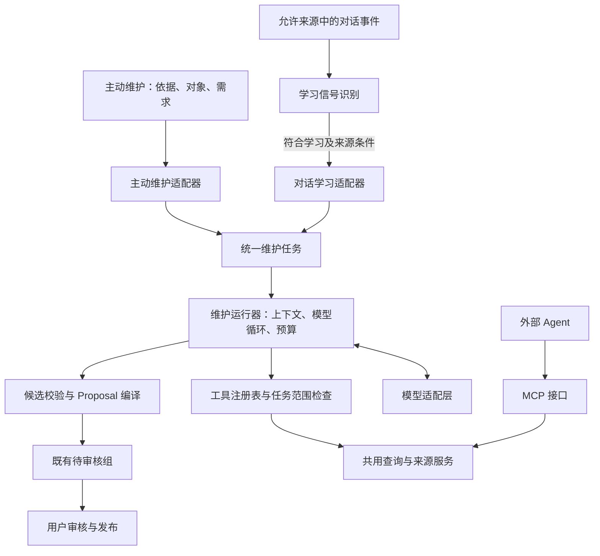

# AI Persona：AI 维护助手与对话学习统一设计

> 设计与历史参考：本文可能包含早期阶段或规划，不是本次发行的验收报告。当前入口与能力以[使用指南](../../../docs/GETTING_STARTED.zh-CN.md)和[兼容矩阵](../../../docs/FEATURE_PARITY.md)为准。

| 字段 | 内容 |
| --- | --- |
| 文档状态 | 首版已实现；实现边界与验证见第 17 节 |
| 版本 | 0.2 |
| 日期 | 2026-09-09 |
| 核心设计 | 两个入口、一个维护核心；共用查询工具、候选格式、校验与送审 |
| 覆盖范围 | 三项输入到模型、工具读取循环、偏好候选生成、Proposal 构造、多轮维护与后台学习接入 |
| 前置需求 | [AI 维护助手重构需求](AI_PERSONA_AI_MAINTENANCE_ASSISTANT_REQUIREMENTS.zh-CN.md) |

本文细化实现方式，不重新定义需求文档中的页面功能。后台对话学习的候选整理纳入统一核心，采集、信号识别、来源授权和学习反馈边界继续保留。偏好场景判定仍负责应用已有偏好，不进入候选生成链路。

第 1—16 节保留架构设计及验收目标；示例 JSON 表达语义，实际字段以 `maintenance/contracts.py` 和第 17 节为准。首版继续复用两个现有任务存储，旧任务不重跑。

## 1. 现状与重构依据

### 1.1 三条相关流程

| 现有流程 | 模型职责 | 后续处理 |
| --- | --- | --- |
| AI 维护助手 | 根据用户要求和可选材料生成草稿，可请求补读 | 校验后自动进入待审核组，多轮更新未审核候选 |
| 对话学习 | `conversation_signal` 识别信号；`conversation_candidate` 匹配已有 Persona 并生成候选 | 校验来源条件、类型和重复项，自动送审 |
| 偏好场景判定 | `activation` 判断当前输入匹配哪些已有场景 | 读取适用偏好，不新增偏好 |

信号识别和候选整理是两个模型任务，可以使用同一个模型，也可以分别配置。它们生成 Persona 数据候选，不训练或修改模型权重。

### 1.2 已有可复用基础

- [AI 维护服务](../src/ai_persona/ai_service.py)：上下文准备、`read_ids`／`source_reads`／`search_queries` 补读循环、草稿及恢复。
- [对话学习流程](../src/ai_persona/conversation_learning/pipeline.py)：信号识别、候选整理、审核历史、来源策略和预算。
- [查询服务](../src/ai_persona/query_service.py)与 [MCP 查询注册](../src/ai_persona/query_mcp.py)：六个查询工具及共用服务。
- [模型桥接](../src/ai_persona/model_bridge.py)与 [Pi 适配层](../src/ai_persona/model_runtime/engine.mjs)：统一模型接入；当前生成路径主要处理文本结果，尚需扩展完整工具往返。
- [候选同步](../src/ai_persona/pending_sync.py)：任务归属、同组更新、幂等、审核锁和中断恢复。
- [提案服务](../src/ai_persona/agent.py)：`ProposalChangeInput`、来源、对象版本与 ChangeSet 构造。

目前已经共用模型连接、提示词管理、部分字段契约和送审服务。需要整合的是两套上层检索、上下文拼装、补读循环和候选校验逻辑。

对话学习当前采用词／中文字符重合度选择前 16 条相关记录，并允许一次额外补读。现有新版知识查询工具主要覆盖知识、课程和材料，偏好维护所需的完整查询仍需补齐。

## 2. 核心设计决策

| 编号 | 决策 |
| --- | --- |
| D01 | 主动维护与后台学习共用维护核心；后台先经过信号识别，主动维护不重复判断用户的要求是否“值得学习” |
| D02 | 模型通过有明确参数与结果格式的工具按需读取；简单任务可在初始上下文充分时直接提出候选 |
| D03 | 内置助手优先直接调用共用查询服务；外部 Agent 通过 MCP 调用相同服务 |
| D04 | 工具名称、说明、参数校验、结果与错误语义集中维护，两种接法不复制检索实现 |
| D05 | 每个上下文块标注来源；先提供够用的信息，再按需补读，避免默认发送整个 Persona |
| D06 | 模型提出字段变化和依据引用；程序生成真实差异、正式标识、版本绑定与 Proposal |
| D07 | 共用候选表示和基础校验，按入口策略限制操作、范围、来源保留及预算 |
| D08 | 有效候选自动送入既有审核，不新增草稿确认关卡；正式发布仍由用户审核触发 |
| D09 | 后台学习保留信号判定和现有评测语义；统一核心不要求两类任务使用相同模型或预算 |
| D10 | 按模块逐步迁移，保留旧任务、模型配置、人工审核决定和来源历史 |

## 3. 总体架构与职责



| 组件 | 负责的事情 |
| --- | --- |
| 入口适配器 | 将表单或合格学习信号转为统一任务，绑定用户意图、来源身份和策略 |
| 维护运行器 | 准备上下文、调用模型、执行工具循环、保存阶段状态、处理停止与恢复 |
| 工具注册表 | 共用工具描述、输入与输出 Schema、校验、执行及错误转换 |
| 查询与来源服务 | 搜索、完整记录读取、来源读取、分页、版本和来源定位 |
| 候选规划器 | 模型在工具支持下决定复用、新增、修改、冲突及无需变更；属于运行器中的模型任务 |
| 候选校验器 | 检查操作、类型、范围、读取证明、来源、重复项、版本和依赖 |
| Proposal 编译器 | 将已校验候选转换为既有提案模型，补齐系统字段和可审核差异 |
| 同步与发布服务 | 复用现有同组同步、人工审核、发布、历史和恢复机制 |

首版使用一个候选规划循环。长材料可有分段理解步骤，不要求额外创建多个 Agent。

## 4. 两个入口如何形成统一任务

### 4.1 主动维护入口

前端提交三项用户输入：

1. 依据：材料标识、上传附件标识、粘贴文本。
2. 对象：维护类型、可选的具体条目或知识分支。
3. 需求：用户原话，以及本轮明确的补充要求。

后端解析附件，登记来源，保存输入版本，并把界面类型映射为程序可执行的修改范围。仅创建任务或上传附件不调用模型、不新增正式 Persona 记录。

“同时收录材料”作为可见的维护范围和候选处理；任务附件默认不自动成为 Material。

### 4.2 对话学习入口

保留现有来源授权、事件去重、后台队列和 `conversation_signal` 阶段：

- 输入为当前用户消息和有界上下文。
- 判断结果为忽略、发现信号或需要更多上下文。
- 产品实现要求、一次性调整、引用内容和助手自己的表述不能直接变为个人偏好。
- 发现合格信号并满足来源条件后，才进入统一维护核心。

适配器同时传入用户原话和结构化信号。信号属于模型提取结果，不能被提升为用户亲自确认的事实；候选规划仍须对照原话核对。

### 4.3 策略差异

| 维度 | 主动维护 | 对话学习 |
| --- | --- | --- |
| 意图依据 | 用户明确要求维护 | 合格的学习信号及原始用户要求 |
| 修改范围 | 用户选定类型、对象及限制 | 学习设置允许类型、信号指向与既有规则 |
| 操作 | 现有支持的新增、修改、归档、恢复及关系维护 | 保留现有新增、修改、受限关联；不因共享核心开放归档等操作 |
| 内容来源 | 指定材料、附件、粘贴文本、本人陈述 | 允许采集的有界对话上下文 |
| 澄清方式 | 任务内继续对话 | 等待补充或保留观察，不自动打断当前工作 |
| 预算 | 可支持较长材料分析 | 保留后台调用及每日预算限制 |
| 证据保存 | 材料与任务来源可形成持久可定位证据 | 正式候选保留简短备注，不创建聊天原文 Evidence |
| 模型选择 | 沿用维护／材料配置并逐步统一路由 | 信号识别与候选模型配置继续可独立 |

后台学习特有的限制，如不推断掌握程度和兴趣、不把场景偏好扩大为全局、知识关系只按现有规则生成，继续由策略校验执行。

## 5. 任务数据与模型上下文

### 5.1 内部任务对象

拟议 `MaintenanceTask` 包含：

| 字段组 | 内容与权威来源 |
| --- | --- |
| 身份 | 任务 ID、Persona 工作区身份、来源入口、父任务和生产者标识；由程序绑定 |
| 输入 | 原始需求、后续消息、选定对象、依据集合、输入版本；来自用户或入口适配器 |
| 策略 | 读取与修改范围、操作与字段限制、预算、来源保留方式；由程序根据用户选择和设置生成 |
| 来源快照 | 本轮来源版本、解析状态、内容标识、可读视图；由来源服务登记 |
| 运行版本 | 本轮 Persona 基线、提示词版本、模型配置、工具契约版本；由运行器记录 |
| 工作结果 | 当前候选版本、手工编辑、澄清项、前轮结果与待审组引用 |
| 读取账本 | 每次实际提供给模型的记录、字段、来源片段、版本、覆盖及调用身份 |
| 生命周期 | 运行、送审与审核状态，以及恢复检查点 |

任务对象不必整体传给模型。凭据、本机绝对路径、内部锁、租约、队列配置及无关历史均不属于模型上下文。

### 5.2 发送内容分层

| 模型输入层 | 内容 |
| --- | --- |
| 固定指令 | 维护职责、来源解释规则、候选生成规则；从版本化提示词加载 |
| 任务上下文 | 用户原话、选定对象、可见修改范围、来源目录、必要的首批记录与片段 |
| 工具定义 | 本轮可用工具的名称、说明和 Schema |
| 工具结果 | 后续实际读取的内容，含来源、版本、覆盖和错误 |
| 当前草稿 | 多轮维护时提供完整有效候选及用户编辑，避免模型重复创建 |

用户要求和参考内容明确分块；文件或引用文本中的指令保持为参考数据。结构化表示可采用 JSON，不依赖供应商特有的会话存储。

### 5.3 首轮上下文示例

以下为模型可见输入示意；其中的 ID 仅用于说明：

```json
{
  "schema_version": "ai-persona.maintenance-context/v1",
  "request": {
    "origin": {"kind": "user_message", "ref": "m1"},
    "text": "参考这段写作示例，补充论文写作偏好，优先复用已有场景。"
  },
  "targets": {
    "origin": {"kind": "user_selection"},
    "types": ["preference"],
    "context_ids": ["ctx_paper"]
  },
  "policy": {
    "origin": {"kind": "application_policy"},
    "allowed_operations": ["create", "update"],
    "publication": "human_review"
  },
  "sources": [
    {
      "ref": "s1",
      "origin": {"kind": "pasted_text", "ref": "paste1"},
      "snapshot": "s1_v1",
      "title": "写作示例",
      "available_views": ["text"]
    }
  ],
  "records": [
    {
      "origin": {"kind": "persona_record", "id": "ctx_paper", "revision": 3},
      "id": "ctx_paper",
      "name": "论文写作",
      "detail_loaded": false
    }
  ]
}
```

`policy` 是程序约束的可见摘要。模型不能通过修改这个字段扩大自己的权限。来源目录不代表原文已经提供；是否读过以实际内容和读取账本为准。

### 5.4 初始上下文策略

- 简短直接陈述：提供要求与相关已有偏好，通常可直接生成。
- 短文本或短材料：在预算内提供完整正文和相关记录。
- 多份长材料：先提供来源目录、章节信息和相关片段，通过工具补读。
- 已指定修改对象：优先提供其完整当前记录及必要关系。
- 未指定具体记录：先检索相关候选，再由模型判断需要读取哪些详情。

给每个内容块标注来源，避免重复包装同一内容。来源与对象的稳定标识、必要版本和简洁定位必须保留；诊断元数据可仅在程序侧保存。

## 6. 查询工具、MCP 与模型接入

### 6.1 一套工具契约，两种执行接法

内置助手通过工具注册表调用 Python 查询服务；外部 Agent 经 MCP 接口调用相同服务。工具输入校验不能只存在于 MCP 装饰器中，内部接法也必须执行相同 Schema 校验。

注册表应定义：名称、描述、输入 Schema、结果契约、读写性质、执行函数与错误映射。MCP 的资源包装和模型消息包装由各自适配器处理，查询逻辑保持共用。

MCP 提供标准化的工具发现和执行接口；模型工具调用表达模型想执行的动作。两者可以组合。若以后独立部署维护运行器，或者使用已有 MCP 运行框架，可将执行接法切换为 MCP，不改变查询服务。[协议架构参考](https://modelcontextprotocol.io/docs/learn/architecture)

### 6.2 工具集合

| 工具 | 状态 | 维护用途 |
| --- | --- | --- |
| `search_knowledge` | 现有 | 检索知识、课程、材料及相关关系 |
| `get_persona_records` | 现有 | 读取上述对象的完整内容、版本与证据引用 |
| `get_knowledge_map` | 现有 | 查看知识层级、邻接关系和修改影响 |
| `list_source_files` | 现有 | 查看来源中有哪些可用文件和视图 |
| `search_source_content` | 现有 | 在指定来源定位相关片段 |
| `read_source` | 现有 | 阅读原文、证据、章节及支持的图片等视图 |
| `search_preferences` | 拟新增 | 按要求、场景、条件和状态检索相关偏好、场景及样例 |
| `get_preference_records` | 拟新增 | 读取已定位偏好、场景和样例的完整当前内容及关联 |
| `finish_maintenance` | 拟新增，运行器内部 | 返回完整候选、澄清或无需变更；不授予模型批准权 |

按任务暴露必要工具。例如没有材料依据的简单偏好维护，无须默认展示全部来源工具。偏好查询应在共用服务层实现；是否将新增工具公开到 MCP，以及如何兼容现有偏好读取说明，实施时单独验证。

偏好维护查询必须能够发现当前未激活场景中的记录。不能用“本轮应该应用哪些偏好”的激活接口替代完整维护查询。

### 6.3 任务范围检查

- Persona 工作区身份、强制读取范围、版本基线、预算和任务附件归属由运行器绑定。
- 模型提供的过滤条件只能在允许范围内进一步缩小，不能通过省略或替换 `scope` 扩大范围。
- 现有领域标签 `scope` 不完整等同于维护范围。类型、具体对象、知识分支、关系端点和可修改字段需要独立的任务策略校验。
- 读取相关对象不自动授予修改权；只读范围和可写范围分别保存。
- 候选编译前再次检查实际修改对象与关系，避免仅在检索阶段限制。
- 调用记录区分主动选定的依据与为了比较而读取的已有 Persona 内容，输出不得伪称后者是用户指定材料。

### 6.4 来源工具结果

复用现有 `QueryResult` 的版本、覆盖、分页、警告和错误语义。运行器为实际提供的片段登记任务内引用，例如：

```json
{
  "basis_ref": "b7",
  "origin": {
    "kind": "source_excerpt",
    "source_ref": "s1",
    "snapshot": "s1_v1",
    "file_id": "f1",
    "locator": {"lines": {"start": 12, "end": 20}}
  },
  "text": "这里是实际提供给模型的原文片段。",
  "coverage": {"complete_document": false}
}
```

局部截断、解析失败和未覆盖部分必须可识别；分页返回不能被标记为已读完整记录。图片结果应作为真实图像内容交给支持的模型，不能仅保留空的文字占位。模型不支持该视图时，返回明确限制或有说明的可用文本替代。

## 7. 模型与工具的执行循环

### 7.1 模型适配层扩展

当前 Pi 接入以一个用户文本消息发起生成并提取文本结果。应增加单步模型接口，接收类型化消息历史与工具定义，保留 assistant 的调用标识、工具参数和后续 tool 结果。

建议由 Python 维护运行器控制循环：

1. Python 准备模型消息和工具契约。
2. `ModelClient` 将请求交给现有 Node／Pi 适配层。
3. 适配层返回文本、工具调用及运行状态，不直接执行 Persona 写入。
4. Python 校验工具请求并执行共用查询服务。
5. 工具结果按对应调用标识加入消息历史，继续下一步模型请求。

供应商所需的类型化响应项应由适配器按其 SDK 契约保留；不能把所有结果压成普通文本后丢失继续调用所需信息。既有单次 `generate` 路径可继续服务信号识别和场景判定。

支持原生工具调用的模型优先使用其工具接口。兼容文本模式时，只接受明确的结构化动作并进入同一注册表和校验流程，不另建 `read_ids` 等长期平行协议。不支持的能力须在模型配置中明确，不根据供应商名称猜测支持情况。

### 7.2 一个循环中的合法动作

- 调用一个或多个允许的只读工具，取得信息后继续。
- 调用 `finish_maintenance`，返回 `propose`、`clarify` 或 `no_change`。

`finish_maintenance` 是模型提交本轮结果的方式，不是直接执行发布的工具。一次结果不能同时提出尚未执行的读取请求和声称已完成的候选；运行器应要求先完成读取，再提交最终结果。

收到终结结果后进行程序校验。可以修复的格式、对象或引用错误以结构化反馈交回模型，在预算内修正；涉及扩大范围、用户身份或关键意图不清时转入澄清。

### 7.3 执行约束

- 独立读取可以并发；前后有依赖的读取按顺序执行。
- 限制模型轮次、工具调用数、输入量、单次输出、累计预算和无新增信息的重复调用。
- 相同来源版本和参数的读取可缓存，但读取账本仍记录本轮实际提供内容。
- 达到上限时明确显示尚未完成的内容，允许补充或继续；不把预算耗尽伪装成无变更。
- 取消、输入版本变化或任务租约失效后，迟到结果不能覆盖当前任务。
- 模型只输出用户可核对的理由与依据，不要求保存完整内部推理过程。

具体数字沿用现有前台／后台限制作为迁移基线，再通过真实任务评测调整；不在本设计中宣称某个固定轮数足够完成所有维护。

## 8. 检索、长文和偏好匹配

### 8.1 已有 Persona 检索

优先结合名称、别名、正文语义、场景和关系进行召回。搜索结果用于定位，修改前仍需完整读取目标记录。知识和偏好分别提供合适的检索字段，共用结果来源和版本契约。

偏好检索至少考虑规则内容、行为类型、适用场景、条件、状态和相关样例。“回答先给结论”与“把核心判断放在开头”应进入同一比较范围，但不能仅凭向量相似度自动合并。

场景激活判定只处理应用时的命中。维护时还需发现未激活、范围不同或可能冲突的偏好。

### 8.2 重复、补充与冲突

候选规划应区分：已经表达同一要求、补充已有条件、缩小或改变场景、实际冲突，以及独立的新规则。

程序负责精确重复和引用检查；模型负责语义比较并给出理由。涉及合并或冲突修正时，输出具体变化供用户审核，不仅给出“已去重”。合并操作若不能由现有发布机制保证完整性，应只展示建议和限制。

维护历史由任务侧提供受限、相关的摘要，不将私人审核说明直接扩展到现有公共查询工具。后台避免重复提出已经拒绝且没有新信息的建议；主动任务出现明确重新添加要求时，可生成关联历史的新候选，不把拒绝当成永久禁止。

### 8.3 材料阅读策略

短材料在预算内直接提供正文。长材料使用现有分段理解和检查点能力，保存原文定位；中间摘要是分析结果，不能替代原文证据。

“整理全文”须有逐段覆盖记录；“查找与某问题有关的内容”可采用检索和局部补读。任务保存本轮阅读目标与实际覆盖。材料理解结果可在原文、提取器及理解目标有效时复用；检索已有 Persona 和生成变化仍需检查当前版本。

来源变化、解析失败或超限不得静默忽略。用户明确选择部分可用依据后，可以基于该范围继续。

## 9. 统一候选格式

### 9.1 终结结果

`finish_maintenance` 使用互斥的结果类型：

| `kind` | 含义 |
| --- | --- |
| `propose` | 返回本轮完整候选快照，进入校验；不代表已经保存或发布 |
| `clarify` | 返回影响本轮结果的阻断性问题，等待入口按自身交互方式处理 |
| `no_change` | 说明无需修改或依据不足；不创建空的审核组 |

后台某些信号尚不明确但与清晰候选互不依赖时，可在 `propose` 中附 `deferred_items`，保留未处理信号；不能把影响候选正确性的阻断问题当作非阻断项。主动维护也须清楚显示未覆盖的要求。

### 9.2 单项候选

拟议 `MaintenanceCandidate` 的通用字段：

| 字段 | 语义与约束 |
| --- | --- |
| `client_ref` | 本组内唯一的临时引用，由模型选择可读短标识，程序校验 |
| `operation` | 沿用现有 `create`、`update`、`archive`、`restore`、`relate`、`unrelate`，受任务策略限制 |
| `entity_type` | 现有 Persona 对象类型，受字段契约与任务范围限制 |
| `target_id` | 修改已有对象时使用实际读到的 ID；新建由程序分配正式 ID |
| `values` | 新建所需字段，或修改字段及新值；复用现有提案字段名称 |
| `basis` | 任务内已知来源引用，说明支持哪些字段或操作；来源身份由程序解析 |
| `reason` | 简洁说明变化与用户要求的关系，按入口调整详细程度 |
| `conflicts` | 实际发现的冲突及涉及对象，可为空 |

更新采用字段级赋值：未出现的字段保留原值。清空字段需显式提供符合 Schema 的空值；列表字段按完整新列表解释，不默认为追加。归档、恢复和移除关系等操作不携带无关字段值。

新对象间的关系沿用现有 `source_ref`／`target_ref`；偏好依赖新场景沿用 `context_client_refs`。这些临时引用在同组校验与编译时统一解析。

模型不负责填 `before`、正式 Proposal ID、发布状态、真实对象版本或来源 Hash。也不要求输出虚构的精确置信度。

### 9.3 候选示例

下例假设模型已经读过论文写作场景的完整记录，并读取了支持所述写作方式的示例片段。示例 ID 延续第 5、6 节，均为虚构说明值。

```json
{
  "kind": "propose",
  "summary": "为论文写作场景补充一条段落组织偏好。",
  "changes": [
    {
      "client_ref": "pref1",
      "operation": "create",
      "entity_type": "preference",
      "values": {
        "scope": "contexts",
        "context_refs": ["ctx_paper"],
        "behavior": "required",
        "instruction": "论文写作时先陈述本段结论，再说明依据。",
        "condition": "生成论文段落或章节草稿时"
      },
      "basis": [
        {"ref": "m1", "supports": ["instruction", "scope"]},
        {"ref": "b7", "supports": ["instruction"]}
      ],
      "reason": "用户明确要求从写作示例提炼偏好，并限定为论文写作场景。",
      "conflicts": []
    }
  ],
  "deferred_items": []
}
```

后台候选使用同一结构，`basis` 可引用入口登记的用户消息和信号；适配器保留信号映射。该引用用于校验与短期追溯，落入正式提案时遵循后台的备注保存策略。

## 10. 从候选到 Proposal

### 10.1 校验顺序

1. 校验终结结果和候选 Schema，拒绝未知操作、未知字段及重复临时引用。
2. 校验生产者、任务版本、当前来源授权与任务是否仍可继续。
3. 校验类型、操作、具体对象、字段与关系端点符合任务修改范围。
4. 对已有对象检查读取账本：完整内容是否实际提供，是否满足关系或合并所需读取。
5. 核对候选引用的来源、片段、信号及其身份；检查位置和内容版本。
6. 检查现有正式对象、当前待审组和相关历史，处理精确重复、冲突及跨候选依赖。
7. 在送审前重新核对 Persona 基线和来源版本，阻止过期结果覆盖。
8. 在同一有效基线下构造具体 Proposal，整体准备完成后同步待审核组。

字段契约应根据任务类型提供给模型，程序再独立校验。自然语言中的语义要求由模型理解，选择范围和系统禁止项由程序强制执行；有歧义的关键限制须澄清，不能声称 Schema 能证明全部语义正确。

### 10.2 真实差异与系统字段

- 修改前内容从本轮读取的正式记录取得，不能相信模型描述的旧值。
- `expected_record_revision` 从读取账本绑定；最新记录已变时重新处理，不能把旧建议直接改绑为新版本。
- 新对象 ID 和 Proposal ID 由现有提案服务生成，临时依赖一起解析。
- 证据从任务来源注册表解析，模型不能指定任意本机路径或伪造来源身份。
- 语义相似不等于可以合并；关系引用和需要共同生效的操作必须保持完整性。

程序可验证“原文片段确实存在且曾被提供”，不能仅靠确定性规则证明“结论得到充分支持”。审核页面应展示实际差异、原文和理由，供用户判断。

### 10.3 多来源证据与现有提案契约

当前部分材料提案路径依赖单一材料上下文和来源相对行号。新任务允许多来源，必须明确升级映射：

- 候选层只引用任务登记的 `basis_ref`；每个引用绑定来源、文件、版本和定位。
- 编译层按实际来源构造 Evidence 或已有证据引用，不把所有引用挂到同一个材料上下文。
- 来源可以独立于正式 Material 存在；任务附件被采纳为证据时，按长期数据规则保存。
- 不能为了适配旧字段伪造一个“总材料”，也不能把模型分析摘要当作原始来源。
- 新增字段若影响持久化 Schema 或 MCP 提案输入，须版本化并兼容旧提案；旧数据保持原有解释。

现有 `ProposalChangeInput` 要求 `confidence`，而后台已对最终提案使用缺省置信表达。统一候选不强制这个字段；实现时应让编译与展示支持“未提供”，不要用虚构的 0 或 1 填满新结果。旧记录按原格式兼容读取。

### 10.4 送审与发布

内置助手不直接暴露无任务约束的 `propose_change_set` 调用。`finish_maintenance` 返回候选后，运行器通过编译器和既有 `sync_pending`／提案服务保存。

外部 MCP `propose_change_set` 保持现有职责与权限；其底层可逐步复用共用校验，不强制外部调用创建助手会话。

有效候选无须先确认草稿，自动进入待审组。编辑候选仍是候选操作，用户的通过／修改后通过才触发发布。发布前执行现有版本、引用、依赖和来源检查。

## 11. 多轮、版本与并发

### 11.1 版本层次

区分任务输入版本、运行代次、候选版本、Persona 基线和审核组代次。它们都由程序管理；保存新输入不意味着已有待审结果随之变化。

- 输入和来源选择改变时开启新运行代次。
- 新一轮携带当前有效候选及用户手工编辑，提交完整快照。
- 只有新结果整体校验成功后，才替换原待审组的未审核内容。
- 页面标明旧结果使用的输入和依据，避免与尚未生成的新输入混淆。

首版沿用现有整体 Persona revision 检查，宁可重新匹配也不冒用过期基线。以后如改为精细读取依赖校验，需要证明能发现新增同义条目、关系变化等影响，不能只检查被更新记录本身。

### 11.2 审核决定保护

同组替换保留 ChangeSet 身份和历史，旧候选按现有方式失效。只要该组已有批准、拒绝、暂缓或失效决定，就不能覆盖，后续维护新建关联任务。

开始生成时检查一次，送审锁内再检查一次，防止模型运行期间发生的人工决定被覆盖。幂等键包含任务／生产者身份、输入版本、候选内容、基线及来源快照，重试不重复创建。

失败、取消、澄清和零变更不撤回已有待审组。移除部分候选必须满足依赖；放弃整组通过既有审核操作处理。

### 11.3 状态与恢复

| 状态 | 行为 |
| --- | --- |
| 准备／解析中 | 保存输入与解析状态，不改变正式记录 |
| 模型处理／读取中 | 保存阶段和已完成的可复用结果，支持取消 |
| 等待澄清／上下文 | 由入口决定继续对话或保留后台待处理状态 |
| 无需变更 | 说明原因，不创建空审核组 |
| 校验中 | 尚不显示为已送审或已生效 |
| 送审失败 | 保存有效候选，重试同步不重新调用模型 |
| 待审核 | 展示同一候选组，可继续修改尚未有决定的任务 |
| 已有审核决定 | 显示实际决定，已通过部分可明确标为生效 |
| 失败／取消 | 保留最后有效结果和检查点，不接收迟到覆盖 |

恢复时核对需求、来源、提示词、工具版本、模型和 Persona 基线。材料理解缓存与候选匹配缓存分别管理；后者不能因前者仍有效而忽略正式记录变化。

## 12. 来源保存、备份与记录

### 12.1 按来源执行保存策略

| 来源 | 保存原则 |
| --- | --- |
| 已有正式材料 | 引用不可变 Source 版本，不复制或覆盖旧来源 |
| 主动上传或粘贴内容 | 先登记任务来源；待审或正式记录引用时保留可定位快照，不要求先收录 Material |
| 主动维护消息 | 保留本轮明确陈述及任务定位，作为候选依据 |
| 后台对话消息 | 按既有事件和观察保留策略保存；正式提案只保留简短备注，不增加聊天原文 Evidence |
| 模型提取的信号／摘要 | 标记为派生内容，记录来源映射，不当作独立用户声明或原始证据 |

后台原文按策略清理后，可以保留不含正文的事件身份和备注，并明确“原始上下文已过保留期”。不能为了让所有入口看起来一致而长期复制聊天原文。

### 12.2 全链路保留策略

需要将相同策略应用到消息快照、工具结果、提示词捕获、恢复检查点和可回放输入，避免正文从队列清理后仍无期限存在于新建的通用日志中。明确收录的个人评测样例继续遵守原有独立保存规则，不因共享核心扩大自动收录范围。

正式记录和待审候选仍引用的来源不得清理。任务存储与长期来源的备份、恢复和引用检查应一并设计；本次不自动删除既有历史或改变旧用户数据。

### 12.3 可观察性

保存模型及提示词版本、工具契约版本、阶段状态、用量、耗时、错误、读取覆盖和候选摘要。技术日志避免重复存放原文；用户页面显示可理解的阶段与真实状态。

供应商没有提供的用量保持未知，输出不完整时不保存为成功候选。这里只记录执行证据和简洁理由，不收集完整模型内部推理。

## 13. 提示词、模型与评测

### 13.1 统一提示词结构

共用核心提示词定义维护职责、工具使用和候选语义；任务策略提供本轮可用类型、操作、来源规则和输出限制。领域字段契约按知识、偏好、材料或课程加载，避免把全库 Schema 默认塞入每次调用。

后台信号识别保留独立提示词。候选核心收到后台任务时再次核对信号与用户原话，不能因前一模型已经提取就直接接受。

### 13.2 模型配置兼容

共享代码不要求共享模型。迁移时保持现有 `maintenance`、`material`、`conversation_candidate` 路由可解释，`conversation_signal` 和 `activation` 继续独立。新核心如何选择现有路由由入口策略决定，不静默更换账号、模型或费用配置。

多阶段材料分析可沿用材料模型；信号识别可采用较小预算。是否合并设置界面的模型任务名称，在兼容映射明确后再调整。

### 13.3 质量验证

确定性测试验证契约、范围、版本、来源和恢复；模型质量通过冻结输入的代表性样例验证。覆盖：

- 同义偏好的复用，条件补充、作用域收窄和真实冲突。
- 产品要求与个人偏好的区分，一次性例外和明确的重新添加要求。
- 多来源引用、全文与局部阅读、材料内容与个人事实边界。
- 新场景与偏好的依赖、跨候选关系和零变更。
- 后台信号与主动维护意图的差异。

保持现有后台学习的信号判定、候选输出和审核反馈映射。旧测试样例按原版本回放，新核心与旧候选路径比较；候选统一不自动给主动维护增加满意度反馈或评测收录。

离线或影子比较不能写入真实待审区。真实模型评测按既有显式运行和预算流程执行，不在迁移时静默扩大调用。

## 14. 建议模块划分与迁移

### 14.1 模块划分

以下目录名为建议，可按项目惯例调整：

```text
maintenance/
  contracts.py       统一任务、候选和结果契约
  policies.py        主动维护与对话学习策略
  context.py         上下文构建、来源标签和读取账本
  tools.py           注册表与任务范围适配
  runner.py          模型工具循环、预算、取消和恢复
  validation.py      共用校验与入口策略检查
  compiler.py        转为既有 Proposal／ChangeSet
  adapters.py        主动维护与对话学习入口映射
```

查询、来源解析和正式发布继续使用现有服务。共享工具契约可放在查询模块，不必全部移进 `maintenance`。任务存储先提供适配接口，不要求第一阶段合并助手与后台队列数据库。

### 14.2 实施阶段

| 阶段 | 交付与切换条件 |
| --- | --- |
| 1. 查询与契约 | 建立共用工具定义，补偏好查询；内部调用与 MCP 查询结果在相同输入和范围下等价 |
| 2. 核心循环 | 增加模型工具往返、统一上下文和候选；先以隔离样例验证，不改变生产者归属 |
| 3. 主动维护 | 接入三项输入、多来源附件和程序范围检查；通过现有送审服务交付完整审核闭环 |
| 4. 后台候选迁移 | 保留信号识别和来源策略，将候选阶段接入核心；完成冻结样例比较与后台边界验收 |
| 5. 清理兼容 | 旧任务可读、恢复规则明确后移除重复生成逻辑；同步文档与模型能力说明 |

所有阶段都在隔离数据上验证。逐入口切换，不能同时运行两条生产候选路径给同一事件送审。回退不覆盖新路径已经产生的人工决定，也不自动重跑全部历史任务。

### 14.3 兼容规则

- 旧会话、ChangeSet、ProducerRef、证据、提示词快照和评测身份保持可追溯。
- 已有待审组按原有归属更新；不能在助手和后台之间冒用生产者。
- 旧任务继续或迁移到新核心时先做明确版本转换；无法完整转换时只读保留，并支持新建关联任务。
- 公共 MCP 查询语义保持兼容；新增任务附件能力不让外部调用者读取其他任务的暂存内容。
- 实施完成后再标记设计已实现，并记录实际通过的验收项和剩余限制。

## 15. 技术验收

本表补充需求文档 A01–A27，重点验证统一实现的契约与兼容性。

| 编号 | 验收内容 |
| --- | --- |
| T01 | 主动维护与后台合格信号均进入同一候选核心；主动维护不额外经过学习信号筛选 |
| T02 | 后台产品规格、一次性调整和未授权来源不会因共享核心产生越界候选 |
| T03 | 共用查询工具在 MCP 与内部执行下，参数校验、结果、来源、覆盖和错误语义一致 |
| T04 | 模型更改或省略范围参数不能突破任务范围；已有标签范围与新增维护范围同时生效 |
| T05 | 偏好查询能发现同义规则和未激活场景；不会把激活结果当成完整偏好目录 |
| T06 | 模型工具请求、调用 ID、结果、多模态内容和后续请求正确往返；兼容模式执行同一工具契约 |
| T07 | 部分记录或截断列表不算完整读取；更新未完整读过的对象被拒绝 |
| T08 | 候选只含变化字段；旧值、版本、正式 ID 和差异由程序生成 |
| T09 | 多来源片段分别绑定正确快照，伪造或未提供的引用被拒绝；任务附件可独立于 Material 保存 |
| T10 | 原文可验证与结论充分支持被区分，审核页提供实际依据，不用校验通过暗示语义已证明 |
| T11 | 新场景、新偏好和关系临时引用正确解析；精确重复及不完整依赖不能送审 |
| T12 | 后台重复拒绝项受到抑制；用户明确重新添加时可新建关联候选，不修改旧决定 |
| T13 | 输入、Persona 或来源在运行期间变化时旧结果失效；不能直接改绑最新 revision |
| T14 | 多轮完整快照更新同一未审核组，保留手工编辑；失败、取消、澄清和零变更不撤回旧候选 |
| T15 | 人工审核与模型生成并发时，锁内检查阻止覆盖已作出的决定；重试和恢复不重复送审 |
| T16 | 前台与后台预算分别执行；达到预算或解析失败不会被误报为任务成功 |
| T17 | 后台简短备注、原文保留期和已有评测规则不因公共核心扩大；主动材料证据仍可定位 |
| T18 | 旧任务、旧模型配置和公共 MCP 调用兼容，迁移不重跑历史、不双路生产候选 |
| T19 | 工具读取、生成候选、上传附件均不发布；正式修改只发生在既有用户审核发布路径 |
| T20 | 冻结样例覆盖语义复用、冲突、场景范围与学习边界，离线比较不污染真实待审区 |

## 16. 实施前需细化的事项

架构方向已经明确；以下细节根据实际实现验证确定，不影响先建设共用核心：

| 事项 | 需要确定的内容 |
| --- | --- |
| 模型工具能力 | 当前各连接与 Pi 版本对工具及多模态消息的实际支持，兼容模式范围 |
| 偏好工具公开方式 | 新增两个工具还是扩展统一记录接口；保留现有调用语义和最小必要参数 |
| 任务来源持久化 | 新附件来源登记、提案引用升级、备份与清理规则 |
| 候选契约迁移 | 多来源依据、未提供置信度和旧 `ProposalChangeInput` 的版本兼容 |
| 任务存储 | 先适配现有两个存储还是后续归并；不在首阶段强制搬迁用户数据 |
| 预算与检索参数 | 初始召回量、全文阈值、工具轮数和模型预算，依据代表性样例测量 |
| 合并完整性 | 现有发布机制能否表达所需原子依赖组，未满足前限制为可核对建议 |

本节记录设计时的待定项。首版已作出的实现选择及保留的后续事项如下。


## 17. 首版实现与验证（2026-09-09）

### 17.1 已落地的链路

- `/ai` 为统一入口。已有材料、粘贴文本、任务附件、维护类型、具体记录／知识分支与用户原话分别保存；打开页面、保存输入和上传附件不会调用模型。
- `maintenance/runner.py` 提供两个入口共用的有界循环；`maintenance/tools.py` 直接注册 MCP 的同一份查询定义、参数验证和执行器，不建立回环 MCP 连接。
- 主动维护输出 `Finish`（`propose`／`clarify`／`no_change`）；后台保留兼容已有评测的 `CandidateOutput`，增加同一 `ToolAction` 契约的 `calls`，由入口适配器交给同一循环。两者最终编译为现有 `ProposalChangeInput`。学习信号检测、事件来源授权、后台预算和简短备注策略仍在后台入口执行。
- 新增 `search_preferences`、`get_preference_records`，可以读取未激活和暂停的场景及规则。知识与偏好共用本地词法／语义检索、版本与分页契约；语义检索不可用时报告降级。精确偏好身份判断由两个入口共用。
- Pi 适配器支持原生工具、调用 ID 与后续工具结果。明确收到“不支持工具”的供应商错误时转为 JSON 兼容循环，仍调用同一注册表；普通超时、鉴权或网络错误不会据此改变执行方式。
- 程序登记实际读取的记录版本和来源片段，将候选中的 `basis.ref` 编译为来源、文件、行号及哈希。修改前必须完整读取目标；表单范围在后端强制检查，编辑草稿也经过同一范围和证据校验。
- `ProposalContext(kind="maintenance", source_versions=...)` 只由内部维护任务产生；外部提案调用不能自行声明。支持多来源 Evidence 和不带置信度的候选，人工批准时再次核对来源。旧版数值置信度与材料提案仍可读取。
- 任务附件使用 `SourceManifest.source_type="task_attachment"`，可以在以后收录为具体 Material 类型；保存附件本身不创建 Material。选择收录时，用户须明确选择略读、读过、学习过或自己写的，程序据此设置关系，不由模型猜测。
- 沿用 `sync_pending` 的同组替换、历史与恢复日志。组 ID 和 `client_ref` 标识持续维护的候选；内部提案 ID、尚未发布的候选记录 ID 可以随重新编译更新。有人工审核决定后不能覆盖。
- 评测继续使用冻结 Persona 快照；共用查询服务在隔离临时目录执行，不读取或写入真实任务队列和 Persona。

### 17.2 接口与容量

| 用途 | 首版接口／约束 |
| --- | --- |
| 选择对象 | `GET /api/ai/options` |
| 新任务 | `POST /api/ai/sessions`，传入 `maintenance` |
| 调整输入 | `POST /api/ai/sessions/{id}/input`，携带当前任务 `version` 与 `input` |
| 粘贴文本 | `POST /api/ai/sessions/{id}/attachment`，携带 `text`、`title`、`version` |
| arXiv 链接 | `POST /api/ai/sessions/{id}/arxiv`，携带 `url`、`version`；复用材料导入器与去重 |
| 文件与图片 | `POST /api/ai/sessions/{id}/file`，携带 `filename`、`content_base64`、`version` |
| 原文件／提取文字 | `GET /api/ai/sessions/{id}/sources/{source_id}`，`?view=text` 返回文字；仅可读取本任务附件 |
| 发起／继续 | 既有 `message`、`resume`、`cancel` 接口 |
| 查看、编辑、送审重试 | 既有会话读取、`edit`、`submit` 接口 |
| 查看证据片段 | `GET /api/ai/sessions/{id}/basis/{ref}`；页面也可直接展开本轮片段 |
| 维护输入 | `target_types`、`record_ids`、`knowledge_root`、`material_ids`、`attachment_ids`、`collect_attachment_ids`、`attachment_relationships`、`reading` |
| 单个附件 | UTF-8 TXT / Markdown、带文字层 PDF、PNG／JPEG／WebP；每份最多 20 MB，提取文字最多 750 KB；任务最多 20 份 |
| 材料理解 | 短文本直接进入候选阶段；长文本复用既有 `material-analysis` 分段理解与校验，保存每个已完成分段 |
| 候选阶段 | 提供分段分析、可定位原文与已有记录检索；原文片段累计最多 150000 字符，模型可通过查询工具补读；阅读覆盖按实际提供的原文记录 |
| 模型循环 | 主动维护每轮最多 8 次模型调用，每次最多 8 项工具请求；后台候选最多 6 次并继续服从后台总预算 |

上传带文字层 PDF 会在本地提取逐页文字；图片经用户明确点击“上传并读取”后由材料模型识别，并保留原图与不确定性提示。扫描 PDF 须转换为截图或补充文字；超出阶段容量的材料须拆分。附件在引用后长期保留以保障审核追溯；本次没有新增自动清理来源的功能。自动语义合并、自动确认冲突和统一迁移历史任务存储仍不开放。

### 17.3 验证依据

`tests/test_maintenance.py` 覆盖多来源、附件与 Material 分离、明确收录、人工批准、同组修改、编辑范围、伪造依据、个人状态来源、完整读取、恢复、原生调用 ID／图像以及兼容模式。后台新增共用工具多轮读取与程序补齐版本测试；既有学习边界和冻结评测继续回归。

模型适配层使用本地模拟 HTTP 服务验证真实 Pi SDK 的工具往返，不依赖商业模型输出。浏览器使用隔离的虚构 Persona 完成“粘贴依据 → 选择偏好 → 发送 → 查看候选及证据”验证；没有将测试候选写入用户 Persona。模型生成内容的语义质量仍需通过实际使用与既有评测持续观察。

### 17.4 页面接入与既有流程复用（2026-09-09）

AI 维护助手的新链接入口仅接入现有 arXiv 导入器，仅接受 abs／pdf 链接，不接受裸论文 ID。其他链接统一提示“目前只支持 arXiv 链接”，不调用通用 URL 下载器或模型补救。前端提示与服务端校验须一致，校验成功后才登记来源及继续维护流程。课程场景使用截图、大纲文件或粘贴文本；普通网页和课程网址支持后移。

正式页面已接入三个场景示例、链接／文件／文本／已有材料入口、资料预览、候选编辑和审核衔接。具体交互要求见需求文档第 5.6 节。

arXiv 获取标题、作者、摘要、PDF 与 HTML 正文沿用 `MaterialImportService`。完全重复的正式材料直接选为依据；相似材料或其他版本转入原有导入核对页。新来源先保存为任务附件，程序将导入元数据补入材料候选；不在添加资料时创建正式 Material。

本次先完成页面与流程适配，没有重新设计提取算法。维护任务的长材料调用从旧材料整理流程抽出的同一分段理解方法，复用原有提示词、输出契约、证据校验和已完成分段；生成候选继续交给统一维护核心。后续再通过真实论文和 notes 的使用结果优化提取质量、阅读预算与候选组织。

`tests/test_maintenance_imports.py` 验证链接边界、材料元数据复用、重复论文／版本核对、附件预览归属、图片原件、PDF 逐页提取、长材料恢复以及人工审核后才发布。
