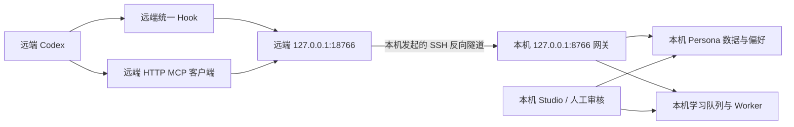

# 让远端 Codex 接入本机 AI Persona：Agent 执行指南

版本：2026-09-09。方案：本机 Persona 网关 + 带认证的 SSH 反向隧道 + 远端 HTTP MCP 和统一 Hook。

本文可直接交给安装 agent。执行顺序：确认目标 → 探测实际环境 → 准备本机 → 安装远端 → 配置持久化 → 分层验收 → 交付。每一步都要记录结果；遇到环境差异先适配，不能跳过验收后宣布完成。

本指南对应本仓库的 AI Persona 应用。新用户需要取得包含 `remote setup/start/status/stop` 的可信源码版本；不要仅凭包名安装来源不明的同名软件。已实测组合为 macOS 本机、Linux 远端和 Codex 0.153.4。其他环境按能力检查适配，不能把“未知服务器”理解为无需检查即可照抄命令。

## 交给 agent 的任务说明

> 请按照本文，在我日常使用的 SSH 远端 Codex 环境中接入本机 AI Persona。先查明实际主机、启动方式、CODEX_HOME、会话目录和网络位置，再安装。保留现有配置和其他应用。完成 MCP 查询、由真实 Codex 触发的 Hook、自动偏好和已授权的学习回传验收，并提供有证据的部署报告。不能以手动调用客户端、健康检查或页面上的旧“已验证”状态代替端到端测试。缺少必要信息时询问我，同时继续不依赖答案的检查。

用户最少提供 SSH 目标，以及平时如何启动远端 Codex。Persona 工作区、可执行文件、版本、端口和已有设置由 agent 优先探测；无法确定或存在多个候选时才询问。

## 0. 明确目标和完成标准

记录是否需要知识查询、自动应用偏好、对话学习。本文完整流程涵盖三项；用户明确不启用的功能记为“不适用”，不要自行打开。确认学习的项目／会话范围、是否信任来源、是否允许本机 Persona 调用已配置模型及其预算。沿用用户已经确认的选择，不反复询问。

“本机”是持有 Persona 数据并主动建立 SSH 连接的电脑；“远端”是 **Codex 进程及其 Hook 实际运行的主机和网络环境**。



图中端口是当前安装器默认值。Studio 通常使用 8765，与网关分开。反向转发由本机发起，远端不需要 SSH 登录本机；方向依据 [OpenSSH 的 `-R` 定义](https://man.openbsd.org/ssh#R)。SSH 接入本身不依赖 Tailscale，后者只可能用于用户另外配置的网页访问。

| 能力 | 必须取得的成功证据 |
| --- | --- |
| 环境一致 | 安装位置与真实启动实例的 CODEX_HOME、主机、网络环境一致 |
| 网络与认证 | 从真正运行 Codex 的环境访问网关成功；无凭据请求被拒绝 |
| MCP | 目标 Codex 会话发现工具并实际完成一次只读调用 |
| Hook | 目标 Codex 显示 Hook 已信任且启用；对话框发出的新探针到达本机 |
| 前文 | 同一真实会话的后续探针能读取前文，或用户明确选择不读取 |
| 偏好 | 真实会话自动收到与本机该轮记录一致的偏好包；另测跳过／无匹配路径 |
| 学习 | 真实会话事件正确入队并按所选模式处理，同一轮不重复产生事件 |
| 恢复 | 新登录、临时目录恢复和隧道重连按约定工作 |

“进程正在运行”“文件存在”“HTTP 200”“MCP 查询成功”均不能单独证明 Hook 自动生效。

## 1. 记录部署参数和已有状态

本次记录保存在用户自己的工作目录，仅本人可读。不要把机器清单、凭据或私人内容提交到公共仓库。

| 参数 | 确定方式 |
| --- | --- |
| 本机 Persona 源码、工作区、运行入口 | 查当前服务、启动命令、用户配置与工作区标识 |
| SSH 配置别名 | 沿用已有别名，核对用户名、HostName、端口和跳板 |
| 实际远端主机名、UID、HOME | 在目标环境读取；别名不等于实际主机名 |
| Codex 启动方式、路径和版本 | 终端 CLI、VS Code Remote SSH、远端 app-server、容器等分别记录 |
| 有效 CODEX_HOME | 以真实启动环境及运行进程为准 |
| config.toml、hooks.json | 同时记录路径、符号链接、最终目标和所有者 |
| 实际会话目录 | 从该实例的新会话确认，不能仅推测默认路径 |
| Python、Shell | 分别检查登录环境与 Hook 使用的绝对路径 |
| 持久化 | HOME 是否共享 NFS；运行目录是否位于 /tmp；何处创建链接 |
| 端口和已有远端连接 | 识别占用者，保留其他服务与连接 |
| 来源和功能策略 | 查询、偏好、学习、项目范围、前文、信任、模型预算 |

后续示例变量须替换为探测到的真实值；本机变量不会自动传到远端：

```sh
# 本机
PERSONA_SSH_ALIAS='my-cluster'
PERSONA_WORKSPACE='/absolute/path/to/my-persona'
PERSONA_REMOTE_CONFIG="$HOME/.config/ai-persona/remote.json"
```

不要复用其他用户的 UID、主机名、Persona ID、Token 或网页域名。后续命令中的 `ai-persona`、`codex`、Python 路径均须与探测结果一致。

**出口：** 目标唯一，已有连接和配置已记录。若是第二个节点或已有同名 MCP，先看第 10 节，不能直接覆盖默认 `remote.json`。

## 2. 在真实使用环境中探测远端

### 2.1 验证 SSH，复现日常启动过程

先正常 SSH 登录，处理必要的首次主机身份确认和认证。后台隧道需要非交互认证：

```sh
# 本机
ssh -o BatchMode=yes -o ConnectTimeout=10 "$PERSONA_SSH_ALIAS" true
```

失败时区分主机密钥、认证、跳板、网络和登录错误。不要关闭主机密钥校验。密码或 MFA 仅够一次交互登录时，不能声称具备无人值守重连；使用用户现有的合适认证方式，或明确需要组织支持。

进入用户平时启动 Codex 的同一种终端、项目目录、环境模块、tmux 会话或容器，执行以下只读检查，或读取等价信息：

```sh
# 远端：用户真正启动 Codex 的终端
hostname
id -u
printf 'HOME=%s\nCODEX_HOME=%s\n' "$HOME" "${CODEX_HOME:-<unset>}"
pwd
type -a codex
codex --version
command -v python3
python3 --version
/usr/bin/python3 --version
```

若 `type -a` 显示 alias 或 function，检查是否更换程序、CODEX_HOME 或工作目录。最后一个 Python 检查失败，不代表整台机器没有 Python。

### 2.2 比较三种环境

必须比较：

1. `ssh host command` 的非交互环境。
2. 当前安装器使用的 `bash -lc` 登录环境。
3. 用户真实 Codex 实例的环境，包括终端初始化、IDE 设置、wrapper、tmux、容器和 app-server。

指定 SSH 远端命令与正常登录 Shell 的行为不同，见 [OpenSSH 对远端命令的说明](https://man.openbsd.org/ssh#DESCRIPTION)。因此，单次 SSH 命令输出 CODEX_HOME 未设置，不能证明用户使用默认目录。

Linux 上已有 Codex 进程时，定位属于该用户的相关进程，只提取 CODEX_HOME、HOME、可执行路径与工作目录。不要打印整个环境、命令行历史或认证文件。CLI 可能连接已有 app-server；此时也要核对服务端进程，不能仅凭会话元数据中的 `originator` 判断运行方式。

检查路径可使用以下只读脚本；解释器换成已确认存在的 Python：

```sh
# 远端：实际启动环境中；不输出配置正文。
python3 - <<'PY'
import json, os
from pathlib import Path
root = Path(os.environ.get('CODEX_HOME') or Path.home() / '.codex')
print('effective_codex_home:', str(root))
for name in ('config.toml', 'hooks.json', 'sessions'):
    path = root / name
    info = {'path': str(path), 'exists': path.exists(),
            'symlink': path.is_symlink(), 'resolved': str(path.resolve())}
    if path.exists():
        info.update(uid=path.stat().st_uid, mode=oct(path.stat().st_mode & 0o777))
    print(json.dumps(info, ensure_ascii=False))
PY
```

**单独检查 config.toml 和 hooks.json。前者链接到持久 HOME，不代表后者也有链接。**

### 2.3 确认网络位置

127.0.0.1 指当前网络环境，不是整个集群。SSH 连到登录节点、Codex 却运行在计算节点或容器时，登录节点的反向端口可能不可见。目标是远端 app-server 时，也必须从它所在环境测试。

直接流程要求：SSH 隧道终点与 Codex 能访问的 loopback 端口一致。若不一致，优先为实际节点建立可达的 SSH 别名／跳板路径；其他网络方案须单独适配和验收，不能默认把端口暴露到所有网卡。

**出口：** 已确认真实主机、CODEX_HOME、会话目录、程序路径、网络位置；与安装器环境一致，或差异已有适配方案。

## 3. 检查安装器是否适配

先执行 `ai-persona remote --help`，检查实际运行版本的源码或能力。本指南对应的实现有以下边界：

| 项目 | 当前行为 | 不满足时 |
| --- | --- | --- |
| 本机环境 | Python ≥ 3.12；模型运行时需要 Node.js ≥ 22.19；使用 POSIX 进程和文件锁 | Windows 原生等环境须先适配，不能照抄为已支持 |
| 远端安装入口 | `bash -lc 'exec /usr/bin/python3 -'` | 依赖其他 Shell／交互初始化时，改入口复现实际环境 |
| 远端 Python | /usr/bin/python3 必须 ≥ 3.11，安装脚本使用 tomllib；客户端只依赖标准库 | 使用合格绝对路径，同步修改安装入口、Hook、headers helper |
| 自定义目录 | 读取登录 Shell 的 CODEX_HOME，未设置才用 ~/.codex | 实际实例不同则先适配；没有 --codex-home 参数 |
| 符号链接 | 支持当前实现识别的共享配置／Hook 链接，保留原目标 | 其他布局先核对所有者和目标再适配，不能强制覆盖 |
| 端口 | 默认本机 8766、远端 18766 | 没有端口 CLI 参数，冲突处理见第 10 节 |
| Codex 能力 | HTTP MCP、http_headers_helper、UserPromptSubmit、结构化上下文、Hook 信任流程 | 检查该版本文档及实际解析；必要时更新或适配 |
| 一次安装 | 面向一个 SSH 别名，MCP 名为 ai_persona | 多节点／共享配置另行规划，不能重复安装覆盖 |

HTTP headers helper 由建立 MCP 连接的 Codex 环境运行。远端 Codex 应在服务器读取凭据；本机 Codex 仅调用 SSH 工具，不等于这一部署方式。部分远程执行通道不支持 helper，见 [Codex MCP 认证和传输说明](https://learn.chatgpt.com/docs/extend/mcp?surface=cli)。

适配须修改并安装本次使用的源码。不要制造全机假的 Python 链接，或临时取消 CODEX_HOME 来让测试通过。至少检查：实际环境选择、重复安装、保留其他 Hook／MCP、凭据不变和信任状态不丢失。

**出口：** 安装器能在实际环境工作。源码测试仅是补充，不能替代目标机验收。

## 4. 准备本机 Persona 和备份

### 4.1 已有 Persona

确认真实工作区及运行入口，检查 Studio、模型连接、学习 Worker 和偏好设置。显式传工作区，避免命中另一个默认目录：

```sh
# 本机
ai-persona status --workspace "$PERSONA_WORKSPACE"
ai-persona learning status --workspace "$PERSONA_WORKSPACE"
ai-persona preferences-apply status --workspace "$PERSONA_WORKSPACE"
```

记录 Persona revision、相关开关、预算和已有来源。保留 AI_PERSONA_PUBLIC_ORIGIN、网页代理及已有自动启动方式；不要为 SSH 接入重新设置整个 Tailscale 或其他应用转发。

### 4.2 新用户尚未安装

在可信源码目录安装；仅首次创建新的真实工作区时执行 init：

```sh
# 本机：可信源码目录中，Python/uv/Node 已满足要求。
uv tool install .
ai-persona models-install
ai-persona init --workspace "$PERSONA_WORKSPACE" --persona-id my-persona
ai-persona configure --workspace "$PERSONA_WORKSPACE"
ai-persona validate --workspace "$PERSONA_WORKSPACE"
ai-persona build --workspace "$PERSONA_WORKSPACE"
ai-persona start --workspace "$PERSONA_WORKSPACE" --no-open
```

在 Studio 配置所需模型并测试连接。Codex 已登录不代表 AI Persona 模型连接已配置。不要把其他应用账号文件复制到 Persona，也不要将本机模型凭据复制到集群。

空 Persona 可验证连通性和空结果查询，但没有已启用偏好时不能证明“偏好命中”。让用户提供真实偏好，或另建明确隔离的测试工作区；不要向正式 Persona 写演示偏好制造通过结果。

### 4.3 升级和备份

全局 ai-persona 与项目 .venv 是不同安装。升级前等当前模型／学习任务结束，停止受影响服务，再更新真正使用的入口。需要全局升级时示例：

```sh
# 本机：按实际服务状态停止，保留其他应用和 SSH 会话。
ai-persona learning stop-worker --workspace "$PERSONA_WORKSPACE"
# 仅已有此连接且需要重启时执行下一条：
ai-persona remote stop --config "$PERSONA_REMOTE_CONFIG"
ai-persona stop --workspace "$PERSONA_WORKSPACE"
ai-persona models-stop
uv tool install --force --reinstall-package ai-persona .
ai-persona models-install
```

随后恢复原工作区与原网页环境设置。只执行 start 会复用旧服务；重装 Python 包后须补装模型依赖。不要用删除账号或重复授权掩盖依赖缺失。

写入前备份：本机 remote 配置、来源／偏好设置，远端 MCP、Hook、客户端配置，以及要改的 Shell 初始化文件；同时记录符号链接关系。备份可能含凭据，仍须仅本人可读。安装器的自动文件备份不能替代策略和链接清单。

**出口：** 本机真实 Persona 可用，所需模型测试通过，已有状态和恢复路径已记录。

## 5. 安装远端客户端、MCP 和 Hook

先检查本机 8766、目标环境 18766 的占用者，不结束未知进程。已属于本次连接时先核对再复用。

**安装器默认动作：** 新建来源覆盖该主机全部会话并信任用户消息；将来源加入自动偏好并打开偏好总开关；保留学习总开关、模型外发和预算。它不是只写连接地址。若用户选择限定范围、严格来源确认或不启用偏好，应先适配安装策略，或在远端首次启动 Codex、网关接收请求前调整为已授权值。重复安装也要检查开关，不假设保留所有暂停状态。

```sh
# 本机
ai-persona remote setup \
  --ssh-host "$PERSONA_SSH_ALIAS" \
  --workspace "$PERSONA_WORKSPACE" \
  --config "$PERSONA_REMOTE_CONFIG"
```

保留返回的 connection_id、hooks_path 和远端 client.json 路径。通常创建：

| 位置 | 内容 |
| --- | --- |
| 本机 remote.json 或指定配置 | 工作区、SSH 目标、端口、网关与监督配置 |
| 本机同目录 remote-clients.json | 来源与 Token 散列，不保存原始 Token |
| 远端 ~/.config/ai-persona/remote/<别名>/client.py | 标准库客户端，提供 health、headers、hook |
| 远端同目录 client.json | 凭据、来源、主机名、URL、允许会话目录 |
| 有效 CODEX_HOME/config.toml | ai_persona HTTP MCP 和 headers helper |
| 有效 CODEX_HOME/hooks.json | UserPromptSubmit Hook 或其持久文件链接 |

安装后逐项核对：

- MCP URL 是远端 loopback 网关路径，例如 http://127.0.0.1:18766/mcp，不是 Studio 网页。
- helper 和 Hook 使用远端可用的绝对 Python、客户端及配置路径；不得打印 headers helper 的输出。
- client.json 是本人所有的普通文件、权限 600；客户端和父目录有正确所有权与访问限制。原始 Token 不进入版本库、命令行参数、截图或普通输出。
- hooks_path 与真实 CODEX_HOME 一致；检查链接最终目标，未破坏共享配置。
- transcript_roots 与实际会话目录一致，记录实际传给 Hook 的 transcript_path。当前客户端拒绝含链接／非规范路径的会话文件；只改 roots 不能解决所有链接问题，适配必须保留目录和所有者校验。
- 原来的 MCP、Hook、其他连接及 Codex 信任状态仍在。不要删除整个安装标记区来更新 MCP，Codex 可能把信任表写在该区内。

共享 HOME 时客户端仍核对实际主机名。别名轮换节点、另一计算节点或容器 hostname 改变会使该客户端不适用；不能移除主机检查掩盖目标不一致。

**出口：** 配置与实际环境一致，格式可解析，其他配置保留，策略符合选择。此时尚不能报告 Hook 已触发。

## 6. 临时运行目录与后台服务

### 6.1 远端 CODEX_HOME 位于 /tmp 等临时目录

确认哪些文件持久保存，哪些状态留在节点本地，不要把整个运行目录盲目搬回 NFS。已有“持久 config.toml + 节点本地 runtime”方案时：

1. 确认持久 hooks.json 包含本次处理器，内容与有效目录一致。
2. 将有效 hooks.json 链接到已确认的持久文件；已有文件或不同目标先比较、合并和备份，不强制覆盖。
3. 在**实际创建运行目录的启动入口之后**补幂等链接恢复。入口可能是 .profile、其他 Shell 文件、wrapper 或 IDE 启动脚本，不固定是 .bashrc。
4. 新登录和目标 Codex 都须验证。只改 .profile 不能保证非登录 IDE 进程执行它。

以下是恢复片段，不是可盲目复制的部署脚本。替换持久文件路径，加入已定位的初始化入口：

```sh
persona_effective_home="${CODEX_HOME:-$HOME/.codex}"
persona_persistent_hooks='/confirmed/persistent/path/hooks.json'
if [ -d "$persona_effective_home" ] && [ -f "$persona_persistent_hooks" ] && \
   [ ! -e "$persona_effective_home/hooks.json" ] && \
   [ ! -L "$persona_effective_home/hooks.json" ]; then
    ln -s "$persona_persistent_hooks" "$persona_effective_home/hooks.json"
fi
```

在新建临时测试目录验证恢复逻辑；不能删除正在使用的真实 CODEX_HOME 来模拟重启。只有重启后才可确认的环节应标“尚未实测重启”，并交付恢复命令。

### 6.2 本机启动与监督

恢复 Studio 时沿用原网页来源环境变量，只启用已授权 Worker：

```sh
# 本机；有原有 AI_PERSONA_PUBLIC_ORIGIN 时沿用原启动方式。
ai-persona start --workspace "$PERSONA_WORKSPACE" --no-open
# 仅用户启用学习且需要后台处理时：
ai-persona learning start-worker --workspace "$PERSONA_WORKSPACE"
ai-persona remote start --config "$PERSONA_REMOTE_CONFIG"
ai-persona remote status --config "$PERSONA_REMOTE_CONFIG"
```

监督进程管理网关与独立 SSH 隧道，子进程退出后重启／重连。当前 remote start 不安装开机或登录自启动。需要自动运行时按本机系统配置用户服务，验证 PATH、工作区权限、SSH 身份和原网页来源设置；macOS 的受保护或 iCloud 目录可能需要不同的后台文件访问安排。未验证的自启动不得报告完成。

本机睡眠、关机或离线时实时接入不可用。断线期间尚未送达本机的输入没有离线补传队列。

**出口：** 监督进程启动，端口仅在 loopback 监听，远端临时目录和本机重启的恢复方式明确。

## 7. 分层验收：必须在目标 Codex 中完成

每项记录时间、实际环境、会话 ID、轮次／请求 ID 及本机对应结果。各层分开，不复制历史测试 ID、偏好 ID或“已验证”结论。

### A. 网络与认证

在 **Codex 所在的远端网络环境**，使用安装输出的路径及实际解释器：

```sh
# 远端：替换成实际路径。
/usr/bin/python3 /absolute/path/to/client.py health \
  --config /absolute/path/to/client.json
```

应返回 ok: true、正确来源和 hostname。preferences_enabled、learning_enabled 只表示配置开关，后者不证明 Worker 和模型工作。无 Token 请求应被拒绝；不能为健康检查通过而取消认证。

### B. MCP 真实调用

按用户日常方式进入目标 Codex，检查 /mcp；CLI 也可用实际支持的 mcp get/list 检查配置。随后在同一会话调用只读工具，如知识图谱或检索；有材料时再执行文件列表和原文读取。

保存成功响应证据。空库空结果是有效查询，工具存在但调用失败不算通过。budget_too_small 是预算参数问题，调整后重试；结果被宿主截断时使用范围或分页。工具名称和参数以目标返回的 schema 为准。

### C. Hook 加载、审查和信任

在目标 Codex 的 /hooks 或等价界面确认：

- 事件为 UserPromptSubmit，来源是有效 CODEX_HOME 配置或预期项目配置。
- 命令属于本次安装，配置、客户端和 Python 路径正确。
- 已审查信任且启用。“已安装”或文件中存在 trusted_hash 不能替代界面核对。

按用户已有授权和执行环境权限规则完成审查；确须用户亲自操作时，准确指出剩余一步。不得手写或搬运信任散列跳过审查。[Codex Hook 官方说明](https://learn.chatgpt.com/docs/hooks)说明了审查、启用和事件行为，界面以安装版本为准。

用户目录和项目目录重复发现同一 Hook 时，检查来源路径。优先消除本次造成的不必要重复，不删除别人的 Hook。存在多条引用时，用本机事件数证明同一轮仅处理一次，不能仅因代码有去重就宣称已经验证。

### D. 真实 Codex 探针与前文

1. 本机 Studio → 设置 → 应用接入 → 本次来源 → 验证接入，生成新测试消息。
2. 完整粘贴到第 C 步确认的**真实 Codex 对话输入框**并发送。
3. 在 Studio 核对新探针已收到、范围匹配、前文可读或明确关闭。
4. 在同一会话再生成并发送新探针，确认带回前文，且会话目录与当前连接一致。

探针不调用 Persona 学习／偏好模型，Codex 本身仍会正常回复。不能在 Shell 直接运行 client.py hook、构造 POST 或伪造 Hook JSON，然后把页面变绿当成第 D 步成功；这些只能记为“客户端传输测试”。

agent 无法操作用户那个客户端时，仍需用户发送消息或提供可操作该实例的方式。没有这份证据，状态只能是“已安装，等待真实客户端验收”。

### E. 自动偏好

从本机已有、启用的偏好中选一个容易触发且不含敏感内容的场景，记录预期对象，生成自然任务。示例结构如下，场景须换成用户的真实场景：

> 这是接入测试，不代表新增长期偏好。请完成「与已有偏好相关的具体任务」。同时只报告本轮 Hook 自动提供的 Persona 上下文是否存在、schema_version 和 preference_ids。不要调用 Persona 查询工具、客户端或额外脚本补取偏好；没有自动上下文就明确说没有。不要创建或修改 Persona 记录。

不把预期偏好 ID 或内容塞进提示词。同时验收：

- 目标 Codex 自动收到 ai-persona.preference-context-payload/v1 及真实偏好对象。
- 本机该来源、会话、轮次的偏好应用记录与输出一致。
- 没有用查询工具或脚本手动补取上下文。

再检查无匹配或关闭偏好时对话正常继续。模型自称“收到”不是唯一证据，超时不等于成功的无匹配。当前默认偏好等待为 5 秒，用户可另设；读取实际设置，不照搬其他用户的 10 秒。网络客户端、外层 Hook 与模型判定各有超时预算，调整时整体核对。

没有已启用偏好时，标“匹配命中尚不可验收”，补足真实数据后继续。

### F. 对话学习

专用探针不会入学习队列，因此检查第 E 步或另一条真实消息的事件：

- 来源、会话、项目范围正确；允许前文时带回实际会话消息。
- “仅接收”只验收入队；“自动学习”还需 Worker、模型、允许模型调用和剩余预算。
- 测试消息分析后 completed / ignored 是合理结果，证明接收和分析通路，不证明候选生成质量。
- 同一轮只产生一次有效事件。生成的候选留给用户审核，不自动发布，也不冒充用户确认来源。

确需验证候选生成时，使用用户明确提供的真实长期信息或隔离测试工作区，记录候选与审核边界；不得用虚构偏好污染正式 Persona。

**出口：** 已授权能力逐项有真实证据。未测、关闭、空库、超时、模型未配置分别记录，不能统一写为全部成功。

## 8. 断线、重连与再次登录

在无重要操作依赖本次通道的测试窗口内执行，只操作本次拥有的进程：

1. 核对监督进程记录的隧道 PID 确实属于本次反向转发，不能按名称结束所有 SSH。
2. 结束该隧道子进程，观察监督进程重连；核对新 PID、日志及远端健康恢复。不要停止用户共享 SSH master 或其他连接。
3. 另做受控服务不可用测试：关闭本次远端服务，在真实 Codex 发送无敏感内容的测试消息，确认 Hook 在配置上限内失败退出且对话继续。此时 MCP 不可用符合预期。
4. 恢复后重做远端健康及一次真实 Hook 探针，不引用恢复前的页面结果。
5. 新开正常 SSH 登录，确认目录与链接正确；按第 6 节验证初始化。本机重启未实际测试就如实注明。

当前监督进程在子进程退出后按 2–30 秒退避重试；网络断开还可能先等待 SSH 保活判定，不能承诺任何断线都在 3 秒恢复。连接日志不能替代业务请求恢复。

## 9. 交付操作与报告

报告须独立可读，不要求用户翻执行日志。将下列占位项填写为实际结果：

| 项目 | 填写内容 |
| --- | --- |
| 结论 | 已完成／部分完成，准确列出未满足项 |
| 日常使用 | 实际 SSH 别名和 Codex 启动方式，是否需要重开已有实例 |
| 管理入口 | 实际可访问 Studio URL；区分本机网页、SSH 网关和可分享网页入口 |
| 环境 | 主机、UID、版本、有效 CODEX_HOME、会话目录、容器／计算节点 |
| 配置 | 实际文件、链接目标、备份位置，不包含 Token |
| 策略 | 查询、偏好、学习、前文、信任、范围、模型及预算 |
| 证据 | A–F 和恢复检查的时间、会话／请求 ID、结果；区分真实客户端和手动传输 |
| 数据影响 | 是否产生候选、是否发布、Persona revision 是否变化及原因 |
| 持久化 | 哪些自动恢复、哪些需手动操作、哪些未实测 |
| 恢复与停用 | 本次服务的启动、检查、停止及撤销方法 |

日常命令示例；交付时写成用户实际路径，不依赖未提供的变量：

```sh
# 本机
ai-persona remote status --config "$PERSONA_REMOTE_CONFIG"
ai-persona remote stop --config "$PERSONA_REMOTE_CONFIG"
ai-persona remote start --config "$PERSONA_REMOTE_CONFIG"
```

手动重启恢复时，Studio、已授权 Worker 和 remote 服务分别恢复，保留原模型及网页环境设置。remote start 不能代替所有服务启动。

临时停用可停止本次服务。撤销访问应禁用本机注册表对应凭据；只关闭学习不会撤销 MCP 查询。撤销后重试并确认拒绝。完整卸载仅移除本次 MCP／Hook／初始化片段和凭据；有后续配置变化时针对性回退，不整份覆盖旧备份。不要删除 Persona 数据、Codex 认证、其他 Hook 或整个共享运行目录。

## 10. 故障与适配分支

| 现象 | 排查和处理 |
| --- | --- |
| /hooks 空，默认目录却有文件 | 核对真实进程 CODEX_HOME，独立 hooks.json 链接、wrapper、IDE 与启动时机 |
| MCP 可用但偏好无效 | MCP 和 Hook 是独立入口；检查加载／信任、真实消息触发、来源开关、场景和超时 |
| 页面已验证，用户仍无 Hook | 旧探针可能来自另一实例或手动客户端；从目标客户端发新探针 |
| 修改后仍是旧行为 | 核对全局 CLI 与 .venv、实际解释器和服务启动时间；更新正确入口并重启 |
| python3 可用但 Hook 报错 | 检查 Hook 的绝对 Python，不能用交互 PATH 结果代替；安装器可能要求更高版本 |
| Connection refused | 检查网关、隧道、端口、网络位置和本机睡眠，分清 8765/8766/18766 |
| 401／403 | 核对来源凭据、开关、helper、Host／Origin；不取消认证或打印 Token |
| context_path_rejected | 核对真实 transcript_path、规范路径、链接、所有者及允许根；不放开任意文件读取 |
| context_unavailable | 确认宿主提供会话路径且文件在实际目录；要求前文时不算通过 |
| 学习事件不处理 | 核对接收／学习模式、Worker、模型、信任、预算及具体事件状态 |
| 主机名不匹配 | 别名换了节点，或 Codex 位于容器／计算节点；修正目标，保留主机隔离 |
| 端口占用 | 识别占用者，仅复用或重启本次服务。更换时同时修改本机 remote 的 local_port/remote_port、远端 client URL 与 MCP URL，保留 loopback 并重新验收。当前重新 setup 会恢复默认端口，需维护适配 |
| 自定义 Shell 与 Bash 登录不同 | 先改安装入口复现实际启动方式，不在测试时改写 CODEX_HOME 掩盖问题 |
| 非预期符号链接 | 确认目标、所有者及其他工具用途，再适配合并和持久化，不强制覆盖 |
| 不支持 headers helper | 确认 HTTP 请求在哪执行和版本能力；可适配该实例支持的凭据方式，须真实进程可读且不泄露 |
| 禁止反向转发 | 保存拒绝原因，联系管理员或选择用户认可的架构，不能宣布方案 A 完成 |
| 端口监听所有接口 | 检查服务器 GatewayPorts 和实际监听；停止本次不合要求的转发并协调，不因可通就验收 |
| NFS HOME、多节点共享配置 | 来源、凭据、主机、有效目录、端口分别规划；一个节点 localhost 不能用于另一个。别名可能生成冲突的 connection_id，固定 MCP 名、默认配置和端口不提供完整多节点编排，须先适配 |
| 本机 Codex 仅经 SSH 调工具 | 不等同于服务器上的 Codex 主体；重新定位 MCP、Hook 执行处，选择对应架构 |

只需支持一个未知目标时，优先完成单节点流程。多个节点、容器或自动调度实例须单独适配，不能复制另一台机器配置跳过检查。

## 11. 执行 agent 的最终自检

- [ ] 没有假定 ~/.codex 就是用户实际目录。
- [ ] 核对了登录、安装与真实进程的环境和网络位置。
- [ ] 保留了其他配置、认证、权限和已有网页访问。
- [ ] 没有把手动请求成功报告为 Codex 自动触发成功。
- [ ] 新探针、偏好与学习事件对应真实部署环境。
- [ ] 策略符合授权，模型测试、候选与正式数据影响有记录。
- [ ] 只报告已验证的恢复能力，没有把启动成功写成开机自启动成功。
- [ ] 交付实际命令、管理链接、故障定位和回退方式。
- [ ] 未满足项均明确列出，没有用“全部完成”掩盖。

## 实现与参考

本文安装行为及边界基于以下源码；版本变化时先核对实现：

- [远端安装器](../src/ai_persona/remote_install.py)：环境、合并、凭据和来源。
- [远端客户端](../src/ai_persona/remote_client.py)：Hook、会话边界、认证和去重。
- [本机网关](../src/ai_persona/remote_gateway.py)：认证、HTTP MCP、偏好和学习转交。
- [监督进程](../src/ai_persona/remote_session.py)：后台运行、转发和重连。
- [相关测试](../tests/test_remote_persona.py)：配置保留、隔离、传输和去重。
- [Codex MCP](https://learn.chatgpt.com/docs/extend/mcp?surface=cli)、[Codex Hooks](https://learn.chatgpt.com/docs/hooks)、[OpenSSH](https://man.openbsd.org/ssh)。

[单台机器接入记录](REMOTE_CODEX.zh-CN.md)是一次部署的历史证据，含具体机器信息，不能替代本文对新用户、新服务器的探测和验收。
