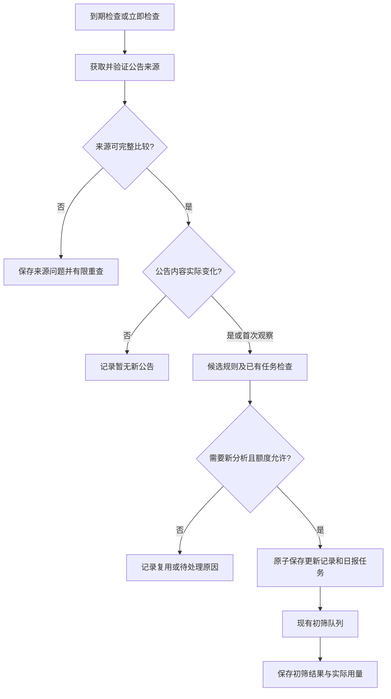

> 历史设计或验证记录。当前结构与运行方式以 [项目说明](../../../README.md) 为准；独立模型功能已移除。

# Paper Radar 自动日报开发设计

| 字段 | 内容 |
| --- | --- |
| 版本 | 0.2 |
| 日期 | 2026-09-08 |
| 状态 | 首版已实现；各订阅自动开关默认关闭 |
| 交付阶段 | D2：在现有真实日报服务上增加定时检查与自动初筛 |
| 适用环境 | 本机单用户 Node.js 服务、SQLite、现有 Web UI 与 Tailscale 入口 |
| 产品依据 | [产品需求 4.12](PAPER_RADAR_REQUIREMENTS.zh-CN.md#412-自动日报先检查来源更新已确认已实现) |
| 现有基础 | [每日推荐设计](PAPER_RADAR_DAILY_RECOMMENDATION_DESIGN.zh-CN.md)、[真实日报实现](../web/DAILY_RECOMMENDATIONS.md)、[按需分析与讨论](../web/ON_DEMAND_ANALYSIS_AND_DISCUSSION.md) |

2026-09-08 实现记录：[自动日报：使用、实现与验证](../web/AUTOMATIC_DAILY.zh-CN.md)。下文保留设计时的现状和方案描述；模块、实际接口、测试结果及当前边界以实现记录为准。条件 GET、自动清理历史、外部通知及实体手机链路验收尚不包含在本次交付中。

## 1. 核心要求与决策状态

**定时只触发来源检查；发现 arXiv 公告确有更新后，才允许创建新的日报分析任务。来源与上一次相同，不创建新的分析任务，不调用模型，不消耗模型调用额度。**

本文中的 archive 指用户订阅的 arXiv 公告来源。比较对象是官方来源提供的公告批次及论文内容，不是本地存档文件的修改时间。

### 1.1 用户已确认

1. 支持自动日报，并允许设置执行额度限制。
2. 自动执行前必须检查来源是否实际更新；没有更新就不运行新的分析。
3. 自动日报沿用选定 subject、Persona 标签、语言和推荐严格度，完整保存候选及处理去向。
4. 日报自动完成初筛、论文介绍和推荐理由；详细报告与讨论仍由用户主动发起。
5. 反馈只记录用户明确提供的四项评价，不从自动运行、阅读或讨论行为推断偏好。

### 1.2 本文提出的首版方案

以下是开发建议，不将具体默认值写成用户已经指定的配置：

- 每个订阅独立设置自动开关、每日检查时间和 IANA 时区。
- 自动开关默认关闭；启用页面明确说明后续新公告会调用已配置模型。
- 无更新或临时来源故障时，在有限窗口内重查来源；重查不调用模型。
- 自动运行额度采用既有单批模型请求上限，加一个每订阅滚动 24 小时的自动模型请求上限。
- 来源不完整时先保存检查结果，首版自动路径等待完整来源；手动日报保留现有部分结果能力。
- 已中断、失败、取消或预算暂停的旧分析任务由用户明确继续，不因定时检查无更新而恢复。
- 新增配置的具体默认数值、首次启用行为等集中见第 14 节，实施前可调整。

### 1.3 首版范围

交付订阅级调度、实际更新判断、任务去重、额度限制、检查历史、暂停与手动恢复，以及启动和休眠后的到期检查。

作者提醒、外部消息投递、任意历史公告的完整恢复、自动唤醒电脑、多用户和云端部署不在本轮范围内。已有单篇分析、讨论、反馈和私有远程入口继续使用现有服务。

## 2. 当前实现与必须改动的位置

以下基于本次读取的实际代码；表中的新模块和接口均为拟新增。

| 现有模块 | 已有行为 | D2 改动 |
| --- | --- | --- |
| `server/daily/service.mjs` | `create()` 先保存 `daily_run`，`execute()` 再抓取来源、绑定或复用日报；初筛结果可缓存 | 自动路径须先检查来源，再准入任务；不能定时直接调用 `create(latest_announcement)` |
| `server/daily/discovery.mjs` | 解析官方 ATOM、存档全部日期组；`latest()` 返回最新组；同分类共享在途请求及 60 秒缓存 | 增加不创建日报的检查入口，返回来源状态、日期组和用于更新判断的内容摘要 |
| `server/daily/subject-bundle.mjs` | 合并同日期分类并按论文编号去重，记录失败和日期不一致 | 自动准入要求完整的同日分类集合，保留各分类检查依据 |
| `server/daily/repository.mjs` | 不可变来源修订、逻辑日报、运行版本、反馈、请求幂等与模型尝试计数 | 增加调度记录、比较基线、更新处理记录及原子准入 |
| `server/analyses/database.mjs` | SQLite 当前最高版本为 4，进程锁，事务使用 `BEGIN IMMEDIATE` | 增加下一版本迁移；保留已有数据与默认关闭的调度状态 |
| `server/service.mjs` | 每次平台尝试执行 `beforeAttempt`，结果通过 `onAttempt` 记录 | 在调用平台之前建立可追踪的额度预留，覆盖失败、重试和备用模型 |
| `server/index.mjs` | 创建各服务并管理启动、关闭；`daily_scheduler: false` | 注册调度服务和 API，仅在实际可用时声明能力 |
| `components/radar/daily-real.tsx` 等 | 真实订阅、手动日报、历史、错误和任务操作 | 增加自动设置、检查状态、额度和待处理更新入口 |

当前 `content_hash` 还包含解析器版本、覆盖问题或合并来源信息；它适合保存来源修订，不能未经拆分就作为唯一的自动分析触发条件。当前日报复用指纹包含完整订阅快照，新增调度字段也不能直接混入此指纹。

条件 GET 可作为后续下载优化，首版允许正常获取后做内容比较。当前通用 `ArxivReader.download()` 未提供条件请求参数及 304 缓存分支；如加入该优化，304 必须绑定同一 URL、已有有效响应和可重建内容指纹，不能在缺少缓存时直接得出无更新。

## 3. 用户流程

### 3.1 启用自动日报

订阅编辑器增加“自动日报”区域：开关、检查时间、时区、额度，以及下次实际检查时间。浏览器可建议时区，但必须在保存前明确展示；后台不从系统时区隐式推断。

启用时验证订阅已启用、subject 和标签有效、已有可用的筛选模型配置。保存设置只做配置验证，不发送测试模型请求。暂时无法验证时保留关闭的配置草稿并显示原因。

首次启用建议在下次设定时间检查当前最新公告：有适用日报则复用，没有则最多生成一次当前批次。此规则是首版建议，界面必须说明；不追溯所有历史存档。关闭后重新启用保留比较基线和处理记录。

### 3.2 日常使用

到时间后，在后台读取并核对来源。有新内容且符合候选规则、未被处理、额度允许时进入初筛队列。页面关闭或手机断开连接不影响已经准入的任务。

首页展示最近检查时间和结果、下一次检查时间、最新完成日报的公告日期、当前任务进度及需要处理的问题。“今天检查过”和“最新日报来自哪一天”分别显示。

### 3.3 用户操作的含义

| 操作 | 含义 |
| --- | --- |
| 立即检查 | 立即执行同一套更新检查；存在新内容时可按自动规则调用模型，按钮附近说明这一点 |
| 关闭自动日报 | 停止新的自动检查、补查及准入；已进入队列或运行中的任务保留独立取消入口 |
| 取消本次日报 | 取消指定任务，保留已完成结果；该更新不会因下次定时检查而重新运行 |
| 继续未完成部分 | 用户明确恢复指定旧任务，复用已完成结果并再次检查额度 |
| 处理已发现更新 | 用户明确处理此前因额度或配置阻塞而保留的更新，不要求来源再次变化 |
| 按当前设置重新筛选 | 明确创建新的内容版本；沿用现有手动接口和调用提示 |

“立即检查”在自动开关关闭时也可由用户主动执行一次；它仍使用更新门槛与自动额度，不等于强制重新生成。

## 4. 架构与服务边界



建议增加 `server/daily/scheduler/`：

| 模块 | 职责 |
| --- | --- |
| `contracts.mjs` | 设置、状态、请求和公开响应的校验 |
| `clock.mjs` | IANA 时区、当地每日时刻、夏令时及下次执行时间的纯计算 |
| `source-check.mjs` | 来源检查、规范化内容指纹、比较基线及差异摘要 |
| `repository.mjs` | 迁移、到期检查领取、原子准入、更新记录和额度预留 |
| `service.mjs` | 检查生命周期、有限重查、启动核对及关闭 |
| `http.mjs` | 自动设置、状态、检查历史和明确处理更新的接口 |

调度器运行在现有 Node 进程，复用同一份 SQLite、arXiv 下载限流和模型服务。网络检查与初筛队列分开推进，模型长任务不能阻止保存已经获取的公告。不会另开一个进程并发使用同一业务数据库。

本地心跳只查询到期记录；建议间隔 30 秒，并使用注入的时钟供测试。每次扫描后以数据库中的 `next_check_at` 决定下一步，不把内存定时器当作任务已经执行的证据。

## 5. 更新判断协议

### 5.1 区分传输变化、公告变化与需要分析的变化

| 层次 | 保存内容 | 用途 |
| --- | --- | --- |
| 传输记录 | URL、抓取时间、原始响应哈希、可用的 ETag/Last-Modified | 下载复用与来源追溯 |
| 公告内容指纹 | 分类、公告日期、论文及公告类型的规范化内容 | 判断是否存在实际更新 |
| 分析输入指纹 | 论文证据、Persona 快照、筛选规则、语言及实际模型等 | 判断既有分析能否复用 |

HTTP 200、文件修改时间和原始 XML 哈希变化均不是启动模型的充分条件。ATOM 顶层和条目中的 `updated` 是 feed 生成时间；`published` 表示公告日期。因此更新门槛基于解析后的公告内容，而非直接比较 `updated`。[arXiv ATOM 规范](https://info.arxiv.org/help/atom_specifications.html)

### 5.2 规范化内容指纹

增加独立、带版本的 `announcement-content-v1` 规则。每个 `(subject, announcement_date)` 对论文排序后计算指纹，包含：

- arXiv 基础 ID 和明确版本；公告日期、公告类型。
- 标题、摘要、按原顺序保留的作者列表。
- 排序去重后的分类集合，以及来源提供、业务实际保存的许可信息。

解析 XML 实体、统一换行和首尾空白；保留公式、大小写及作者顺序，避免过度文本清洗。论文集合按稳定 ID/版本/公告类型排序，分类按稳定顺序排序。合并分类时，`matched_subjects` 和 `source_matches` 也规范化。

不纳入：抓取时间、feed 生成时间、XML 属性顺序、论文条目顺序、数据库 ID、派生证据 ID、解析器版本、错误消息、订阅名称、调度时间、额度，以及模型或 Persona 的修订。

新指纹与已有来源修订哈希并存，不重写历史哈希。解析器或指纹算法升级时，从同一份已存原始来源重算新旧基线，记录 `baseline_rebuilt`；不能把软件升级造成的差异当作 arXiv 更新。无法重建时显示基线待确认，等待明确初始化，不能无声重跑全部历史。

### 5.3 比较基线与处理记录

按订阅的分类集合保存最近一次**完整、可比较**的来源观察。共享下载缓存不能替代订阅自己的比较基线，否则先检查的订阅会错误地使后检查的订阅跳过。

更新记录使用以下唯一标识：

```text
subscription_id + source_scope_key + announcement_batch_key + content_fingerprint
```

其中 `source_scope_key` 仅由排序后的 subject 集合确定；`announcement_batch_key` 是该分类集合与公告日期的稳定标识。设置版本和调度时间不进入此键。更新记录区分已准入、已有结果、无有效新候选、等待额度、等待配置、人工取消或删除后忽略。

比较基线表达“已经观察到了什么”；更新记录表达“决定如何处理”；日报任务表达“分析完成到哪里”。三者不能共用一个最近成功时间。

检查发现新来源但额度不足时，也保存基线和待处理更新。下一次相同来源返回 `no_update`，不因额度恢复而偷偷处理积压；页面继续保留“已发现更新待处理”的独立状态。

同一来源修订再次出现、旧 CDN 响应回退或服务重启，不能重复消费同一个更新。较旧公告日期记为 `stale_source`，不回退有效基线；同日期曾见过的指纹通过更新记录识别，不能因 F1 → F2 → F1 而再次分析 F1。

### 5.4 多分类、空来源与不完整来源

1. 对全部所选分类做检查；每个分类记录来源日期、指纹、完整性和错误。
2. 首版自动准入要求所需分类均为同一公告日期且来源完整。日期不一致、解析冲突或读取失败时，保存成功来源，但不创建自动分析任务。
3. 不完整观察不推进订阅的完整比较基线。后续恢复完整时，仍与上一次完整观察比较，避免把先到达分类的新论文丢掉。
4. 只有完整且可比较的集合与基线相同，才能标记 `no_update`。有任何未核实来源时使用 `source_incomplete` 或 `source_failed`。
5. 当前解析器对无法确定公告日期的空 feed 返回 `announcement_unknown`，D2 不将它改成“今天零论文”。没有公告与来源不可核实分别展示。
6. 可明确归属日期的完整批次即使没有符合订阅纳入规则的论文，也可以记录 `no_eligible_change`，模型调用为零。

分类 feed 可能不同步，完整等待会推迟自动结果。这是首版的明确取舍；UI 提供现有手动部分日报入口，但自动路径不会绕过完整性门槛。官方组合 feed 有结果数量上限，继续逐分类抓取和核对。[arXiv RSS 说明](https://info.arxiv.org/help/rss.html)

### 5.5 真实更新后的候选处理

- 新批次：纳入全部符合订阅规则的候选，并按现有内容缓存避免相同适用输入重复调用。
- 同批次补入或修订：保存新的不可变来源修订；未变化且分析输入完全匹配的项目复用旧结果。
- 只有已排除的版本更新：保存来源变化，记录 `no_eligible_change`，不因版本动态强制产生模型调用。
- 只有删除或撤回候选：保存来源修订和受影响记录，提示旧报告来源发生变化，不为剩余未变内容强制调用模型。
- 新更新中某篇旧候选此前分析失败，而其论文输入没有变化：保留待恢复状态；不利用其他论文的更新顺带重试旧失败项。用户明确继续后才恢复。
- Persona 或分析设置确实改变时，旧缓存可能不再适用。只有来源更新门槛已经通过，才可按实际新输入执行所需筛选并计入额度；仅设置改变不能触发旧批次自动重算。

“来源有更新”是必要条件，不代表必须调用模型，也不承诺所有新增日报都只需一次请求。页面展示新增、修订、复用、待恢复和预计需要初筛的候选数，不显示无依据的费用估计。

保留旧失败项需要实际修改执行协议：为未变化的旧失败候选保存 `execution_policy=manual_resume_required` 及 `previous_item_id`，自动 `execute()` 跳过它且仍计入初筛未完成；明确恢复时才清除该限制。不能只在 UI 标记待恢复，因为当前循环会处理所有未排除且没有筛选版本的项。旧成功结果只在完整缓存键匹配时复用；新来源没有移除的候选始终保留可见去向。

## 6. 调度与时间规则

### 6.1 时间存储

保存 `local_time`（`HH:mm`）、IANA `timezone`、设置 `revision` 和 UTC `next_check_at`。例如 `07:30 / Europe/Vienna` 只是配置示例，不自动应用到用户订阅。

每个当地自然日最多一个计划检查周期，周期内可有有限来源重查。重复的夏令时时刻只执行一次；不存在的时刻顺延至当天第一个有效时刻。使用支持 IANA 时区的日期实现，测试中固定时钟，不能用固定 UTC 偏移或简单加 24 小时代替当地日期计算。

修改运行时间只重算下一次检查，不补发过去的时刻。修改时区后从新时区的下一个未来时刻起生效，不清除当日检查历史。心跳迟到时合并错过的时刻，立即执行一次检查，不为离线的每一天逐个创建空任务。

arXiv 有公告周期和延期安排，RSS 也有独立更新时间；计划时间仅表示开始检查，实际是否有新内容取决于来源。内部不把节假日硬编码为必然没有论文，也不承诺设定时刻已经生成报告。[公告安排](https://info.arxiv.org/help/availability.html)、[RSS 更新说明](https://info.arxiv.org/help/rss.html)

### 6.2 有限来源重查

建议初次检查后，最多额外重查 4 次，间隔 30 分钟，总窗口 2 小时；所有值集中配置，不分散硬编码。新周期出现时，旧周期尚未开始的来源重查被合并，避免双重检查链。

`no_update`、临时下载失败和分类不同步可以安排来源重查；发现完整可比较更新并作出处理决定后结束该周期。遵守已有下载限流和服务端可用的重试提示；超出窗口只记录下一次计划时间。

每次来源检查的低层下载重试也有上限，指标区分检查次数与实际 HTTP 次数。“立即检查”复用同一订阅正在进行的检查，并设短期冷却，重复点击不增加额度或产生无限重查链。

下载可继续共享在途请求和短期有效缓存，但响应必须带实际 `fetched_at`。过期缓存或单纯命中本地旧存档不能被报告成已经检查过当前官方来源。

### 6.3 休眠、重启与漏跑

现有后台服务配置可托管 Node 进程，网页无需打开；Mac 睡眠、关机或未启动服务时不会执行。Tailscale 只提供访问入口。运行前提与排错沿用[远程访问说明](../web/REMOTE_ACCESS.zh-CN.md)。

启动时按以下顺序处理：

1. 取得业务库进程锁、完成迁移，恢复检查与任务的持久化状态。
2. 将遗留 `checking` 检查标为中断并安排一次受限的来源检查；不把中断记成无更新。
3. 已原子准入、仍为 `queued` 的日报属于原任务，可以进入现有队列；不会再次创建或绑定另一份任务。
4. 已经开始模型执行而中断的任务保持 `interrupted`，显示“继续未完成部分”；首版不自动重试。
5. 合并遗漏的计划时刻，检查当前来源；仍按实际内容更新门槛决定是否准入新任务。

所有获取到的日期组先归档。首版自动处理当前完整最新批次，较早已存档但未处理的批次进入可见积压列表，由用户明确选择补处理。未存档且已经从 feed 消失的历史范围标为“公告覆盖未确认”；不把搜索 API 的提交日期当作完整公告重建依据。

## 7. 检查状态与日报状态

### 7.1 检查记录

检查生命周期 `queued → checking → finished`，中断用 `interrupted`。完成后独立保存 `outcome`，避免检查已经完成却被误认为日报生成已经完成。

| 检查结果 | 含义 | 本次检查是否可新增模型任务 |
| --- | --- | --- |
| `no_update` | 完整来源与上次有效观察相同 | 否 |
| `existing_result` | 有新观察，但已有兼容任务或结果 | 否，引用已有任务 |
| `no_eligible_change` | 有真实更新，但没有需分析的有效候选 | 否 |
| `admitted` | 新更新已关联一个新日报任务 | 是，受后续逐次额度检查约束 |
| `blocked_budget` | 发现更新，当前自动额度不足 | 否，保留待处理更新 |
| `blocked_configuration` | 发现更新，但模型、标签或配置不可用 | 否，保留待处理更新 |
| `source_incomplete` | 分类不同步、解析冲突或覆盖不足 | 否 |
| `source_failed` | 无法取得可用来源 | 否 |
| `stale_source` | 响应回退到较旧批次 | 否 |
| `configuration_changed` | 检查期间订阅范围或有效设置改变 | 否，重新核对新配置 |
| `baseline_rebuilt` | 软件升级后重建比较基线 | 否 |

未变化检查的硬性断言：本次检查创建的 `daily_run` 数为 0，新增模型尝试和预留数为 0，Persona 内容读取次数为 0。并发中的既有任务可能继续工作，不能用进程级模型请求总数误判这一断言。

### 7.2 日报运行

复用当前 `queued / running / paused / completed / partial / failed / cancelled / interrupted`。只有来源完整且所有纳入候选已有合法初筛结果时才完成；`needs_fulltext` 是合法初筛结果，未请求详细分析不影响日报完成。

检查失败不改写旧日报状态，检查无更新不覆盖旧日报日期。任务失败、停止或删除也不清除已经消费过的更新记录。

## 8. 数据与事务设计

### 8.1 新增持久化记录

沿用项目“常用筛选列 + JSON data”的存储方式；唯一约束、状态、领取字段和额度统计使用明确 SQL 列，不能只在 JavaScript 里判断。

| 表 | 关键字段与约束 |
| --- | --- |
| `daily_schedules` | `subscription_id` 主键，`enabled`、`revision`、`local_time`、`timezone`、`next_check_at`、`max_model_calls_24h`；到期索引 |
| `schedule_checks` | `id`、`subscription_id`、`schedule_revision`、`cycle_key`、`check_index`、`trigger`、`status`、`outcome`、`started_at/finished_at`、各来源观察和差异摘要；周期内检查唯一约束 |
| `schedule_requests` | 用户操作的幂等键、请求哈希、动作及结果引用；同键异参返回 409 |
| `schedule_source_cursors` | `(subscription_id, source_scope_key)` 主键，最近完整观察的日期、内容指纹、各分类修订引用、`observed_at` 与规范化版本 |
| `schedule_updates` | 更新唯一键；来源修订、发现检查、处理状态、`run_id`、阻塞原因和取消/删除标记；任务引用可为空 |
| `automatic_attempt_reservations` | `attempt_id` 主键，`subscription_id`、`run_id`、`item_id`、`reserved_at`、状态及实际尝试引用；滚动窗口查询索引 |

计划检查的唯一约束为 `(subscription_id, schedule_revision, cycle_key, check_index)`；`cycle_key` 保存计划当地日期及其对应 UTC 到期时刻，重查沿用原周期。立即检查使用请求幂等键并在事务中查找可复用的 active check。领取通过 `UPDATE ... WHERE status='queued'` 并检查影响行数完成，同一进程的重叠心跳不能同时领取。进程锁阻止两个服务实例共同执行；启动时回收遗留的检查状态。

额度预留状态使用 `reserved / recorded / unknown / released`。滚动用量按该订阅 `reserved_at > now - 24 hours` 且状态不为 `released` 的记录数计算；`recorded` 包括成功与平台返回错误。`run_id` 和 `item_id` 的额度归属信息在业务结果删除后仍保留至窗口结束，不允许级联删除造成额度恢复。

JSON 中的来源修订引用必须通过仓储层校验存在性；需要独立删除管理的关联应实现对应引用检查。`schedule_updates` 是去重账本，不随日报删除级联清除；删除日报后保留最小的来源指纹和忽略标记，避免下次检查重建用户刚删掉的报告。额度记录至少保留完整的滚动窗口，删除任务不能释放已消费额度。

新 `daily_run` 增加无凭据的 `origin`：`kind=scheduled`、`check_id`、`update_id`、`schedule_revision`。被自动检查复用的手动任务保留原有 origin，检查记录单独引用它，不改变其预算归属。

### 8.2 设置与内容版本分离

`daily_schedules.revision` 只控制定时设置的并发修改，不递增分析设置版本。既有订阅的名称、展示标签、时间戳和预算也不应该成为是否重复分析的原因。

提取明确的 `analysis_config_hash`，覆盖会影响候选或内容的配置：subjects、Persona 连接与 scope、语言、严格度、版本纳入规则和筛选策略。初筛模型指纹只覆盖实际 screen 路由及其有效备用配置，不因讨论模型改变失效。具体 Persona 证据修订继续进入逐篇缓存键。

首次启用、subject 范围改变、分析设置改变、单纯调度设置改变分别处理：

- 首次启用按第 3.1 节初始化当前批次。
- subject 集合变化建立该集合的独立基线；保存时提示下一次会检查新范围。切回曾用集合复用已有记录，不能靠切换设置重复消费旧批次。
- 仅模型、标签、语言、严格度改变时，来源未变仍不自动分析；下一份新来源使用新设置，历史由用户明确重筛。
- 仅时间、时区、额度、开关改变时保留所有来源基线和处理记录。

### 8.3 原子准入与手动竞争

新增 `DailyService.admitStoredRevision()` 内部入口，接收已经验证的来源修订、订阅快照及自动更新来源。自动调度不经过“先创建发现任务”的手动入口。

网络获取和 Persona 读取均在 SQLite 事务之外执行；自动检查在更新门槛通过前不读取 Persona 内容，真正的快照读取由已准入的初筛任务完成。准入事务中重新核对有效开关或明确的一次性检查授权、订阅 revision、source scope、检查领取状态、更新唯一键、已有兼容日报和额度。

同一事务完成：保存完整来源比较基线、更新处理记录、日报运行和请求关联。需要新任务时，在同一事务内绑定已存来源并生成候选，提交后再调用 `pump()`。额度或配置不足时，只保存待处理更新与检查结果。

手动路径在发现来源后也必须进入共享的日报准入/绑定逻辑。它可能已创建一个发现阶段的占位运行，但最终必须复用同一个兼容任务，并更新相关请求与检查引用。去重比较包含来源内容与分析配置，不能只比“手动最新”和“定时存档”这两个不同的请求参数。

当前 `create()` 和 `bindReport()` 自己开启事务；重构时拆出事务内部方法，避免 `BEGIN IMMEDIATE` 嵌套。事务级竞争结果必须返回真实被复用任务的状态，包括 `cancelled` 和 `paused`，不能包装成新的执行成功。

### 8.4 崩溃窗口

| 崩溃位置 | 恢复行为 |
| --- | --- |
| 来源已下载，比较事务未提交 | 可重新检查/比较；没有基线被提前消费 |
| 准入事务已提交，`pump()` 尚未执行 | 原 queued 任务在启动时继续，更新记录阻止再次创建 |
| 已预留额度、平台响应尚未落盘 | 保留预留为结果未知；任务中断，等待明确恢复 |
| 结果已保存，检查展示字段未更新 | 根据更新记录和 run 重新汇总展示，不调用模型 |

只能保证本地任务准入和记录去重。平台已收到请求但本地未收到结果时，无法保证外部模型恰好执行一次；明确恢复可能再次调用，必须保留未知状态和额度占用。

## 9. 额度设计

### 9.1 限制对象

首版建议保留两级硬上限：

1. **单批上限**：复用 `subscriptions.max_model_calls`，运行快照固定后不因重启或重试归零。
2. **每订阅滚动 24 小时自动调用上限**：`daily_schedules.max_model_calls_24h`，覆盖自动来源任务及其后续明确继续操作。

使用滚动窗口避免修改时区、检查时间或跨午夜使额度立即重置。页面明确写“过去 24 小时”，不称为“今日费用”。多个订阅分别有上限，UI 汇总其实际自动用量，但首版不把单订阅限制称作全站总预算。

自动来源任务由用户点击继续后仍保留自动 origin 和额度约束。单独新建的手动日报、单篇报告和讨论使用原有自身限制，页面分别展示。调整额度是显式操作，不能由调度器或错误重试自动提高。

### 9.2 逐次预留

额度不是推荐篇数上限。所有候选照常持久化，预算不足的项保留未处理状态，不归为未推荐、不截断候选。

每次真正准备调用平台前，生成稳定的 `attempt_id` 并在一个事务中：

1. 核对 run 未取消、未中断且仍可执行。
2. 检查单批已预留数和过去 24 小时自动预留数。
3. 原子增加单批计数并插入自动预留；任一额度不足时整笔回滚。
4. 事务提交后才请求模型，最终用同一个 attempt ID 落盘结果和实际 token 用量。

当前 `ModelService` 在 `beforeAttempt` 后才创建 attempt ID，实施时需提前生成，并向回调提供 ID 和开始时间；保持原有调用者兼容。格式修订、平台重试和显式启用的备用模型都是独立实际尝试，分别计数。

已预留但无法证明未发送的尝试保守计入额度。只有能明确证明尚未发出请求的失败才可释放预留；取消、超时或平台错误不自动退款。缓存命中不预留额度，来源检查本身不预留额度。

### 9.3 额度耗尽后的行为

检查前已无额度：仍可检查并存档来源；发现更新后记录 `blocked_budget`，不创建分析任务。任务执行中耗尽：保存已完成部分，进入 `paused` 并说明限制来源。

额度自然恢复或用户修改上限后，旧暂停任务与待处理更新仍等待明确继续。下一次无更新检查不会恢复它们。之后有另一个新批次时，可以在可用额度内处理新批次，旧积压继续单独显示。

## 10. API 草案

全部为拟新增接口，沿用同源、JSON 和 `X-Paper-Radar: 1` 检查。生成检查或触发处理的 POST 需要 `Idempotency-Key`；修改使用明确 revision，冲突返回 409。不开设可绕过既有保护的调度 HTTP 入口，内部心跳直接调用服务方法。

| 接口 | 行为 |
| --- | --- |
| `GET /api/subscriptions/:id/schedule` | 返回设置、revision、下次计划、有效启用状态、滚动用量和最近检查摘要 |
| `PATCH /api/subscriptions/:id/schedule` | 保存开关、时间、时区、自动上限，携带 `expected_revision`；不直接运行模型 |
| `POST /api/subscriptions/:id/schedule/check` | 创建或复用立即检查，返回 202 和 check ID |
| `GET /api/subscriptions/:id/schedule/checks` | 分页检查历史；与日报历史分开 |
| `GET /api/schedule-checks/:id` | 状态、来源覆盖、实际抓取时间、变化摘要及关联任务 |
| `GET /api/subscriptions/:id/schedule/updates` | 已发现待处理、已忽略及已关联日报的更新列表 |
| `POST /api/schedule-updates/:id/process` | 明确处理待处理更新；有旧失败任务时复用现有 retry 规则，有旧取消任务时明确继续该任务 |

设置示例仅用于接口开发，非真实配置：

```json
{
  "expected_revision": 3,
  "enabled": true,
  "local_time": "07:30",
  "timezone": "Europe/Vienna",
  "max_model_calls_24h": 200
}
```

首次 GET 可返回关闭的 revision 0 配置；首次 PATCH 使用 `expected_revision: 0` 并通过唯一主键处理竞争。缺少时间、合法时区或有效额度时不能启用。

`process` 必须在页面说明可能调用模型；处理原更新时使用已固定的设置，若原连接或 scope 不再有效，返回需要重新确认设置的错误，不静默扩大范围。用户选择当前设置重筛时进入既有明确生成流程。

`/api/capabilities` 在调度模块可用时返回 `daily_scheduler: true`；这个值表示功能可用，不表示某个订阅已启用。响应可增加协议版本，旧前端看到未知字段仍能使用手动日报。

## 11. UI 与可观测性

### 11.1 必需展示

- 自动开关、当地检查时间、时区及下次实际执行时间。
- 最近一次检查的时间和结果；来源使用缓存时显示真实抓取时间。
- 最新已完成日报的公告日期和打开入口。
- 当前运行进度、单批用量、过去 24 小时自动用量及暂停原因。
- 已发现但未处理的更新和历史覆盖缺口。

状态文案示例：“已检查，暂无新公告”“公告正在更新，部分分类日期尚未一致”“发现新公告，自动调用额度不足”“筛选已暂停，已完成结果保留”。来源不完整和任务未完成分别显示。

界面沿用已有中英文 catalog。手机端可以修改时间和上限、检查状态及继续任务；时区不能藏在仅桌面可见的提示中。页面轮询只读状态，不因打开页面或刷新发起检查、模型调用或反馈。

### 11.2 日志与指标

结构化日志记录 check ID、订阅 ID、更新时间指纹摘要、实际来源时间、检查结果、run ID、耗时、下载次数、缓存命中数、模型预留和受控错误码。正文、Persona 内容、密钥和完整提示词不写入普通日志。

验收统计至少包括：到期检查数、无更新检查数、来源失败数、准入任务数、重复准入阻止数、模型尝试/未知预留数、预算暂停数。按 check 和 run 归属统计，避免把同时运行的手动任务用量归到无更新检查。

检查历史需要保留策略，建议展示最近 90 天并分页。历史检查的详细错误可清理；仍被更新记录、有效比较基线或待处理任务引用的来源和去重信息不能随日志清理删除。定时、手动抓取与存档清理共用引用检查。

## 12. 数据迁移与发布

1. 开发时基于当前 v4 增加 v5 迁移；若实现前已有其他迁移，使用下一空闲版本，不能覆盖已有迁移编号。
2. 只新增调度相关表和必要索引。既有订阅、日报、结果、反馈和讨论保留，所有订阅自动开关初始关闭。
3. 从既有完整来源与兼容日报建立可复用索引，不在迁移时抓取网络、读取 Persona 或调用模型。正式首次启用再执行第 3.1 节规则。
4. 修改指纹逻辑时提供兼容匹配：可从旧快照提取新的分析字段重新比较，不能因版本升级失去已有日报去重能力。
5. 注册 scheduler 的 `start/close`。关闭时先停止新检查与准入，再停止来源检查、日报、讨论和模型服务，最后关闭数据库；检查中断原因落盘。
6. 本机发布前备份数据库，构建 UI 并重启现有后台服务。继续使用原数据目录与远程来源配置，不启动第二个持库进程。
7. 回退代码前须恢复兼容数据库备份或提供向后兼容路径；旧程序会拒绝高于其支持版本的数据库，不能承诺直接换回旧代码即可回退。

本次文档交付不执行迁移、服务重启、开关启用或真实模型验收。实现阶段在具体测试与启用范围内执行这些动作。

## 13. 测试矩阵与完成标准

### 13.1 自动测试

沿用现有临时 SQLite、模拟 Persona 和模拟模型测试夹具，新增可注入时钟与 feed 版本序列；禁止以真实时间等待一天验证定时逻辑。

| 编号 | 场景 | 必须满足 |
| --- | --- | --- |
| S01 | 相同 XML 连续检查 | 后续检查新增 run、模型尝试、Persona 读取均为 0 |
| S02 | 只改 feed/entry `updated` | `no_update`，模型调用为 0 |
| S03 | 条目、分类或合并来源顺序变化 | 内容指纹相同，不创建任务 |
| S04 | 同批次补入论文或改摘要 | 识别真实更新；已有适用结果复用，必要调用受预算约束 |
| S05 | 只出现未纳入的版本动态 | 存档并标记无有效新候选，模型调用为 0 |
| S06 | 只有删除或来源撤回 | 保存修订与提示，不为未变论文强制重算 |
| S07 | 网络失败、损坏 XML、未知日期空 feed | 显示失败或不可确认，不显示无更新 |
| S08 | 多分类部分失败、日期不同、内容冲突 | 自动不准入，不推进完整基线；恢复后能识别未处理更新 |
| S09 | 两个订阅共用同一分类来源 | 下载共享，基线和处理各自独立 |
| S10 | 手动最新、定时存档同时触发 | 最终兼容逻辑日报只有一个实际筛选任务 |
| S11 | 两次心跳或两次立即检查竞争 | 检查领取、幂等与冷却有效，无重复调用 |
| S12 | 只改调度时间、时区、开关或额度 | 无来源变化时模型调用为 0，不重置去重账本 |
| S13 | 只改 Persona、语言、严格度或模型 | 无来源变化不自动重筛；明确手动重筛仍可用 |
| S14 | 首次启用已有兼容手动日报 | 复用并建立基线，不重复筛选 |
| S15 | 指纹算法或解析器升级 | 基线重建与来源更新区分，升级本身不调用模型 |
| S16 | 新来源额度不足，之后额度恢复但来源未变 | 保留待处理更新，不自动恢复；明确处理后才执行 |
| S17 | 平台重试、格式修订、备用模型 | 每次尝试都原子计数，两级上限均不可突破 |
| S18 | 并发预留最后一个额度 | 只有一个尝试获准；失败预留不得留下半笔计数 |
| S19 | 取消、失败、删除后检查相同来源 | 不复活旧任务，不清除额度和更新去重记录 |
| S20 | 新批次含旧失败但未改变的候选 | 旧失败候选不被顺带自动重试，待恢复状态可见 |
| S21 | 准入事务前后分别崩溃 | 不丢更新、不重复创建；queued 恢复与 interrupted 待明确继续区分 |
| S22 | 平台请求已发出、响应未落盘 | 额度预留保持未知，不自动退款或重复发送 |
| S23 | 休眠跨日、时钟回拨、夏令时跳过/重复 | 合并遗漏检查，重复时刻只执行一次，不用固定 UTC 偏移 |
| S24 | 旧日期响应及 F1 → F2 → F1 | 不回退基线或再次分析已消费修订 |
| S25 | 检查期间关闭自动或修改 subject | 迟到结果不可按失效配置准入新任务 |
| S26 | 无更新时已有另一个任务正在运行 | 本 check 调用为 0，原任务不被误取消，统计归属正确 |
| S27 | 迁移、存档清理与删除 | 历史正文、反馈和讨论保持一致，引用和去重信息保留 |
| S28 | API 同源、幂等、revision 和能力声明 | 沿用现有保护，旧页面可继续手动使用，冲突有明确反馈 |

建议文件：`tests/scheduler-source.test.mjs`、`scheduler-time.test.mjs`、`scheduler-admission.test.mjs`、`scheduler-budget.test.mjs`、`scheduler-http.test.mjs`、`scheduler-migration.test.mjs`。公共检查路径改变后运行现有日报、模型、讨论和远程访问回归。

### 13.2 浏览器与真实验收

隔离浏览器使用模拟来源和模型覆盖：保存/关闭自动设置、无更新状态、来源失败、额度暂停、手动继续、历史日期不被检查日期覆盖，以及 390px 手机布局。检查刷新或页面轮询不会发起新的写请求。

真实验收使用明确选定的订阅、标签、模型与有限额度：获取一个实际公告批次完成自动初筛，随即再次检查相同来源，核对没有新日报任务和模型尝试；再记录后续真实新批次的自动处理。验收记录包含源指纹、候选数、实际模型请求、耗时、错误与恢复情况，不替用户填写反馈。

手机通过实际 Tailscale 地址验证查看状态、修改设置和明确继续任务。响应式模拟测试与真实手机验收分别记录。服务重启、短暂断网和漏过计划时刻需要单独复验，不把本机 API 成功视为这些场景已经通过。

### 13.3 交付完成标准

- S01–S28 的相关测试通过，既有回归、TypeScript 和生产构建通过。
- 连续真实公告批次能够按设置检查并生成，来源不变时不创建分析任务、不调用模型。
- 失败、额度不足与无更新可以明确区分，旧任务不会因定时无变化检查自动重跑。
- 检查、任务、来源与用量都能追溯；现有日报、报告、讨论和反馈保留。
- 自动开关由用户明确启用，UI、运行文档与 capabilities 对实际能力的描述一致。

## 14. 建议默认值与实施顺序

### 14.1 待最终确定的默认值

这些选项不影响“来源未更新则不运行”这一已确认要求。实现可以采用下列建议值，但应集中定义、在 UI 可见，并在变更记录中注明它们是产品默认值。

| 选项 | 首版建议 |
| --- | --- |
| 自动开关 | 默认关闭，既有订阅不自动开启 |
| 检查时刻与时区 | 启用时由用户保存；浏览器时区只作可见建议 |
| 首次启用 | 下次检查处理当前最新完整批次一次，已有兼容结果则复用 |
| 单批调用上限 | 沿用用户已有 `max_model_calls`；现有默认 200 不视为用户指定额度 |
| 滚动 24 小时自动上限 | 初始建议取该订阅的单批上限，整数 1–2000，可单独修改 |
| 来源重查 | 30 分钟间隔，最多额外 4 次，总窗口 2 小时 |
| 立即检查冷却 | 同订阅 60 秒，优先复用正在进行的检查 |
| 多分类不完整 | 等待完整来源；提供明确的手动部分日报入口 |
| 旧任务恢复 | 首版由用户明确继续，保持原已完成内容和额度记录 |
| 漏跑历史 | 当前最新批次走更新门槛；其他积压由用户明确选择处理 |

### 14.2 开发里程碑

| 阶段 | 交付内容 | 进入下一阶段的条件 |
| --- | --- | --- |
| A：来源检查 | 规范化内容指纹、独立检查记录和比较基线 | 无变化、时间变化、重排、失败与不完整场景不启动任何模型 |
| B：原子准入 | 更新记录、共享任务绑定、配置指纹与手动竞争处理 | 相同更新只有一个适用运行，取消/删除不会被复活 |
| C：额度 | 原子预留、滚动限制、未知调用处理与阻塞入口 | 重试和并发不能绕过额度，预算恢复不触发旧任务 |
| D：调度 | 时间设置、有限重查、启动/关闭与休眠后的到期核对 | 时区与夏令时测试通过，重启不重复消费来源 |
| E：界面 | 自动设置、状态、检查历史、待处理更新和双语文案 | 桌面与手机布局的隔离流程验收通过 |
| F：本机验收 | 迁移、构建、真实批次、相同来源复查与手机访问 | 第 13.3 节完成标准达成，再更新运行文档中的实现状态 |

## 15. 参考与后续维护

- 更新检查必须遵循[产品需求 4.12](PAPER_RADAR_REQUIREMENTS.zh-CN.md#412-自动日报先检查来源更新已确认待实现)；本设计细化旧[每日推荐设计第 11 节](PAPER_RADAR_DAILY_RECOMMENDATION_DESIGN.zh-CN.md#11-d2定时执行与补处理)的 D2 规划。
- 初筛与全文任务的关系以[按需分析实现](../web/ON_DEMAND_ANALYSIS_AND_DISCUSSION.md)为准，不沿用旧 D1 自动全文流程。
- 公告时间字段与类型参照[arXiv ATOM 规范](https://info.arxiv.org/help/atom_specifications.html)；来源获取形式与上限参照[RSS 说明](https://info.arxiv.org/help/rss.html)；发布与延期参照[公告安排](https://info.arxiv.org/help/availability.html)。本设计对这些资料的使用范围是来源语义，不据此承诺历史无遗漏恢复。
- 开发完成后将实际默认值、迁移编号、接口变化、测试结果和真实验收边界写入独立运行说明，再更新 README。未实现的方案继续标注为设计。
