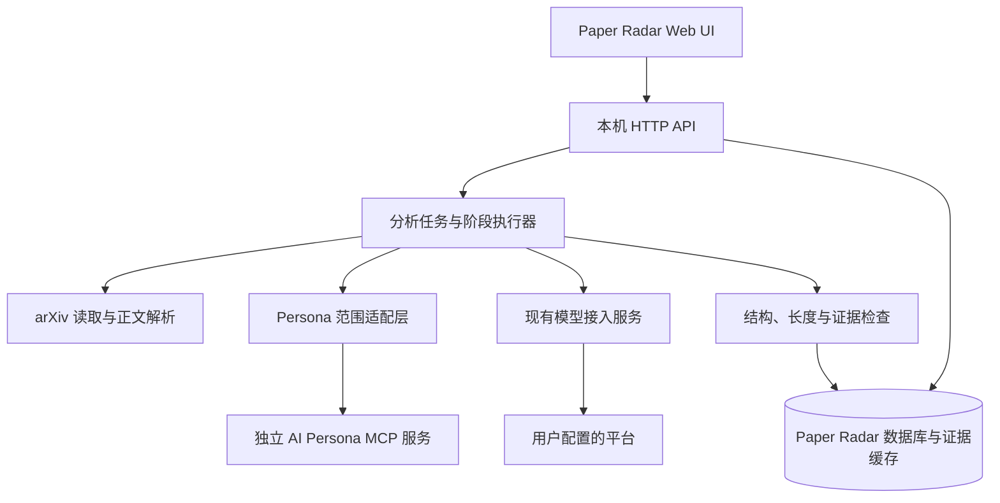
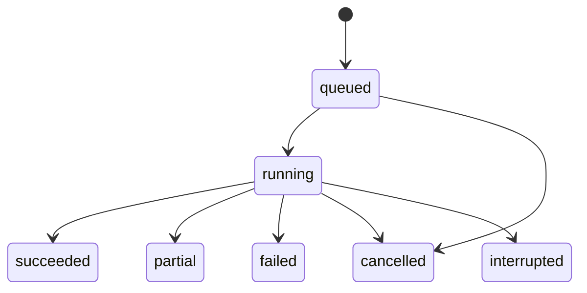

> 历史设计或验证记录。当前结构与运行方式以 [项目说明](../../../README.md) 为准；独立模型功能已移除。

# Paper Radar 后端设计：单篇真实分析与每日推荐基础

| 字段 | 内容 |
|---|---|
| 版本 | 0.1 |
| 日期 | 2026-09-06 |
| 状态 | 实现前设计稿；描述目标行为，不代表后端已完成 |
| 首个交付 | 在现有 Web UI 中完成单篇 arXiv 论文的真实分析、保存、恢复和反馈 |
| 部署建议 | 单用户本机运行，复用现有 Node.js 模型服务 |
| 项目边界 | Paper Radar 与 AI Persona 平级、独立，通过正式接口读取 Persona |
| 依据 | [产品需求](PAPER_RADAR_REQUIREMENTS.zh-CN.md)、[模型接入](PAPER_RADAR_MODEL_INTEGRATION.zh-CN.md)、[单篇实测](../../../evaluations/2026-09-06-arxiv-2501.12903v3/REPORT.zh-CN.md)、[AI Persona 范围接口](../../../../ai-persona/docs/AI_PERSONA_SCOPED_MCP.zh-CN.md) |

2026-09-07 补充：本文保留最初的总体设计，单篇当前实现以[运行与验收说明](../web/SINGLE_ANALYSIS.md)为准。第 12 节和阶段 D 的后续细化见[每日推荐专题设计](PAPER_RADAR_DAILY_RECOMMENDATION_DESIGN.zh-CN.md)，其中区分手动真实日报、自动运行及作者与通知三个交付阶段。

同日需求更新：[产品需求 v0.4](PAPER_RADAR_REQUIREMENTS.zh-CN.md)已明确推荐严格度、先介绍后按需分析、论文及报告问题讨论、中文保留英文专业术语。本文保留原设计，变更的技术说明已另列；每日自动全文派发及完成条件等旧规则须按新需求修订，不能据此继续自动分析用户尚未请求的论文。当前代码的差异见需求文档第 11 节。


**v0.4 实现补充：**按需全文、独立状态与预算、严格度和讨论现已落实。当前执行规则、数据迁移与 API 见[按需分析与讨论实现说明](../web/ON_DEMAND_ANALYSIS_AND_DISCUSSION.md)，覆盖本文旧 D1 自动全文和父子预算相关规则。

## 1. 目标与决策状态

后端负责把“输入论文链接”变成可检查、可恢复的研究分析。用户选择论文、Persona 标签、语言和总结长度后，系统读取论文及允许使用的个人材料，调用已配置模型，检查生成结果，再将内容和进度返回现有页面。

用户已明确要求的能力包括：独立项目、标签范围限制、中英文输出、详细总结及字数范围、单篇链接分析，以及四项独立且可选的反馈。每日 subject 筛选和关注作者提醒仍是完整产品目标。

本文提出的技术方案作为后续实现基线。SQLite、任务状态、重试预算等属于工程设计；多标签并集、空标签行为、默认字数和推送渠道等产品规则，须区分原型采用值与永久规则。本文不将原需求中的待确认事项改写为已确认需求。

模型能力与工程实现分开验收：当前小模型测试中的概念错误、条件遗漏和审核漏检，应先用更强模型在相同设置下复测，不为小模型的能力限制扩展复杂纠错流程。项目保留格式、字数、引用、标签范围和任务状态等基本保障；更强模型复测后仍存在的工程缺口再进入实现计划。

### 1.1 首版范围

- 真实 arXiv 元数据和正文获取，固定论文版本并缓存。
- HTML 正文抽取与 PDF 文本回退，提供内容覆盖说明。
- 从真实 AI Persona 获取标签，并严格限制个人上下文范围。
- 生成详细研究总结、推荐判断、理由、材料联系和待验证的交叉想法。
- 校验结构、字数、引用及结构化个人事实；失败时有限修订。
- 真实任务进度、取消、重试、历史结果及四项可选反馈。
- 在当前本地 Web UI 中运行，不依赖 Codex 对话继续执行。

### 1.2 后续范围

在单篇流程稳定后实现每日候选收集、批次筛选、作者匹配、定时执行和通知。远程部署、多用户、全文图像理解、自动学习、一键导入 Persona 和实验复现分别设计，不作为单篇首版的前置条件。

## 2. 当前基础与缺口

以下状态来自当前代码及已保存的实测记录。

| 模块 | 已有能力 | 本次需要增加 |
|---|---|---|
| Web UI | 单篇入口、设置、示例结果、模拟进度、浏览器历史和反馈 | 真实 API、动态标签、真实结果和错误状态 |
| 模型服务 | Pi 适配、多平台连接、授权、任务路由、超时、显式备用、用量记录 | 单任务取消、持久化任务关联、输入预算、业务输出校验 |
| arXiv | 前端链接解析；此前临时脚本完成一篇真实读取 | 产品内读取、结构化解析、版本缓存、回退和覆盖检查 |
| AI Persona | 标签发现、严格 scope、分页、来源及版本校验 | Paper Radar 自己的 MCP 客户端和范围固定封装 |
| 数据 | 模型凭据有独立加密存储；单篇结果仍在浏览器 | 业务数据库、证据文件、分析版本和反馈持久化 |
| 质量检查 | 前端字数计数；实测中人工修订 | 自动结构校验、计数修订、证据检查及回归样本 |

原实测报告指出的标签发现、严格范围和多标签语义问题，已由 AI Persona 新增接口解决。不要继续从 Studio 页面解析标签，也不需要为首个本地版本重做上游材料读取接口。

## 3. 架构与职责



### 3.1 实现选择

- 继续使用 `web/server/` 下的 Node.js 后端，逐步从模型服务扩展为 Paper Radar 应用服务，保留现有 `/api/models/*` 接口和凭据。
- 首版使用一个应用进程、SQLite 持久化任务队列和有界并发执行器。数据库保存任务事实，内存只保存正在运行的句柄，不依赖 Redis 或独立调度集群。
- AI Persona 通过本机 stdio MCP 连接。连接参数由受信任的本机配置管理，包含可执行程序、参数和工作区；普通分析请求只能引用已配置的连接，不能提交任意命令或路径。
- 模型请求经现有 `ModelService` 内部调用，避免应用服务通过 HTTP 再调用自己。分析阶段不得绕开统一路由、凭据管理和用量记录。
- 任务采用明确的固定步骤。模型负责理解和生成内容，不负责自主选择未授权的数据源或执行代码。

模型任务映射沿用现有名称：`summary` 用于研究总结及其修订，`connections` 用于单篇个性化判断、理由、联系和交叉，`screen` 留给每日候选筛选。校验修订沿用对应组件的模型路由。单篇阶段不额外执行一轮每日筛选。

创建任务时保存默认模型、任务覆盖和备用策略的配置快照。调用前校验连接仍有效；用户修改连接导致配置不一致时停止相关阶段并报告 `connection_changed`，不静默改用另一个模型。OAuth 令牌正常刷新由凭据服务处理，不把令牌复制到任务记录中。

### 3.2 数据归属

AI Persona 保有正式知识、兴趣、标签、材料和来源。Paper Radar 保有订阅、论文缓存、选定范围的必要证据副本、任务、分析结果和显式反馈。

Paper Radar 不读写 Persona 内部数据库或正式记录文件。读取材料原文时，只使用范围接口返回、Manifest 声明的来源文件，并验证哈希。这属于接口授权的来源读取，不是直接遍历工作区。

分析与反馈不会自动写回 AI Persona。跨设备访问时需要受控的材料内容接口；本机文件路径不能成为远程部署方案。

## 4. 用户行为与首版规则

| 场景 | 后端目标行为 |
|---|---|
| 输入摘要、PDF、HTML 链接或编号 | 归一化为 arXiv ID，服务端独立验证；保留显式版本 |
| 未指定版本 | 获取元数据，解析到具体版本后固定；历史结果不随最新版变化 |
| 沿用订阅 | 复制标签、语言、长度；本次设置独立保存，单篇不受 subject 限制 |
| 多选标签 | 首版沿用 UI 并集，显式传 `tag_match: "any"`；不依赖上游默认值 |
| 未选择标签 | 首版沿用 UI，仅研究总结；不查询全库，不生成个性化判断 |
| 选定标签无相关材料 | 明确覆盖范围和证据不足，不推断用户不理解或不感兴趣 |
| Persona 连接失败 | 记录个性化失败，可保留已完成总结；不等同于“不推荐” |
| 单篇不推荐 | 仍生成完整研究总结及判断理由 |
| 未发现可靠联系或交叉 | 允许为空并说明检索范围，不为填满卡片编造内容 |
| 修改设置或重新生成 | 新建分析版本；保留旧结果及其反馈 |
| 打开结果但不反馈 | 不产生任何反馈或阅读状态 |

总结长度首版沿用整数范围 `200 ≤ min < max ≤ 3000`、默认 800–1200。由服务端配置和校验，页面读取相同约束，后续可调整而不改写历史记录。

## 5. 单篇分析流程

### 5.1 接受请求与创建任务

1. 校验链接、语言、字数、标签 ID 格式及 Persona 连接引用。
2. 校验所需模型是否配置；不发送测试请求来代替真实任务。
3. 保存不可变的输入设置、请求幂等键和配置引用，返回 `202` 与任务 ID。
4. 任务进入持久化队列。论文存在性、标签版本和来源可用性由后续阶段确认。

请求校验不负责证明论文真实存在。前端识别出合法编号时，只显示“格式有效”；后端获取成功后才显示论文信息。

### 5.2 获取论文及固定版本

通过 arXiv 官方元数据入口取得版本、标题、作者、摘要、分类、日期及原文地址。ID 与版本分别存储，例如基础 ID `2501.12903` 和版本 `3`。首次分析不将“最新版”当成缓存中的永久别名。

无版本请求先重新检查元数据，再决定是否复用已缓存的版本；显式版本必须匹配返回内容，不能悄悄改用最新版本。记录抓取时间、最终来源 URL、文件哈希、许可元数据和解析器版本。

下载器只接受归一化得到的官方来源，重定向也需检查；限制响应大小、类型和超时。429、临时网络错误与论文不存在分别处理。相同来源请求在进程内合并，使用共享限流器和缓存。

arXiv 旧版 API 当前要求至少三秒一次、单连接请求，限流应覆盖该服务的所有相关任务，不按用户页面分别计数。此数值来自官方文档，实施时再次核对；正文下载同样采用保守并发和错误退避。[arXiv API 使用约定](https://info.arxiv.org/help/api/tou.html)

### 5.3 建立论文证据包

优先使用 HTML，保留章节、段落、公式、图注、表格、参考文献及补充部分的结构。HTML 不可用或质量明显不足时使用 PDF 文本解析，保留页码；PDF 抽取结果仍需检查双栏顺序和乱码。

每份证据包包含：

| 字段 | 含义 |
|---|---|
| `paper_version_id` | 本地论文版本标识 |
| `source_hash` / `parser_version` | 原始内容与抽取程序版本 |
| `blocks` | 带稳定 ID、类型、章节、文本及来源定位的内容块 |
| `references` | 参考文献序号、标题、作者、可解析的 DOI / arXiv ID |
| `coverage` | 正文、参考文献、补充材料、公式、图像等的覆盖情况 |
| `quality_issues` | 解析缺失、乱码、顺序不确定等具体问题 |

内容块 ID 在该证据包内稳定，连同来源哈希定位；重新解析产生新证据包，不把旧引用重定向到新内容。HTML 定位使用锚点，PDF 定位使用页码和块序号。公式尽量保留 LaTeX 或原始数学表示，不能只留下丢失符号的平文本。

首版不承诺自动理解所有图像或扫描 PDF。区分“读取图注”与“理解图像”；正文不可用时保存元数据并返回 `insufficient_source`，不将摘要扩写为通过验收的全文总结。以后如增加摘要模式，须是显式模式和独立结果类型。

### 5.4 获取限定范围的个人证据

Paper Radar MCP 客户端启动时检查工具及参数能力，至少验证 `list_tags`、四个带 scope 的读取接口和版本错误处理。旧进程或旧安装缺少参数时提示更新并重连，不降级为无范围查询。

调用顺序：

1. `list_tags` 返回真实标签和 Persona revision，用户选择稳定 ID。名称和别名存在歧义时展示全部匹配项。
2. 固定 `scope = { tag_ids, tag_match: "any" }` 和本轮 `expected_persona_revision`。
3. `prepare_persona_context` 获取范围内初始上下文并检查 `coverage`。
4. `search_knowledge` 在相同范围和版本下搜索、分页，先选择相关知识与材料。
5. `get_persona_record` 和 `get_material_source` 继续携带相同范围、Persona revision、已知记录 revision 与源哈希。
6. 校验来源文件哈希，抽取必要片段，保存此次实际使用的证据清单。

适配层在创建时绑定范围和版本，后续调用不允许省略、覆盖或扩大。显式空范围直接跳过个人读取，不能使用旧版顶层 `tag_ids: []` 表达它，因为旧参数具有不同含义。

检索应结合论文题目、摘要、研究术语和参考文献。初始上下文不是整个知识库：记录候选总数、已检索数、送入模型的材料数及遗漏原因。若声明完成了范围内的全部参考文献匹配，必须分页读取相关材料元数据直到结束；预算限制导致不完整时只能声明“已检查部分材料”。

严格范围也约束关系和证据；不沿关系扩展到标签外材料。当前无领域标签的全局 Preference 不参与该任务，也不调用全局偏好激活作为补充。

### 5.5 生成研究总结

研究总结只使用论文证据，便于独立检查和复用。默认结构与现有 UI 一致：

1. 研究背景与问题。
2. 研究对象、方法和关键假设。
3. 具体完成的推导、实验、计算或设计。
4. 主要结果及支持证据。
5. 贡献、成立条件和适用范围。
6. 局限与尚未解决的问题。

章节可按论文类型调整，但不得用泛泛背景替代具体工作。重要定量结论、公式适用条件和图表解读应有证据引用；无法确定时保留不确定性。

长文按章节建立证据提纲，必要时分块提取事实再合成总结。检查每块的覆盖情况，不能截掉后半篇后声称分析了全文。该额外阶段同样计入模型请求和时间预算。

### 5.6 生成个性化判断、联系和交叉

选定标签时，结合论文证据及范围内个人材料生成：

- `recommended` / `not_recommended` / `undetermined`：分别表示推荐、不优先推荐、证据不足无法判断。
- 推荐或不推荐的具体理由，以及使用了哪些知识、兴趣或材料。
- 已有材料的联系，区分直接引用、共同问题、方法比较等关系类型。
- 可选的交叉候选，说明前提、现有依据、尚未验证部分和第一步验证方式。

`undetermined` 是分析结论未确定，不能计为“不推荐”。Persona 故障则是处理错误，不能伪装成这一正常结论。

参考文献匹配先使用 DOI、arXiv ID 等确定性标识；标题和作者近似匹配只产生候选。不能仅凭模糊标题匹配标为“直接引用”。模型负责解释已确认的关系，不自行编造材料 ID 或来源链接。

个人事实使用结构化值：`authored` 才能称为用户撰写；`medium` 不可提升为高兴趣；`unspecified` 保持未知。交叉候选先与已获取正文、补充材料和范围内材料比较；不把作者已经回答的问题描述成新问题。首版没有全领域新颖性检索，不宣称首次发现或证明可行。

### 5.7 校验、有限修订与发布

| 检查层 | 内容 | 失败处理 |
|---|---|---|
| 结构 | JSON、schema、枚举、必需字段、字段长度 | 返回具体错误，有限修订 |
| 长度 | 按最终展示正文计数，验证用户范围 | 修订内容，不机械截句或重复填充 |
| 来源 | 引用 ID 存在、论文版本一致、材料在范围内、哈希可核对 | 拒绝不存在或越界的引用 |
| 个人事实 | 兴趣等级、作者关系、知识程度与记录一致 | 修正或移除无依据表述 |
| 内容核对 | 关键结论是否得到证据支持；推测是否标注 | 标记具体问题，必要时要求人工复核 |

中文沿用 `Array.from(text.replace(/\s/gu, '')).length`；英文沿用现有 Unicode 单词计数函数。只统计总结正文，小标题、结构化引用 ID、理由、联系和交叉不进入预算。计数函数从示例内容模块抽出，由前后端共同引用并记录版本。

不同平台结构化输出能力不同。适配器明确支持时可使用对应约束，否则使用固定输出协议加本地 schema 校验；两种情况都必须通过相同验收。所有模型输出作为数据处理，不执行模型返回的路径、命令或 HTML。

每个生成组件默认最多两次内容修订；格式、长度和引用错误尽量合并为一次修订要求。网络重试另计，并与总预算共同限制，防止重试层叠。

只有通过必需检查的组件成为正式结果。未通过内容可以在“待复核”状态下查看，但不能显示为完整成功。可机器检查不等于科学正确：对事实支持度和新颖性保留人工抽查及回归评估。

## 6. 输出契约与证据定位

建议定义 `analysis.schema.v1`，由共享 schema 校验并生成前端类型。以下是字段设计，不是已上线接口。

| 对象 | 核心字段 |
|---|---|
| Analysis | `id`、`schema_version`、`job_id`、`paper_version_id`、`settings_snapshot`、`component_versions`、`created_at` |
| Summary | `sections[{id,title,paragraphs,evidence_ids}]`、`actual_length`、`counting_version`、`validation` |
| Recommendation | `decision`、`reasons[{text,paper_evidence_ids,persona_evidence_ids}]`、`coverage` |
| Connection | `material_id`、`relation_type`、`explanation`、两侧证据 ID、`match_basis` |
| Crossover | `question`、`premises`、`supporting_evidence_ids`、`unverified_points`、`first_check`、`novelty_check_scope` |
| Provenance | 论文与 Persona 来源版本、实际模型、提示词版本、生成参数、各次模型请求 ID、用量和耗时 |
| ComponentStatus | `available` / `not_requested` / `failed` / `needs_review`，以及错误与质量问题 |

证据使用应用生成的统一 ID，例如 `paper:<bundle>:<block>`、`persona:<snapshot>:<record>:<excerpt>`。模型只返回已提供的 ID，服务端解析为用户可打开的原文位置或材料摘录；不让模型自行拼接链接。

个人材料摘录记录 `record_revision`、`source_hash`、文件哈希、行范围及片段文本。前端仅收到受控摘录和来源标识，不收到任意本机文件路径。原文和未验证输出按文本安全渲染。

缺少个性化输入用 `not_requested`，连接失败用 `failed`；不能用同一个空数组掩盖二者。联系或交叉已检查但没有发现时，保存空结果、检查范围和说明。

## 7. 任务执行、取消和恢复

### 7.1 任务状态



| 状态 | 含义 |
|---|---|
| `queued` | 请求已持久化，等待执行 |
| `running` | 至少一个阶段执行中 |
| `succeeded` | 本次请求的必需组件全部通过检查并保存 |
| `partial` | 已有可用组件，但其余请求组件失败或需要复核 |
| `failed` | 没有可用结果，任务已停止 |
| `cancelled` | 用户取消，已停止继续调度；可保留取消前完成的组件 |
| `interrupted` | 服务退出等导致执行中断，外部请求结果可能未知 |

阶段为解析输入、获取论文、抽取证据、获取 Persona、生成总结、生成个性化内容、校验和保存。无标签时跳过 Persona 及个性化阶段；论文证据完成后，总结和 Persona 准备可以有界并行。

页面展示真实阶段与状态，首版不伪造精确百分比或预计完成时间。数据库事务同时保存阶段状态、组件结果和事件序号，避免“已完成”但结果丢失。

### 7.2 幂等与重试

- 创建请求携带 `Idempotency-Key`。同键同输入返回原任务；同键不同输入返回 `409`。它解决重复提交，不代表自动采用最新论文版本。
- 正在运行且有效配置相同的任务可复用，返回 `reused: true`。最终缓存是否可用需解析论文版本及 Persona revision 后判断。
- 用户重试创建关联的新任务，记录 `retry_of`，保留原任务历史。仅复用来源、版本和配置仍匹配的已完成阶段。
- 重新生成使用新的分析版本和显式 `force_regenerate`，不覆盖已有结果与评价。

### 7.3 取消与进程恢复

取消请求先落库，再触发该任务的 `AbortController`；下载、模型调用、重试等待均接收同一取消信号。用户取消使用独立错误码，不当成超时重试，也不触发备用模型。

阶段提交时校验任务状态和执行代次，取消后到达的迟到响应不能把任务改回成功。若最终结果已先提交，则取消接口返回已完成状态。

服务关闭时停止接收新执行工作、取消在途操作并尽量落库。重新启动后，排队任务继续，未正常结束的运行任务标为 `interrupted`，允许用户重试。首版不自动重发可能已经计费但响应未知的模型请求，也不承诺跨平台调用恰好执行一次。

### 7.4 建议初始预算

以下为可配置工程默认值，需用真实样本测量后调整。

| 项目 | 初始建议 |
|---|---|
| 并发分析任务 | 1 个；等待任务持久化 |
| 同时运行的模型请求 | 最多 2 个，包含连接测试在内统一限制 |
| 单次模型尝试超时 | 沿用 120 秒，允许后续按模型配置 |
| 单组件内容修订 | 最多 2 次 |
| 单任务实际模型请求总数 | 最多 12 次，包含失败、网络重试和备用尝试 |
| 执行时间预算 | 默认 15 分钟，不含排队时间 |

模型输入根据实际模型上下文容量预留输出与安全余量，先选择证据再生成；预算不足时分块或报告限制。未知 tokenizer 使用保守估计，不以字符数声称精确 token 数。需要长文额外处理时仍受总预算约束，不能静默省略正文。

额度不足、认证失败、上下文超限、输出截断分别记录。只有用户已启用的备用连接可接收请求；记录实际平台和模型。无法取得费用或平台用量时保持未知，不伪造零费用。

## 8. 存储、缓存与版本

### 8.1 数据目录

建议新增业务数据根目录 `~/.local/share/paper-radar/data/`：

```text
data/
  radar.sqlite
  cache/papers/             # 原始论文和解析证据包
  evidence/persona/         # 本次选定范围的必要摘录
  artifacts/                # 有限保留的生成与修订产物
```

新增 `PAPER_RADAR_STORAGE_DIR` 配置业务目录。现有 `PAPER_RADAR_DATA_DIR` 继续表示模型凭据目录，默认 `~/.local/share/paper-radar/models`，不改变旧配置的含义或搬迁凭据。

数据库与文件属于本机用户，目录和文件使用受限权限，不放入源码、静态构建目录或站点发布包。模型凭据继续使用现有加密存储；业务 SQLite 首版不宣称具有与凭据库相同的加密能力。

### 8.2 逻辑数据表

| 表 | 保存内容 |
|---|---|
| `papers` / `paper_versions` | 基础 ID、确定版本、书目信息、来源哈希和覆盖状态 |
| `source_bundles` / `evidence_blocks` | 文件清单、解析器版本、内容块与定位 |
| `persona_connections` | 本机连接配置引用和稳定的工作区身份 |
| `persona_snapshots` / `persona_evidence` | 范围、revision、实际使用记录和摘录、覆盖说明 |
| `analysis_jobs` / `job_stages` / `job_events` | 输入、状态、执行代次、预算、错误、恢复所需信息 |
| `analysis_results` / `analysis_components` | 不可变结果、组件版本、校验和生成来源 |
| `generation_attempts` | 任务与阶段、模型请求 ID、实际模型、用量、失败及修订原因 |
| `feedback` | 结果、组件版本、评价维度、显式值、可选理由及更新时间 |

启动时执行版本化迁移；使用事务、外键与唯一约束保证关系。文件先写临时文件并原子替换，再提交数据库引用；不在数据库中发布尚未写完的文件。清理操作跳过被历史结果引用的证据。

### 8.3 缓存分层

| 缓存 | 至少包含的键 |
|---|---|
| 论文原文 | arXiv ID、确定版本、来源类型和哈希 |
| 解析结果 | 来源哈希、解析器版本 |
| 研究总结 | 论文证据包、语言、字数范围、计数/schema/提示词版本、模型及生成配置 |
| 个性化分析 | 论文证据包、Persona 连接身份、revision、规范化 scope、实际证据哈希、语言、模型及分析程序版本 |

连接身份必须纳入个人缓存：不同工作区可能具有相同标签 ID 和 revision，不能因此共享结果。模型指纹不包含密钥；缓存保留实际模型和是否使用备用的信息，新请求只有在路由策略允许复用该实际模型时才能命中。

修改标签只使相关个性化缓存失效；研究总结可以复用。修改总结长度只使总结组件失效；若某实现把总结作为个性化输入，则必须把总结组件版本纳入个性化缓存键，不能继续独立复用。

Persona 当前接口不保留跨调用历史快照。`stale_revision` 时丢弃尚未完成的个人证据集合，从新 revision 重查；首版最多自动重建一次，持续变化则报告可重试错误。不得删除版本参数后继续。

在个人证据包完整获取并核对后，使用本地不可变副本完成该次分析。随后 Persona 更新不会篡改历史结果；页面标明使用的旧 revision，下一次请求重新判断缓存。`list_persona_changes` 只用于失效判断，不作为推荐依据；首版允许任意 Persona revision 变化使个性化缓存失效。

### 8.4 保留与删除

历史结果保留其设置、组件与必要证据，便于恢复和核对。常规日志不保存提示词全文、个人材料或平台原始错误。格式失败产物仅存于受限业务目录，设置可配置的清理期限，不能混入模型公开调用日志。

用户删除结果时删除对应反馈和独占的个人证据；共享公共论文缓存按引用和保留策略清理。删除记录不修改 AI Persona。首版不导入现有浏览器演示结果为真实历史，也不迁移示例标签 ID。

## 9. HTTP API 草案

模型接口保持不变，新增应用接口。写请求沿用同源、JSON 和 `X-Paper-Radar: 1` 约束；仅监听本机回环地址。首次实现建议用短轮询读取任务，完成或离开页面后停止轮询，后台任务仍继续。

| 方法与路径 | 用途 |
|---|---|
| `GET /api/capabilities` | 真实分析可用性、语言/长度约束、配置能力及版本 |
| `GET /api/persona/status` | 连接和范围接口能力状态，不暴露任意本机路径 |
| `GET /api/persona/tags` | 通过已配置连接分页查询真实标签 |
| `POST /api/analyses` | 创建任务；要求 `Idempotency-Key` |
| `GET /api/jobs` | 分页查询排队、运行、中断和失败任务，供刷新后恢复任务列表 |
| `GET /api/jobs/:id` | 当前状态、真实阶段、问题、事件序号和可用结果 ID |
| `POST /api/jobs/:id/cancel` | 请求取消 |
| `POST /api/jobs/:id/retry` | 建立关联的新任务，同样支持幂等键 |
| `GET /api/analyses` | 分页查询历史结果；可筛选论文和状态 |
| `GET /api/analyses/:id` | 获取结构化分析与来源、质量说明 |
| `GET /api/analyses/:id/evidence/:evidence_id` | 读取该结果已关联的受控证据片段 |
| `PUT /api/analyses/:id/feedback/:dimension` | 新增或修改一项显式反馈 |
| `DELETE /api/analyses/:id/feedback/:dimension` | 撤销一项反馈 |
| `DELETE /api/analyses/:id` | 删除结果及其反馈，清理独占数据 |

创建请求示意；`persona_connection_id` 和 `tag_ids` 的值必须由实际配置与标签接口返回，以下为占位符：

```json
{
  "arxiv_input": "https://arxiv.org/abs/2501.12903",
  "persona_connection_id": "<configured-connection-id>",
  "scope": {
    "tag_ids": ["<selected-tag-id>"],
    "tag_match": "any"
  },
  "language": "zh",
  "summary_length": { "min": 800, "max": 1200 },
  "force_regenerate": false
}
```

空标签请求使用显式 `tag_ids: []`，连接可为 `null`。禁止非空标签配合缺失连接。后端自行解析模型配置和提示词，浏览器不能通过分析接口提供任意系统提示、来源文件路径或模型凭据。

返回任务状态和 `result_id` 引用；实际内容通过结果接口获取。HTTP 接受成功不代表分析成功。统一错误包含 `code`、`message`、`stage`、`retryable` 和 `request_id`；请求本身无效用 4xx，任务执行失败通过持久化任务状态报告。

| 代表性错误 | 行为 |
|---|---|
| `invalid_arxiv_input` / `invalid_settings` | 在创建前指出具体字段 |
| `paper_not_found` / `insufficient_source` | 显示来源问题；不生成伪全文总结 |
| `persona_unavailable` / `index_unavailable` | 保留独立总结，指明 Persona 准备失败 |
| `invalid_reference` / `out_of_scope` | 刷新标签或停止越界读取，绝不扩大范围 |
| `stale_revision` / `stale_record` / `stale_source` | 重建一致的个人证据集合，受重试预算限制 |
| `auth_required` / `quota_exceeded` | 提供模型设置入口，保留任务阶段 |
| `context_length` / `output_limit` | 调整材料或输出预算，不能把截断输出标为成功 |
| `schema_invalid` / `length_unmet` / `evidence_invalid` | 有限修订，仍失败则待复核或部分完成 |
| `budget_exceeded` / `interrupted` | 说明已完成部分和恢复方式 |

## 10. 四项反馈

| dimension | 用户选项 | 解释 |
|---|---|---|
| `accuracy` | 准确 / 不准确 | 对推荐或不推荐判断的评价，优先呈现 |
| `summary` | 满意 / 不满意 | 对研究总结的评价 |
| `reason` | 满意 / 不满意 | 对推荐理由的评价 |
| `connections` | 满意 / 不满意 | 对已有材料联系和潜在交叉的合并评价 |

存储值统一为 `positive` / `negative`，展示语义由维度决定。每项独立，负向理由可为空；不存在的行即未评价，不预填中立或正向答案。理由长度首版沿用现有 UI 上限 1000 字符。

反馈绑定具体分析结果及对应组件版本。重试或重新生成不得自动复制旧反馈；直接打开同一缓存结果仍展示它自己的评价。改变总结内容不能把旧总结评价应用到新内容。

未生成的维度不收集评价；没有联系或交叉时，首版沿用 UI 隐藏第四项。已完成的不推荐判断可以收集准确性和理由评价。撤销仅删除指定维度；统计分母只包含该维度实际评价数。

查看、点击、停留和未提交均不生成反馈。运行日志只用于排错和用量核对，不生成阅读状态或行为偏好。首版只记录反馈，不训练模型、不自动改写提示词或 Persona。

## 11. 前端迁移与可观察性

保留现有单篇布局，新增真实数据适配器，逐步替换 `advanceJob` 的时间模拟、预写结果和单篇 `localStorage` 历史。

- 启动时查询能力；真实服务不可用时明确显示连接问题。演示模式保留独立标记和存储，真实任务失败不能自动换成示例成功结果。
- 真实标签替换硬编码 `Physics` 等名称，显示标签名但保存稳定 ID。
- 浏览器可暂存未提交表单；后端是任务、结果和反馈的唯一事实来源。
- 刷新后分别查询任务列表和结果历史，恢复尚无结果的排队、失败及中断任务，不能只查询已完成分析。
- 实际结果显示论文版本、语言、目标/实际字数、Persona 范围、模型、资料覆盖和质量问题。
- 已完成总结可先展示，个性化内容随后出现；未校验的流式文本不作为正式结果。
- 对部分失败提供针对性重试入口，避免用户只能重新生成全部内容。

每个任务与模型请求建立关联，记录阶段耗时、缓存命中、用量、重试原因和失败代码。不在常规日志写入全文提示或个人片段。错误文案不得直接透传可能包含凭据或输入的平台错误。

## 12. 每日推荐如何复用

每日流程新增候选发现与调度，将单篇的论文缓存、Persona 适配、生成校验和反馈机制作为共用服务。

1. 保存 subject、作者、标签及输出设置。
2. 按可追溯的 arXiv 发布批次获取元数据，记录分页、时间边界和补抓状态。
3. 按论文基础 ID 去重，分别处理新文章和新版本，避免交叉分类重复。
4. 对所有候选完成筛选；推荐项进入详细分析，未推荐项保留判断及所用证据范围。
5. 记录作者匹配依据。姓名相同只能产生候选，不能直接认定为同一作者。
6. 形成日报和作者动态，通过已选通知渠道发送并记录投递状态。

每日候选保存处理状态和推荐判断两个字段。最终已完成筛选的候选必须完整划分为推荐/未推荐；失败和判断未确定的候选保留待处理，不能为了使数量对齐而归入未推荐。日报展示批次是否完整。

首版单篇输入不受 subject 限制。通知渠道、每日执行时间、作者是否跨 subject、新版本提醒等仍沿用产品需求中的待确认状态，不在本次后端实现中默认创建邮件或外部推送。

## 13. 模块落点与交付顺序

建议的新增模块如下，路径为实现计划，尚未创建：

```text
web/server/
  papers/          # 元数据、下载、HTML/PDF 抽取、证据包
  persona/         # MCP 客户端、固定 scope、来源核验
  analyses/        # 输入与结果 schema、阶段、提示词、校验
  jobs/            # 持久化队列、取消、预算、恢复
  persistence/     # SQLite、迁移、文件和缓存引用
  http/            # 新业务路由及统一错误
web/lib/
  analysis-api.ts  # 前端 API 适配与共享契约
  text-length.ts   # 从示例模块拆出的纯计数函数
```

原 `server/engine.mjs`、`service.mjs`、`store.mjs` 保留为模型模块，按需增加取消及调用关联。迁移路由时保持模型设置兼容，避免重复实现 Pi 和 OAuth。

| 阶段 | 工作 | 可交付结果 |
|---|---|---|
| A：真实总结 | 数据库和任务骨架、arXiv 读取、正文证据、模型总结、schema/长度/引用校验、页面接入 | 输入任意受支持论文链接，得到真实详细总结和可恢复历史；失败可见 |
| B：个性化完整流程 | MCP 客户端、真实标签、范围/版本固定、引用匹配、理由/联系/交叉、四项反馈 | Physics 等范围可用，结果有来源且可评价 |
| C：稳定性与成本 | PDF 和长文案例、取消竞态、重启恢复、缓存失效、预算、错误和隐私检查 | 单篇后端达到日常使用条件 |
| D：每日产品能力 | 批次抓取、完整筛选、作者身份、定时和通知 | 满足原始每日推荐与作者提醒需求 |

A、B 阶段均需要基本错误处理和测试，C 是扩充场景而非推迟可靠性要求。阶段 A 完成不能宣称个性化或整个 Paper Radar 后端已完成。

## 14. 验收与测试

### 14.1 固定真实样本

使用 `2501.12903v3` 作为人工核对和集成回归样本，测试时通过标签接口解析用户选定的 Physics 范围，不硬编码私人标签 ID、记录数量或永久 revision。

- 800–1200 字中文总结必须详细说明研究工作，并符合实际计数。
- 保留 θ=π 的适用条件，区分 L 个格点与粒子数 N=L/2。
- 区分量子信息/纠缠传播与密度传播，不因同有节点就声称动力学等同。
- 在相应材料仍存在于选定范围时，识别参考文献 [48]–[50] 的三处直接引用。
- 用户关系和兴趣等级来自当前记录，不提高已记录的兴趣等级。
- 交叉标为待验证，不将论文已回答的问题直接包装成新发现。

该样本验证本轮已知问题，不代表对所有论文或所有模型完成科学正确性评估。真实模型测试记录平台、模型、耗时、token、内容问题及修订次数；用合成 Persona 跑自动测试，私人证据不进入仓库和在线演示。

### 14.2 自动与故障测试

| 测试组 | 必需场景 |
|---|---|
| 输入与来源 | 摘要/PDF/HTML/旧编号、显式旧版本、缺失论文、错误重定向、超时、限流、响应过大 |
| 抽取覆盖 | 有 HTML、仅 PDF、双栏、公式、参考文献与补充部分缺失、无可用正文 |
| Persona | 空范围、多标签并集、同名标签、分页超初始预算、标签外关系、源哈希变化、revision 变化、索引落后 |
| 模型输出 | 合法/非法 JSON、超长/过短、截断、空输出、无效引用、错误个人事实、无联系、英文计数 |
| 任务 | 重复点击、幂等键冲突、取消后迟到响应、队列等待、进程中断、部分成功、预算耗尽 |
| 缓存 | 论文新版本、语言/长度/模型变化、Persona 连接与范围变化、移出标签、旧结果保持不变 |
| 反馈 | 只填一项、负向空理由、修改撤销、未填写无记录、内容版本隔离、未生成维度拒绝写入 |
| 前后端 | 真实进度、刷新恢复、Persona 故障保留总结、失败不变成演示成功、模型设置继续可用 |

测试分为纯函数、受控 HTTP/MCP 集成和少量真实论文/模型验收。网络测试使用缓存样本和模拟故障，避免每次回归重复请求平台。真实平台测试按用户已授权连接执行，不能把一个平台成功推断为所有平台均已验证。

## 15. 部署边界与后续决策

第一版在当前 `127.0.0.1:4317` 提供 Web UI 与真实后端，服务启动和任务运行独立于浏览器及 Codex。现有静态在线 Demo 不具备该后台运行能力，也不能直接读取用户 Mac 上的 Persona 来源。

远程版本需要单独处理用户认证、账户数据隔离、凭据托管、持续运行的任务执行器以及受控 Persona 内容读取。保持模块接口可替换，但首版不增加这些基础设施。

| 项目 | 本设计建议 | 后续处理 |
|---|---|---|
| 标签语义与空标签 | 沿用单篇 UI 的并集及仅总结模式 | 若产品调整，修改 scope 和模式并产生新分析版本 |
| 总结范围 | 先沿用 800–1200、允许 200–3000 | 根据真实内容质量调整服务端配置 |
| PDF 与图像 | 文本解析回退，明确图像未检查 | 用样本决定是否增加多模态阶段 |
| Persona 新接口 | 本地首版无需新增核心读取接口 | 远程部署时设计受控摘录读取 |
| 数据保留 | 结果长期保留，临时失败产物可清理 | 实现时给出明确默认期限和删除入口 |
| 每日批次与通知 | 保留为后续产品决策 | 在阶段 D 前确定批次、时间、作者与渠道规则 |

后续实现应先完成阶段 A 的真实总结，再接阶段 B 的个性化完整流程；所有阶段继续遵守独立项目、严格标签范围、显式可选反馈和可核查来源这四项约束。
