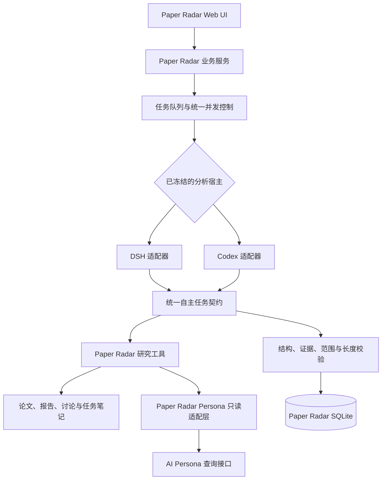
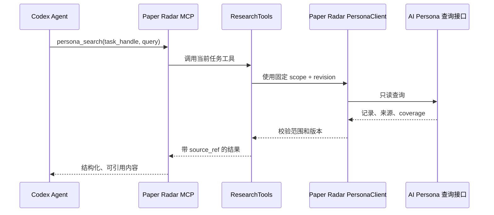

> 历史设计或验证记录。当前结构与运行方式以 [项目说明](../../../README.md) 为准；独立模型功能已移除。

# Paper Radar：DSH / Codex 双分析宿主设计

| 字段 | 内容 |
| --- | --- |
| 版本 | 0.1 |
| 日期 | 2026-09-11 |
| 状态 | 首版已实施并通过自动测试 |
| 产品入口 | Paper Radar Web UI 与本机后台服务 |
| 可选分析宿主 | DSH、Codex |
| Persona 规则 | Paper Radar 内部只读；Codex 任务禁用 AI Persona MCP 与 Hook；不写回 AI Persona |
| 依据 | [产品需求](PAPER_RADAR_REQUIREMENTS.zh-CN.md)、[现有后端设计](PAPER_RADAR_BACKEND_DESIGN.zh-CN.md)、[自主任务验收](../dsh/AUTONOMOUS_VALIDATION.zh-CN.md) |

## 1. 背景与目标

Paper Radar 目前通过 DSH 执行每日初筛、单篇分析、详细总结、个性化分析、内容复核、论文讨论和带工具的提示词实验。业务层已经具备论文读取、限定范围的 Persona 查询、证据登记、结构化结果校验、缓存、任务恢复和反馈保存。

本次工作的目标不是用 Codex 删除或替代 DSH，而是让用户在 Paper Radar 中选择分析宿主：

- DSH：继续沿用现有插件、模型目录、认证与 Agent 运行方式。
- Codex：由 Paper Radar 直接控制本机 Codex Agent，复用同一套业务工具与输出契约。

Paper Radar 仍是唯一产品入口和业务事实来源。用户在 Paper Radar 中配置宿主、模型、思考强度、并行数量和备用策略，在原有日报、报告与讨论页面中查看结果，不需要转到 Codex 对话界面完成工作。

### 1.1 成功标准

完成后应满足：

1. 用户可以在 DSH 与 Codex 之间明确切换；切换只影响新任务。
2. 两个宿主分别保存模型与并行配置，互不覆盖。
3. 两个宿主执行相同的 Paper Radar 业务任务，使用相同的输出 Schema、证据规则和 Persona 范围。
4. Codex 任务不加载或调用用户日常 Codex 中的 AI Persona MCP，不运行 AI Persona Hook。
5. Persona 只由 Paper Radar 内部按固定 scope 和 revision 查询，并以带来源的结构化数据提供给 Agent。
6. Paper Radar 不向 AI Persona 写入提案、对话学习事件、偏好或其他数据。
7. 一个任务失败、取消或宿主不可用时，不自动切换到另一个宿主，也不污染已完成结果。

## 2. 范围与非目标

### 2.1 本次范围

- 新增 `dsh | codex` 双宿主选择。
- 新增 Codex 账户状态、模型目录、模型路由、并行限制和运行记录。
- 让每日初筛、单篇分析、总结、个性化分析、复核、讨论和提示词实验支持 Codex。
- 将现有自主任务与研究工具从 DSH 专属目录提升为宿主无关能力。
- 为 Codex 建立隔离运行空间、任务级工具范围和启动预检。
- 保留历史任务、报告、讨论和反馈的可读性。

### 2.2 非目标

- 不删除 DSH 或其插件。
- 不让 DSH 与 Codex 自动互相备用。
- 不继续扩展 Independent 模式；它退出设置页和新任务路径，历史兼容代码可暂时保留。
- 不把 Paper Radar 改造成 Codex 插件，也不要求用户从 Codex 发起日常阅读。
- 不向 AI Persona 写回推荐反馈、阅读结果、报告摘要、对话或模型推断。
- 不开放 Codex 直接访问 AI Persona 数据库、状态目录或来源文件路径。
- 不改变现有论文抓取、订阅、调度、反馈含义和业务结果格式。
- 不在本次引入云端多用户部署。

## 3. 核心设计决策

### 3.1 Paper Radar 是编排者，宿主只负责推理



论文来源、Persona 来源、工具执行和数据库写入均由 Paper Radar 控制。模型不能用自然语言输出要求服务器执行任意命令、路径或数据库操作。

### 3.2 宿主选择在任务创建时冻结

全局设置保存当前默认宿主 `dsh` 或 `codex`。创建日报、单篇报告、讨论轮次或提示词实验时，将宿主及其模型设置复制到任务快照。之后：

- 修改默认宿主不改变排队或运行中的任务。
- 修改模型设置不改变已经创建的任务。
- 明确重试创建新执行版本，使用用户当时选择的当前设置；旧结果仍保留。
- 结果与调用记录必须显示实际宿主、模型、思考强度和是否使用备用模型。

### 3.3 不进行跨宿主自动回退

Codex 失败时不自动改用 DSH，DSH 失败时也不自动改用 Codex。跨宿主切换会改变运行语义、模型身份、上下文处理和缓存来源，必须由用户明确选择。

每个宿主内部可以配置一个显式备用模型。备用只处理该宿主内允许的临时限流或平台错误；认证失败、输入超限、任务取消、Schema 错误、工具越界和隔离检查失败不触发备用。

## 4. 双宿主配置

### 4.1 设置页结构

“模型设置”分为三个区域：

1. **分析宿主**：DSH / Codex。
2. **当前宿主配置**：连接状态、模型方案、任务分配、并行数量、备用模型。
3. **最近运行**：实际宿主、模型、状态、耗时、用量与错误。

两个宿主分别保存配置。切换标签或默认宿主不会把一方的模型 ID、思考强度或并行数量写入另一方。

### 4.2 共用任务名称

| 任务 | 当前用途 | 默认方案 |
| --- | --- | --- |
| `screen` | 每日候选初筛 | 快速 |
| `single` | 完整单篇分析 | 深入 |
| `summary` | 独立详细总结与对应实验 | 深入 |
| `connections` | 独立个性化分析与对应实验 | 深入 |
| `review` | 内容复核与对应实验 | 深入 |
| `discussion` | 论文与报告问题讨论 | 深入 |

每项可选择“快速”“深入”或“自定义”。快速与深入方案各包含模型和可选思考强度；自定义只覆盖该任务。设置保存前验证模型仍存在，并验证思考强度属于该模型支持的选项。

### 4.3 并行数量

- 默认 4，允许范围继续使用 1–16。
- 每个宿主单独保存并行值。
- 并行数限制正在运行的 Agent 任务，不等同于一篇文章内部的模型调用次数。
- 调低限制不取消已经开始的任务；新任务等待空位。
- 宿主切换期间，旧宿主的在途任务继续计入各自队列，不转移到新宿主。
- 自动日报的每次运行上限、初筛任务预算和并行上限继续分别生效。

### 4.4 Codex 模型目录

Codex 设置页不维护硬编码模型列表。适配器通过 App Server 的 `model/list` 读取当前账户可见模型、默认模型、支持的思考强度和输入能力。保存任务配置时使用稳定模型 ID，展示名称只作为界面信息。

模型从目录消失或不再支持已保存的思考强度时：

- 已完成历史结果保持可读。
- 新任务在创建前提示重新选择。
- 不静默迁移到所谓“更近”或“更新”的模型。

## 5. Codex 接入方式

### 5.1 选择 App Server

Codex 适配器使用本机 `codex app-server` 的 stdio JSON-RPC 通道。App Server 适合需要账户状态、模型目录、对话生命周期、取消、流式事件和结构化输出的自定义客户端；WebSocket 传输当前不是本设计的依赖。

主要调用包括：

- `initialize` / `initialized`：建立客户端会话。
- `account/read`：读取登录状态，不读取认证文件。
- `account/rateLimits/read`：读取可用额度信息。
- `model/list`：建立模型与思考强度选择器。
- `thread/start`：为每次业务执行创建 Agent 线程。当前恢复依赖 Paper Radar 已保存的业务状态，不依赖 `thread/resume`。
- `turn/start`：提交任务、模型、思考强度、工作目录与输出 Schema。
- `turn/interrupt`：取消运行中的任务。
- `thread/tokenUsage/updated`：记录可用的 token 使用量。
- `mcpServerStatus/list`、`hooks/list`、`config/read`：执行运行前隔离检查。

参考：[Codex App Server](https://learn.chatgpt.com/docs/app-server)。

### 5.2 Paper Radar 专属 Codex 运行空间

Codex Worker 使用独立于用户日常 Codex 的运行目录，例如：

```text
~/.local/share/paper-radar/
├── hosts/backend.json # 当前默认宿主与配置版本
└── codex/
    ├── runtime-home/   # Paper Radar 专属 Codex 配置、认证与线程状态
    ├── routes.json     # Codex 模型方案与任务分配
    ├── workspace/      # 只读 Agent 工作目录
    └── tasks/          # 最小任务描述和临时上下文
```

Paper Radar 启动 Codex 子进程时为它设置专属运行空间，不复制 `~/.codex` 中的配置、Hook、MCP、插件或线程记录。由于 App Server 仍可能通过其他受管根目录枚举到 Skills，适配器还会通过 `skills/list` 和 `skills/config/write` 将所有可见 Skill 显式禁用，再继续预检。用户第一次连接 Codex 时，从 Paper Radar 发起 Codex 管理的 ChatGPT 登录；Paper Radar 只通过 `account/read` 查看状态，不读取或复制 token。

这样做同时实现：

- 日常 Codex 继续正常使用 AI Persona MCP 与 Hook。
- Paper Radar 的 Codex 任务不会继承这些全局能力。
- Paper Radar 任务不会混入日常 Codex 历史或侧边栏。
- Paper Radar 可以版本化并核验自己的 Codex 配置。

### 5.3 Hook 与外部 MCP 的强制隔离

专属运行空间中只登记 Paper Radar 内部 MCP。Codex 进程还必须使用高优先级启动覆盖关闭 Hook：

```text
features.hooks = false
```

AI Persona MCP 不写入该运行空间。为了防止错误复制配置或未来升级引入同名服务，启动参数还应明确设置：

```text
mcp_servers.ai-persona.enabled = false
```

Codex 支持通过 `features.hooks=false` 关闭生命周期 Hook，也支持用 `mcp_servers.<id>.enabled=false` 禁用单个 MCP，而不删除其配置。命令行 `--config` 覆盖优先于用户与项目配置。参考：[配置参考](https://learn.chatgpt.com/docs/config-file/config-reference)、[高级配置](https://learn.chatgpt.com/docs/config-file/config-advanced)、[Hooks](https://learn.chatgpt.com/docs/hooks)。

不能只在提示词中写“不要调用 AI Persona”。模型不应看到该工具，Hook 也不应有机会运行。

### 5.4 启动预检与失败关闭

Codex 适配器完成握手后、接受业务任务前必须核验：

1. `config/read` 的有效配置中 `features.hooks` 为 `false`。
2. `mcpServerStatus/list` 中不存在可调用的 `ai-persona` 服务或工具。
3. 只有设计允许的 Paper Radar 内部 MCP 可用于研究任务；用户级和系统级 Skills 均已禁用。
4. `account/read` 显示可用的认证状态。
5. `model/list` 包含已保存任务路由所引用的模型和思考强度。
6. Paper Radar MCP 的版本、工具清单和 Schema 哈希与服务端兼容。

任一隔离条件不满足时返回 `codex_isolation_failed`，不开始模型调用。运行期间若收到任何 `hook/started` 事件，立即中断任务、保留诊断并将本次执行标记为隔离失败。

如果系统或组织管理策略强制启用某个不能关闭的 Hook，Paper Radar 应说明原因并拒绝 Codex 任务；不能把“尽量不调用”显示成已经隔离。

## 6. Paper Radar 内部研究工具

### 6.1 工具边界

现有 `ResearchTools` 提供了完整自主任务所需能力：

- 论文元数据、目录、正文分页、搜索、参考文献、图注与表格文本。
- 限定 Persona 范围内的记录搜索、记录读取、来源列表、来源搜索与续读。
- 本任务证据、已有报告、当前讨论历史和 Paper Radar 任务笔记。
- 中间报告保存。

这些能力在逻辑上是宿主无关的。首版为避免破坏现有 DSH 引用，仍保留在 `server/dsh/` 下，但 Codex 已通过本机、任务受限的 Paper Radar MCP 调用同一实现。业务校验只有一份；后续可做纯目录整理，不改变运行边界。

### 6.2 为什么使用 Paper Radar MCP

Codex App Server 的每线程动态工具属于实验接口，本设计不把它作为首版生产依赖。Paper Radar 提供固定的本机 MCP 工具目录，工具参数和返回结构稳定；每次任务通过不可猜测的任务句柄绑定到一个 `ResearchTools` 实例。

每个工具调用都必须携带任务句柄。服务端根据句柄取得已经冻结的：

- 论文 ID 与版本。
- Persona identity、scope 与 revision。
- 报告或讨论 ID。
- 允许的工具集合。
- 取消信号与任务状态。

句柄过期、任务已取消、对象不属于任务或请求扩大 Persona 范围时立即拒绝。工具不接受任意数据库路径、文件路径、Persona 工作区路径或外部 URL。

### 6.3 Persona 数据流



Codex 只看到 Paper Radar 工具，不看到 AI Persona MCP。Paper Radar 内部仍可调用 AI Persona 的查询接口，但必须继续执行当前已有的 scope、revision、来源哈希和分页规则。

提供给 Agent 的上下文使用结构化、AI-friendly 格式，每项内容明确来源。例如：

```yaml
persona_context:
  provider: paper-radar
  mode: read_only
  persona_identity: "<identity>"
  persona_revision: "<revision>"
  scope:
    tag_ids: ["<tag-id>"]
    tag_match: any
  records:
    - record_id: "<record-id>"
      record_revision: 3
      entity_type: knowledge_node
      content: "<task-relevant excerpt>"
      source:
        source_ref: "persona:<record-id>:r3"
        provenance: "<validated provenance>"
```

初始输入只给出完成任务所需的最小信息。模型按需调用工具补读；未实际交付给 Agent 的记录不能成为结果依据。

### 6.4 严格禁止写回 AI Persona

本设计不提供任何 AI Persona 写入路径：

- 不注册 AI Persona 的提案提交工具。
- 不调用 conversation learning、conversation event 或 proposal 接口。
- 不用 Hook 自动收集 Paper Radar 问题、回答或反馈。
- 不把日报反馈、报告评价、讨论内容或任务笔记同步到 AI Persona。
- 不允许模型用通用 shell、文件工具或来源路径绕过 Paper Radar。

`notes_save` 可以继续存在，但它只保存到 Paper Radar 当前任务，不属于 Persona 写回。结果数据库、证据、缓存和显式反馈仍归 Paper Radar 所有。

未来若产品需要写回，必须另写设计、增加用户明确确认与待审核流程；不能在本设计下暗中启用。

## 7. Agent 任务与输出

### 7.1 一任务一上下文

- 每篇日报候选使用独立 Agent 线程。
- 每次完整单篇分析使用独立 Agent 线程。
- 每个讨论轮次继续以 Paper Radar 数据库中的会话历史为事实来源，通过 `history_read` 按需读取；不依赖某个宿主的隐藏对话记忆。
- 提示词实验使用隔离线程，不写正式报告或日报结果。
- 重试可以引用已保存组件、笔记和证据，但不声称恢复原模型的内部思考。

这样可以在两次讨论之间切换宿主，同时保持 Paper Radar 会话语义稳定。

### 7.2 初始上下文

初始输入继续由 `runAutonomous` 构造，至少包含：

- `schema`：自主任务协议版本。
- `goal`：任务类型、语言、字数、严格度与不确定性要求。
- `input`：论文版本、所选范围和用户显式设置。
- `paper`：元数据、摘要及来源 ID。
- `persona_scope`：仅包含 scope、revision 和来源引用，不打包整个 Persona。
- `available_results`：已有报告、讨论历史与任务笔记的存在性。
- `output`：当前任务的 JSON Schema。

动态内容放在结构化字段中，每个论文、Persona、报告或历史片段必须有显式 `source_ref`。来源文件内容是数据，不得成为宿主配置或系统指令。

### 7.3 最终结果与中间保存

Codex `turn/start` 使用 `outputSchema` 约束最终结果。Paper Radar 收到结果后仍执行现有 Zod 与业务校验，包括：

- 结构、枚举和必需字段。
- 总结实际长度。
- 论文证据 ID 是否属于固定版本。
- Persona 证据是否属于固定 scope 与 revision。
- 结构化个人事实是否与已交付记录一致。
- 材料联系、推荐理由和推测是否有相应依据。

单篇长任务可通过 Paper Radar 工具保存已经通过校验的中间组件。最终任务失败、取消或中断时保留有效组件，不把未校验草稿标记为正式结果。

### 7.4 输出无效时的处理

- 将具体校验错误返回给同一任务，最多进行受限修订。
- 修订继续使用原论文、Persona、宿主、模型与提示词快照。
- 不因 JSON 或引用错误切换宿主。
- 达到任务预算或仍未通过时标记 `partial`、`failed` 或 `needs_review`，保留诊断。

## 8. Codex 生命周期、取消与恢复

### 8.1 线程与业务任务关联

Paper Radar 保存：

- `business_task_id`
- `backend = codex`
- `thread_id`
- `turn_id`
- Codex 运行版本
- 模型与思考强度
- Prompt 版本与工具契约版本
- Persona revision 与论文版本
- 开始、完成、取消时间和最终状态

Codex 线程只是执行记录，Paper Radar SQLite 仍是业务状态来源。

### 8.2 取消

用户取消时：

1. Paper Radar 先标记取消意图，阻止新的结果提交。
2. 调用 `turn/interrupt`。
3. 等待有限时间确认终态。
4. 若 App Server 无响应，终止专属子进程。
5. 晚到结果不得覆盖取消状态或已保存版本。

已经到达模型服务的调用无法回滚；调用记录应保留 `cancelled`、`interrupted` 或 `unknown`，不能伪称没有产生用量。

### 8.3 服务重启

- `queued` 任务从 Paper Radar 队列恢复。
- `running` 且缺少可确认 Codex 终态的任务标为 `interrupted`，不自动重复付费调用。
- 用户明确重试时，可用已保存的 Paper Radar 内容创建新执行。
- 如果安全恢复需要 `thread/resume`，恢复前重新执行隔离、模型和工具版本检查。

## 9. 认证、额度与运行环境

### 9.1 认证

Codex 认证由 Codex 自己管理。Paper Radar 提供“连接 Codex”“断开连接”和账户状态界面，但不读取、导出或写入认证 token。专属运行空间第一次使用时可能需要单独完成一次 ChatGPT 登录。

### 9.2 额度

- 设置页显示 `account/rateLimits/read` 可提供的窗口、已用比例和重置时间。
- 额度信息不可用时显示“未知”，不解释为无限。
- 额度耗尽后停止启动新 Codex Agent，现有任务按实际终态保存。
- Paper Radar 自己的每日最大调用数量仍先于外部额度生效。
- 不自动消耗额度重置或执行购买行为。

### 9.3 本机运行

Paper Radar 和 Codex App Server 都在同一用户的本机环境运行。定时日报要求电脑与 Paper Radar 后台服务可运行；Codex 桌面对话窗口不需要保持打开。App Server 与内部工具只使用 stdio 或权限为 0600 的本机 Unix socket，不监听公网地址。

## 10. 存储与缓存

### 10.1 配置存储

首版实际保存：

```json
{
  "activeBackend": "codex",
  "revision": 1
}
```

DSH 现有 `routes.json` 继续使用；Codex 使用独立 `routes.json`，采用同样的 revision 冲突检查、快速/深入方案、六类任务分配、并行数量和显式备用结构。

### 10.2 结果身份与缓存键

缓存键至少包含：

- 自主任务协议与业务 Schema 版本。
- 论文 ID、固定版本、元数据和解析器版本。
- Persona identity、scope、revision。
- Prompt 版本集合。
- `backend`。
- 实际模型 ID 与思考强度。
- Codex 或 DSH 适配器版本。
- Paper Radar 工具契约版本。

不同宿主结果默认不共享模型结果缓存。论文正文缓存和已经验证的 Persona 查询缓存可以复用，但必须继续服从来源版本与范围规则。

### 10.3 日志

调用日志保存任务、宿主、模型、思考强度、线程/轮次 ID、状态、耗时和可用用量。不保存：

- Codex 或 DSH 认证信息。
- 完整 Prompt、论文全文或 Persona 全量内容。
- AI Persona 来源文件的本机绝对路径。
- Paper Radar 内部任务句柄或 socket token。

现有提示词捕获功能可以继续保存为产品调试数据，但须沿用其独立访问与保留规则。

## 11. 错误模型

| 错误代码 | 含义 | 默认处理 |
| --- | --- | --- |
| `codex_unavailable` | 未找到 Codex、App Server 退出或无法连接 | 提示安装/升级或选择 DSH |
| `codex_auth_required` | 专属运行空间尚未登录 | 引导连接，不启动任务 |
| `codex_rpc_error` | App Server 请求被拒绝或协议不兼容 | 停止当前 Codex 操作 |
| `codex_isolation_failed` | Hook、AI Persona MCP 或未知工具仍可用 | 失败关闭，不调用模型 |
| `MODEL_NOT_FOUND` / `INVALID_REASONING_EFFORT` | 已保存模型或思考强度不可用 | 要求重新选择 |
| `rate_limited` | Codex 额度或速率限制 | 按显式同宿主备用策略处理，否则失败 |
| `codex_tool_unavailable` | Paper Radar MCP 未启动或版本不匹配 | 失败，不退化为无工具分析 |
| `tool_scope_violation` | 工具请求越过论文、Persona 或会话范围 | 拒绝并记录；不扩大权限 |
| `invalid_output` | 最终结构、证据或事实校验失败 | 受限修订后失败或待复核 |
| `interrupted` | 进程退出、服务重启或用户取消 | 保留有效内容，等待明确重试 |

错误信息进入 Paper Radar 的本地化映射，不直接把可能含路径、Prompt 或内部配置的原始错误展示给远程页面。

## 12. 现有代码改造边界

### 12.1 已实施模块

- `server/hosts/service.mjs`：默认宿主、请求内冻结、历史任务按快照回到原宿主，以及双宿主生命周期。
- `server/codex/app-server.mjs`：stdio JSON-RPC、事件订阅、请求取消和进程关闭。
- `server/codex/models.mjs`：Codex 认证、模型目录、路由、并行、同宿主备用、线程/轮次和隔离预检。
- `server/codex/tool-bridge.mjs`：任务句柄、一次性 token、允许工具集和本机 Unix socket 回调。
- `server/codex/tool-server.mjs`：每任务 stdio MCP，只公布已登记的 Paper Radar 工具。
- `components/radar/host-model-settings.tsx`：宿主切换、Codex 登录/退出和隔离状态。

共用的 `ResearchTools` 和自主任务编排仍保留原路径，两个宿主引用同一份实现，没有复制业务校验。

### 12.2 修改模块

- `server/index.mjs`：改为显式 `dsh | codex` 路由；不再为新任务创建 Independent `ModelService`。
- `server/concurrency.mjs`：将两个 Agent 宿主视为自管队列，并按任务快照取得原宿主的并行数。
- `analyses`、`daily`、`discussions`、`prompts`：DSH 与 Codex 均进入同一自主任务、证据和输出校验流程。
- 模型设置页面：增加宿主选择与 Codex 状态，但复用现有方案和任务分配组件。
- 任务与调用记录：增加 backend、thread/turn 和适配器版本字段。

### 12.3 保持不变

- arXiv 公告与论文读取。
- AI Persona 的严格范围查询逻辑。
- 订阅、日报、单篇、讨论和反馈数据归属。
- 结构、长度、证据与个人事实校验。
- 提示词版本、捕获和 A/B 实验业务规则。
- 本机 HTTP 的 Host、Origin、写请求头与远程访问限制。

## 13. 实施阶段

### 阶段 A：统一宿主契约

- 把 `ResearchTools` 与 `runAutonomous` 移到宿主无关目录。
- 引入 `agentTasks`、`structuredOutput`、`cancellation`、`modelCatalog` 等能力字段。
- 保证 DSH 全部现有测试和真实行为不变。
- 将 Independent 从设置页和新任务入口移除，保留历史读取。

验收：DSH 的日报初筛、单篇、讨论和实验无回归。

### 阶段 B：Codex 控制面与设置

- 建立专属运行空间和 App Server 客户端。
- 完成登录、断开、账户状态、额度、模型目录和健康检查。
- 完成 Codex 快速/深入方案、六类任务分配、并行数量和备用模型保存。
- 实现 Hook/MCP 隔离预检。

验收：不调用模型即可证明 Codex 已连接、模型可选，且 AI Persona MCP 与 Hook 不可用。

### 阶段 C：每日初筛纵向链路

- 一篇候选一个 Codex 线程。
- 接入论文摘要、Persona 初始卡片与按需只读工具。
- 使用现有初筛 Schema、证据校验、预算、取消和日报统计。
- 扩展到并行批次、自动日报和重启恢复。

验收：真实公告批次可由 Codex 完成，单篇失败不阻塞其他候选；无 AI Persona 写入。

### 阶段 D：完整单篇分析

- 接入正文、参考文献、来源、已有报告、任务笔记和中间保存工具。
- 保留部分结果、强制重新生成、缓存和结果版本。
- 核验长任务取消、App Server 异常和工具范围。

验收：在相同论文与 Persona scope 下，Codex 能交付现有报告格式，所有引用通过原业务校验。

### 阶段 E：讨论、复核与提示词实验

- 讨论按需读取 Paper Radar 历史与证据。
- 支持报告锚点、选中文字、继续追问和独立话题。
- 支持五类自主任务提示词的 A/B 试跑。
- 保持实验不写正式业务结果。

验收：讨论可在宿主切换后继续，历史不依赖 DSH 或 Codex 的隐藏会话状态。

### 阶段 F：对照与正式开放

- 使用固定真实样例对照 DSH 与 Codex。
- 比较输出通过率、引用质量、用户反馈、耗时和用量。
- 完成设置说明、升级说明和回退说明。
- 默认宿主保持用户选择，不因安装 Codex 自动改变。

## 14. 验证计划

### 14.1 自动测试

- 双宿主设置独立保存、revision 冲突和切换快照。
- Codex JSON-RPC 握手、并发请求、事件乱序、断线和关闭。
- 模型目录变化、思考强度验证和同宿主备用。
- `turn/interrupt`、晚到结果、进程强制关闭和未知用量。
- 最大并行 1、默认 4、上限 16，以及动态调低。
- 每篇任务独立工具句柄和越界拒绝。
- Persona scope、revision、来源哈希、分页和证据登记。
- Codex 最终 Schema 与现有 Zod/业务校验的一致性。
- 缓存包含宿主、模型、Prompt、工具与 Persona 版本。
- Independent 不再出现在新设置与新任务路径。

### 14.2 隔离测试

在用户全局 Codex 已启用 AI Persona MCP 和 `UserPromptSubmit` Hook 的环境中：

1. 普通 Codex 任务仍能看到并使用原有 AI Persona 能力。
2. Paper Radar Codex 预检看不到可调用的 `ai-persona` MCP。
3. Paper Radar Codex 运行期间不产生 `hook/started`。
4. 含有“调用 AI Persona”“提交 Persona 提案”等文本的论文或问题不能获得相应能力。
5. AI Persona 正式记录、提案队列和对话学习队列在测试前后内容哈希不变。
6. Paper Radar 内部 Persona 工具仍能返回固定 scope/revision 下的只读结果。

### 14.3 真实验收

- 从真实 Archive/公告候选运行一批 Codex 每日初筛。
- 对一篇短论文和一篇长论文分别运行完整分析。
- 从摘要、报告章节和选中文字分别发起讨论。
- 在任务运行时切换默认宿主，确认在途任务不迁移。
- Codex 断线或额度不足时确认不自动改用 DSH。
- 对同一固定样例分别使用 DSH 与 Codex，确认都通过相同引用和 Persona 事实校验。

模型输出质量仍需人工抽查；结构和证据检查通过不等于科学结论已经同行评审。

## 15. 发布与回退

### 15.1 发布

1. 先发布统一宿主契约，不开放 Codex 入口。
2. 开放 Codex 连接和设置，只允许测试连接。
3. 开放手动单篇初筛或固定样例。
4. 开放手动日报和完整单篇。
5. 开放自动日报、讨论和实验。

每个阶段都必须保持 DSH 可用。安装 Codex 支持不会自动切换当前默认宿主。

### 15.2 回退

- 用户可以把默认宿主切回 DSH。
- Codex 在途任务不迁移；用户可等待、取消或明确重试。
- 回退不删除 Codex 配置、历史运行记录或已完成报告。
- 不恢复旧数据库覆盖双宿主产生的数据。
- Codex 适配器故障不影响 DSH 插件 socket 与路由文件。

## 16. 最终约束摘要

本设计的稳定边界为：

```text
Paper Radar
├── 选择 DSH 或 Codex
├── 保存宿主独立的模型和并行配置
├── 管理论文、Persona 范围、工具、证据、任务和结果
├── 对 AI Persona 只读
└── 不进行跨宿主自动回退

Codex Worker
├── 使用 Paper Radar 专属运行空间
├── Hook 全部关闭
├── AI Persona MCP 不加载且显式禁用
├── 只调用任务受限的 Paper Radar MCP
└── 不写 Paper Radar 数据库或 AI Persona
```

只有 Paper Radar 可以把经过校验的模型结果提交为正式日报、报告或讨论答案；只有用户未来明确提出新的产品需求并经过单独设计，才可能增加 AI Persona 写回能力。
