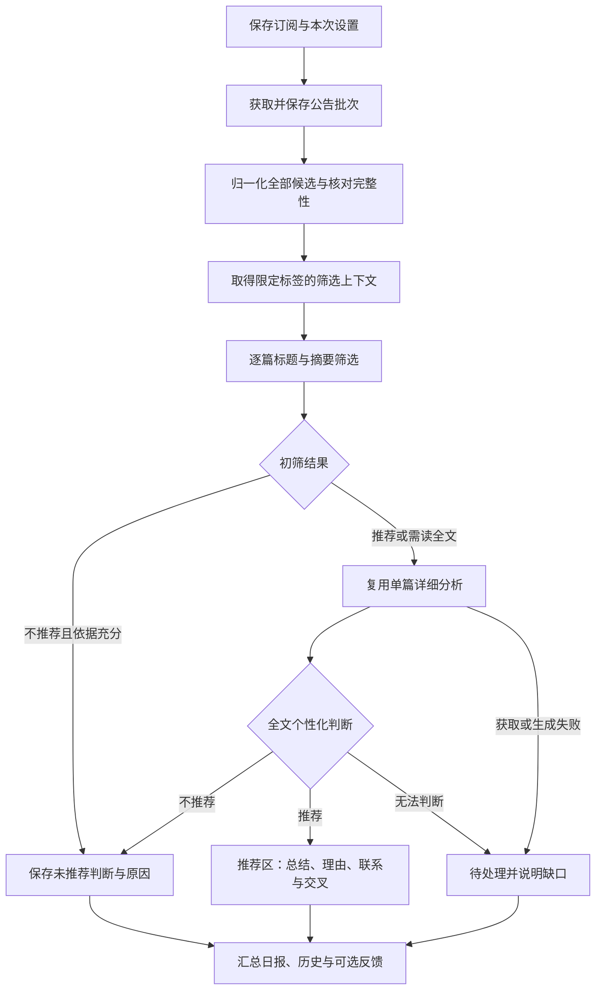

> 历史设计或验证记录。当前结构与运行方式以 [项目说明](../../../README.md) 为准；独立模型功能已移除。

# Paper Radar 每日推荐设计

| 字段 | 内容 |
| --- | --- |
| 版本 | 0.1 |
| 日期 | 2026-09-07 |
| 状态 | 设计基线；D1 实现与验证见[运行说明](../web/DAILY_RECOMMENDATIONS.md)，D2/D3 仍为规划 |
| 首个交付 | 保存真实订阅，手动生成一个完整 arXiv 公告批次的个性化日报 |
| 运行方式 | 现有本机 Node.js 服务、SQLite、Web UI |
| 依据 | [产品需求](PAPER_RADAR_REQUIREMENTS.zh-CN.md)、[总体后端设计](PAPER_RADAR_BACKEND_DESIGN.zh-CN.md)、[单篇分析实现与验收](../web/SINGLE_ANALYSIS.md) |

**2026-09-07 需求变更说明：**[产品需求 v0.4](PAPER_RADAR_REQUIREMENTS.zh-CN.md)新增推荐严格度、用户主动触发的详细报告、论文与报告问题讨论，以及英文专业术语规范。本文保留 D1 的既有设计记录，其中“初筛推荐或不确定后自动派发全文”“全部推荐详情完成才算日报完成”等规则已被新目标取代，相关任务、恢复、预算、状态和验收设计已在实现补充中更新。新产品行为以需求 v0.4 为准，不能将本文的旧自动全文流程继续视为目标要求。


**v0.4 实现补充：**按需全文、独立状态与预算、严格度和讨论现已落实。当前执行规则、数据迁移与 API 见[按需分析与讨论实现说明](../web/ON_DEMAND_ANALYSIS_AND_DISCUSSION.md)，覆盖本文旧 D1 自动全文和父子预算相关规则。

## 1. 目标与设计边界

用户保存 subject、允许使用的 Persona 标签、输出语言和总结字数范围后，系统收集对应范围的每日论文，为全部候选做出判断。用户能够查看推荐和未推荐两部分；推荐论文提供详细总结、推荐理由、已有材料联系和潜在交叉，并能核查依据。

每日推荐在 Paper Radar 中实现。AI Persona 继续提供标签、个人知识和材料的只读范围接口，不承担订阅、论文抓取、筛选、任务调度或反馈保存。

本文中的“必须”来自已确认需求或实现这些需求所需的工程约束；“首版建议”是为实施提出的默认规则，不将此前待讨论的产品选项改写为用户已确认的决定。尤其是空标签、新版本、作者优先关系和推送渠道，见第 15 节。

### 1.1 已确认的要求

- 依据用户所选 arXiv subject 筛选每日论文，推荐与未推荐结果均可查看。
- 筛选和个性化解释只使用用户所选 Persona 标签内的内容；论文自身元数据和正文不受此限制。
- 支持中文、英文，以及用户设置的研究总结字数范围；总结应说明文章具体做了什么。
- 推荐理由、材料联系和交叉方向分别呈现；没有可靠联系时允许为空。
- 只记录四项可选反馈：推荐准确性、总结满意度、推荐理由满意度、联系与交叉满意度；负反馈理由也可留空。
- 不增加阅读状态，不根据点击、停留、未阅读或未反馈推断偏好。
- 关注作者的新文章提醒仍属于完整产品要求，可在每日 subject 流程之后交付。
- 模型理解能力不足时优先更换更强模型复测，不为小模型增加复杂纠错系统。
- 自动日报先检查 arXiv 公告来源是否更新；来源与上一次相同，仅记录检查，不启动新的日报分析或模型调用。发现实际更新后仍遵守候选规则、去重及运行额度限制；本机自动调度已实现，详见[自动日报实现说明](../web/AUTOMATIC_DAILY.zh-CN.md)。

### 1.2 交付顺序

| 阶段 | 用户获得的能力 | 范围 |
| --- | --- | --- |
| D1：手动真实日报 | 保存订阅，点击生成最新公告批次，查看全部候选和真实分析 | 本次优先实现的完整纵向流程 |
| D2：自动运行 | 配置时间与时区，后台定时检查新批次，断线或重启后恢复与补处理 | 在 D1 上补充调度和历史覆盖 |
| D3：作者与通知 | 关注作者动态、已选择渠道的消息投递 | 单独明确身份匹配、优先关系和渠道 |

D1 必须包含持久化、幂等、部分失败、范围隔离和可恢复任务，不能用演示结果替代缺失环节。D1 完成不表示作者提醒或自动推送已经完成。

## 2. 当前基础与实际缺口

设计开始时，每日页面、订阅和作者数据仍是浏览器演示。单篇真实分析已经具备论文读取、模型调用、Persona 检索、结果保存、反馈和基本校验。下表记录实施前基础；D1 的实际模块和接口见运行说明。

| 模块 | 已有实现 | 每日流程需要增加 |
| --- | --- | --- |
| 模型接入 | Pi 适配、多平台连接、默认路由及任务覆盖、取消和请求记录 | 使用已有 `screen` 路由，关联日报和候选，统计整批实际请求 |
| 论文读取 | `server/analyses/arxiv.mjs`：单篇版本、HTML/PDF、来源缓存 | 公告 feed、批次存档、候选元数据、去重及完整性检查 |
| Persona | `server/analyses/persona.mjs`：严格 scope、revision、材料证据 | 为筛选提供可复用的范围内记录快照，避免每篇重复扫描 |
| 详细分析 | `server/analyses/service.mjs`：单篇总结与个性化生成 | 内部提交日报子任务、固定模型设置、回传组件结果 |
| 数据库 | `server/analyses/database.mjs`：SQLite 版本 1，任务、结果、反馈、缓存 | 版本迁移、订阅、公告批次、日报、候选、筛选版本、调度记录 |
| 前端 | 单篇页面已接真实 API，日报页面仍使用示例 | 真实订阅、日报进度、日期历史、未推荐原因与失败重试 |
| 调度 | 单篇队列持久化；运行中任务重启后标记中断 | 每日触发、批次水位、补处理、父子任务恢复 |

现有单篇队列同一时刻执行一篇、排队上限 50；每篇最多 12 次实际模型请求、15 分钟执行预算。这些是单篇限制，不能直接作为整份日报的论文数或总时长限制。

已有 GPT-6 在两篇公开物理论文上的复测均完成，每篇四次模型请求、没有内容修订。这支持继续使用当前默认连接进行日报验收，但不能据此推算所有论文的耗时或筛选准确率，详见[单篇验收记录](../web/SINGLE_ANALYSIS.md)。

## 3. 用户流程与首版建议

### 3.1 保存订阅

支持多个独立订阅，每个订阅可选择一个或多个 subject。订阅内分类取并集，按基础 arXiv ID 去重；不同订阅可以分别使用不同标签、语言和总结长度。

订阅包含名称、subjects、Persona 连接与标签、语言、总结范围、启用状态及版本号。D2 再开放定时设置；D1 默认手动运行，不保存一个实际不会执行的“已启用定时”状态。

多分类实现采用 `subjects` 数组作为完整范围，去重排序后保存；兼容旧 `subject` 单值请求和历史数据，无需重写历史快照。各分类分别读取官方 ATOM，以最多三个来源并发的方式收集，保存每个来源修订及合并修订。合并仅纳入最新公告日期的来源；失败、日期不同或内容冲突会显示缺口并保留部分结果，全部来源失败则不生成空日报。同篇跨分类公告只初筛一次，并保留分类及版本来源。来源恢复后再次“生成最新一批”产生可追溯的新修订。

修改分类不会改变已有日报的不可变订阅快照。分类范围不一致时不能把旧批次按新范围重新筛选，应重新收集最新一批；只调整严格度等设置时仍可重筛兼容的历史批次。

subject 使用官方分类代码和名称，提供可搜索的分类列表；不继续只显示演示中的四个分类。后端验证代码，不接受任意 feed URL。标签从现有 Persona 接口取得，保存稳定 ID 和显示名称快照。

建议继续显式使用多标签并集 `tag_match: "any"`。每日个性化订阅在启用或运行前要求至少一个有效标签，空标签可以保存草稿，并提示补充范围。单篇的“无标签只生成总结”保持可用。未来通用推荐模式应单独定义判断标准，不把空标签解释成使用完整 Persona。

### 3.2 生成与查看日报

1. 用户选择订阅，点击“生成最新一批”。
2. 系统读取官方来源，确定实际公告日期和候选集合，并保存本次订阅、模型及来源快照。
3. 页面先显示真实候选数量，再显示已判断、待深入分析和失败数量。
4. 推荐论文逐篇完成详细分析；用户不必等整批结束才查看已完成内容。
5. 未推荐列表保留标题、作者、摘要入口、简短原因、判断依据和准确性反馈。
6. 用户可对未推荐论文点击“详细分析”，复用单篇功能。
7. 刷新或关闭页面不会取消任务；再次打开从后端恢复日报和任务状态。

历史按“公告批次”组织，同时展示实际生成时间。修改订阅不会改写历史日报；重做历史批次时生成新版本，明确选择使用原设置还是当前设置。

### 3.3 列表与统计

默认页面展示推荐和未推荐两个结果区域；未完成项放在独立处理区，而不是第三种推荐结论。

每个日报至少展示：

- 订阅、subject、公告日期、生成时间和所用 Persona 标签。
- 来源是否完整、纳入规则、新作/跨分类/更新数量。
- 候选总数、推荐数、未推荐数、未完成判断数。
- 推荐项中详细分析已完成、正在生成、需要重试的数量。
- 所用模型、实际请求数量、用量可用性和缓存命中情况。

列表中的简短概览与六节研究总结区分。推荐论文详情沿用单篇布局、证据入口、长度计数和四项可选反馈。

## 4. arXiv 每日候选发现

### 4.1 使用公告 feed 确定候选

首选官方 subject ATOM feed：

```text
https://rss.arxiv.org/atom/<subject>
```

arXiv 为活动 subject 提供 RSS 和 ATOM；多分类组合 feed 有 2000 条结果限制。因此首版逐 subject 获取、复用同一 subject 的抓取结果，不依赖组合 feed 返回全部内容。[官方 RSS 说明](https://info.arxiv.org/help/rss.html)

公告 ATOM 中的条目 `published` 表示本次公告日期，`arxiv:announce_type` 区分新作、更新和跨分类，`id` 含论文版本。`updated` 表示 feed 生成时间，不能直接作为论文提交或修改时间。解析器必须区分“公告 ATOM”和“搜索 API 的 Atom”，不能只因格式名称相同就共用日期解释。[官方 ATOM 格式](https://info.arxiv.org/help/atom_specifications.html)

保存来源 URL、获取时间、响应校验信息（若有 ETag/Last-Modified）、原始响应哈希、解析器版本及条目原始公告日期。按公告条目的日期分组，不用电脑的当天日期覆盖它；feed 顶层 ID 不假设每天唯一。

逻辑批次由 subject 和来源公告日期确定；在该批次下保存不可变来源修订。另计算归一化条目内容哈希，忽略 feed 生成时间和条目排序等非内容变化，避免来源每次重新生成就触发模型重跑。来源实际补充或更正论文时保存新修订，日报运行固定其使用的修订。

### 4.2 公告时间与空结果

arXiv 公告有工作周期和延后安排，提交时间不等于实际公开时间。因此，“过去 24 小时提交的论文”不能直接作为“今日公告”。[官方发布安排](https://info.arxiv.org/help/availability.html)

内部时间戳存 UTC；公告日期保留来源的日期及偏移，展示和调度使用明确时区。用户设置的运行时区与公告日期分开，不写死“北京时间今天”或固定 UTC 偏移。

必须区分以下情况：

| 情况 | 页面行为 |
| --- | --- |
| 来源可核验，本批次没有符合规则的候选 | 本批次没有新候选；可正常完成，模型请求为零 |
| 来源仍是已经处理过的旧批次 | 尚无新公告批次；链接到最近日报，不重复生成 |
| 来源未更新、日期不明确或解析为空但无法验证 | 等待来源更新或来源状态待核验 |
| 网络失败、限流、返回 HTML 错误页 | 抓取失败，可重试 |
| 该订阅尚未运行 | 尚未生成日报 |

不能用 HTTP 200 或空数组证明“今天没有论文”。空 feed 的批次归属需要可核验的来源信息；无法确认时保持未确定。

### 4.3 公告类型与去重

首版建议默认纳入首次发布和首次进入该 subject 的跨分类条目；更新及更新后跨分类单独保存、标记为“版本动态”，是否进入推荐分析由显式版本策略控制。

以下属于应用层归一化类型，实施时应以真实 feed 样本核对映射：

`new / cross / replace / replace_cross / unknown`

- 同一公告批次、同一订阅、同一基础 arXiv ID 只有一个候选，保留全部命中来源。
- 不按标题或 DOI 删除不同 arXiv ID 的记录；这些信息只能提示可能关联。
- 同一篇命中多个订阅，可以合并论文基础展示，但各订阅判断独立。标签或语言不同不得混用个性化内容。
- 先保存公告给出的明确版本，随后全文读取必须使用该版本。未知版本先补充元数据，不能永久使用“最新”别名。
- 同一批次出现版本冲突、未知类型或不一致元数据时保留问题，不静默挑一个版本完成处理。
- 更高版本是版本事件，不自动当作另一篇新论文；某订阅首次看到它，也不改变它在 arXiv 上的公告类型。
- 停用版本推荐不会把版本动态算成“未推荐”；来源总数与进入本次筛选的候选数分别报告。

### 4.4 完整性与补抓

抓取完整性是独立状态：

`pending / complete / incomplete / failed`

保存来源条目数、解析成功数、合并重复数、按策略排除数、未知条目数和最终候选数。若来源提供总数则核对；若没有，则记录完整性依据和可验证边界，不能虚构总数。

完整性检查至少包括：响应结构和日期可信、所有条目可解释、没有截断迹象、声明总数能核对、同一批次来源无未解决冲突。达到可能的返回上限、分页未结束或部分条目解析失败时不能标为完整。已取得的候选可以继续处理，但日报显示来源不完整。

搜索 API 可用于补充版本/分类元数据及按时间窗口恢复候选，分页须实际走完并记录 totalResults、start 和返回数量。大查询应拆小；本地继续采用共享串行限流、至少 3.1 秒间隔及退避，避免日报和单篇分别请求造成超限。[官方 API 手册](https://info.arxiv.org/help/api/user-manual.html)

D1 验收必须用真实 subject 的完整来源验证一批，而不只是读取前 N 条。实施前先核对当前 feed 的空批次、日期和容量行为；无法证明完整的来源不可作为“完整日报”验收样本。

补处理分两类：

1. **已保存公告来源**：按原始批次精确重放，可恢复当时的版本及公告类型。
2. **未保存的过去日期**：通过官方元数据等补查；只有能恢复公告归属和完整性才称为精确补跑。否则标为“补查候选，公告覆盖未确认”。

当前公告 feed 不能假设是历史档案。搜索 API 的提交/更新日期也不保证能重建历史公告列表。D2 必须持续保存抓取批次；长时间离线、feed 已轮换的情况明确报告覆盖缺口，不能承诺任意历史日期都能无遗漏恢复。

## 5. 从候选筛选到详细分析



### 5.1 筛选输入

每篇筛选仅输入：

- 标题、作者、摘要、分类、固定版本及元数据证据 ID。
- 选定标签范围内的兴趣、知识、材料元数据与相关记录证据。
- 本订阅的语言和明确筛选规则。

不在初筛阶段下载每篇全文，不对所有论文先生成长总结。作者姓名本身不能证明论文作者是用户，也不能绕过标签范围。

首版建议逐篇一次筛选请求，便于隔离失败和核对完整覆盖。之后若性能需要，可合并小批量请求；每篇仍必须有独立 ID、独立结果，输出条目集合须与输入完全一致。首版不引入多层模型投票、复杂评分权重或向量数据库。

### 5.2 筛选输出协议

新增 `screening.v1`，与现有 `analysis.v1` 分离。以下 ID 为占位符：

```json
{
  "paper_version": "2501.12903v3",
  "outcome": "needs_fulltext",
  "reason": "摘要中的测量动力学可能与所选材料有关，需要全文确认研究对象与适用条件。",
  "paper_evidence_ids": ["<metadata-abstract-evidence-id>"],
  "persona_evidence_ids": ["<scoped-record-evidence-id>"],
  "claims": [],
  "questions_for_fulltext": ["该方法能否用于所选材料讨论的系统？"]
}
```

`outcome` 允许 `recommended / not_recommended / needs_fulltext`。每项保存输入哈希、scope、Persona revision、模型、实际请求和协议/提示词版本。

判断规则：

- 初筛推荐表示值得进入详细分析；全文阶段可以改变判断。
- 只有能基于当前证据做出明确判断时才标为未推荐。
- 摘要不足、研究对象不明或相关性有实质不确定时进入全文，不把低置信度自动归为未推荐。
- 未检索到相关记录，不等于用户不感兴趣或不具备知识；解释必须限定为本次范围与检索覆盖。
- 不设置“每天必须推荐五篇”之类配额，不为了填满列表降低标准。
- 若任务范围内没有足够的个人依据，标记上下文不足；不盲目对全部候选启动全文生成，也不静默使用其他标签。

后端检查 JSON、枚举、候选 ID、证据存在性和结构化个人事实。证据格式或模型输出失败可以有限重试，最终仍失败则保存待处理项。首版不增加一套逐篇模型评审筛选的额外流水线；通过真实样本检查漏选，问题优先从模型能力与输入充分性定位。

### 5.3 复用单篇分析

初筛推荐和需要全文的候选进入现有单篇服务，使用日报保存的明确论文版本、标签、语言、长度及模型路由快照。

当前 `AnalysisService.create()` 会自行读取当时模型配置，并在全文读取后才获取 Persona。因此需要增加受信任的内部创建入口，携带日报任务来源和模型设置快照；不能只循环调用现有 HTTP 接口就宣称整批设置已固定。浏览器不能提交任意模型内部配置或证据文件路径。

第一版沿用单篇的六节总结、个性化判断、引用核验和有限修订。对于“需要全文确认”的论文，首版允许最终不推荐但已生成总结，以减少重构。若以后这部分成本明显，再考虑全文判定与长总结解耦。

2026-09-07 更新：列表归属由初筛决定，详细分析只补充报告和模型意见。用户主动分析表示希望继续了解论文，不得因为全文意见改变而把它从推荐列表移走。

| 情况 | 保存与展示 |
| --- | --- |
| 全文认为相关，总结及个性化均可用 | 原列表保留，完整报告与全文补充意见可查看 |
| 全文认为相关，总结失败或需核对 | 原列表保留，详细报告标记未完成，不影响初筛已完成状态 |
| 全文不推荐 | 原列表保留，单独展示相关性较弱的全文意见与依据 |
| 全文判断为 `undetermined` | 原列表保留，说明全文相关性仍不确定 |
| 全文阶段失败 | 原列表和初筛理由保留，可重试报告 |

初筛理由、证据和准确性反馈保持绑定初筛版本；全文报告及其意见、证据和反馈单独保存。数据库 v4 从不可变初筛版本恢复旧日报的列表归属，保留既有全文结论和所有内容。详细分析不推断或自动写入正面反馈。

### 5.4 字数与材料联系

沿用已实现的总结规则：默认 800–1200，当前可设置 `200 ≤ min < max ≤ 3000`；中文按非空白正文字符、英文按单词统计，不包含章节标题和推荐理由。数值是现有产品约束，可后续调整。

材料联系继续区分直接引用、共同问题和方法比较。仅凭摘要或同名标题不能生成“论文直接引用你的文章”；直接引用需要全文参考文献匹配。潜在交叉保持前提、待验证点和第一步检查，不声称全领域新颖。

## 6. AI Persona 接入

### 6.1 首版不需要新增核心上游接口

现有五个只读接口足以实现本机每日推荐：

| 接口 | 用途 |
| --- | --- |
| `list_tags` | 标签选择、名称与有效性检查 |
| `prepare_persona_context` | 在 scope 内准备当前筛选任务上下文 |
| `search_knowledge` | 分页读取范围内记录，按论文检索相关材料 |
| `get_persona_record` | 记录详情、关系和个人事实 |
| `get_material_source` | 全文分析所需材料来源与哈希 |

沿用后四项的 scope 与版本检查，以及连接身份校验。关联记录不扩大范围，不调用全局偏好接口，也不将反馈写回 Persona。

需要改造的是 Paper Radar 的适配层：将“范围内记录获取”和“按某篇论文选择证据”拆开。一个订阅运行期间可以复用已验证的范围内记录快照，再逐篇选取相关证据；不能将第一篇的关键词筛出的少数记录作为整天所有论文的个人上下文。

### 6.2 快照与版本语义

- 订阅配置和标签 ID 在日报运行中固定；标签排序规范化用于缓存。
- 初筛共享相同 scope、同一 revision 的记录快照，保留分页及读取覆盖情况。
- 当前最多扫描 1000 条记录等限制必须显式记录；超限时不能把未读取部分描述成不存在。若不足以支持可靠判断，相关项保持待处理。
- 详细分析继续使用单篇的按论文证据快照，每次读取都校验 revision、记录版本和来源哈希。
- Persona 不提供任意历史 revision 的读取。获取过程中版本变化，最多重新获取一次；持续变化则保留可重试问题。
- 每个初筛和全文结果分别保存其实际 revision。日报保存使用过的 revision 集合，不声称整天所有阶段都使用同一份历史 Persona。
- 全文获取到了新 revision 时，最终理由必须完整来自新的有效证据包；不能拼接旧初筛理由充当新结果的证据。
- 已完成的其他候选保留原判断及版本。若用户希望用最新材料重判整批，应创建新的日报运行版本。

缓存只在连接身份、scope、revision、读取覆盖和实际内容哈希均匹配时复用。不选标签不会退回全库；标签失效或连接中断时保留论文候选和已完成结果，暂停受影响的个性化阶段。

跨设备读取 Persona 原文、历史快照导出或大规模增量订阅可以在未来提出专门接口，均不是本机 D1 的前置条件。

## 7. 任务、状态与完整性

### 7.1 独立保存判断和处理状态

候选的核心字段：

| 字段 | 取值或含义 |
| --- | --- |
| `processing_status` | pending / screening / awaiting_analysis / analyzing / completed / failed / needs_review / paused / cancelled |
| `final_decision` | 初筛列表归属，兼容字段名：recommended / not_recommended / null |
| `decision_basis` | 初筛依据：abstract / null |
| `analysis_decision` | 全文补充意见：recommended / not_recommended / undetermined / null |
| `screening_version_id` | 初筛不可变结果引用 |
| `analysis_id` | 完整分析结果引用，可为空 |
| `details_status` | not_requested / queued / running / available / partial / failed |
| `error` | 失败阶段、受控错误码及能否重试 |

初筛列表的 `null` 表示初筛未完成或关联待确认；全文 `undetermined` 仅保存为补充意见，不改变初筛列表。处理失败与有无有效判断可以同时存在，例如已经确认推荐但总结失败。

对已收集、去重且符合纳入规则的候选，始终满足：

```text
候选总数 = 最终推荐数 + 最终未推荐数 + 尚未完成判断数
```

未知条目、排除的版本动态和来源缺失量单独统计，不通过改分类凑齐数量。

### 7.2 日报与运行

一份逻辑日报由“订阅 + 公告批次”标识，可以包含多次运行版本。

请求指定“最新一批”时，先创建可查询的运行任务，日报引用暂为空；确定来源批次后再事务性关联或复用逻辑日报。抓取失败的任务也必须出现在运行历史中。若 feed 包含多个日期，D1 的“最新一批”只选择来源中最新的可识别批次，其他批次仍归档，D2 再按未处理批次补跑。

- 首次生成创建 `daily_run`。
- 同设置的重复点击返回已有任务。
- 重试未完成项在同一运行中创建新的执行尝试，保存旧失败和旧内容版本。
- 使用新设置、更新后的完整来源或强制重新生成，创建新的运行版本。
- 完成的运行不自动随订阅或 Persona 变化；前端明确标识当前展示版本。

运行状态为：

`queued / running / paused / completed / partial / failed / cancelled / interrupted`

`completed` 必须同时满足：来源完整、全部候选已判断、全部最终推荐项的总结和个性化内容有效。没有候选但来源完整也可完成。仍有抓取缺口、待判断项或推荐详情失败时显示 `partial` 或对应等待状态。

### 7.3 队列、取消和恢复

日报是持久化父任务，候选是独立工作项。逐步向单篇队列提交少量子任务，不一次性提交超过现有 50 个排队上限，也不截断候选列表来适配它。

共享现有模型并发上限和 arXiv 限流器；手动单篇和日报轮流获得执行机会，避免日报长期占满队列。首版采用简单有界调度即可。

取消日报停止未派发项，并取消该日报独占、正在运行的子任务；已经复用的其他单篇任务或其他日报共享任务不受影响。迟到结果不得把取消状态改为成功。

重启时先恢复来源、候选和子任务关联。已完成部分只读取结果，不把一次断电当成已完成筛选。D1 提供手动恢复；D2 按[自动日报开发设计](PAPER_RADAR_AUTOMATIC_DAILY_DESIGN.zh-CN.md)区分已准入的排队任务与已执行中断的任务，后者等待用户明确继续，无更新检查不触发恢复。

幂等保证本机结果不会重复写入；平台请求成功但响应尚未保存时发生崩溃，恢复仍可能产生额外模型调用。应记录调用状态未知，不能承诺跨外部平台的严格“只调用一次”。

## 8. 持久化与数据版本

沿用一个 SQLite 数据库和现有进程锁，以事务迁移升级 `user_version`，保留原单篇任务、结果、反馈和模型配置。迁移前按现有运行说明备份业务数据；禁止用重建数据库替代升级。

建议新增以下表；大正文、证据结构沿用现有 JSON/缓存方式，不要求首版将所有字段完全关系化：

| 表 | 主要内容与约束 |
| --- | --- |
| `subscriptions` | ID、名称、subjects（兼容旧 subject）、scope、语言、长度、状态、revision、定时设置 |
| `arxiv_feed_snapshots` | URL、获取时间、原始哈希、解析版本、抓取/完整性说明 |
| `arxiv_batches` | 单分类或分类集合、公告日期的稳定批次 ID，以及当前来源修订引用 |
| `arxiv_batch_revisions` | 不可变批次修订、来源引用、归一化内容哈希与完整性说明 |
| `arxiv_announcements` | 批次修订、arXiv 基础 ID、版本、公告类型、元数据、合并来源 |
| `daily_reports` | 订阅、公告批次、当前展示运行；逻辑唯一键为订阅与批次 |
| `daily_runs` | 报告引用（发现阶段可空）、来源修订、运行版本、不可变设置、状态、预算、统计、幂等键 |
| `daily_items` | 运行与候选唯一关联、处理状态、当前判断版本、子任务引用 |
| `daily_item_versions` | 不可变初筛/最终判断、原因、证据、实际 scope/revision、模型信息 |
| `daily_attempts` | 筛选请求和执行尝试、失败、恢复及时间；关联日报和候选 |
| `daily_feedback` | 没有全文分析结果的筛选版本反馈；版本与维度唯一 |
| `schedule_ticks` | D2 调度触发、结果、下次检查及来源覆盖缺口 |

`daily_runs` 保存完整订阅快照及无凭据的模型配置快照。子任务继续写入原 `jobs/results/attempts`，通过关联字段归属日报；批次统计按实际 attempt ID 去重，避免重复统计父任务和子任务。

缓存键至少包括：

- 公告解析：来源哈希、公告解析器版本。
- 初筛：论文元数据哈希、连接身份、scope、Persona 快照及证据哈希、语言、实际模型路由和筛选版本。
- 详细总结及个性化：沿用现有单篇键，包括固定来源、语言/长度、scope、实际证据和模型。
- 日报重用：不可变来源批次、订阅快照、运行策略；不能仅按显示日期复用。

归档订阅停止新调度并保留历史。删除日报清理其运行、筛选反馈和独占个人快照；共享或用户单独创建的分析结果保留。新增引用关系后，现有单篇删除接口需检查日报引用，提示先解除关联或删除相关日报，避免悬空引用。公共论文缓存继续按已有策略复用。

## 9. HTTP API 草案

以下为拟新增接口，当前并未实现。现有 `/api/models/*`、`/api/analyses`、`/api/jobs/*` 保持兼容。

| 方法与路径 | 用途 |
| --- | --- |
| `GET /api/arxiv/subjects` | 分类代码、名称、目录版本和来源 |
| `GET /api/subscriptions` | 真实订阅列表 |
| `POST /api/subscriptions` | 创建订阅或草稿 |
| `GET /api/subscriptions/:id` | 读取配置和 revision |
| `PATCH /api/subscriptions/:id` | 修改、启停或归档；携带预期 revision |
| `POST /api/daily-runs` | 手动生成最新或已存档批次，返回 202 |
| `GET /api/daily-runs` | 分页任务历史，包含尚未确定批次的排队或抓取失败任务 |
| `GET /api/daily-runs/:id` | 运行状态、阶段、覆盖和用量 |
| `POST /api/daily-runs/:id/cancel` | 取消该运行 |
| `POST /api/daily-runs/:id/retry` | 恢复未完成项，保留已完成内容版本 |
| `GET /api/daily-reports` | 按订阅/公告日期分页查询历史 |
| `GET /api/daily-reports/:id` | 报告版本、来源完整性及统计 |
| `GET /api/daily-runs/:id/items` | 按判断、处理状态分页读取候选 |
| `GET /api/daily-items/:id` | 判断版本、筛选证据和完整分析引用 |
| `POST /api/daily-items/:id/analyze` | 主动为该项发起详细分析 |
| `GET /api/daily-item-versions/:id/evidence/:evidenceId` | 读取该筛选版本关联的证据 |
| `PUT /api/daily-item-versions/:id/feedback/:dimension` | 保存对应版本的显式反馈 |
| `DELETE /api/daily-item-versions/:id/feedback/:dimension` | 撤销该项反馈 |
| `DELETE /api/daily-reports/:id` | 取消未完成工作并删除该日报及独占数据 |

创建运行示例：

```json
{
  "subscription_id": "<saved-subscription-id>",
  "expected_subscription_revision": 1,
  "source": { "kind": "latest_announcement" },
  "force_regenerate": false
}
```

历史重放使用 `source: { "kind": "stored_batch", "batch_id": "<batch-id>" }`。D1 不接受一个任意历史日期就承诺生成完整公告日报。D2 补查另记录时间窗口、恢复方式及覆盖，不伪装成已存档批次。

修改请求沿用 JSON、`X-Paper-Radar: 1` 和同源限制；创建、重试和主动分析要求 `Idempotency-Key`。同键不同参数返回 409，订阅 revision 冲突也返回 409，客户端刷新后重试。HTTP 接受成功不代表日报生成成功。

扩展 `/api/capabilities` 宣告真实日报及调度能力。真实服务不可用时明确报错；不得降级成虚构的日报成功结果。

## 10. 反馈版本与前端状态

继续只有 `accuracy / summary / reason / connections` 四个维度：

- 推荐与未推荐判断均可评价准确性。未推荐区文案为“这次不推荐的判断是否准确”。
- 初筛只有判断和原因时，仅开放准确性与理由反馈。
- 全文内容可用后再开放对应满意度，不对尚未生成的内容收集评价。
- 未填不写入，负反馈原因可以为空；修改、撤销均只影响指定维度。
- 初筛与全文改判属于不同内容版本，旧反馈不自动迁移。
- 不添加已读字段、默认评价、自动学习或 Persona 写入。

每个候选版本返回 `feedback_target`。仅初筛时指向 `daily_feedback`；当前显示完整分析内容时，适配层转发到该 `analysis_id` 已有反馈存储。这样从日报和单篇历史打开同一个分析，会看到相同反馈，不保存两份矛盾评价。

前端可以保存未提交表单和当前页面选择；真实订阅、日报、运行、分析和反馈以服务端为准。旧演示订阅仅允许用户检查后复制为真实草稿，必须重新选择真实标签，示例结果和评价不导入业务数据库。

## 11. D2：定时执行与补处理

本节是规划摘要，具体模块、事务、API、额度和验收见[自动日报开发设计](PAPER_RADAR_AUTOMATIC_DAILY_DESIGN.zh-CN.md)。该设计优先明确了“无更新不触发旧任务恢复”的规则，替代本文早期关于自动恢复与补处理的宽泛建议；本机自动调度已实现，当前行为以[自动日报实现说明](../web/AUTOMATIC_DAILY.zh-CN.md)为准。

调度运行在当前 Node 后端，不依赖网页打开，也不依赖 Codex 对话。首次启用时由用户设置 IANA 时区和当地运行时间，不从服务器时区猜测。

保存 `timezone`、`local_time`、`next_run_at` 和调度触发记录。跨夏令时的默认规则建议为：重复时刻只执行一次，不存在的时刻顺延到下一个有效时间；在界面显示实际下次运行时间。

**已确认的执行门槛：先检查来源是否实际更新，再决定是否创建日报分析任务。** 来源与上一次相同，本次触发只写入检查记录和“暂无新公告”，不创建新的 `daily_run`，不调用模型、不消耗模型请求额度。有限退避检查仍只检查来源，不能反复调用模型验证有没有更新。相同 subject 多个订阅共用一次来源抓取，但各自独立记录处理进度。

更新判定沿用第 4.1 节的公告批次及归一化条目内容哈希，忽略抓取时间、feed 生成时间、条目排序等非内容变化。来源的真实新增或修订也要经过订阅候选规则；没有需要处理的候选或已有适用结果时，不强制重算整批。HTTP 缓存校验可用于减少下载，但不能仅因返回 200、原始 XML 字节变化或检查日期变化就启动分析。抓取失败、解析失败或覆盖不完整单独记录，不标为“没有更新”。

检查记录与日报运行记录分别保存，使“暂无新公告”不会混入日报历史或覆盖最近成功日报日期。来源没有更新的定时检查不触发旧任务的继续或重试，也不取消已有运行中的任务；恢复与补处理由独立策略管理，不能绕过这一门槛。

用持久化唯一键防止定时、手动和服务重启重复创建同一运行；不能只依靠内存定时器“上次执行时间”。追踪两个独立位置：

- **来源归档进度**：哪些公告批次已获取、哪些日期覆盖缺失。
- **订阅处理进度**：各订阅对哪些批次已完成、部分完成或尚未处理。

不使用单个“最近成功日期”跳过中间失败批次。停用订阅停止新的自动检查和准入；恢复时展示积压范围和预计工作量，旧任务与历史积压由用户明确选择后按配置预算处理。

电脑休眠或服务停止期间不能运行。恢复后核对本地已保存批次与处理状态，再对缺失范围补查，展示无法精确恢复的部分。旧任务恢复与积压补处理的触发规则另行细化，不能因一次无来源更新的定时检查直接重跑。是否增加系统启动时常驻服务，作为 D2 的安装配置交付；无需先引入 Redis、云调度或消息队列。

D2 验收必须覆盖：完全相同来源、仅 feed 时间改变、仅条目重排时，新建日报分析任务数和模型请求数均为零；真实更新按规则处理且重复检查不重复筛选；检查失败不会伪装成无更新；无更新检查不会触发旧失败任务的重试。

## 12. 资源预算与运行记录

先复用用户当前默认模型，`screen / summary / connections` 分别继承已有路由；不在代码中硬编码某个平台或 GPT-6，不因每日任务自动换小模型。备用仍遵守用户配置的显式策略。

预算控制执行速度和暂停，不改变推荐判断。首版至少支持整批实际模型调用上限、单项现有限制、并发限制和暂停原因。达到整批预算时保存待处理项，用户增加预算或后续恢复后继续，不能把剩余论文归入未推荐。

可显示估算关系：

```text
预计请求量 ≈ 候选数 × 每篇初筛请求
           + 进入全文数 × 每篇详细分析请求
           + 实际重试与回退
```

每篇四次详细请求只是两个既有样本的观测，长文、失败或修订会增加请求；页面估算需明确不是保证。订阅授权平台可能不返回可换算费用，费用缺失显示“不可用”，不显示零元。

常规日志记录任务 ID、阶段、耗时、缓存、请求/用量和受控错误码。论文和 Persona 内容按不可信数据处理，不执行其中的命令或工具请求；原文片段、完整提示及凭据不写常规日志、源码仓库或静态站点包。

## 13. 模块改动与部署边界

建议新增：

```text
web/server/daily/
  contracts.mjs       # 订阅、运行、候选、初筛与 API 协议
  repository.mjs      # 新表读写、版本和事务
  discovery.mjs       # 公告读取、类型解析、批次与完整性
  screening.mjs       # 受限上下文、初筛调用及校验
  service.mjs         # 日报父任务、单篇子任务、恢复和汇总
  scheduler.mjs       # D2 定时触发、补处理与水位
  http.mjs            # 每日推荐与订阅 API
web/lib/daily-api.ts
web/components/radar/ # 接入现有日报、订阅和详情页面
web/tests/daily.test.mjs
```

这是建议落点，不要求先重命名现有单篇目录。需明确改动的共用模块：

1. 数据库迁移及删除引用检查。
2. arXiv 官方来源 allowlist：当前只有 `arxiv.org/www.arxiv.org/export.arxiv.org`，公告需要明确增加 `rss.arxiv.org`，所有来源共用下载约束与限流。
3. Persona 获取与逐篇证据选择的内部拆分。
4. 单篇内部创建入口、日报归属和模型快照传递。
5. 模型调用的父子任务归属及整批预算核算。
6. 能力接口、真实日报前端适配和版本化反馈。

继续同源 Web UI 与 API、本机独立业务目录和现有凭据管理。日报增加后台任务，不自动修改监听地址、Host/Origin 或 Tailscale 配置。实际手机转发链路需要单独验证，不能用本机 API 成功代替手机访问验收。

D1 不引入公网托管、多用户认证或外部通知。若以后部署位置变化，再设计身份、数据隔离与远程 Persona 内容接口。

## 14. 实施步骤与验收

### 14.1 D1 实施顺序

| 顺序 | 工作 | 通过条件 |
| --- | --- | --- |
| 1 | 验证官方 feed 样本，确定公告字段、空批次和完整性规则 | 可归一化一个真实完整 subject 批次，版本与来源可追溯 |
| 2 | 数据库迁移、真实订阅 CRUD 和标签校验 | 重启后配置保留，原单篇历史及模型连接不受影响 |
| 3 | 抓取存档、候选持久化、初筛和状态协议 | 所有符合规则的候选都有明确处理去向，无静默截断 |
| 4 | 对接单篇子任务、设置快照、结果与预算 | 推荐和不确定项可获得真实全文分析；失败可恢复 |
| 5 | 前端接入日报、历史、未推荐原因和反馈 | 刷新可恢复，真实错误可见，演示数据不混入 |
| 6 | 故障回归和一批真实验收 | 满足下面的覆盖、隐私、质量与用量要求 |

### 14.2 必需自动测试

| 领域 | 重点场景 |
| --- | --- |
| 来源 | 公告与搜索日期区别、新作/跨分类/更新、版本冲突、跨分类重复、旧 feed、可核验空批次 |
| 完整性 | 达到上限、缺页、总数不符、解析失败、来源修订、历史恢复缺口不能显示完成 |
| scope | 多标签、空范围、标签删除、连接变化、分页预算、revision 变化和标签外材料拒绝 |
| 筛选 | 合法/非法输出、遗漏候选、无效证据、未推荐原因、需要全文、范围不足、零推荐 |
| 分析 | 初筛推荐后全文改判、全文证据不足、总结失败但判断有效、缓存正确隔离 |
| 任务 | 重复触发、超过 50 个候选的增量派发、取消竞态、重启、预算暂停、子任务结果重用 |
| 反馈 | 可选单项、空理由、修改撤销、未生成维度拒绝、初筛到全文版本隔离、跨页面一致 |
| 迁移 | 旧单篇数据保留、日报引用保护、归档、删除独占数据、演示不混入真实数据 |

使用公开 feed 片段与合成 Persona 作为测试夹具；真实私有证据不提交到仓库。D2 再增加时区、夏令时、断线补处理、手动与定时竞争等测试。

### 14.3 真实验收

选择用户实际关心的 subject、明确授权的标签和已有模型连接，生成一份完整公告批次日报：

1. 对照来源核对候选集合、明确版本、公告类型和数量，记录覆盖依据。
2. 确认每个候选都有最终判断或可见的未完成原因；来源不完整时不能宣称整批完成。
3. 人工检查推荐项内容，并抽查未推荐项，重点寻找漏掉的相关论文；只看推荐项不足以评价筛选效果。
4. 推荐项的总结满足用户字数设置，有真实工作细节；理由和联系能够定位到限定范围证据。
5. 测试刷新、重启、重试及缓存；记录实际模型、请求、耗时、失败和覆盖。
6. 不替用户填写反馈；评审中发现的问题记录为验收问题，与用户四项反馈分开。
7. 如做手机验收，使用实际手机入口确认日报和 API，另记结果。

首版不人为指定没有样本支撑的“准确率达到 95%”。报告实际审查数量、发现的问题和范围。若是模型理解问题，先用更强模型复测；抓取遗漏、状态错误、引用或 scope 不正确属于必须修复的工程缺口。

## 15. 尚需讨论的产品选项

| 选项 | 本设计建议 | 状态 |
| --- | --- | --- |
| 多订阅与 subject 数量 | 多个独立订阅，每个一个或多个 subject，分类取并集并去重 | 用户已确认，已实现 |
| 多标签与空标签 | 多标签并集；每日个性化运行要求非空有效标签，空标签可存草稿 | 每日空标签规则待确定，不改动单篇仅总结模式 |
| 新版本 | 默认新作及新跨分类进入筛选；版本动态单列，可显式开启分析 | 待确定永久默认规则 |
| 语言与总结长度 | 按订阅保存，复用单篇现有约束 | 首版建议 |
| 执行时间与时区 | 用户设置，D1 手动，D2 开放定时 | 尚未指定实际时间 |
| 作者提醒 | 独立作者动态，可与论文候选关联；姓名匹配仅产生候选 | 仍需作者身份和跨 subject 规则设计 |
| 外部通知 | 先在 Web UI 查看；后续按用户选择增加渠道 | 渠道、内容范围及授权待确定 |
| 整批预算 | 可配置调用上限，达到后暂停，保留全部候选 | 默认额度需结合首批实际用量确定 |
| 通用推荐 | 如需要，单独定义非个性化模式与标准 | 不用空标签隐式启用 |
| 历史补查 | 已存来源精确重放；缺少来源时明确覆盖不确定 | 不承诺任意历史公告无遗漏恢复 |

这些选项不妨碍先实现订阅持久化、公告抓取、候选状态和单篇复用。依赖具体规则的交互在实施该部分时明确；当前文档不创建任何真实订阅、定时任务、模型请求或外部投递。
