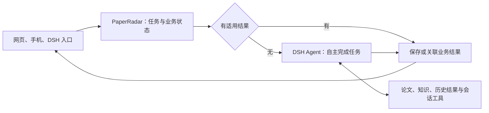

> 历史设计或验证记录。当前结构与运行方式以 [项目说明](../../../README.md) 为准；独立模型功能已移除。

# PaperRadar：DSH 自主任务设计

| 项目 | 内容 |
| --- | --- |
| 版本 | v0.4 |
| 日期 | 2026-09-10 |
| 状态 | 自主任务设计待实施；现有每日 Agent 实现及限制见独立验收记录 |
| 适用范围 | 每日初筛、单篇分析、总结、个性化、联系、交叉问题、复核、修订与讨论 |
| 核心原则 | 给模型目标、必要背景和工具，由模型自主决定完成方式 |
| 已确认的工程取舍 | 复用有效业务结果；不为资料缓存或前缀缓存增加专门工程 |

本版根据用户最新要求重写：不规定模型阅读、检索、分析、检查和写作的顺序；不设置必经分析阶段，不强制安排多个角色 Agent。此前版本中的固定流程、阅读配额和强制复核链不再作为目标设计。

[单篇自主分析设计](SINGLE_PAPER_AGENT_DESIGN.zh-CN.md)细化各类任务的目标、可用资料和交付内容。下文的应用接入与存储约定属于工程职责，不是给模型执行的研究步骤。

## 1. 设计原则

PaperRadar 提供用户想解决的问题和可访问资料，DSH 提供模型、工具循环与会话能力，模型自行判断需要获取什么信息、怎样分析、何时已经能够回答。

| PaperRadar 提供 | 模型自行决定 | 运行时负责 |
| --- | --- | --- |
| 用户任务、论文链接或固定版本 | 从哪里开始阅读、读哪些内容 | 账号认证、模型调用与工具执行 |
| 必要的已有元数据与可读结果引用 | 是否搜索、读取正文、查看图表或继续追问 | 可访问数据范围、版本和引用定位 |
| 用户选择的知识范围、筛选标准 | 使用哪些资料、是否补充证据 | 调用预算、并发、超时与取消 |
| 语言、长度、报告栏目等交付要求 | 如何组织推理、检查和表达 | 结果保存、格式校验、幂等与恢复 |
| 实际可用的工具及接口说明 | 是否使用笔记、复核或已保存成果 | 实际用量、读取记录及错误状态 |

模型可以一次作答，也可以多轮使用工具。系统不因为它没有遵循某条预设路径而判定失败。工具可用不代表每次都必须调用。

### 1.1 不再采用的设计

- 不设置“目录 → 摘要 → 方法 → 实验 → 总结”的固定阅读顺序。
- 不将“推荐、联系、交叉问题、复核”编排成必经模型调用链。
- 不要求每篇固定创建阅读、写作、个性化和复核等多个 Agent。
- 不要求先生成研究记录、草稿或计划，才能提交用户所需结果。
- 不要求先读摘要、只有摘要不足才允许阅读全文。
- 不采用“最多读两个章节”或“最多检索若干次”等替模型决定研究深度的规则。
- 不在工具说明中夹带某种推荐阅读法、思考方法或固定调用顺序。
- 不以规定工具是否调用、调用次数或章节数量作为质量合格的替代指标。

明确的用户要求仍然是任务目标。例如用户要求比较全部所选知识，目标需要保留，但用什么材料、如何完成比较由模型决定；程序不把逐条调用某个接口视为唯一完成方式。

### 1.2 保留的产品能力

保留单篇分析、每日手动与自动分析、按需详细报告、讨论、模型选择、提示词管理、反馈、历史、网页与手机入口。

现有报告栏目和语言／字数设置属于交付内容。它们描述用户拿到什么，不决定模型以什么顺序研究。知识范围、预算和账号权限同样不是研究方法。

## 2. 整体结构



图中只规定任务提交、结果匹配及保存关系。Agent 内部没有由 PaperRadar 制定的研究流程图。

每日候选登记、更新检查、排队、额度预留和结果去重由普通程序完成，不为这些确定性工作额外调用模型。

一个用户任务默认对应一个隔离的 Agent 执行上下文。每日仍按篇创建独立任务，便于并行与失败隔离；单篇内部的报告栏目不自动变成多个 Agent。若以后开放宿主委派能力，应作为可选工具，由模型按需使用，服从同一任务的权限和总预算，而非固定角色编排。

## 3. 向模型提供什么

### 3.1 最小任务输入

| 字段 | 内容 | 来源 |
| --- | --- | --- |
| `objective` | 用户的问题或明确的业务目标 | 用户请求／已保存订阅 |
| `paper` | 论文链接、固定版本、已有标题与摘要 | 论文来源快照 |
| `context_refs` | 可用报告、笔记、历史证据的短描述及引用 | PaperRadar |
| `persona_scope` | 用户选定的知识范围与版本；无选择时省略 | 用户设置／Persona |
| `criteria` | 推荐标准、严格度等与本任务有关的内容 | 用户设置 |
| `deliverable` | 所需内容、语言、长度和必要提交格式 | 用户设置／页面协议 |

内容采用简短结构化分块，每块有来源标记。执行编号、凭据、缓存索引和调度细节不默认进入模型上下文。

以下为初筛输入示意，尖括号为占位符；没有阅读或思考步骤：

```json
{
  "objective": {
    "text": "判断这篇论文是否值得我进一步阅读，并说明理由。",
    "source_ref": "subscription:<id>:request"
  },
  "paper": {
    "url": "https://arxiv.org/abs/<arxiv-id-vN>",
    "title": "<已有标题>",
    "abstract": "<来源已提供的摘要>",
    "source_ref": "paper:<version>:metadata:<hash>"
  },
  "criteria": {
    "text": "<用户的筛选标准>",
    "source_ref": "subscription:<id>:criteria:<revision>"
  },
  "persona_scope": {
    "ref": "<所选知识范围及版本>",
    "source_ref": "subscription:<id>:selection:<revision>"
  },
  "deliverable": {
    "content": ["推荐判断", "简短理由", "依据与不确定之处"],
    "language": "zh-CN",
    "schema": "screening.autonomous.v1",
    "source_ref": "subscription:<id>:output:<revision>"
  }
}
```

给已有摘要是提供信息，不代表规定先看摘要。只有链接时同样可以运行，由 Agent 使用可用工具获取资料。全文和整份知识正文不提前全部拼入输入。

### 3.2 工具描述只讲接口

每个工具说明用途、参数、返回内容、来源、权限范围、分页方式和可能错误。工具结果过大时提供游标或定位引用，方便模型继续读取；不指示它下一步应该调用哪个工具。

可用能力包括：

- 论文元数据、目录、搜索、正文、公式、图表和参考文献读取。
- 所选 Persona 范围内的搜索、记录与材料读取。
- 既有报告、证据、研究笔记和主题历史读取。
- 可选笔记或草稿保存。
- 符合业务协议的结果提交。
- 宿主实际提供且适合任务的其他能力。

按授权范围和真实能力提供工具，不按预设“当前阶段”锁定只能调用某一类工具。图像、PDF、联网等能力以实际接入为准，不能仅因工具名称存在就宣称具备对应读取能力。

### 3.3 知识范围与阅读记录

用户选定的范围决定可用资料，Agent 自行选择读取方式。空标签不隐式扩大到全库，也不引入主聊天个人背景。

用户已有的“考虑全部所选知识”要求保留为评价范围，不能在输入准备时偷偷缩成 top-k。工具提供完整范围的访问能力，模型可以利用目录、摘要、已有成果或原文完成任务；不硬编码必须逐条打开正文或先完成全量分页。

程序记录真实交付过的资料及版本，用于引用核验和追溯。读取记录不证明模型已理解全部内容；模型应如实说明依据和不确定性，不能声称完成没有依据的全文或全范围核验。缺少某个预设工具调用本身不构成结果失败。

## 4. 每日初筛

### 4.1 应用层行为

沿用来源更新检查、分类并集去重、候选纳入和手动／自动共享准入。自动来源无更新时，不读取 Persona、不创建新的业务分析任务、不调用模型，也不自动重试旧失败项。

明确重筛已存批次不要求先出现新公告。全部候选登记状态，不设每日最低推荐篇数或固定比例。

每篇匹配适用的已完成结果。未命中且符合准入条件的候选进入队列，每篇获得独立 Agent 上下文。相同任务正在运行时关联或等待，不重复派发。

### 4.2 Agent 的任务

目标是判断这篇论文是否符合用户标准，并给出简短理由、依据及不确定之处。

模型自行决定是否读取摘要、正文、图表、知识记录或既有结果，以及什么时候证据足以支持判断。不会被要求采用固定阅读顺序、必须阅读全文、只能读两章或必须再找一个模型复核。

已有标题、摘要、标准和范围引用保持简洁。完整报告仍需用户明确发起；模型为筛选自主阅读正文，不等同于应用自动创建详细报告任务。

### 4.3 结果与执行状态

结果保留推荐、不推荐和待确认，以及页面需要的简短介绍、理由和来源。程序校验结构、对象版本、引用存在性、授权范围及用户明确的输出格式。

执行失败、取消、预算暂停和判断为不推荐分别保存。模型提交前是否调用过某个阅读或复核工具不作为通过条件。

工具或提交格式错误返回具体接口信息，由模型自行决定如何处理。不会因此触发程序编排的整篇重写或固定复核循环。所有新增模型调用均受总预算约束。

## 5. 单篇分析与其他任务

| 用户任务 | 提供的目标与资料 | 所需交付 |
| --- | --- | --- |
| 完整单篇分析 | 论文引用、用户设置、可选知识范围 | 原有总结、推荐理由、联系和交叉问题等报告内容 |
| 单独总结或调整总结 | 论文／已有报告引用、语言和长度要求 | 所需总结 |
| 个性化分析 | 论文及所选知识范围、评价标准 | 个性化判断、理由和有依据的联系 |
| 核对某份内容 | 待核对内容及目标 | 发现的问题、依据、无法确认之处 |
| 修改某部分内容 | 指定内容、用户修改要求或接口校验错误 | 修改后的内容 |
| 自由／报告讨论 | 用户问题、论文／报告锚点、主题历史引用 | 回答、来源及不确定之处 |

表中的行是可以发起的任务，不是一篇分析必须顺序执行的阶段。完整分析默认交给一个 Agent，不由业务服务强制拆成“阅读 → 总结 → 个性化 → 复核 → 修订”。

研究记录、草稿和复核报告是可产生、可保存、可复用的产物，不是必备中间交付。模型可以自行检查，也可在工具允许时请求额外帮助；应用不会在每次回答后自动加一次复核模型调用。

单篇具体约定见[单篇自主分析设计](SINGLE_PAPER_AGENT_DESIGN.zh-CN.md)。

## 6. 模型选择与运行边界

### 6.1 按发起的任务选择模型

保留从 DSH 选择模型与支持的思考强度，以及本次选择、任务偏好、宿主默认的继承关系。任务在开始时固定实际设置，重试或继续沿用其明确快照。

- 每日初筛使用每日初筛设置。
- 完整单篇分析使用单篇任务设置。
- 用户单独发起总结、个性化、复核或讨论时，使用对应任务设置。
- 完整报告包含多个栏目，不会因此强制轮流使用所有模型设置。
- 如开放按需委派，具体子任务使用用户已经配置的相应选择，计入父任务预算；不自行增加账号或暗中升级模型。

既有阶段路由偏好保留为相应任务的可选配置。界面应说明其生效场景，不能显示会使用某模型却静默忽略。一次自主任务内部不按报告栏目强制切模型。

### 6.2 预算、并发与权限

2026-09-10 更新：完整单篇分析默认取消调用次数和总执行时间上限，按结果提交、用户取消或实际错误结束。以下预算约束适用于初筛、讨论、自动日报总额度和显式设置预算的试跑；完整分析仍记录全部调用用量。

当前统一并行数量设置 N 继续控制应用运行容量与实际模型请求；保存后的调整规则保留。并行调度不参与模型的研究决策。

账号、数据权限、明确的总时间／调用／token 预算、取消和并发属于运行边界，不设定研究方法。删除章节数、阅读次数等作为业务策略的固定配额；单次工具响应大小与服务限流可以保留，因为它们约束接口资源，不规定模型应读哪些内容。

预算覆盖 Agent 内部所有模型调用、按需委派、上下文整理和恢复。达到上限保存已有内容并说明状态，不自动提高额度，也不把未完成候选归为不推荐。

### 6.3 上下文与恢复

优先使用 DSH 的会话和上下文能力，所有额外模型调用纳入计量。现有压缩路径存在计量限制，目标实现须解决后再启用，不将它当作已验证能力。

模型可按需保存笔记或中间结果；程序持久化实际事件、已提交内容和必要关联，不要求模型在固定位置写检查点。

会话能恢复时继续原会话；无法恢复时，提供任务、可用历史与已有结果引用供模型继续，并明确这是重建执行。先查询原提交状态再决定重试，取消后不接受迟到结果；外部调用结果未知时保留未知状态，不保证模型恰好执行一次。

## 7. 有效业务结果复用

完成结果复用继续必做。资料缓存和前缀缓存沿用现有自然能力，不增加专门工程或命中率门槛。

### 7.1 匹配与依赖

复用身份包含用户／订阅或任务范围、固定论文及实际内容、任务目标、用户标准、相关 Persona 身份与版本、语言及交付要求、有效模型与思考强度、提示词和任务协议。

只使用真实影响结果的依赖。修改讨论模型不无故使独立总结失效；同一自主分析已接触 Persona 后产生的总结，不能未经依据判断就声称完全独立于 Persona。

可选笔记、组件和复核结果按实际生成情况保存，不强制为了填满缓存结构额外调用模型。程序匹配有效结果；未命中时把已有成果作为可用资料交给 Agent，不规定它必须先复用哪一项。

### 7.2 发布、去重与重做

- 有效完成结果在相同条件下直接关联，本次新增模型调用为 0。
- 草稿、失败、取消、未知调用和缺少必要身份的旧结果不能冒充成功缓存。
- 待确认保留业务状态，沿用现有明确继续规则，不自动循环重试。
- 不要求存在独立复核报告才允许结果复用；用户显式要求复核的任务则需满足该目标。
- 强制重新判断绕过已完成结果匹配，保留旧版本与反馈。
- 原子领取、有效尝试校验和幂等提交防止重复执行及迟到覆盖。
- 已关联结果保留原生成时间、实际模型和原用量，不重复计量。
- 来源、任务依据或协议变化可使结果失效，但设置变化本身不自动重跑历史。

从旧固定流程迁移到自主任务时，更新契约身份。旧结果仍可读；只有能够证明满足当前目标时才自动复用，不因升级批量生成新结果。

## 8. 界面与校验

原报告分栏继续可用；栏目表示内容，不表示模型执行顺序。进度展示真实事件，例如正在读取资料、正在运行、已保存部分内容、已提交、暂停或失败，不显示尚未发生的固定阶段。

程序检查必要字段、字数、引用对象及权限、版本和保存状态。科学质量通过模型完成任务及实际样本评估检验，不自动插入另一次 LLM 审查。用户可以明确发起核对任务。

保留草稿和已提交组件；整体失败不删除已经保存的内容。模型未生成某类中间产物时，界面不制造“缺少必经阶段”的错误。

阅读、讨论、取消和没有反馈都不等于用户评价，也不自动调整兴趣或写入 Persona。

## 9. 实施与验收

### 9.1 工程工作项

以下是开发者的交付清单，不是模型的执行步骤：

| 工作项 | 完成要求 |
| --- | --- |
| 简化任务输入与提示词 | 全部模型接入点移除阅读教程、固定阶段和角色剧本，保留目标、来源与交付要求 |
| 提供通用工具访问 | 在合法范围内自主使用论文、知识、报告和会话能力，不继承初筛两章节限制 |
| 泛化 DSH 任务入口 | 支持各用户任务的模型设置、工具、提交协议与会话方式 |
| 取消固定模型编排 | 不强制生成研究记录、分角色、自动复核或修订流水线 |
| 结果与恢复 | 保存实际产物，复用完成结果，正确处理未知提交、中断和取消 |
| 工作台与界面 | Agent 试跑具备实际工具；界面反映任务和结果，不虚构固定分析阶段 |

### 9.2 验收原则

不同论文、问题或模型可以采用不同工具轨迹，不要求复现指定调用顺序。重点检查：

1. Agent 能在没有步骤指令的情况下完成目标，也能在资料充分时直接提交。
2. 自主选择正文、图表、知识和历史资料；没有固定的两章节门槛。
3. 无强制研究记录、独立复核或多 Agent 编排；显式复核请求仍可完成。
4. 原输出栏目、语言、长度、来源、范围和用户明确的完整比较目标保留。
5. 各任务模型设置实际生效，所有调用和整理纳入预算。
6. 无更新零业务调用、逐篇并行、候选覆盖、结果复用及强制重做保持正确。
7. 大论文、大知识范围和长讨论有可验证的上下文处理，失败保留已有内容。
8. 固定材料测试检查接口和边界，真实样本评估任务质量；不以“调用了指定工具”宣称科学判断正确。

所有模型接入点都遵循本原则，不仅限于新单篇路径；现有每日 Agent 中的固定阅读限制和提交门槛也需要重新对齐。

## 10. 现有实现与文档状态

0.3.0 已落实本轮原则：完整单篇任务、讨论、自主工作台采用通用 DSH Agent；每日初筛移除固定阅读配额和完整扫描提交门槛。具体实现、测试与仍未接入的能力见 [本轮验收](AUTONOMOUS_VALIDATION.zh-CN.md)。旧验收记录仅证明旧版本行为。

- [单篇自主分析设计](SINGLE_PAPER_AGENT_DESIGN.zh-CN.md)：各类目标、产物、工具和模型选择。
- [第一阶段需求](PHASE_1_REQUIREMENTS.zh-CN.md)：原接入基础与兼容能力。
- [每日 Agent 验收记录](AGENT_VALIDATION.zh-CN.md)：已有实现与限制的历史事实。
- [宿主兼容记录](../../../plugins/dsh/COMPATIBILITY.md)：当前已验证接口边界。
- [原单篇实现说明](../../../plugins/paper-radar/web/docs/SINGLE_ANALYSIS.md)及[按需分析与讨论](../../../plugins/paper-radar/web/docs/ON_DEMAND_ANALYSIS_AND_DISCUSSION.md)：已有产品行为；其中固定模型流程不再作为本轮目标约束。

与此前设计冲突时，以本版“提供目标和工具，模型自主完成”的原则为准。后续实现须另行记录真实验证和部署状态。
