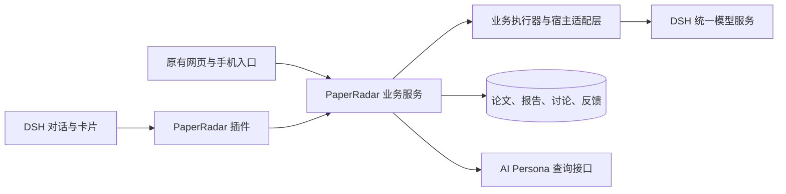

> 历史设计或验证记录。当前结构与运行方式以 [项目说明](../../../README.md) 为准；独立模型功能已移除。

# PaperRadar DSH 插件：第一阶段需求文档

| 项目 | 内容 |
| --- | --- |
| 文档版本 | v0.4 |
| 日期 | 2026-09-10 |
| 文档状态 | 第一阶段已实现并本机启用；验收范围与未通过项见验收记录 |
| 第一阶段名称 | 保留原有功能，打通网页与 DSH 双入口 |
| 原有应用 | PaperRadar，本机真实服务及现有网页／手机入口 |
| 接入宿主 | DSH |
| 新目录用途 | 独立保存插件项目的需求与后续设计，不搬迁或复制现有业务数据 |

本版根据用户确认修订：插件模式从第一阶段起使用 DSH 的模型调用、账号与认证能力，不需要在 PaperRadar 独立配置模型。用户可以针对不同任务，选择 DSH 中已配置的模型及其支持的思考强度；未设置时继承宿主。完整 Agent 自主阅读仍属于后续阶段。

实施交付：[使用与安装说明](../../../plugins/dsh/README.md)、[宿主兼容记录](../../../plugins/dsh/COMPATIBILITY.md)、[验收记录与已知限制](VALIDATION.zh-CN.md)。本需求文档保留目标约定，不能将下方验收清单的存在理解为全部场景已通过。

后续设计：[论文研究全流程 DSH Agent 设计](AGENT_EXECUTION_DESIGN.zh-CN.md)细化自主阅读、逐篇并行及结果复用；每日初筛已实现，单篇扩展待实施，不改变本文所记录的第一阶段交付范围与状态。

范围扩展：用户进一步要求优化单篇全部适用环节，见[单篇全流程 DSH 优化设计](SINGLE_PAPER_AGENT_DESIGN.zh-CN.md)。每日 Agent 的实际完成情况以独立验收记录为准，单篇新增设计不计入本文的已实现功能。

最新设计原则：所有涉及模型的任务只提供目标、必要背景、工具与交付要求，由模型自主决定阅读和分析方式；不沿用本文历史流程中的固定模型步骤或强制复核链。具体以[自主任务设计](AGENT_EXECUTION_DESIGN.zh-CN.md)及[单篇自主分析设计](SINGLE_PAPER_AGENT_DESIGN.zh-CN.md)为准，原功能、权限、模型配置和业务数据约定保留。

## 1. 背景与目标

PaperRadar 已提供单篇论文分析、手动与自动每日推荐、按需详细报告、论文讨论、模型设置及用户反馈。现有系统由应用提前组织输入，再调用模型完成各业务阶段。

接入 DSH 的长期方向，是让 PaperRadar 提供论文研究领域的工具、规则、数据与结果界面，并复用 DSH 的 Agent 执行能力。第一阶段先建立可靠的接入基础：用户既能继续在现有网页中使用 PaperRadar，也能在 DSH 中查看论文、发起现有业务任务、继续讨论；两个入口共享结果和状态。

第一阶段完成后，用户应能完成以下过程：

1. 在手机上查看某份已有日报。
2. 在 DSH 中找到同一份日报及其中的论文，发起该论文的详细分析。
3. 在任一入口查看同一个任务的进度、报告及证据。
4. 从报告中的一个问题开始讨论，并在另一入口继续同一个讨论主题。
5. 对报告提交反馈，在两个入口看到一致的反馈状态。

本阶段首先验证“业务能力可以被宿主调用，模型能力直接复用宿主，研究结果可以跨入口继续使用”。长上下文的自主检索、跨论文比较和持续研究问题属于后续阶段。

## 2. 需求依据与决策状态

### 2.1 用户已经明确的要求

- 保留 PaperRadar 原有功能，包括单篇分析、每日分析等。
- 探索 PaperRadar 作为 DSH 插件的形态，以及复用 Agent 能力的方式。
- 优先讨论和规划第一阶段，并在独立文件夹中保存需求文档。
- 插件模式不需要独立配置模型，直接复用 DSH 的模型调用与认证。
- 用户可以针对不同任务，选择 DSH 中已配置的模型和该模型支持的思考强度；这项选择能力属于第一阶段必做功能，用户可以不设置。

### 2.2 本文采用的第一阶段建议

以下为根据上一轮讨论提出的设计建议，供继续讨论，不等同于所有实现细节均已确定：

- 现有网页与手机入口继续提供完整功能。
- DSH 插件提供原生论文／任务卡片、自然语言操作和现有页面入口。
- PaperRadar 业务服务统一管理数据、任务状态和业务校验。
- 原有分析阶段、提示词与业务校验可继续复用，但插件模式的模型请求统一进入 DSH；不能仅由宿主调用旧接口、背后继续依赖另一套账号。
- DSH 从第一阶段负责统一模型服务、入口对话与工具编排；是否进一步改为自主研究 Agent 执行流程，见第 13 节。
- 优先服务现有单用户、本机运行场景，不在本阶段引入多人协作或云端托管。

### 2.3 需求解释规则

- “保留功能”指保留用户可见能力、数据、设置和业务语义，不要求所有内部代码保持原样。
- “模型能力保留”指保留多模型选择、按任务选择模型与思考强度、用量和明确备用策略；插件模式不保留第二套必须配置的账号、密钥和登录界面。
- “保留网页入口”不等于“插件模式的模型任务能脱离 DSH 运行”。浏览和管理仍由业务服务提供；新模型任务依赖可用的宿主运行时。
- “双入口”指两个入口操作同一业务对象；不是各自生成一份互不关联的日报或报告。
- “继续讨论”指恢复同一主题及其论文、报告和证据依据，不只是打开新的通用聊天。
- “接入成功”不表示已经解决所有旧问题，也不表示第二阶段的自主阅读能力已经完成。
- 本文是需求与验收约定，不锁定具体进程部署、SDK 方法名或数据库表结构。

## 3. 原有功能保留清单

以下条目均为第一阶段的兼容要求。完整编辑能力可以继续由现有网页承载；DSH 中必须提供清晰入口，不要求首版重做所有设置页面。

| 编号 | 能力 | 保留要求 |
| --- | --- | --- |
| BASE-01 | 单篇分析 | 接受 arXiv 编号或链接；保留无 Persona 标签时的纯论文总结；支持进度、取消、重试和已有结果复用 |
| BASE-02 | 手动每日推荐 | 保留真实订阅、多 arXiv 分类、分类并集去重、历史批次及按当前订阅重新筛选 |
| BASE-03 | 全部候选可查看 | 保留推荐、未推荐、待确认和处理失败等不同去向；不能仅返回若干推荐项 |
| BASE-04 | 自动日报 | 保留开关、时间、时区、来源更新检查、额度、检查历史和明确继续入口 |
| BASE-05 | 按需详细报告 | 由用户主动发起；报告任务与日报初筛分别记录进度和用量；全文意见不覆盖初筛列表归属和原理由 |
| BASE-06 | 论文讨论 | 不要求先生成详细报告；保留自由提问、多轮追问、不同主题、历史恢复和取消／重试 |
| BASE-07 | 报告问题讨论 | 保留从章节、联系、交叉问题或真实选中文字开始讨论，并关联原报告版本 |
| BASE-08 | Persona 范围 | 继续使用用户选定的标签范围及版本约束；材料和其他会话不能隐式扩大个性化依据 |
| BASE-09 | 输出设置 | 保留严格度、总结字数范围、中英文输出及中文叙述保留英文专业术语的规则 |
| BASE-10 | 模型能力 | 插件模式复用 DSH 已配置的账号、模型、认证和调用；默认继承，不要求重新设置；支持按任务选择宿主已有模型及其思考强度，显式备用模型也只引用宿主已有模型；平台或功能不兼容须在迁移验收中明确 |
| BASE-11 | 提示词管理 | 保留 Prompt Workbench 接入、用户启用版本、历史版本与任务使用快照的关系 |
| BASE-12 | 反馈 | 保留准确性、总结、理由、联系四项独立可选反馈；初筛与全文反馈仍绑定对应内容版本 |
| BASE-13 | 历史与证据 | 旧论文、报告、讨论和反馈继续可读；证据可定位到当时实际使用的来源 |
| BASE-14 | 网页与手机 | 保留当前本机网页及 Tailscale 手机访问方式；手机不必安装或打开 DSH |

作者提醒目前尚未实现，不作为本阶段已具备功能，也不列为本阶段新增交付项。

### 3.1 必须保留的业务语义

1. 没有新公告时，不启动 PaperRadar 分析任务，不读取 Persona，不进行业务模型调用。
2. 来源失败或来源不完整，不能显示为“没有更新”。
3. 筛选失败不能归类为“不推荐”；证据不足与执行失败分别展示。
4. 推荐数量由判断结果决定，不设最低篇数或固定比例。
5. 浏览、展开论文卡片、打开报告或讨论窗口，不自动启动全文分析或回答生成。
6. 用户明确选择详细分析后，全文任务不受已结束日报任务的取消或预算状态隐式影响。
7. 阅读、聊天、关闭页面、没有反馈，都不等于用户表达了兴趣或满意度。
8. 初筛、详细报告和讨论保留各自的设置、用量与结果版本。
9. 网页关闭不等于任务取消；计算机睡眠或相关服务停止时，不承诺任务仍可执行。

“无更新零调用”指 PaperRadar 业务模型调用。用户主动向 DSH 发消息时，宿主可能调用模型理解请求，这部分属于入口编排用量，必须与论文分析用量区分。定时检查不应为解释“暂无更新”额外启动 Agent。

## 4. 第一阶段范围

### 4.1 必须交付

- 插件安装、连接配置及连接状态展示。
- 模型调用统一接入 DSH：已配置宿主的用户可直接运行，网页、手机和自动任务也使用同一模型服务。
- 在 DSH 中发现、查看现有订阅、日报、论文和报告。
- 原生论文／任务卡片与返回 PaperRadar 完整页面的入口。
- 从 DSH 发起单篇分析、已有订阅的手动日报、明确选定论文的详细分析。
- 从 DSH 创建或继续现有论文／报告主题讨论。
- 两端一致的任务进度、错误、取消、重试、结果和反馈。
- 业务对象与 DSH 会话／运行记录之间的可追溯关联。
- 现有功能、历史数据和手机入口的兼容验证。

### 4.2 可以复用现有页面承载

- 新建与编辑订阅、选择标签、配置自动日报。
- 模型账号登录和认证统一进入 DSH 设置；PaperRadar 设置页显示实际使用的模型、思考强度、默认继承状态，并提供按任务选择宿主模型与思考强度及显式备用策略的设置。
- 提示词编辑、版本比较与启用。
- 完整候选列表、历史管理及现有删除操作。

上述能力保留，但首版不要求全部增加自然语言写入接口。插件应提供可打开的对应页面和必要的当前状态说明；其中模型认证应打开宿主设置，不能继续要求在旧 PaperRadar 模型页重复登录。

### 4.3 不纳入第一阶段

- 全面重写为 Agent 自主阅读、检索、压缩和证据探索流程。
- 跨论文比较、跨论文全库聊天、持久研究问题及研究专题管理。
- 自动执行代码、数值复现、远程计算和实验任务。
- 作者提醒、论文新版本监控和研究问题增量跟踪。
- 自动反馈学习、自动启用新提示词、向 AI Persona 写入正式知识或兴趣。
- 多人账户、跨用户共享、公开发布服务或独立云端部署。
- 将现有完整前端一次性重写为 DSH 原生界面。

## 5. 产品结构与责任边界

第一阶段可以继续使用现有业务阶段，由适配层把模型请求交给 DSH。统一模型服务是本阶段必须项；把整个研究过程改为自主调用工具的 Agent 循环是另一项改造。

| 部分 | 负责事项 |
| --- | --- |
| PaperRadar 业务服务 | 论文与订阅管理、来源检查、任务准入、去重、预算、业务校验和结果保存 |
| DSH 插件 | 将用户意图转换为业务操作，展示卡片和进度，维护宿主与业务对象的关联，并将业务模型请求接入宿主支持的调用路径 |
| DSH 运行时 | 统一模型目录、账号与认证、模型调用、宿主 Agent 对话、工具循环、会话和运行事件 |
| AI Persona | 提供公开查询接口及范围内知识；正式记录仍由其自身管理 |
| 现有网页 | 提供完整操作界面，继续服务桌面和手机用户 |

插件应调用业务服务，不直接打开生产 SQLite 数据库，不启动第二个同时持有该数据目录的业务进程。具体采用本机接口或其他适配方式，在技术设计中确定。

业务服务如与 DSH 分进程运行，应通过明确的宿主适配接口提交模型请求；不能把“读取宿主配置文件或复制密钥后自行调用平台”当成复用 DSH。应核实固定版本中受支持的模型服务与运行时接口，并保留调用状态、取消和用量关联。

第一阶段保留 PaperRadar 调度为自动日报的唯一业务调度来源；不在 DSH 中再复制一套相同定时任务。

## 6. 用户流程与功能要求

### FR-01 安装、连接与发现

- 安装后可以配置或发现已明确指定的 PaperRadar 本机服务。
- 展示连接成功、服务未启动、版本不兼容、部分能力不可用等可理解状态。
- 插件检查实际业务能力，不能把静态演示页面识别为可执行真实分析的服务。
- 连接设置与认证信息不进入模型提示词或普通错误消息。
- DSH 已有可用模型时直接使用；未配置模型或认证失效时，提示前往宿主模型设置，不引导创建 PaperRadar 独立账号。
- PaperRadar 未连接时保留重新连接和打开设置的入口，不伪造空列表或成功状态。
- 首版不自动搬迁数据、复制模型凭据或启动重复服务。

### FR-02 查看订阅、日报与论文

- 用户可以要求查看某个订阅的最新日报、指定日期日报或已有历史。
- 返回实际公告日期、订阅、来源覆盖、处理进度和各类候选数量。
- 推荐、未推荐、待确认和失败项均可分页查看或打开完整列表。
- “最新”“今天”等请求必须解析为明确订阅及公告批次；不能把当前日期直接当成已有日报日期。
- 目标存在歧义时，展示可区分的候选供用户选择；不能仅按模糊标题执行写操作。
- 从网页进入 DSH 时，传递稳定对象引用；不能只传论文标题或当前屏幕文本。

### FR-03 发起单篇分析

- 接受与现有网页一致的 arXiv 编号和链接。
- 已有明确设置时直接按其执行；缺少必要信息时读取已有设置或提供现有设置入口。
- 标签、语言、字数、严格度、模型和思考强度使用明确的默认来源，任务开始时保存快照；模型与思考强度按第 7.4 节解析，快照不包含凭据。
- 用户未要求个性化时，不自动从主聊天或其他 Persona 标签补充个人背景。
- 创建后返回可持续查看的任务卡片，任务可在原网页中找到。
- 打开已有报告优先读取现有结果；重新生成必须是用户明确的操作。

### FR-04 发起或继续每日任务

- 支持为已存在且可运行的订阅发起手动日报，或调用现有“立即检查”能力。
- “查看最新日报”是只读操作；“生成最新一批／立即检查”可以进入来源检查与任务准入。
- 正在进行、已有兼容结果、无更新、来源失败和预算不足应分别展示。
- “继续”必须绑定明确的未完成任务或待处理更新，不能重新创建整份日报。
- 两个入口同时操作时，沿用统一去重与事务规则。
- 修改自动设置、订阅和筛选标准仍遵循原有规则；设置改变本身不触发历史重跑。

### FR-05 发起按需详细报告

- 用户可对日报中的指定论文发起详细分析，包括未推荐或待确认论文。
- 从日报发起时，按既有规则继承该日报版本的范围及输出设置；本次模型按第 7.4 节解析宿主选择后固定，不直接照搬旧日报中的账号引用。
- 保留初筛理由和列表归属，另行呈现全文意见与报告状态。
- 不因用户查看了推荐列表，就自动为所有推荐项生成全文报告。
- 首版至少支持逐篇明确发起；自然语言批量任务及新的批量界面不作为本阶段必要条件。

### FR-06 任务卡片、进度与操作

- 原生卡片至少显示：论文／日报名称、所属订阅或论文版本、任务状态、当前阶段、更新时间及可用操作。
- 用户可以打开结果、查看失败原因，并按现有规则取消或重试。
- 卡片从业务状态更新，不依靠 Agent 生成文本猜测当前进度。
- 任务已提交、已入队或宿主回合结束，都不能显示为“报告已完成”。
- 重试、恢复和重新生成使用不同含义；保留原任务及已有结果的关联。
- 原生按钮能够直接执行明确业务操作，不必每次再调用模型解释按钮含义。

### FR-07 报告与证据查看

- DSH 可展示报告概览、主要状态和打开完整版的入口。
- 关键结论及引用可打开相应业务证据，保留论文版本和实际读取范围。
- 宿主中缩略展示不能改变报告原文、引用或反馈绑定。
- 无完整报告、仅摘要依据、部分完成和内容待核对必须明显区分。
- 旧报告可以关联新的 DSH 入口，但不能声称恢复了不存在的旧 Agent 运行轨迹。

### FR-08 跨入口继续讨论

- 支持从论文、报告及报告中的具体问题进入讨论。
- 以 PaperRadar 讨论主题 ID 识别同一个主题，同时关联宿主会话；两者不要求使用同一标识。
- 在网页发送的问题及已提交回答，可以在 DSH 中查看，并在同一主题追加问题；反向同样成立。
- 讨论保留论文版本、报告版本、问题原文、Persona 范围及证据关联。
- 同一主题同时只有一轮业务回答执行。两端同时发送时，后到请求明确等待或提示正在回答，不能并发覆盖。
- 新建主题、继续主题和从另一份报告开始讨论分别处理。
- 宿主主聊天中未属于本主题的内容，不默认作为个人事实或论文讨论上下文。
- 业务服务保存用户可见的问题、回答和证据；宿主运行事件可以另行关联，不要求导入整份主聊天历史。
- token 级流式回答可作为体验增强；首版必须先保证可靠进度与最终答案一致。

### FR-09 反馈一致性

- 对已生成内容提供与原界面一致的反馈维度和条件。
- 从任一入口提交、修改或撤回反馈，另一入口读取到同一状态。
- 反馈绑定具体报告、初筛或组件版本，不能只绑定论文标题。
- 不能从“继续分析”“打开报告”“追问很多次”等行为推断正面或负面反馈。
- 自然语言反馈必须明确指向目标及维度；含义不明确时展示反馈入口，不自动写入。
- 不因本阶段新增反馈入口而自动建立学习流程或修改 AI Persona。

### FR-10 完整页面与手机衔接

- 卡片中的链接能够打开对应论文、任务、日报或讨论主题，而不只返回首页。
- 链接根据当前设备可访问的已配置入口生成，不能统一使用只对服务机器有效的 localhost 地址。
- 手机继续使用现有访问方式；从手机打开 DSH 不是本阶段必要条件。
- 不新增公网暴露要求，不为了插件接入放宽现有访问限制。
- 不能打开宿主时，网页中的报告与历史仍然可读；显示宿主不可用与业务任务失败的区别。

## 7. 数据、设置与上下文约定

### 7.1 数据归属

| 信息 | 权威来源 |
| --- | --- |
| 订阅、来源批次、候选与筛选结果 | PaperRadar |
| 报告、证据、讨论主题与用户可见消息 | PaperRadar |
| 反馈及对应内容版本 | PaperRadar |
| 自动调度设置、业务预算和任务状态 | PaperRadar |
| 插件模式的模型目录、账号、认证与调用能力 | DSH |
| 各任务的可选模型／思考强度设置及实际使用值的非敏感快照 | PaperRadar，所引用的模型和能力由 DSH 解析与验证 |
| 宿主会话、工具事件和 Agent 运行记录 | DSH |
| 正式个人知识、兴趣及原始材料记录 | AI Persona |
| 启用的 PaperRadar 业务提示词及版本 | 现有 PaperRadar 提示词管理 |

允许两端存在展示缓存，但插件不能维护第二套可独立修改的报告或订阅。删除宿主会话不应连带删除业务报告；原有业务删除操作继续遵守引用关系校验。

### 7.2 任务与版本

- 每个业务任务必须有稳定 ID，并记录来源入口和关联宿主运行／会话。
- 论文、报告、Persona 范围与版本、提示词版本按当前业务规则固定；插件任务的有效模型选择按第 7.4 节保存，不复制宿主账号凭据。
- 运行中修改设置，不应悄悄改写已创建任务的输入或已经保存的报告。
- 迁移不重新生成旧报告、不改变历史反馈，也不自动重跑旧任务。
- 插件重连先查询原任务状态，不直接再次提交模型任务。

### 7.3 给 Agent 的上下文

- 使用结构化字段，至少区分用户任务、目标对象、设置、已有状态、可访问证据和限制。
- 每条领域内容携带业务来源引用；涉及原文时携带论文／材料版本及段落、章节或其他有效定位。
- 普通列表工具优先返回 ID、标题、短描述、状态和详情入口，支持分页。
- 读取报告和证据按章节或片段返回，不把整个业务数据库或完整检索日志注入主聊天。
- Persona 范围由服务端落实，不能仅靠提示词约束；报告引用与用户事实继续按现有规则校验。
- 当前业务执行器内部仍可能使用较大输入；以上插件工具约定不等于已完成第二阶段的研究输入重构。

### 7.4 模型与用量

#### 7.4.1 配置一次，插件直接使用

- 插件模式的模型请求必须通过 DSH 已配置的模型服务或执行能力完成。PaperRadar 不维护第二套必填平台地址、API Key、OAuth 登录和凭据刷新。
- 单篇分析、日报初筛、详细总结、个性化分析、内容复核与讨论均适用；不允许部分业务阶段仍暗中依赖旧模型库。
- 插件默认无需填写模型或思考强度字段。用户可按任务类型保存模型与思考强度，也可临时指定某次任务的选择；这些设置只引用宿主模型及其支持的参数，不复制账号。
- 原网页和手机页面在插件部署模式下也调用同一宿主模型能力，不因入口不同而改用旧账号。
- 原有账号配置和历史模型记录不删除、不改写，但不自动参与插件任务的路由。此前独立运行方式可单独保留；它不是插件使用前必须完成的设置，也不构成静默回退路径。

#### 7.4.2 模型与思考强度选择规则

以下为产品要求，需由插件适配层落实并验收；不能假定所有宿主接口省略模型参数时都会自动得到同样的结果。

| 情况 | 默认选择 |
| --- | --- |
| 用户明确指定本次任务的模型或思考强度 | 对明确指定的字段优先使用本次选择；不修改已保存的任务设置或宿主全局默认值 |
| 对应业务已保存模型或思考强度设置 | 使用已保存的字段；界面显示覆盖内容，仍为“继承”的字段继续按下述规则解析 |
| 在 DSH 会话中新建业务任务 | 未覆盖的字段继承发起时该会话实际生效的模型与兼容的思考强度，不读取过期的会话创建值 |
| 从原网页／手机新建业务任务 | 未覆盖的字段使用接入的 DSH 实例的默认模型及适用于最终模型的默认思考强度 |
| 自动日报或其他无父会话的任务 | 使用对应任务设置；未设置的字段使用宿主默认，不选择任意活跃聊天 |
| 继续已有讨论主题 | 默认使用该主题已解析保存的模型与思考强度，跨入口继续不隐式改变；用户明确切换可作用于之后的轮次 |
| 重试或恢复既有任务 | 沿用已保存的模型与思考强度；选择不可用时明确提示，不悄悄改用其他配置 |

- 模型与思考强度各自支持“继承”，按“本次明确选择 → 已保存的任务设置 → 发起会话／宿主默认”的顺序解析；已有讨论和重试任务适用表中的快照规则。
- 先确定最终模型，再验证思考强度。只覆盖模型时，不把另一模型的会话思考强度直接带入，而使用最终模型在宿主中的默认设置；只覆盖思考强度时，须验证继承得到的模型是否支持该值。
- 思考强度选项来自宿主对当前模型的能力声明，不统一硬编码为固定档位。模型不支持调节时，显示“不支持调节”，仍允许使用其默认能力；宿主未提供可验证的选项时，只提供宿主默认并说明原因，不猜测参数。
- 用户明确选择的强度失效或切换模型后不再兼容时，在保存或执行前提示重新选择或恢复继承；不静默丢弃、转换或降低强度。模型与强度的有效值必须实际传入宿主调用路径，不能只影响界面或提示词文字。
- 任务进入可执行状态时，为各业务阶段解析并记录实际 provider、model、思考强度／适用推理参数、各字段选择来源及宿主关联信息，不记录密钥或令牌。使用宿主默认且无法取得具体强度时，记录“宿主默认／具体值未报告”，不虚构已使用的档位。
- 在途任务不因宿主默认模型、思考强度或任务设置变化而悄悄改变已固定的执行参数；新任务按新的设置解析。认证刷新继续由宿主管理，撤销访问或配置失效必须得到正确处理。
- 首次从旧版历史讨论继续时，保留其历史模型信息，为新轮次按当前继承规则解析可用宿主模型；旧账号 ID 不能直接当成宿主模型 ID。
- 宿主模型不可用、能力不足或认证失效时，返回具体原因及宿主设置入口，不要求用户另建 PaperRadar 账号。

#### 7.4.3 按任务设置页面

- PaperRadar 模型区域默认显示“使用 DSH 模型”、当前有效模型与思考强度、各字段选择来源及“在 DSH 中管理”入口，不出现添加独立模型、填写密钥或独立登录的流程。
- 第一阶段必须提供按任务类型设置模型与思考强度的能力；每项默认均为“继承”，无需用户逐项配置。模型列表只展示 DSH 中已配置的模型，强度列表随所选模型更新；缺少可用模型应在宿主完成一次配置。
- 首版至少分别覆盖单篇分析、每日初筛、详细总结、个性化分析、内容复核和论文讨论。单篇分析作为入口可设置任务默认；内部阶段有独立设置时优先采用阶段设置，未设置的字段再继承所属任务默认。有效顺序为“本次明确选择 → 阶段设置 → 所属任务默认 → 发起会话／宿主默认”。
- 每行展示任务名称、模型选择、思考强度选择和实际生效说明；支持恢复继承。网页和 DSH 入口读取同一份任务设置，修改某一任务不改变其他任务或宿主全局设置。
- 持久化选择只保存宿主模型引用与受支持的思考强度值。业务任务中的“分析严格度”、总结字数和来源范围继续独立设置，不能用思考强度替代这些业务规则。

#### 7.4.4 用量与备用策略

- DSH 入口编排与论文分析属于同一调用体系中的不同用途。应按业务任务关联实际请求和宿主用量，区分用途但不重复计量同一请求。
- 宿主重试、业务修订和显式备用调用都计入实际尝试；PaperRadar 的任务预算必须在平台调用前生效，不能只在事后汇总。两个执行层不得各自无界重试。
- 未确认结果的外部模型请求不能声称从未执行或已回滚；无法确认的用量保留未知状态。
- 备用模型策略需与宿主能力协调并显式启用。不能在宿主失败后自动切换到旧 PaperRadar 密钥，也不能擅自改变宿主全局备用策略。

## 8. 失败、取消与服务生命周期

| 情况 | 必须表现 |
| --- | --- |
| PaperRadar 服务不可用 | 显示连接错误，保留重连入口；不显示“无论文”或虚构成功 |
| DSH 页面关闭 | 已提交业务任务继续由业务服务管理 |
| 插件断开或卸载 | 不删除业务数据；仅展示连接断开时业务可继续，提供模型能力的适配层卸载则将受影响任务标为中断或不可用 |
| DSH 运行时停止或模型服务不可用 | 网页、历史和来源检查可继续；需要模型的新任务明确显示不可用或待处理，在途任务记录中断／待核对，不回退到旧账号 |
| 浏览器刷新或网络断开 | 重新读取同一任务／讨论状态；恢复后不重复提交 |
| 取消后收到迟到结果 | 不覆盖取消状态，也不把旧结果写入新的重试任务 |
| 预算或时间到达上限 | 保留已完成内容，展示原因与合法继续方式 |
| 模型输出格式或引用错误 | 显示具体失败阶段；按既有修订预算处理，未通过不标记完成 |
| 来源或 Persona 版本变化 | 按原有快照与版本策略处理，不静默混用新旧依据 |
| 宿主版本不兼容 | 明确说明插件不可用的能力，原网页和历史数据继续可用 |

不增加“每调用一个工具就向用户确认”的交互。用户已明确提出的分析、讨论、取消等操作按范围执行；需要选择真实对象或缺少必要设置时才请求补充信息。既有删除操作沿用原界面的处理方式，插件模式的模型认证统一进入宿主设置。

关闭 DSH 的浏览器窗口与停止 DSH 后台运行时是不同操作。插件模式下，无界面的定时分析也需要宿主模型能力可用；来源检查仍可由 PaperRadar 独立完成。模型服务恢复后，旧任务按原有明确继续规则处理，不自动批量重放。

## 9. 已知问题与范围限制

### 9.1 当前个性化分析输入超限

2026-09-10 已定位到现有流程的一项失败：个性化分析将论文正文与 Persona 上下文合并后超过应用内部的完整提示词长度限制；原始长度错误被替换为“分析未能完成，可重试”的通用信息。重复提交同样输入仍可能失败。

第一阶段要求：

- 不把插件包装或重新提交旧任务宣称为该问题的解决方案。
- 两端至少显示可解释的失败原因、失败阶段、已完成部分，以及原样重试是否有意义。
- 对这类确定性超限，不在后台无限重试或自动扩大知识范围。
- 验收必须覆盖该失败路径和部分结果保存。

通过 Agent 自主检索、分层读取及证据整理解决大输入问题，归入第二阶段。若要求第一阶段即可成功处理该超限样例，需要显式增加相应执行层改造与质量验收，不能只提高字符上限后宣称完成自主阅读。

### 9.2 DSH 尚在开发者预览

官方说明插件与基础 API 仍会变化。实施时应固定并记录验收使用的版本，通过集中适配层接入，避免将宿主内部结构散布到 PaperRadar 业务代码中。

插件可用性、模型兼容性、任务取消与会话恢复需要实际验证；官方文档中的扩展能力不等于现有 PaperRadar 可以无改动直接嵌入。

## 10. 非功能需求

- **兼容性**：保留现有页面、API、后台调度、业务模型选择能力和历史数据读取；插件模式的账号设置统一到 DSH，旧配置保留但不自动接管新任务。
- **一致性**：两个入口通过同一业务服务操作；刷新后读取同一权威状态，不承诺所有界面瞬时同步。
- **响应体验**：发起长任务后先返回任务身份与可查看状态，不等待整份报告生成后才回应。
- **可恢复性**：重连、刷新和进程恢复后能找到已提交任务；不以重新分析代替状态恢复。
- **可诊断性**：错误说明能区分连接、来源、Persona、模型、格式、长度、预算和取消问题；不得暴露密钥或完整私人输入。
- **范围控制**：复用现有服务端范围、来源、版本和写请求保护，不授予插件直接改写 Persona 数据库的能力。
- **最小上下文**：工具返回与当前操作有关的精简结构和来源，避免重复序列化同一记录。
- **生命周期**：插件启停与数据生命周期解耦；业务服务与 DSH 的启动依赖和退出行为应有明确使用说明。

## 11. 验收标准

以下为计划执行的验收项目，不表示已通过。P0 项必须通过；已知旧故障按 AC-18 验收，并明确记录其尚未解决的业务影响。

| 编号 | 场景 | 预期结果 | 优先级 |
| --- | --- | --- | --- |
| AC-01 | 安装并连接真实本机服务 | 能读取实际能力、订阅和历史；不会连接到静态演示后伪称可分析 | P0 |
| AC-02 | DSH 运行时或模型连接不可用 | 原网页、手机、历史和来源检查可用；新模型任务明确不可用／待处理，不悄悄使用旧账号；与仅关闭宿主页面的行为区分 | P0 |
| AC-03 | DSH 发起单篇分析 | 网页中出现同一个业务任务；结果及设置快照一致 | P0 |
| AC-04 | 网页已有日报／报告 | DSH 能定位并查看，无需重新生成 | P0 |
| AC-05 | DSH 发起已配置订阅的日报 | 进入现有来源检查与任务准入；全部候选及处理去向可查看 | P0 |
| AC-06 | 无新公告的定时检查 | 不新增业务分析任务、不调用业务模型、不读取 Persona | P0 |
| AC-07 | 查看、展开卡片和打开讨论 | 不自动生成全文报告或业务回答 | P0 |
| AC-08 | 对一篇候选明确启动详细报告 | 仅启动所选任务，初筛列表归属和原理由保持正确 | P0 |
| AC-09 | 两端重复点击或断线重连 | 查询／复用同一准入任务，不重复生成结果或盲目重发模型请求 | P0 |
| AC-10 | 任一入口取消任务 | 另一入口读取取消状态；迟到结果不能覆盖；已有内容保留 | P0 |
| AC-11 | 失败后重试或明确重新生成 | 正确区分操作，保留原版本和关联，不能当成同一结果覆盖 | P0 |
| AC-12 | 网页开始讨论，再从 DSH 追问 | 同一主题内追加消息，保留原论文、报告版本和证据依据 | P0 |
| AC-13 | DSH 开始讨论，再从网页追问 | 同上；不同主题不混合，两端同时发送不会并发覆盖 | P0 |
| AC-14 | 从报告选中内容进入讨论 | 锚点属于真实报告文本，引用能定位，不能以报告概括替代全部原文依据 | P0 |
| AC-15 | 修改或撤回反馈 | 两端状态一致；其他维度、历史版本及 Persona 正式记录不受隐式影响 | P0 |
| AC-16 | 标签、字数、语言、模型、思考强度或提示词设置改变 | 新任务按规则使用新设置，历史和在途任务保留正确快照 | P0 |
| AC-17 | 检查个性化范围 | 不能使用标签外材料或主聊天背景作为隐式推荐依据 | P0 |
| AC-18 | 复现当前输入超限 | 展示具体原因、阶段和可保留总结；不虚报修复、不无限重试 | P0 |
| AC-19 | 插件断开、宿主退出、业务服务中断 | 按第 8 节正确区分显示；恢复不产生重复任务或虚假完成 | P0 |
| AC-20 | 原数据升级前后对比 | 历史报告、讨论、反馈、订阅及自动设置不丢失、不被自动重写 | P0 |
| AC-21 | 手机真实入口访问 | 能打开对应日报、报告和讨论；链接不误指向手机 localhost | P0 |
| AC-22 | 开始任务后查看原生卡片 | 有稳定任务身份、阶段与操作；完成状态来自业务服务 | P0 |
| AC-23 | 模型与提示词工作台回归 | 多模型选择、可选任务路由和显式备用策略引用宿主能力；启用业务提示词版本有效；旧配置与历史保留 | P0 |
| AC-24 | 工具结果检查 | 列表可分页，内容结构化并带来源；未将整库／日志注入主聊天 | P0 |
| AC-25 | 仅 DSH 已配置账号，PaperRadar 没有旧模型凭据 | 单篇、初筛、总结、个性化、复核和讨论均可通过宿主模型完成；不要求第二次登录 | P0 |
| AC-26 | 会话、宿主默认与任务设置的模型／思考强度不同 | 各入口按第 7.4 节选出预期模型与强度；日志显示实际选择，任务覆盖不改写宿主默认值 | P0 |
| AC-27 | 运行中修改宿主默认模型或撤销认证 | 在途任务不隐式换模型；新任务采用新默认；认证撤销正确失败，不恢复旧凭据 | P0 |
| AC-28 | 手机发起分析、定时日报无父会话 | 使用指定宿主实例的模型能力，关闭聊天窗口不影响后台调用；无需手机单独认证 | P0 |
| AC-29 | 检查实际调用、重试和计量 | 宿主调用可关联业务任务；同一请求不重复计数，预算在调用前生效，没有旧模型库旁路 | P0 |
| AC-30 | 为每日初筛、详细总结和讨论分别选择模型与思考强度 | 设置独立保存并在两端一致；真实宿主调用使用各任务对应的模型与参数，其他任务不受影响 | P0 |
| AC-31 | 使用不支持调节强度的模型，或切换到支持不同档位的模型 | 选项随宿主能力更新；不支持时仍可按默认运行；明确设置不兼容时执行前提示，不伪造或静默忽略参数 | P0 |
| AC-32 | 仅修改模型、仅修改强度、临时覆盖及恢复继承 | 按字段优先级与模型兼容性正确解析；临时覆盖不改写持久设置，恢复继承后新任务使用相应默认 | P0 |
| AC-33 | 单篇分析默认与内部阶段模型／强度设置不同 | 阶段独立设置优先于所属任务默认，本次明确选择优先；各阶段保留正确执行快照 | P0 |

### 11.1 验证证据要求

- 开发验证优先使用隔离数据与模拟模型，覆盖失败、重复提交、取消和恢复路径。
- 至少完成一次真实 DSH 与本机业务服务的双向操作验证，并记录宿主／插件版本。
- 使用一个代表性单篇任务、一个已有订阅的日报流程，以及一个跨入口讨论主题验证主流程。
- 真实模型验证与模拟验证分别记录，不把模拟成功当成平台账号兼容或研究质量证明。
- 手机验证应注明是真实设备与现有访问链路，还是仅浏览器窄屏模拟；两者不能互相替代。
- 不为验收自动批量重跑个人历史论文，不把测试反馈写入正式知识或兴趣记录。

## 12. 第一阶段实施顺序与交付物

| 步骤 | 范围 | 可检查的交付物 |
| --- | --- | --- |
| A：只读接入 | 连接状态、能力发现、日报／论文／报告查询与完整页面入口 | 可安装插件、使用说明、真实对象可定位的只读演示 |
| B：模型复用与业务操作 | 宿主模型适配、模型与思考强度的默认继承及按任务选择、单篇、手动日报、详细报告、取消／重试、任务卡片 | 仅配置宿主即可运行的验证，按任务选择实际生效的验证，两端一致的任务记录、失败分类、去重与预算验证 |
| C：讨论与反馈 | 主题关联、跨入口续聊、报告锚点、反馈同步 | 同一主题在两端继续使用的演示、引用与版本验证 |
| D：兼容验收 | 原网页、手机、自动日报、模型和提示词管理、历史数据 | 第 11 节验收记录、已知限制、升级和回退说明 |

第一阶段不以“插件能加载”或“页面能嵌入”作为完成标准。必须完成真实业务对象的读取、宿主模型复用、任务操作、跨入口讨论和持久化结果验证；不能以调用依赖旧账号的分析接口替代宿主模型接入。

## 13. 继续讨论的事项

这些事项不阻止需求稿保存，但需要在对应技术设计或实现开始前落实。下列默认值为建议。

| 编号 | 事项 | 本稿建议 |
| --- | --- | --- |
| D-01 | 第一阶段是否重写为自主研究 Agent | 模型调用统一复用 DSH 已列为必须项；业务阶段可继续复用，自主阅读与检索流程暂放第二阶段 |
| D-02 | DSH 首版界面深度 | 原生论文／任务卡片及讨论，复杂设置和完整报告复用原网页 |
| D-03 | 自然语言修改订阅和自动设置 | 首版通过原设置页完成，先保证查看及运行现有订阅 |
| D-04 | 按任务模型与思考强度选择界面的具体交互 | 无需独立配置、默认继承及按任务选择均为用户已确认的第一阶段要求；仅具体控件形式待设计，不能将选择能力推迟到后续阶段 |
| D-05 | 业务服务如何随插件启动 | 首版连接现有后台服务；自动托管服务应确保唯一实例后再考虑 |
| D-06 | 讨论主题与宿主会话的具体映射 | 以业务主题为权威，支持关联会话；旧主题不要求伪造历史 Agent 轨迹 |
| D-07 | 当前超限样例是否要求第一阶段成功生成全文个性化结果 | 本稿要求准确失败处理；若要求成功，需增加执行层改造与质量验收 |

## 14. 参考资料

### 14.1 现有项目依据

- [PaperRadar 项目说明](../../../plugins/paper-radar/README.md)
- [现有产品需求](../../../plugins/paper-radar/docs/PAPER_RADAR_REQUIREMENTS.zh-CN.md)
- [按需分析与讨论实现](../../../plugins/paper-radar/web/docs/ON_DEMAND_ANALYSIS_AND_DISCUSSION.md)
- [自动日报实现](../../../plugins/paper-radar/web/docs/AUTOMATIC_DAILY.zh-CN.md)
- [AI Persona 新查询接口对接](../../../plugins/paper-radar/web/docs/AI_PERSONA_QUERY_V2.zh-CN.md)
- [账号与模型设置](../../../plugins/paper-radar/web/docs/MODEL_ACCOUNTS.zh-CN.md)
- [手机与本机后台服务](../../../plugins/paper-radar/web/docs/REMOTE_ACCESS.zh-CN.md)
- [Prompt Workbench](../../../plugins/prompt-workbench/README.md)

### 14.2 宿主官方资料

以下为本轮讨论已查阅的官方资料。其描述支持插件、工具、会话与 SDK 接入的可行性，不作为具体接口跨版本稳定的承诺。

- [DSH 官方介绍](https://www.deepseek.com/dsh/)
- [项目状态与开发者预览说明](https://github.com/deepseek-ai/deepseek-dsh#developer-preview)
- [架构与扩展点](https://github.com/deepseek-ai/deepseek-dsh/blob/master/docs/architecture.md)
- [插件扩展指南](https://github.com/deepseek-ai/deepseek-dsh/blob/master/docs/cookbook/extension-cookbook.md)
- [Agent 专用配置](https://github.com/deepseek-ai/deepseek-dsh/blob/master/packages/preset/agent-presets/README.md)
- [SDK 运行方式](https://github.com/deepseek-ai/deepseek-dsh/blob/master/packages/bundle/sdk-app/README.md)
- [统一模型调用服务](https://github.com/deepseek-ai/deepseek-dsh/blob/master/packages/llm/llm/README.md)
