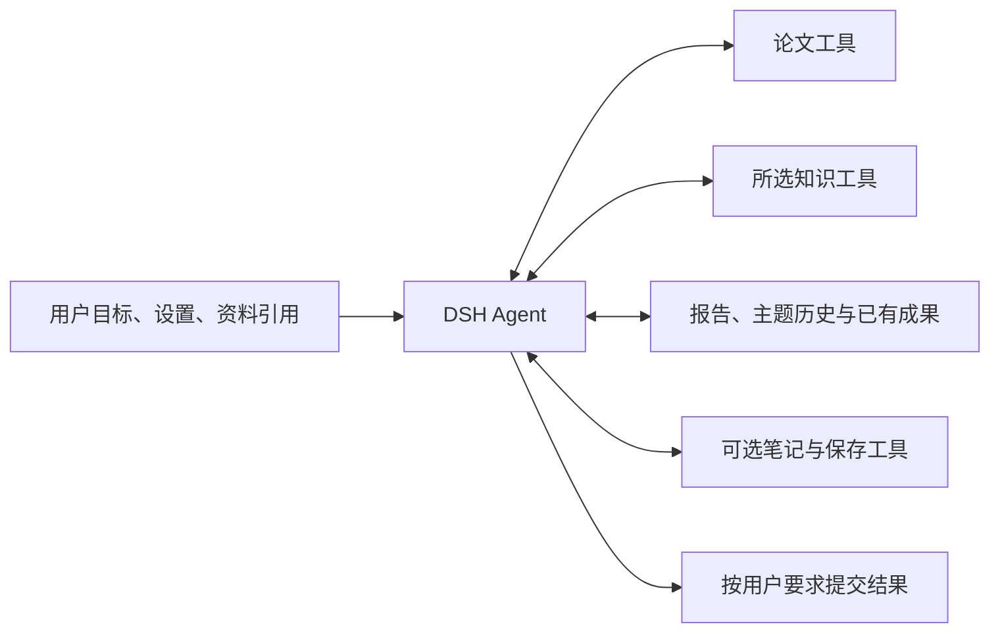

> 历史设计或验证记录。当前结构与运行方式以 [项目说明](../../../README.md) 为准；独立模型功能已移除。

# PaperRadar：单篇论文自主分析设计

| 项目 | 内容 |
| --- | --- |
| 版本 | v0.2 |
| 日期 | 2026-09-10 |
| 状态 | 设计待实施 |
| 核心要求 | 所有涉及模型的任务都交给 DSH 自主完成，不预设研究方法和必经流程 |
| 适用范围 | 完整分析、总结、个性化、材料联系、交叉问题、复核、修订、讨论与提示词试跑 |

本版替代此前的按阶段流水线设计。阅读、写作、个性化和复核不再固定分配给不同 Agent，也不要求先产生研究记录才能做其他工作。统一原则见[总设计](AGENT_EXECUTION_DESIGN.zh-CN.md)。

## 1. 用户得到什么，模型自己决定怎么做

PaperRadar 提供明确的任务、论文链接或固定版本、用户选择的资料范围和可用工具。模型自行决定怎样读取、搜索、分析、检查和表达。

“生成六节总结”“解释与我的知识的联系”“核对这个结论”分别描述交付目标。它们不是阅读步骤，也不意味着完整分析必须逐个启动这些任务。

保留原有单篇报告、按需详细分析、无标签纯总结、个性化内容、讨论、反馈和历史。保持语言、长度和所选范围的用户设置，取消软件自作主张添加的研究步骤。

### 1.1 保留与移除

| 保留 | 移除 |
| --- | --- |
| 用户问题和报告需要的内容 | 先读目录再读摘要等阅读教程 |
| 可访问资料和来源引用 | 必须通读指定章节才可回答的程序门槛 |
| 语言、字数和必要结果 schema | 固定规划、生成、审查、修订的模型调用链 |
| 模型／思考强度选择 | 按报告栏目自动拆 Agent 或切模型 |
| 数据权限、总预算、并发和取消 | 初筛最多两章节等研究深度配额 |
| 保存、复用和恢复已有产物 | 必须写研究记录、草稿或检查点才能继续 |
| 如实标记依据与不确定性 | 每次结果必须经过另一个模型才能发布 |

程序负责下载、解析、分页、字数、引用和格式校验、计量及持久化。这些能力通过工具或宿主服务提供，不要求模型使用某种固定方法。

## 2. 任务结构



图表示可用能力，不表示调用顺序。

默认一次完整单篇任务使用一个独立上下文。Agent 可以直接阅读并回答，也可以使用多轮工具、保存中间内容或自行检查。用户发起新的讨论主题时创建或恢复对应主题上下文。

如果宿主委派能力在该任务中可用，模型可以自主判断是否使用；无需建立默认的“阅读 Agent、写作 Agent、复核 Agent”组织结构。委派不扩大权限或总额度，未实际发生的委派不计作完成条件。

## 3. 各类任务的交付约定

以下各项可以作为独立用户请求，也可以作为完整报告要求的内容。它们互不构成固定执行次序。

### 3.1 完整单篇分析

**目标**：按用户设置分析指定论文，交付原页面需要的报告内容。

**可用资料**：论文链接及版本、已有短元数据、用户指定的知识范围、历史分析和证据引用。

**交付**：研究总结；用户选择个性化时提供推荐理由、材料联系和可支持的交叉问题。保留现有栏目与来源展示，缺少足够依据时如实说明。

模型自行组织一次任务内的工作。业务服务不拆成多个必经子任务，不要求必须先完成总结才能考虑个性化，或必须先生成联系才能提出研究问题。

### 3.2 总结或改写总结

**目标**：按所需语言、字数和现有六节结构总结论文，或修改指定已有总结。

六节仍为背景与问题、对象与方法、具体工作、主要结果、贡献与适用条件、局限与未解决问题。它们是输出栏目，模型可以按任意适当方式获取信息和组织写作。

提供原文工具及可用成果引用，不要求先完成一份固定格式的事实提纲。只改字数或语言时，将已有内容作为可用资料，是否需要重新查证由模型判断。

程序继续检查实际字数、字段和引用；错误说明哪个字段不符合接口要求，不返回一套新的写作流程。

### 3.3 个性化推荐与理由

**目标**：根据用户标准及所选知识，说明论文是否值得进一步阅读，以及为什么。

提供完整所选范围的访问能力，不能在后台预先把用户范围缩成少数关键词命中项。用户明确要求考虑全部所选知识时，将这一要求写入目标；模型自行决定利用目录、摘要、已有成果、搜索或原文的方式。

不以必须遍历所有分页或打开每条正文作为通用技术门槛。范围覆盖、资料交付与模型实际理解分别对待；结果不得声称没有依据的完整比较。

输出保留推荐、不优先推荐或证据不足，以及必要理由、个人事实与双方来源。无标签纯总结不自动查询 Persona，其他会话不能隐式补充用户背景。

### 3.4 材料联系与交叉研究问题

**目标**：说明与用户所选知识／材料的关系，以及有依据的后续问题。

模型自行决定使用哪些资料和工具。没有材料联系也可以基于论文与知识点提出问题；没有足够支持时允许空结果。

交付内容说明依据、关系或问题的性质，以及尚未验证之处。直接引用关系需要真实参考文献匹配；主题相似不能标为论文直接引用。研究设想不冒充已证实结论，实际没有完成全领域检索时不宣称全领域新颖。

这些是结果真实性要求，不规定先检索、再比较、再产生问题的步骤。模型可以在完整报告内一次交付，也可在用户单独请求时完成。

### 3.5 内容复核与修订

**目标**：在用户明确要求核对、修改，或模型自主认为有必要时完成相应工作。

提供待处理内容及版本、用户的问题或客观接口错误，以及原文和相关资料工具。模型自行判断要查什么、改什么、是否需要额外帮助。

软件不在所有回答后自动发起复核 Agent，不设置固定的生成—审查—返工链。既有“内容复核”功能和模型配置仍可使用，但不再是每个报告的强制关卡。

核对任务输出问题、依据与无法确认之处；修改任务输出用户所需的新内容。模型提交的草稿和结果立即持久化，后续异常不能丢掉已经保存的内容。

复核结论只关联实际检查的版本。没有独立复核记录不等于普通任务失败；用户明确要求核验的任务则应交付相应核验结果。

### 3.6 自由讨论与报告讨论

**目标**：回答当前问题，保留本主题明确的前提和上下文。

输入提供用户问题、论文或报告版本、真实讨论锚点、必要历史或历史引用。模型自主读取原文、定义、图表、报告内容和允许访问的知识。

支持没有报告直接讨论，保留从总结、理由、联系、交叉问题和真实选中文字进入讨论的功能。报告是已有分析，来源位置可追溯，但不能因它已保存就自动视为科学事实。

主题与模型设置保持跨入口一致，同主题同一时刻执行一轮。长会话优先利用 DSH 上下文能力和已有主题记录，不每轮无条件重拼全部历史与全文。整理历史的模型调用同样计量。

### 3.7 提示词与 Agent 试跑

所有涉及模型的模板遵循同一原则：说明目标、资料、交付和接口，删除逐步方法、固定角色剧本及必经工具序列。

工作台的 Agent 试跑提供实际领域工具、明确资料范围和有界预算。检查任务是否完成、引用及用量是否正确，不要求复现某条工具轨迹。单次文本提示词仍可在适用的简单任务中使用，不强制为了“Agent 化”增加工具调用。

试跑结果不自动替换生产提示词、不写用户反馈，也不触发正式日报。

## 4. 输入与工具设计

### 4.1 输入示意

下例仅说明任务和交付。尖括号均为占位符，正式内容由真实来源解析：

```json
{
  "objective": {
    "text": "分析这篇论文，按我的报告设置给出总结，并说明与所选知识的关系。",
    "source_ref": "user:<request-id>"
  },
  "paper": {
    "url": "https://arxiv.org/abs/<arxiv-id-vN>",
    "source_ref": "paper:<version>:metadata:<hash>"
  },
  "persona_scope": {
    "ref": "<用户选择的范围及版本>",
    "source_ref": "settings:<snapshot>:persona"
  },
  "available_results": {
    "refs": ["<如果存在，提供已有成果引用>"],
    "source_ref": "paper-radar:<result-index>"
  },
  "deliverable": {
    "language": "zh-CN",
    "summary_length": {"min": 800, "max": 1200},
    "content": ["六节总结", "推荐理由", "材料联系", "可支持的交叉问题"],
    "schema": "analysis.autonomous.v1",
    "source_ref": "settings:<snapshot>:report"
  }
}
```

例中长度和栏目演示现有设置，正式任务使用用户实际值。没有知识范围时不附 Persona 块，交付按纯总结模式调整。

工具 schema 由 DSH 提供；应用不在用户输入里重复粘贴整套工具手册。资料块、用户问题和软件指令分别标记来源。

### 4.2 可用工具能力

| 能力 | 接口描述应包含的内容 |
| --- | --- |
| 论文元数据、目录与正文 | 论文身份、定位、版本、返回字段、分页和错误 |
| 论文搜索 | 搜索范围、匹配内容与定位，不将结果默认视为全文覆盖 |
| 图表、公式和参考文献 | 实际可读取形式、来源位置及能力缺口 |
| Persona 搜索与读取 | 授权范围、版本、记录字段与原文位置 |
| 报告和历史证据读取 | 产物版本、来源性质、允许访问的证据 |
| 主题历史读取 | 所属主题、消息或记录引用、分页 |
| 可选笔记／草稿保存 | 对象身份、内容、版本、保存结果 |
| 最终结果提交 | 用户所需结果 schema、保存状态、具体校验错误 |

接口说明不包含“你应该先调用某工具”“每个方法都要查看实验”等策略。工具是否需要、调用次序及次数由模型在预算内决定。

图像、PDF、网页与搜索能力按照已接入的宿主和工具声明。不把只有图注的返回伪装成实际图像读取，也不以接入 DSH 为由宣称自动具备所有能力。

### 4.3 客观校验与模型判断

程序校验对象身份、版本、必要结构、字数、引用是否可定位、权限、取消状态和保存幂等。结构化个人事实可以与原始字段核对，但不额外调用 LLM 来执行每次提交的隐形审查。

科学判断交给模型完成，质量通过任务样本评估。校验不要求先产生某类笔记、读完规定章节、调用复核工具或执行特定数量的模型轮次。

## 5. 保存与结果复用

最终报告按原栏目保存，实际产生的笔记、草稿、检查结果或中间内容也可以独立保存。存储允许部分完成，不要求模型在固定时点提交固定产物。

完整且适用的结果可以直接复用。未命中时提供已有成果引用作为可用信息，模型自行判断如何利用；不强制建立“阅读成果 → 总结 → 推荐 → 联系 → 交叉 → 复核”的依赖流水线。

复用身份考虑任务目标、论文和实际来源、输出语言／长度、用户标准、相关 Persona 范围与版本、模型和思考强度、任务协议及实际依赖。只修改不相关任务的模型配置，不应使独立结果失效。

复用必须依据真实上下文：如果同一次分析生成的总结已受 Persona 或其他内容影响，应记录相应依赖，不能为提高命中率而宣称独立。一次执行产生多个组件，模型调用仍只计一次。

草稿和未完成结果可以作为继续工作的材料，但不作为成功缓存。没有独立复核记录不构成普通结果不可复用的理由；显式复核任务的结果则按核验目标与内容版本匹配。

强制重做保留旧内容与反馈；普通设置修改、页面浏览或失败记录存在都不自动触发重算。资料缓存和模型前缀缓存不增加专门工程。

## 6. 模型配置与运行支持

### 6.1 模型选择对应用户任务

| 发起方式 | 模型设置 |
| --- | --- |
| 完整单篇分析 | 单篇任务设置／明确覆盖，未设置时继承宿主 |
| 单独总结 | 详细总结设置及原继承关系 |
| 单独个性化、联系或交叉问题请求 | 个性化分析设置及原继承关系 |
| 显式核对内容 | 内容复核设置 |
| 讨论 | 论文讨论设置及该主题明确选择 |
| 每日初筛 | 每日初筛设置 |

保留用户在 DSH 已配置的模型与思考强度，不另建账号。完整单篇任务使用一个有效主模型，不因输出包含多个栏目就强制执行多个阶段路由。

若模型按需使用已开放的委派工具，被委派的任务按照用户已有偏好解析模型，属于真实发生的额外工作。没有委派时不伪造这些模型参与分析。模型选择的来源和实际用量始终可见。

当前设置中原有阶段偏好保留，界面解释其对应独立任务或按需委派的生效方式，不能静默删除或声称全部都会执行。

### 6.2 总预算与上下文

2026-09-10 更新：完整单篇分析默认取消调用次数和总执行时间上限，按结果提交、用户取消或实际错误结束。下述预算仅在任务显式设置额度时约束执行；调用、上下文整理的计量与并发控制继续保留。

调用次数、时间、token、并发和权限是宿主运行边界。所有真实调用，包括整理上下文、委派、继续和重试，都计入相应预算；不在此之外增加固定章节数或研究轮次配额。

现有初筛关闭了不能完整计量的宿主压缩路径。新设计需要接入可计量的宿主上下文能力，或明确提供受预算约束的替代能力，不能仅打开旧开关。

会话超限或预算耗尽时，保存已有提交和真实运行状态，供用户继续；不能把执行限制解释为论文不值得推荐。工具分页和单次返回上限保留，但不规定模型应该停在第几页。

### 6.3 恢复与进度

业务任务 ID、主题、已提交结果、运行关联和用量持久化。优先恢复可用宿主会话；无法恢复时提供已有任务与资料让模型继续，明确标识重建。

软件不命令模型每完成某一步就写检查点，也不要求构造特定格式的研究笔记。可选保存工具和实际会话记录提供恢复依据；中断发生在任何位置，都保留已确认写入的内容。

界面使用真实任务事件和已提交内容，不用“阅读阶段完成后必定进入总结阶段”之类固定进度条。展示草稿、部分完成、完成、暂停和失败，缺少未要求的中间成果不报错。

## 7. 从上一版设计迁移

以下为开发工作，不是模型工作步骤：

| 原有设计或实现 | 修改目标 |
| --- | --- |
| 单篇大文本生成、分段提取后重新合并 | 通过自主 Agent 与工具完成目标，应用不指定读取办法 |
| 预先分配研究、个性化和复核 Agent | 一个自主任务为默认，委派仅在模型按需使用时发生 |
| 总结后强制复核、失败再整篇生成 | 去除自动模型审查链；具体核对或修改可作为独立任务 |
| 必须全量分页／最多读两章等门槛 | 保留用户覆盖目标、授权与资源边界，移除固定读取路径检查 |
| 必须先产出研究记录 | 笔记与中间结果可选，最终结果可直接提交 |
| 所有任务使用 screen 专用工具和参数 | 按用户任务提供适用能力与模型设置，复用通用执行器 |
| 按预设步骤展示进度 | 依据实际工具事件、运行状态和保存结果展示 |
| 缓存依赖整个全局配置 | 记录真实任务与内容依赖，复用适用业务结果 |

提示词、工具说明、提交校验、后台编排和测试都要同步检查，不能只删提示词中的步骤，而保留迫使模型走相同步骤的后台门槛。每日初筛也适用这一修订。

## 8. 完成标准

- 所有涉及模型的接入点均使用目标与工具式设计，工作台模板同样不带固定方法或角色剧本。
- 不同任务可以采用不同工具顺序；已有信息足够时直接提交能够成功。
- 模型无需预先生成笔记、调用某阅读工具或完成独立复核，普通报告也能发布。
- 用户明确的任务、所选范围、语言、字数和报告栏目保留；真实来源与不确定性可查看。
- 全部任务复用 DSH 账号和有效模型配置，真实调用及上下文整理可计量。
- 长论文、较大知识范围、长讨论和不同阅读轨迹在样本中实际验证，不以固定工具轨迹充当质量验收。
- 无标签纯总结、主题隔离、双入口、初筛归属、历史反馈、取消、恢复和结果复用保持正确。
- 已有生成内容在后续异常中不丢失，未知调用和可能增加的重试用量如实记录。

本版完成设计修订，未修改运行代码。现有实现事实见[Agent 验收记录](AGENT_VALIDATION.zh-CN.md)和[宿主兼容记录](../../../plugins/dsh/COMPATIBILITY.md)；其固定策略不代表本版目标已经实现。

## 0.3.0 实施记录

完整报告、讨论、自主工作台及结果复用已实施。已保存内容在新 Agent 重试时作为资料引用；原宿主会话恢复和图像理解没有作为已实现能力。详见 [本轮验收](AUTONOMOUS_VALIDATION.zh-CN.md)。
