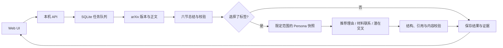

> 历史设计或验证记录。当前结构与运行方式以 [项目说明](../../../README.md) 为准；独立模型功能已移除。

> 2026-09-10：DSH 模式已改为自主工具任务。完整报告使用一个 Agent，讨论按需读取历史与证据；本文原固定流程仅描述独立模式/历史实现。最新实现和验证见 [0.3.0 验收](../dsh/AUTONOMOUS_VALIDATION.zh-CN.md)。

# 单篇文献分析：实现与运行说明

更新日期：2026-09-07。当前实现面向单用户、本机运行，复用已有模型接入服务。

## 使用方式

在 `web/` 安装依赖，运行 `npm run build`，再运行 `npm run start:local`。打开 <http://127.0.0.1:4317/#single-analysis>，在“模型设置”选择已授权的连接，即可输入任意有效 arXiv 链接或编号。

不选标签即可生成研究总结。需要个性化分析时，先配置 AI Persona，再在页面选择真实标签。多标签按并集处理，手动添加论文不受订阅 subject 限制。可以从订阅复制语言、长度和标签设置；标签必须能唯一匹配实际 Persona 标签，否则提示重新选择。

中文计数为非空白字符（含标点），英文按单词计数；章节标题、引用标识和界面文字不计入。有效范围为 200–3000，最少字数必须小于最多字数，默认 800–1200。系统按实际生成正文检查并要求模型修订，不用截句或补重复段落凑长度。

当前静态在线站点和 `npm run dev` 仍提供标注清楚的演示；真实任务入口为本机 Node 服务。服务不可用时，本机页面显示连接错误。

### 与 AI Persona 一致的远程入口兼容

前端通过当前页面同源的 `/api/` 请求后台，与 AI Persona 的 UI 使用同一种连接方式。模型设置根据实际后台响应判断连接状态，不再仅根据 `localhost` 主机名判断；接口解析以实际 JSON 内容为准，兼容远程浏览器转发时响应头缺失或被改写。HTML、空响应、拒绝访问和不符合协议的数据仍明确报错，远程连接失败不会悄悄切换到演示结果。内网 HTTP 环境的请求标识使用 `crypto.getRandomValues`，不依赖仅安全上下文可用的 `crypto.randomUUID`。

这项兼容修改没有开放新的监听地址、修改 Tailscale 配置或放宽服务端 Host/Origin 检查。当前 AI Persona 的运行实例也只监听 `127.0.0.1:8765`；若手机能访问它，说明还经过现有的转发或远程浏览器入口。Paper Radar 需由同一类入口转发完整页面和 API。直接访问电脑 Tailscale IP 或新增 HTTPS 反向代理仍须单独配置允许的访问来源，不能仅凭本机页面正常就认定手机链路已通过。

## AI Persona 连接

在「设置 → AI Persona」中配置本机连接。页面载入已有连接；尚未配置时尝试识别相邻的 AI Persona 安装。知识库位置和程序位置均可手动输入完整路径。在 macOS 本机上，还可点击「选择文件夹」打开系统窗口，选择包含 `persona-data` 和 `persona-state` 的知识库；点击「选择程序」选择 `ai-persona-mcp` 文件（通常在安装目录的 `.venv/bin` 内，程序选择窗口会显示隐藏文件）。程序位置留空时自动查找。窗口从当前路径打开，选中后仅填回表单，取消不改变原值；不会上传文件或立即切换连接。其他系统仍可输入路径。先点击「测试连接」，确认返回的标签，再点击「保存并连接」。空标签目录仍属于连接成功，但须先在 AI Persona 中建立标签才能进行个性化推荐。

原生选择窗口由运行 Paper Radar 的 macOS 电脑打开，使用系统 AppKit，不需要另装依赖。关闭页面、取消选择或关闭服务会清理窗口；同时只允许一个选择窗口，十分钟未完成会自动关闭。

保存后无需重启。存在排队、运行中的分析、日报、讨论、来源检查或提示词实验时，等待这些任务和正在执行的查询结束，再自动切换。待生效修改可以取消；测试或切换失败继续保留原连接。配置和待生效修改均保存在本机，服务重启后仍可恢复。

同一知识库仅修改名称、程序位置或文件夹名称会保留连接身份（按本机数据目录身份识别）。换成另一个知识库时，相关订阅与自动推荐暂停，旧标签选择清空；重新选择标签并启用订阅后，再按需开启自动推荐。历史报告、讨论、证据和反馈不改写。页面上的路径始终指运行 Paper Radar 后台的电脑。

配置文件默认位于 `~/.local/share/paper-radar/data/persona.json`，或通过 `PAPER_RADAR_PERSONA_CONFIG` 指定。已有如下格式仍可读取；新版保存会附加连接名称、稳定身份、设置版本与待生效修改。设置接口只接收名称和本机位置，启动参数由后端固定生成：

```json
{
  "command": "/absolute/path/to/ai-persona/.venv/bin/ai-persona-mcp",
  "args": ["--workspace", "/absolute/path/to/ai-persona"]
}
```

直接在外部编辑配置文件后需要重启 Paper Radar；网页保存无需重启。它独立启动 MCP 客户端，不读取 Codex 配置，也不依赖 Codex 插件会话。不支持网络连接。

上游需提供 `ai-persona.query-result/v2` 的六个新接口：`get_knowledge_map`、`search_knowledge`、`get_persona_records`、`list_source_files`、`search_source_content`、`read_source`。旧查询接口不再使用。具体范围、分页与历史结果规则见[新版 Persona 对接](AI_PERSONA_QUERY_V2.zh-CN.md)。本实现仅查询知识，不调用偏好激活或业务写接口。

每次分析固定连接身份、标签集合、Persona revision、记录 revision 和来源哈希。所有内容请求都携带标签范围与预期版本。返回范围不符、版本变化或来源哈希不符时，不使用该批证据；版本变化最多重新获取一次。无标签时不会连接或查询 Persona。

## 处理链路



1. **输入与任务。** 将官方 arXiv abstract、HTML、PDF 链接和编号规范化。创建任务时快照模型路由及分析设置，使用幂等键防止重复提交。同一请求键配不同内容返回冲突。
2. **论文证据。** 先从 Atom API 读取元数据，必要时回退官方摘要页，固定实际版本。HTML 优先，保留公式文本、图注、表格文本、段落和参考文献；HTML 不可用才解析 PDF 文本。原始文件及解析结果均以哈希校验缓存，来源证据有章节、锚点或页码。
3. **研究总结。** 不论是否推荐，都生成背景与问题、对象与方法、具体工作、主要结果、贡献与适用条件、局限与未解决问题六节。提供正文证据、真实模型信息和字数。总结不需要 Persona，因此个性化部分失败时可保留独立有效的总结。
4. **个性化证据。** 完整分页读取所选标签下的全部知识点及备注，最多 1000 个，作为不可裁剪的推荐依据。在同一范围与版本下，通过新查询接口检索相关关系、辅助材料和原文片段；保存 provenance、行号或页码及文件哈希。超限或知识点读取不完整时明确失败，不用关键词命中子集代替全部知识点。
5. **推荐与联系。** 推荐判断允许“推荐”“本次不优先推荐”“证据不足”。涉及个人兴趣、熟悉程度或作者关系时，输出结构化原始事实。直接引用必须匹配原文参考文献；其余联系标记为共同问题或方法比较。交叉方向明确写出前提、待验证点和第一步检查，不宣称全领域新颖。找不到可靠联系时允许空结果。
6. **检查与修订。** 先做严格 JSON、正文长度、引用存在性、个人事实一致性和直接引用匹配检查，再调用模型基于证据核对重要结论。每个组件最多生成三次，修订保留之前的纠错要求。持续失败则保存“待核对”内容与具体问题，不标为成功。
7. **保存与反馈。** 结果、证据快照和模型请求元信息保存于本机。只有用户明确提交的反馈才写入，未填写不创建记录。四个维度独立，负反馈原因也可留空；缺少相应有效内容时不开放该项评价。

## 生命周期、复用与删除

- 任务状态为 `queued / running / succeeded / partial / failed / cancelled / interrupted`，各阶段另有进度。已获得正文后即可看到论文信息，后续组件分别保存。
- 同一时刻执行一个论文任务，排队上限 50。离开页面不会取消后端任务；返回页面从后端恢复历史和进度。取消会中止请求，迟到的模型响应不能覆盖取消状态。
- 服务重启将运行中任务标记为中断，保留已完成组件；排队任务继续执行。重试创建关联的新任务，旧结果与旧反馈保留。
- 可复用内容按论文版本/来源哈希、解析器、流程版本、语言、总结长度、Persona 身份/版本/标签/证据以及模型配置区分。个性化结果的缓存只保存结果引用，不额外复制个人材料。
- “重试未完成部分”复用已校验、设置相同的组件，必要时拿上一份未通过的草稿及错误继续修订。它仍会重新验证当前论文和 Persona 证据。
- “重新生成（调用模型）”跳过生成内容缓存，仍复用未变化的论文原文。旧结果保留，反馈不移植到新结果。
- 删除分析会删除该结果、其任务、模型尝试记录和四项反馈。个人证据快照包含在结果中，一并删除；公共论文原文与公共总结缓存保留以便复用。失败且未取得正文的任务仅保留任务历史。

## 本机存储与资源上限

| 配置 | 默认值与用途 |
| --- | --- |
| `PAPER_RADAR_PORT` | `4317`；只绑定 `127.0.0.1` |
| `PAPER_RADAR_DATA_DIR` | `~/.local/share/paper-radar/models`；原有加密模型配置与凭据 |
| `PAPER_RADAR_STORAGE_DIR` | `~/.local/share/paper-radar/data`；SQLite、Persona 连接配置和公共论文缓存 |
| `PAPER_RADAR_PERSONA_CONFIG` | 上述数据目录中的 `persona.json` |

SQLite 使用 WAL、事务和独占进程锁，数据目录权限为 `0700`，数据库为 `0600`。个人分析证据按本机文件权限保护，不是加密数据库。模型凭据继续使用已有独立加密存储。两类数据均位于项目和云盘源码之外，不进入静态站点包。备份时应停止服务后复制整个数据目录；直接复制运行中的单个 SQLite 文件可能遗漏 WAL 内容。

完整单篇分析默认不限制总执行时间和模型请求次数，`AnalysisService` 的 `maxAttempts` 与 `executionMs` 默认均为 `null`。DSH 插件保留这两个显式空值，正常分析在提交通过校验的结果后结束；手动取消、服务停止和实际错误仍会结束任务。调用及上下文整理继续记录用量。初筛、讨论、自动日报总额度及工作台试跑使用各自的预算。

单次网络和工具请求的超时仍然适用。arXiv 请求串行并间隔至少 3.1 秒，HTML 上限 8 MB、PDF 30 MB/300 页。旧独立模式的个人原文单文件上限 10 MB，总选取文本约 45000 字符，单材料最多 9000 字符；超长论文最多分六批提取带引用的事实。DSH 模式按需分页读取，模型上下文容量不足时明确失败。

目前为本机单用户服务，通过 Host、Origin 和自定义请求头限制浏览器跨站访问；它没有面向公网的账户认证。将来支持托管或多人使用时，需另行实现身份、租户隔离、凭据管理和远程 Persona 接入。

## API 摘要

修改请求使用 `Content-Type: application/json` 和 `X-Paper-Radar: 1`；创建/重试另带 `Idempotency-Key`（8–120 个字母、数字、下划线或连字符）。

| 方法与路径 | 用途 |
| --- | --- |
| `GET /api/capabilities` | 判断是否连接真实本机分析服务 |
| `GET /api/persona/status` | 独立 MCP 连接状态 |
| `GET /api/persona/settings` | 当前连接、编辑建议、设置版本与待生效状态，不返回环境变量 |
| `POST /api/persona/settings/pick` | 按 `kind`（`workspace` / `executable`）打开本机窗口；`initial_path` 指定起始位置，`language` 指定界面语言；返回 `{path}`，取消时为 `null`，不保存设置 |
| `POST /api/persona/settings/test` | 测试名称、知识库位置与程序位置，返回五分钟有效的测试标识与标签预览 |
| `PUT /api/persona/settings` | 使用测试标识与设置版本保存；任务完成后切换 |
| `DELETE /api/persona/settings/pending` | 使用设置版本取消待生效修改 |
| `GET /api/persona/tags` | 真实标签列表，支持 cursor 和 revision |
| `POST /api/analyses` | 创建任务，返回 202 和 job |
| `GET /api/jobs?limit=25&offset=0` | 分页任务历史 |
| `GET /api/jobs/:id` | 任务与阶段状态 |
| `POST /api/jobs/:id/cancel` | 取消任务 |
| `POST /api/jobs/:id/retry` | 重试，创建新任务 |
| `GET /api/analyses` | 分页读取结果摘要 |
| `GET /api/analyses/:id` | 完整结果与证据索引、显式反馈、请求用量 |
| `GET /api/analyses/:id/evidence/:evidenceId` | 读取属于该结果的证据正文 |
| `PUT /api/analyses/:id/feedback/:dimension` | 保存单个维度反馈 |
| `DELETE /api/analyses/:id/feedback/:dimension` | 清除该项反馈 |
| `DELETE /api/analyses/:id` | 删除分析及其私人快照 |

创建任务示例（不使用个人材料）：

```json
{
  "arxiv_input": "https://arxiv.org/abs/2501.12903v3",
  "persona_connection_id": null,
  "scope": { "tag_ids": [], "tag_match": "any" },
  "language": "zh",
  "summary_length": { "min": 800, "max": 1200 },
  "force_regenerate": false
}
```

反馈维度为 `accuracy / summary / reason / connections`，请求为 `{"value":"positive"}` 或 `{"value":"negative","reason":"可选理由"}`。正文、证据和反馈没有读取状态字段。

## 代码与验证

主要模块为 `server/analyses/`（任务、SQLite、arXiv、Persona、协议与 HTTP），`lib/analysis-api.ts`（前端接口）和 `components/radar/single-analysis-real.tsx`（真实页面）。旧演示保持独立，公共编号解析和字数规则由双方复用。

运行 `npm test` 检查业务、模型与原演示；`npm run analyses:test` 单独运行真实分析的隔离测试。测试使用合成材料和模拟模型，覆盖请求校验、缓存与版本、严格标签范围、引用、修订、取消、重启恢复、反馈、删除和 HTTP 来源限制。真实验收使用公开论文 `2501.12903v3` 与用户选择的 Physics 范围，不将私有材料或生成结果复制到测试夹具。

自动校验通过表示满足当前程序及模型检查，不保证科研结论完全正确。图像识别、OCR、全领域新颖性搜索、向量检索、每日订阅批处理、作者推送和反馈学习不属于这次单篇实现。

### 本次验收记录

- 公开论文 `2501.12903v3`、Physics 标签、中文 800–1200 字，使用用户已有的 ChatGPT/Codex 连接与 `gpt-5.6-luna`。
- 首轮输出触发了科学条件和兴趣程度的核对提示，保存为待核对；修订重试最终完成，得到 1126 字六节总结、3 条有原文参考文献支持的直接引用联系、1 个待验证交叉方向。该次重试共调用模型 6 次。
- 最新结构、字数、引用与个人事实校验均通过；证据读取接口返回成功。未替用户提交任何评价，反馈记录保持为空。
- 服务重启后历史结果仍可读取；相同设置再次分析成功复用总结和个性化结果，实际新增模型请求为 0。
- 49 项隔离测试通过（其中 20 项为新增单篇后端测试），TypeScript 检查、生产构建与新增后端/页面的定向 lint 通过。全仓库 lint 仍存在原有组件、旧页面和演示测试中的规则问题；本次未扩展修改这些无关组件。
- 未执行浏览器点击或视觉回归；已通过本机 HTTP 与业务接口进行验证。

远程入口兼容修订另增加 6 项回归测试：缺失/改写响应头、拒绝非 JSON 数据、保留权限拒绝、远程入口不误判演示、内网 HTTP 请求标识、同源请求及修改请求头保护。通过本机和合成转发响应检查后，手机实际访问链路仍需在手机端确认。

### 第二篇真实验收：2302.01355v2

2026-09-06 使用 [Full Counting Statistics of Charge in Chaotic Many-body Quantum Systems](https://arxiv.org/abs/2302.01355v2)，沿用 Physics、中文 800–1200 字与已有 ChatGPT/Codex 连接。最终验收状态为 **部分完成**，研究总结仍需核对，不能视为内容质量全部通过。

- HTML 正文和补充材料共抽取 141 个内容块、96 条参考文献；图像未独立解读。限定 Physics 扫描 22 条记录，选取 16 条相关记录。
- 个性化部分通过当前结构、个人事实和模型核对，得到推荐判断、2 条理由、1 条共同问题联系和 1 个待验证交叉方向。未发现直接参考文献匹配，没有将主题联系标为直接引用。
- 六节总结为 929 个非空白字符，字数与引用检查通过，但模型在修订中重新引入“过量峰度趋向 3”的错误，自动内容审核未检出。原文关系是峰度 κ 趋向 3、过量峰度 κ−3 趋向 0。
- 验收复核保留了原始生成文本，将总结降为 `needs_review`、任务降为 `partial`，附上具体问题和原文证据，并撤销这份错误总结的缓存。该标记通过停止服务后的本机维护事务完成，随后重启并验证持久化；当前还没有网页端的验收标记接口。这不是用户反馈，四项反馈记录仍为空。
- 26 个所引用证据的读取接口均返回有效正文。首轮及两次重试共 23 次模型请求，其中首轮有一次模型调用失败；未再继续自动重试来掩盖首次成功率问题。此次使用本机 HTTP 验证，没有验证手机 Tailscale 的实际浏览器链路。

本次已修正：补充材料标题以普通段落出现时的漏识别（解析器升级为 `arxiv-blocks-v2`）；明确作者关系 claim 使用单个字符串成员；增加六节总结的共享字数预算提示；让完成阶段显示最后一轮问题。新增补充材料识别和最终问题持久化回归测试，全部 57 项测试及改动文件的定向 lint 通过。

该轮验收后确定的处理原则是：小模型出现科学概念混淆、条件遗漏、修订后旧错误复发和内容审核漏检时，优先更换更强模型，以相同论文、标签和字数设置复测，不据此扩展复杂的审核或纠错流程。项目继续负责全文读取、接口连接、任务状态、缓存、标签隔离，以及格式、字数和引用存在性等基本校验；只有更强模型复测后确认仍属于工程缺口的问题，再考虑修改实现。单纯结构校验、字数达标或模型自评通过均不足以代表科研内容验收通过。

### GPT-6 复测：两个既有样本

2026-09-06 将已有 ChatGPT/Codex 连接从 `gpt-5.6-luna` 切换为 `gpt-6-astra`，沿用 Physics、中文 800–1200 字、Persona revision 117 和现有分析流程。两篇均指定原有论文版本并启用 `force_regenerate`；总结及个性化结果均未命中生成缓存。模型切换通过本机配置接口完成，没有修改项目代码、提示词或审核机制。

| 论文版本 | 总结字数 | 模型请求 | 内容修订 | 模型请求累计耗时 |
| --- | ---: | ---: | ---: | ---: |
| `2302.01355v2` | 977 | 4 | 0 | 122.7 秒 |
| `2501.12903v3` | 927 | 4 | 0 | 118.9 秒 |

每篇的四次请求分别为总结生成、总结核对、个性化生成和个性化核对，全部成功。表中耗时是模型请求耗时之和，不包含队列等待和论文、Persona 读取时间。

- 两个任务均为 `succeeded`，总结和个性化组件均为 `available`；每篇生成 2 条推荐理由、2 条材料联系和 1 个待验证交叉方向。
- `2302.01355v2` 的联系分别为共同问题和方法比较；`2501.12903v3` 的两条联系均有原文参考文献匹配支持，标为直接引用。
- 对照原文复核了此前出错的关键点：峰度与过量峰度没有再次混淆；总结保留了主要近似、尺度及数值适用条件，并区分平均输运和信息传播等不同物理量。交叉问题说明了已有结果与待验证部分。
- 结构、字数、个人事实和标签范围检查通过；两篇分别读取了 27 和 37 个被引用证据，均返回有效正文。用户反馈均为空。
- 默认连接保持为 GPT-6，结果保存在本机分析历史中。模型配置、凭据与私人分析数据不进入版本库；此次仅补充公开的验收结果。

这两个样本支持优先升级模型的处理方式，无需因小模型表现扩展工程纠错流程。本轮验证通过本机后端接口完成，手机 Tailscale 的实际浏览器链路仍需单独验收。
