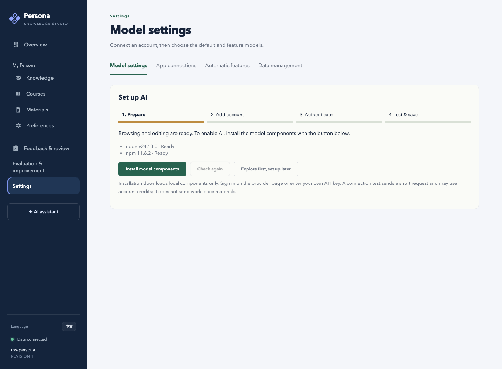

# Model connections and authentication / 模型接入与认证

This page describes the authentication options exposed by this version of AI Persona. It is an application support matrix, not a guarantee that every account, subscription, region or model has provider permission. Each user supplies their own credentials locally.

下表是本版本提供的接入入口；可调用的模型与额度以提供方对你的账号授权为准。订阅账号登录与 API Key 接入分别显示。个人凭据不会随 GitHub 仓库分发。

| Platform / 平台 | API Key | Account login / 账号授权 |
| --- | --- | --- |
| OpenAI API | Yes / 支持 | — |
| ChatGPT / Codex | — | Yes / 支持：浏览器或设备码方式 |
| Claude | Yes / 支持 | 本版本未提供 / Not exposed by this version |
| Gemini | Yes / 支持 | 本版本未提供 / Not exposed by this version |
| DeepSeek | Yes / 支持 | — |
| OpenRouter | Yes / 支持 | Yes / 支持 |
| Moonshot / Kimi 开放平台（中国、国际分别配置） | Yes / 支持 | — |
| Kimi For Coding | Yes / 专用 Key | Yes / 支持 |
| Custom compatible service / 自定义兼容服务 | Yes / 支持 | 可选择无需认证的本地服务 / Unauthenticated local services also supported |

The matrix follows `model_runtime/model-config.ts` and the pinned Pi adapter. Account login is not a promise of free use or access through every subscription plan. Unsupported provider/model combinations remain unavailable instead of being shown as successfully configured.

## First use / 首次使用

Run `./scripts/ai-persona setup` from the repository root. Keep “Guide me through AI setup next” selected, or open **Settings → Models** later.

1. **Prepare / 准备环境** — The page checks Node.js and npm, then installs the pinned model components only when you click the installation button. Use the linked [official Node.js download](https://nodejs.org/en/download) if Node.js is missing. Reading settings does not trigger an installation. A failed download can be retried; refreshing the page resumes progress while the Studio process remains running.
2. **Add account / 添加账号** — Choose the provider and its available authentication method. Use separate connections for different accounts, regions or endpoints.
3. **Authenticate / 完成认证** — Enter API keys in the local password field, or use the provider authorization link and follow the on-page steps. The account owner completes passwords, login challenges and consent. A pending session can be resumed after refreshing the page or cancelled. Never paste credentials into an issue, chat or screenshot.
4. **Test and save / 测试并保存** — Select a default model, explicitly test it, then save model settings. The test requests a short “OK” response; it does not attach workspace materials. It can consume provider credits. A saved key or finished login is not itself a successful model test.

The progress panel only marks a default model verified when a successful test matches the saved connection revision and model. Editing a connection or explicitly reauthorizing invalidates earlier verification. Automatic token refresh is handled by the adapter. Tests of one model do not verify other models, image input or quality of generated candidates.

状态含义：

- **环境已就绪**：本机程序可运行，尚未判断账号是否有效。
- **凭据已保存**：本机已保存 Key 或授权结果，尚未确认模型可调用。
- **AI 连接已验证**：当前连接版本与已保存的默认模型完成过成功测试。权限、额度、网络后续仍可能变化。

The application encrypts its local account store; the key is also local, so filesystem access to that account directory must remain private. Installing runtime components does not read, reset or remove credentials. Demo accounts are isolated from real workspaces.

## Verification / 验收

Automated first-use verification uses an empty workspace, account directory and runtime cache. It clicks the actual installation button, runs the real pinned adapter, tests API-key requests against a local fixture server, covers a rejected key and successful retry, and checks desktop/mobile layouts. It exercises the real Codex adapter's login-method prompt, refresh recovery and cancellation **before** contacting a real account provider. Additional runtime tests cover simulated OAuth answers, credential persistence, refresh and cancellation.

这些自动测试不能替代第三方真实账号登录。发布者和用户可在自己的本机页面完成最后验收：

- Use a fresh private workspace; install components from the page.
- Add an API-key connection or a supported subscription-account connection with your own account.
- Complete login on the provider page, or enter the key in the local form. Do not share credentials with a maintainer.
- Run a connection test for a model your account can access; save the default.
- Reload Studio and verify the default selection remains. Record only provider/method, OS, date and pass/fail; omit tokens, codes and account identifiers.

Until this last account-owned step is recorded, the release must describe live-provider authentication as **not independently verified**, even if automated tests pass. See [validation](VALIDATION.md) for what was actually run.

## Troubleshooting / 排错

- Missing Node.js: install the LTS release with npm, then restart Studio if its process cannot see the newly installed executable.
- Download failed: check network/proxy and cache write access, then retry. For detailed terminal output, run `./scripts/ai-persona models-install` from the repository root; do not publish raw logs containing private proxy information.
- Upgrading while a model service is running: finish current AI work, then run `./scripts/ai-persona models-stop`; the next model-settings request starts the updated runtime. This does not remove credentials.
- Authorization expired or cancelled: restart authorization from that connection. Failed component installation does not require reauthorization.
- Authorized but model test rejected: check the selected model, account permissions, region and available quota. The application keeps installation failures, authentication failures and provider failures separate.
- Remote Studio: read status remotely, but install components on the computer running Studio. The web installer rejects remote installation requests even when a private remote origin is configured.
